# 07 — Open questions

Everything here is something a documentation author should not assert without checking with the team.
Each entry says what could not be determined and *why* — what evidence was missing, not merely that it
was absent.

```mermaid
flowchart TD
  ROOT["Open questions"]
  ROOT --> ENV["Blocked by environment"]
  ROOT --> MIG["Migration and version lines"]
  ROOT --> DUP["Duplication — deliberate or drift"]
  ROOT --> FID["Fidelity"]
  ROOT --> EDGE["Contract edges"]
  ENV --> E1["no node_modules anywhere in this checkout"]
  ENV --> E2["no dsl/dist, so no emitted JSON Schema to inspect"]
  ENV --> E3["no public/vendor bundle, so the import path is untestable"]
  MIG --> M1["how many stored documents are below DSL_VERSION 0.3.0"]
  MIG --> M2["will SlideContent.schemaVersion ever move past 1"]
  MIG --> M3["does a RuntimeStore exist for the runtime version line"]
  DUP --> D1["editor/src/core vs lib/edit/slide-ops — which survives"]
  DUP --> D2["packaged vs lib/prosemirror — which is canonical"]
  DUP --> D3["legacy Editor/Canvas — is deletion planned"]
  FID --> F1["no pptx to DSL to pptx corpus"]
  FID --> F2["preset coverage vs the OOXML ST_ShapeType set"]
  EDGE --> G1["is line.width intended as stroke width"]
  EDGE --> G2["is audio.src intentionally a plain string"]
  EDGE --> G3["does validateScene leave a hole the agent path closes"]
```

## 1. Things blocked by the environment

| Question | Why it could not be answered |
| --- | --- |
| Do the four package test suites pass? | `node_modules` is absent at the repo root and in every package (`ls -d node_modules` → nothing), so `npx vitest run` fails at config load with `Cannot find package 'vitest'`. Every metric in `06` is static. |
| What do the generated JSON Schema artifacts actually contain? | `packages/@openmaic/dsl/dist` does not exist, and `gen-schema.mjs` requires `ts-json-schema-generator` from `node_modules`. Statements in this pack about the schemas are read from `gen-schema.mjs`, `schema-roots.ts`, and `test/schema.test.ts` — not from an emitted `.json`. In particular: which definitions end up `additionalProperties: false` is asserted in `stage.ts:104` and implemented by omission in `gen-schema.mjs:24`, but not verified against an artifact. |
| Does the vendored importer bundle load and parse a real deck? | `public/vendor/maic-importer/` is absent (it is gitignored and produced by `postinstall`), so neither the `HEAD` probe path nor the actual parse could be exercised. |
| How large are the published tarballs, and does the version-bump gate's "publishable inputs" under-approximation bite in practice? | Requires `npm pack` and a registry lookup. The script documents the limitation at `check-package-version-bumps.mjs:14`; whether it has ever mattered is a release-history question. |

## 2. Migration and version-line questions

| Question | What is known | What is missing |
| --- | --- | --- |
| How many stored documents are still below `DSL_VERSION 0.3.0`? | The ladder has three steps, the last one a real transform (`version.ts:238`). The 0.2.0→0.3.0 comment says a single legacy `line` element made *every* agent edit to its scene fail (`version.ts:196`), which implies real affected data existed. | No telemetry, no backfill script found in scope. Whether migration runs eagerly on read for all documents or lazily per access is a `@openmaic/storage` question, outside this subsystem. |
| Will `SlideContent.schemaVersion` ever move past `1`? | `CURRENT_SLIDE_CONTENT_SCHEMA_VERSION = 1` with no per-step body (`lib/edit/slide-schema.ts:24`, `:38`), and the DSL calls it "Optional for backward compatibility" (`stage.ts:184`). | Nothing states whether this third line is deprecated in favour of `dslVersion` or is intended to stay. If it is dead, the field is a permanent no-op that every writer still stamps. |
| What is the intended relationship between `dslVersion` and the storage layer's compatibility check? | `version.ts:46` says "storage compares these constants by value and rejects anything stamped newer than it knows", and `check-package-version-bumps.mjs:290` gives a worked failure scenario. | The actual comparison lives in `@openmaic/storage`, which is out of scope here. A doc author describing the guarantee should read that package. |
| `RUNTIME_DSL_MIGRATIONS` ships empty and `RuntimeStore` is described as "Part B of #869" (`runtime.ts:6`). Does a `RuntimeStore` exist yet? | `validateRuntimeSession` / `validateRuntimeRecord` exist and are exported. | No `RuntimeStore` was found in this subsystem's scope. Whether the runtime version line has any live producer is unresolved. |

## 3. Deliberate-or-accidental duplication

| Question | Evidence for both readings |
| --- | --- |
| Which op kernel is the intended future: `@openmaic/editor/src/core/index.ts` or `lib/edit/slide-ops.ts`? | *Deliberate:* `course-edit/apply.ts:122` explicitly keeps the **server agent** op union independent from the browser one. *Accidental:* that note is about the server surface, not about two browser kernels; `slide-edit-session.ts:164` casts an `EditorHistory` to `SlideEditHistory` and back through `commitSlideEdit`, described as a "compatibility bridge isolated to that fallback until its React surface moves into `@openmaic/editor`" — which reads like migration in progress, not a permanent split. Nothing states a target date or a deletion plan. |
| Which ProseMirror stack is canonical: `lib/prosemirror/` or the packaged `react/text/prosemirror/`? | They differ behaviourally (`createDocument` always wraps in `
` at `lib/prosemirror/index.ts:12`; `createTextDocument` branches on markup detection at `editor/.../document.ts:12`). No comment in either says one supersedes the other, and both are reachable today. |
| Is `components/slide-renderer/Editor/Canvas/` (the legacy editable canvas, ~2 500 LOC across `useScaleElement`, `useDragElement`, `useDragLineElement`, `Operate/`) intended to be deleted once `NEXT_PUBLIC_MAIC_EDITOR_RENDERER_ENABLED` defaults on? | The flag docstring says "Default OFF so professional editing keeps using the legacy in-app editor canvas" (`feature-flags.ts:60`), which implies eventual flip, but no deprecation marker exists on the legacy tree. |

## 4. Fidelity questions

| Question | Why it is open |
| --- | --- |
| What fraction of the OOXML preset-geometry set do the 154 `presetShapes` entries cover? | OOXML defines a fixed `ST_ShapeType` enumeration; the DESIGN doc claims "200+ OOXML preset 几何" (`packages/@openmaic/importer/DESIGN.md:29`) but the measured registry has 154 single-path + 44 multi-path entries. Whether the union covers the spec, and which names fall through to the rectangle fallback, was not determined — it needs the spec list diffed against the registry keys. |
| Which real decks currently lose fidelity, and how badly? | The loss mechanisms are all identifiable in code (`01b` §4.3), but there is no fixture corpus or comparison report in scope. `packages/@openmaic/renderer/src/snapshot/index.ts:26` mentions "visual regression baselines (compare with the source PPT's own PNG export)" as a use case — whether such a baseline set exists was not found. |
| Does `.pptx` → DSL → `.pptx` preserve anything measurable? | The round-trip suite that exists (`tests/edit/round-trip/`, 8 files) is *edit* → export, not import → export. No import → export fixture was found. |
| Is the `detectUnit` `> 20000` EMU threshold empirically derived? | `units.ts:45` calls it a heuristic and gives the reasoning (1 pt = 12 700 EMU) but no provenance for the specific cutoff. |

## 5. Contract edges that look like bugs but may be intentional

| Question | Evidence |
| --- | --- |
| Is `PPTLineElement.width` **meant** to be the stroke width? | The renderer uses it as `strokeWidth` (`BaseLineElement.tsx:119`) and as the dash-array base (`:34`), while `getElementRange` treats a line's extent as `left + max(start[0], end[0])` (`renderer/src/utils/element.ts:48`) — i.e. `width` is genuinely not the box width for lines. But `PPTBaseElement.width` is documented as "元素宽度" (element width) at `slides.ts:146`, and `PPTLineElement` inherits it without comment. Either the type needs a comment or the field needs renaming; which one is a team decision. |
| Why is `PPTAudioElement.src` a plain `string` while `PPTImageElement.src` and `PPTVideoElement.src` are `AssetRef`? | `slides.ts:780` vs `:341` and `:744`. `AssetRef` is itself `= string`, so this is documentation-only today — but `slideMediaSlotDescriptors` does classify `audio-src` as a media slot (`slide-media-slots.ts:44`) and `enumerateAssetManifest` maps it to `kind: 'audio'`. The asymmetry looks like an oversight, but nothing says so. |
| Should `PPTVideoElement.src` and `mediaRef` be merged? | `slides.ts:752` says merging them "is deliberately out of scope for this type-unification step", which defers rather than decides. Consumers must handle both (`use-resolved-slide.ts:88`, `use-export-pptx.ts:1111`). |
| Is `SlideData` (`slides.ts:982`, `@deprecated`) still written by anything? | It is retained "for backward compatibility with persisted/legacy payloads". No writer was found in scope, but a reader/writer could live in storage or in a legacy import path. |
| Why does `validateScene` accept a `slide` scene whose `content.canvas` is merely "an object" (`validate.ts:272`) rather than running the element validators? | The module says it is a structural subset and the JSON Schema is the exhaustive mirror (`validate.ts:11`). So a canvas with a malformed element passes `validateScene` and is caught only by the agent path's TypeBox `validateSlideCanvas`. Whether the browser write path has an equivalent check was not established — `validateAppScene` (`lib/document-store/validators.ts:27`) delegates straight to `validateScene` for slide scenes. **This is the single most consequential open question in the pack**: it determines whether a browser-side edit can persist an out-of-contract element that the agent path would have rejected. |

## 6. Smaller unknowns

- Whether `ImportContext.fixedViewport` and `ImportContext.extractVideoFirstFrame` are ever non-default:
  both are marked "当前未被 transform 使用" (currently unused by the transform) and reserved for a later
  viewport-strategy migration (`import-pipeline/types.ts:6`, `:14`).
- Whether `SHAPE_LIST`'s 26 `pptxShapeType` mappings are the *intended* full set or a partial one: the
  transform falls back to the parser's path when no pool entry matches
  (`transformParsedToSlides.ts:981`), so a missing mapping degrades quietly to a non-editable shape
  rather than failing.
- Whether `presetOverlays` having exactly one entry (`can`) means other 3-D presets simply lose their
  top face, or whether those presets are handled through `multiPathPresets` instead.
- What `@openmaic/generation` and `@openmaic/storage` contribute to this subsystem's boundaries: both
  are in `INTERNAL_DEPENDENTS` on `@openmaic/dsl` (`scripts/openmaic-packages.mjs:37`) and both were
  out of scope here, but the storage layer owns the migrate-on-read boundary that Flow B depends on.
- Whether the renderer's `./fonts.css` export and the generated `KATEX_FONT_EMBED_CSS` are kept in sync
  with the app's own font loading; `packages/@openmaic/renderer/FONTS.md` (90 lines) was not read in
  full.
- Whether `EditableSlideCanvasProps.grid` / `ruler` / `snapping` are wired now or still the "no-ops
  until Part A" the comment says (`editor/src/react/types.ts:150`). `snapping` *is* consumed by
  `useEditGesture` (`react/useEditGesture.ts:74`), so the comment is at least partly stale; `grid` and
  `ruler` were not traced to a consumer.
- Whether `EditableSlideCanvasProps.onElementsChange`'s doc comment is still accurate. It says the
  channel is "Not yet emitted by the Stage 0 shell — wired up as Part A moves the gesture machinery into
  the package" (`editor/src/react/types.ts:101`), but `useEditGesture` calls it at
  `react/useEditGesture.ts:302`. The comment is stale; whether anything *else* in that props block is
  also stale was not audited prop by prop.
- Whether the `'navigate'` history mode is exercised outside text/table/shape-label editing. Its
  matcher only recognises `text.updateContent`, `shape.updateTextContent` and `table.updateCell`
  post-states (`editor/src/core/index.ts:357`–`:371`); every other operation type returns `false`, so a
  `'navigate'` transaction carrying, say, an `element.update` always falls through to "replace present,
  clear future" (`:323`). Whether any caller does that is unresolved.
- Whether `pptxgenjs`'s vendored `addFormula` has been offered upstream. The fork carries exactly one
  feature (`packages/pptxgenjs/src/gen-objects.ts:669`, `src/slide.ts:253`), which makes it a
  maintenance liability if upstream ever ships an equivalent under a different name.
- Whether the `mathml2omml` fork's single-character fix (`a3f88d53`) was reported upstream. If it was
  and landed, the fork can be replaced by a version bump; nothing in the repo records that.
- Which `viewportSize` a new authored slide should use. `emptySlideContent` picks `1000`
  (`course-edit/apply.ts:510`), `createDefaultSlide` is a second factory in
  `lib/edit/slide-edit-elements.ts:99`, `useViewportSize` defaults to `1000`
  (`renderer/src/hooks/useViewportSize.ts:38`), and the importer emits the deck's own pixel width
  (typically 1280 or 960). A mixed deck is therefore expressible; whether the renderer's per-slide
  `viewportSize` handling makes that harmless was not traced end to end.
- Whether `@openmaic/renderer`'s required `tailwindcss >= 4` peer dependency
  (`renderer/package.json:70`) is genuinely required now that `SLIDE_RENDERER_STYLES` is injected as a
  `<style>` element (`renderer/src/styles.ts:53`) and every element uses inline styles. The DESIGN doc's
  D3 decision ("要求消费者使用 Tailwind 4", `renderer/DESIGN.md:22`) predates that injection.
- What `chrome: false` costs besides the shadow and radius. The prop's docstring names exactly those two
  effects (`renderer/src/SlideCanvas.tsx:78`), and `chrome` also gates the inner background div's
  `borderRadius` (`:200`) — but whether snapshot output is otherwise byte-identical to the on-screen
  canvas was not verified (it cannot be, in this checkout, without a browser).
