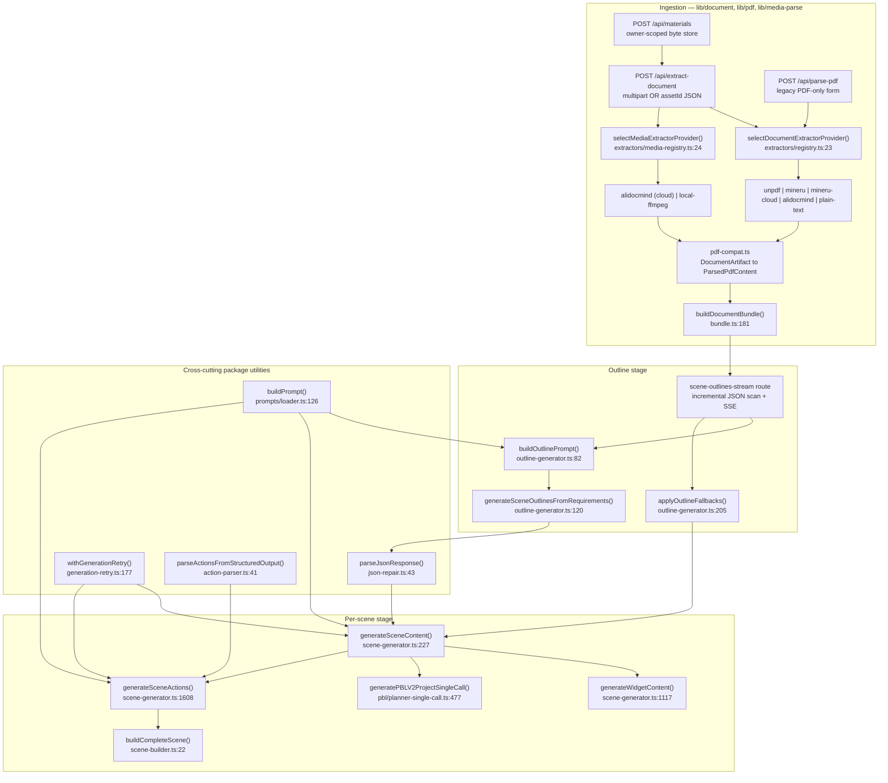

# Generation pipeline — overview

**Slug:** `generation-pipeline`
**Surveyed at:** commit `c2c9553a` (`git log -1 --format=%h` → `c2c9553a`)

## Topic index

Every file in this pack, in reading order. Sections that outgrew 350 lines were
split; both halves are registered here.

| File | Contents |
| --- | --- |
| `00-overview.md` | charter, execution modes, internal-parts diagrams, file inventory |
| `01a-modules-package.md` | `@openmaic/generation` module-by-module |
| `01b-modules-app-ingestion.md` | ingestion: types, registries, extractors, compat, bundling, extraction routes |
| `01c-modules-app-generation.md` | generation routes, stage routes, orchestration, UI |
| `02a-interfaces-package.md` | model seam, `SceneOutline`, outline entry points |
| `02b-interfaces-scenes.md` | scene entry points, content unions, assembly, retry, logger |
| `02c-interfaces-ingestion.md` | provider/artifact/transform/bundle/vision-partition contracts |
| `02d-interfaces-wire-and-prompt.md` | SSE + JSON wire shapes, one real assembled prompt |
| `02e-interfaces-prompt-system.md` | the three prompt loaders, template language, formatters |
| `03a-flows-ingestion-outline.md` | flow A (upload → bundle), flow B (outline + review), language control |
| `03b-flows-scenes-and-quiz.md` | flow C (scene fan-out), D (PBL), E (classroom job), F (quiz), progress transports |
| `04-dependencies-and-config.md` | npm/SaaS/binary deps, env vars, config resolution |
| `05-failure-modes.md` | failure catalogue, retry topology, abort, partial-failure matrix |
| `06-quality-and-metrics.md` | measured metrics with commands, strengths, real problems, test posture |
| `07-open-questions.md` | what could not be determined, and why |

## Charter

Turn a free-text course requirement (plus optional uploaded course materials)
into a persisted MAIC course document: a `Stage` plus an ordered list of
`Scene`s, each carrying typed content (slide canvas / quiz questions /
interactive widget HTML / PBL project) and an ordered `Action[]` playback
script.

Four sequential concerns:

1. **Ingestion** — bytes → extractor → normalised `DocumentArtifact` /
   `MediaArtifact` → flattened `ParsedPdfContent` → a single multi-document
   text+image *bundle* ([`lib/document/bundle.ts:181`](lib/document/bundle.ts#L181)).
2. **Outline generation** — requirement + bundle → one LLM call →
   `{ languageDirective, courseTitle, outlines[] }`
   ([`packages/@openmaic/generation/src/outline-generator.ts:120`](packages/@openmaic/generation/src/outline-generator.ts#L120), streamed by
   [`app/api/generate/scene-outlines-stream/route.ts:287`](app/api/generate/scene-outlines-stream/route.ts#L287)).
3. **Stage planning** — mint the stage id, persist the stage shell, publish /
   freshness metadata ([`app/api/stages/route.ts:50`](app/api/stages/route.ts#L50),
   [`app/api/stage-meta/[stageId]/route.ts:38`](app/api/stage-meta/[stageId]/route.ts#L38)).
4. **Per-scene generation** — for each outline: content
   ([`scene-generator.ts:227`](packages/@openmaic/generation/src/scene-generator.ts#L227)) → actions ([`scene-generator.ts:1608`](packages/@openmaic/generation/src/scene-generator.ts#L1608)) → assemble
   ([`scene-builder.ts:22`](packages/@openmaic/generation/src/scene-builder.ts#L22)) → optional TTS → store.

The publishable package `@openmaic/generation` owns steps 2 and 4 as pure
functions over an injected model seam:

```ts
// packages/@openmaic/generation/src/pipeline-types.ts:60
export type AICallFn = (
  systemPrompt: string,
  userPrompt: string,
  images?: Array<{ id: string; src: string }>,
) => Promise<string>;
```

The package "does not select a provider, read environment configuration, or own
persistence" (`packages/@openmaic/generation/README.md`). Every provider
decision, retry budget and persistence write lives in the app.

## Two execution modes

| Mode | Driver | Progress transport | Entry |
| --- | --- | --- | --- |
| Interactive (default UI) | Browser: [`app/generation-preview/page.tsx:306`](app/generation-preview/page.tsx#L306) + [`lib/hooks/use-scene-generator.ts:627`](lib/hooks/use-scene-generator.ts#L627) | SSE for outlines; Zustand store status for scenes | `/generation-preview` |
| One-shot server job | [`lib/server/classroom-generation.ts:176`](lib/server/classroom-generation.ts#L176) driven by [`app/api/generate-classroom/route.ts:14`](app/api/generate-classroom/route.ts#L14) via `after()` | Job row polled by `GET /api/generate-classroom/[jobId]` | `POST /api/generate-classroom` |

Both call the *same* package primitives; only the model plumbing, retry
wiring and persistence differ.

## Internal parts



## Stage sequence, with the artefact each stage hands on


## File inventory

LOC from `wc -l`. Package total: `wc -l packages/@openmaic/generation/src/**/*.ts`
→ **8155**. App-side in-scope total:
`wc -l $(git ls-files 'app/api/generate*' 'app/api/stages' 'app/api/stage-meta' 'app/api/quiz-grade' 'app/api/materials' 'app/api/extract-document' 'app/api/parse-pdf' lib/document lib/media-parse lib/pdf lib/import lib/prompts components/generation app/generation-preview | grep -E '\.tsx?$')`
→ **16287**.

### `@openmaic/generation` package

| Path | LOC | Role |
| --- | --- | --- |
| `src/scene-generator.ts` | 1931 | All per-scene content + action generation |
| `src/pbl/types.ts` | 699 | PBL v2 project contract |
| `src/pbl/planner-single-call.ts` | 578 | Single-call PBL planner + validation |
| `src/pbl/planner-core.ts` | 487 | Shared PBL prompt/normalisation/gating |
| `src/json-repair.ts` | 278 | 4-strategy JSON recovery from model output |
| `src/generation-retry.ts` | 234 | Retry classification + exponential backoff |
| `src/outline-generator.ts` | 233 | Outline prompt build, parse, fallbacks |
| `src/action-parser.ts` | 162 | Structured-JSON → `Action[]` |
| `src/interactive-post-processor.ts` | 157 | LaTeX delimiters + KaTeX injection |
| `src/prompt-formatters.ts` | 152 | Course context, agent/teacher blocks, vision parts |
| `src/prompts/loader.ts` | 145 | Markdown template loader (snippet/if/var) |
| `src/scene-builder.ts` | 115 | Outline + content + actions → DSL `Scene` |
| `src/index.ts` | 114 | Public export surface |
| `src/outline-types.ts` | 107 | `SceneOutline`, `PdfImage`, `WidgetOutline` |
| `src/outline-formatters.ts` | 79 | Vision partition + image descriptions |
| `src/outline-type.ts` | 76 | `changeOutlineType()` for the editor |
| `src/pipeline-types.ts` | 64 | `AICallFn`, `GenerationResult`, contexts |
| `src/scene-types.ts` | 60 | `Generated*Content` unions |
| `src/prompts/types.ts` | 38 | `PromptId` / `SnippetId` unions |
| `src/outline-media.ts` | 30 | `uniquifyMediaElementIds()` |
| `src/prompts/index.ts` | 27 | `PROMPT_IDS` |
| `src/logger.ts` | 15 | `GenerationLogger` seam |
| `src/constants.ts` | 2 | `MAX_PDF_CONTENT_CHARS`, `MAX_VISION_IMAGES` |
| `src/pbl/operations/kernel/*.ts` | 2368 | PBL runtime kernel (progress/proficiency/etc.) |
| `templates/*/{system,user}.md` | 4583 across 26 files | Generation prompt bodies |
| `snippets/*.md` | 7 files | Reusable prompt blocks |
| `prompts-pbl/*.md` | 3 files | PBL planner system prompts |
| `test/*.test.ts` | 2977 total, 26 files, 130 cases | Package tests |

### App layer

| Path | LOC | Role |
| --- | --- | --- |
| `app/generation-preview/page.tsx` | 1554 | Browser orchestrator for the whole run |
| `components/generation/outlines-editor.tsx` | 1523 | Human-in-the-loop outline review/edit |
| `components/generation/generation-toolbar.tsx` | 1033 | Requirement input, material picker, provider pins |
| `app/generation-preview/components/visualizers.tsx` | 848 | Per-step progress visuals |
| `lib/document/extractors/local-media.ts` | 835 | ffmpeg/ffprobe + ASR media extractor |
| `lib/pdf/pdf-providers.ts` | 719 | PDF provider dispatch (`parsePDF`) |
| `app/api/generate/scene-outlines-stream/route.ts` | 716 | Outline SSE endpoint |
| `app/api/extract-document/route.ts` | 659 | Unified document + media extraction endpoint |
| `lib/import/use-import-classroom.ts` | 575 | Classroom ZIP import |
| `components/generation/media-popover.tsx` | 495 | Media/TTS provider toggles |
| `app/api/materials/route.ts` | 416 | Owner-scoped material upload + list |
| `lib/document/mime.ts` | 370 | Format registry, MIME normalisation, accept string |
| `app/api/generate/agent-profiles/route.ts` | 368 | Classroom agent persona generation |
| `app/api/generate/scene-content/route.ts` | 363 | Scene content endpoint (step 1) |
| `lib/pdf/mineru-cloud.ts` | 363 | MinerU Cloud submit/poll/zip |
| `lib/pdf/alidocmind-client.ts` | 315 | AliDocMind submit/poll/get |
| `lib/document/extractors/manifest.ts` | 268 | Browser-safe extractor metadata mirror |
| `lib/document/bundle.ts` | 256 | Multi-document bundling + vision priority |
| `lib/document/types.ts` | 233 | Artifact / provider / result contracts |
| `lib/document/pdf-compat.ts` | 201 | Bidirectional artifact ↔ `ParsedPdfContent` |
| `app/api/generate/scene-actions/route.ts` | 195 | Scene actions endpoint (step 2) |
| `app/api/stages/[id]/route.ts` | 189 | Document GET/PATCH/PUT/DELETE |
| `lib/prompts/loader.ts` | 157 | App-side template loader |
| `lib/media-parse/media-parse-providers.ts` | 151 | AliDocMind media parse dispatch |
| `app/api/stages/[id]/freshness/route.ts` | 152 | Revision SSE |
| `app/generation-preview/types.ts` | 147 | Session state + step definitions |
| `lib/document/transforms/*` | 462 | Transform pipeline (not wired into generation — see below) |
| `app/api/quiz-grade/route.ts` | 113 | Short-answer LLM grading |
| `app/api/parse-pdf/route.ts` | 93 | Legacy PDF-only extraction endpoint |
| `app/api/generate-classroom/route.ts` + `[jobId]` | 73 + 54 | Server job create + poll |

Plus supporting app modules reached by import and documented here because they
carry pipeline behaviour: `lib/hooks/use-scene-generator.ts` (1053),
`lib/server/classroom-generation.ts` (738), `lib/utils/concurrency.ts` (76).

## Explicit boundaries

Out of scope for this pack (documented by sibling packs):

- Image/video/TTS *provider* implementations (`lib/media/*`, `lib/audio/*`).
  Only their call sites in the pipeline are noted.
- The PBL runtime kernel under `src/pbl/operations/kernel/` — it is exported by
  this package but consumed at classroom *runtime*, not during generation.
- RAG ingestion. Note that `lib/document/transforms/` (the
  normalise/noise-removal pipeline) is consumed **only** by
  [`lib/rag/ingest/document.ts:138`](lib/rag/ingest/document.ts#L138); the generation path never calls
  `transformDocument`
  (`git grep -n "transformDocument" -- app lib` → registry/index/pipeline
  definitions plus `lib/rag/ingest/document.ts` only).
- `@openmaic/dsl` element/action schemas; this pack cites them as types.

No file in the deliverable list is omitted: the subsystem has real content for
every one. Three chapters (modules, interfaces, flows) exceeded the 350-line
ceiling and were split into the lettered files below.

## Files in this pack

Fifteen files. Every row links, so this table is the pack's navigation as well as its
manifest.

| File | Contents |
| --- | --- |
| `00-overview.md` | this file — charter, internal parts, stage sequence, source inventory, boundaries |
| [`01a-modules-package.md`](docs/appendix/research/generation-pipeline/01a-modules-package.md) | modules of the `@openmaic/generation` package |
| [`01b-modules-app-ingestion.md`](docs/appendix/research/generation-pipeline/01b-modules-app-ingestion.md) | app layer, part 1: ingestion |
| [`01c-modules-app-generation.md`](docs/appendix/research/generation-pipeline/01c-modules-app-generation.md) | app layer, part 2: generation routes, orchestration, UI |
| [`02a-interfaces-package.md`](docs/appendix/research/generation-pipeline/02a-interfaces-package.md) | package core: the model seam (`AICallFn`) and the outline contracts |
| [`02b-interfaces-scenes.md`](docs/appendix/research/generation-pipeline/02b-interfaces-scenes.md) | scene, retry and prompt contracts |
| [`02c-interfaces-ingestion.md`](docs/appendix/research/generation-pipeline/02c-interfaces-ingestion.md) | ingestion and bundling contracts |
| [`02d-interfaces-wire-and-prompt.md`](docs/appendix/research/generation-pipeline/02d-interfaces-wire-and-prompt.md) | wire shapes, plus one real assembled prompt end to end |
| [`02e-interfaces-prompt-system.md`](docs/appendix/research/generation-pipeline/02e-interfaces-prompt-system.md) | the prompt system: templates, snippets, loaders |
| [`03a-flows-ingestion-outline.md`](docs/appendix/research/generation-pipeline/03a-flows-ingestion-outline.md) | traced flows: ingestion and outline generation |
| [`03b-flows-scenes-and-quiz.md`](docs/appendix/research/generation-pipeline/03b-flows-scenes-and-quiz.md) | traced flows: scenes, PBL, the classroom job, quiz |
| [`04-dependencies-and-config.md`](docs/appendix/research/generation-pipeline/04-dependencies-and-config.md) | dependencies and configuration |
| [`05-failure-modes.md`](docs/appendix/research/generation-pipeline/05-failure-modes.md) | failure modes |
| [`06-quality-and-metrics.md`](docs/appendix/research/generation-pipeline/06-quality-and-metrics.md) | quality observations and measured metrics |
| [`07-open-questions.md`](docs/appendix/research/generation-pipeline/07-open-questions.md) | open questions |

Pack→topic mapping and the shared chapter convention: [`../index.md`](docs/appendix/research/index.md).
