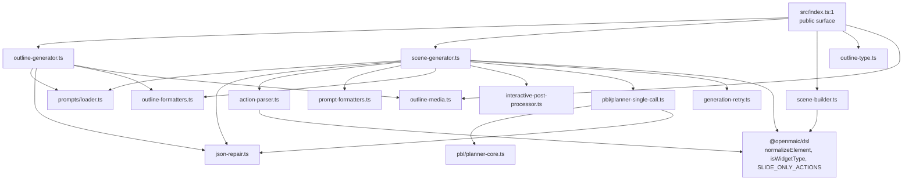
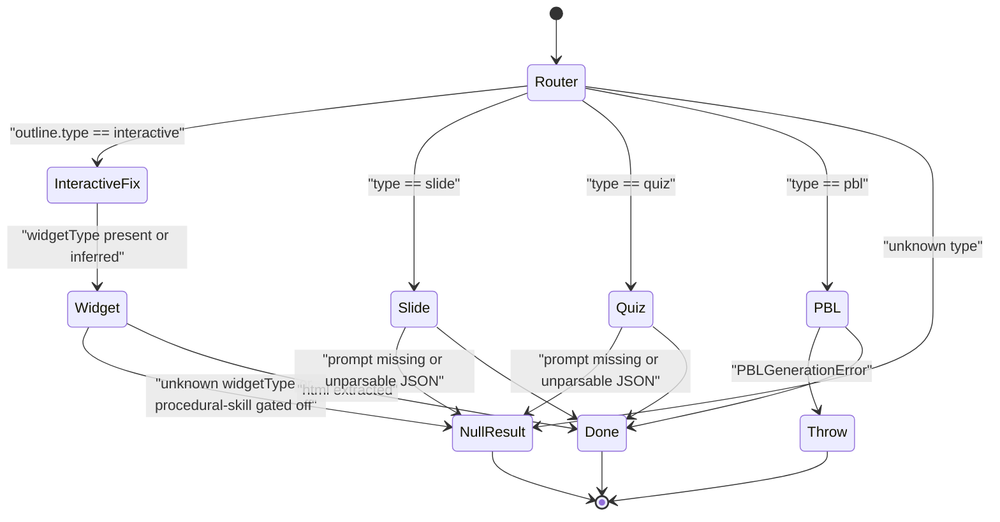

# Modules — the `@openmaic/generation` package

Part 1 of 3. App-layer ingestion modules are in
`01b-modules-app-ingestion.md`; generation routes, orchestration and UI in
`01c-modules-app-generation.md`.



## `src/index.ts` — export surface

114 lines, entirely re-exports. Groups: pipeline types (`AICallFn`,
`AgentInfo`, `GeneratedSlideData`, `GenerationResult`,
`SceneGenerationContext`), scene generation
(`generateSceneContent`, `generateSceneActions`, `generateWidgetContent`,
`extractInteractiveElements`, `extractWidgetConfig`, `resolveImageIds`,
`PBLGenerationError`), assembly (`buildCompleteScene`), retry
(`withGenerationRetry`, `isAbortError`, `isRetryableGenerationError`), PBL
(`generatePBLV2ProjectSingleCall` plus the whole runtime kernel via
`export *`), outline (`buildOutlinePrompt`,
`generateSceneOutlinesFromRequirements`, `applyOutlineFallbacks`,
`sanitizeProceduralSkillOutline`, `DEFAULT_LANGUAGE_DIRECTIVE`), and the whole
prompt loader (`export * from './prompts/index.js'`, [`index.ts:114`](packages/@openmaic/generation/src/index.ts#L114)).

Note the duplicated symbol names: `formatImageDescription` /
`formatImagePlaceholder` are exported from `prompt-formatters.ts`
([`index.ts:100-101`](packages/@openmaic/generation/src/index.ts#L100-L101)) while byte-identical copies also exist in
[`outline-formatters.ts:3`](packages/@openmaic/generation/src/outline-formatters.ts#L3) and [`:14`](packages/@openmaic/generation/src/outline-formatters.ts#L14). Only `partitionImagesForVision` is
exported from `outline-formatters` ([`index.ts:89`](packages/@openmaic/generation/src/index.ts#L89)).

## `src/prompts/loader.ts` — template assembly

Templates are Markdown on disk, resolved relative to the module URL so the same
code works from `src/` and `dist/`:

```ts
// prompts/loader.ts:13
const DEFAULT_PROMPTS_DIR = resolve(dirname(fileURLToPath(import.meta.url)), '../..');
```

`buildPrompt(promptId, variables, promptsDir?)` ([`loader.ts:126`](packages/@openmaic/generation/src/prompts/loader.ts#L126)) runs a fixed
three-phase substitution, in this order:

1. `processSnippets` ([`loader.ts:42`](packages/@openmaic/generation/src/prompts/loader.ts#L42)) — `{{snippet:name}}` → file content of
   `snippets/<name>.md`. A missing snippet **throws** ([`loader.ts:37`](packages/@openmaic/generation/src/prompts/loader.ts#L37)) rather
   than shipping the literal token to the model.
2. `processConditionalBlocks` ([`loader.ts:52`](packages/@openmaic/generation/src/prompts/loader.ts#L52)) — `{{#if flag}}…{{/if}}`,
   non-nesting by design, truthiness read from the same `variables` record.
3. `interpolateVariables` ([`loader.ts:99`](packages/@openmaic/generation/src/prompts/loader.ts#L99)) — `{{camelCase}}`; an **undefined**
   value leaves the literal `{{token}}` in place ([`loader.ts:103`](packages/@openmaic/generation/src/prompts/loader.ts#L103)), objects are
   `JSON.stringify(value, null, 2)`.

`loadPrompt` ([`loader.ts:65`](packages/@openmaic/generation/src/prompts/loader.ts#L65)) requires `system.md` and treats `user.md` as
optional *only* on `ENOENT` ([`loader.ts:87`](packages/@openmaic/generation/src/prompts/loader.ts#L87)) — any other fs error rethrows.
Missing `system.md` returns `null`, which is how every caller detects
"prompt-unavailable".

`PROMPT_VARIABLE_DEFAULTS` ([`loader.ts:15`](packages/@openmaic/generation/src/prompts/loader.ts#L15)) currently carries exactly one
entry: `pbl-actions.projectSummary`.

Prompt ids are a closed union ([`prompts/types.ts:6`](packages/@openmaic/generation/src/prompts/types.ts#L6)): `requirements-to-outlines`,
`slide-content`, `quiz-content`, `simulation-content`, `diagram-content`,
`code-content`, `game-content`, `visualization3d-content`,
`procedural-skill-content`, `slide-actions`, `quiz-actions`,
`interactive-actions`, `pbl-actions`. Snippet ids likewise
([`prompts/types.ts:22`](packages/@openmaic/generation/src/prompts/types.ts#L22), 7 ids).

## `src/outline-generator.ts`

- `buildOutlinePrompt(requirements, context)` (`:82`) — assembles the
  `requirements-to-outlines` prompt. Inputs: `requirement`, PDF text truncated
  to `MAX_PDF_CONTENT_CHARS` (50 000, [`constants.ts:1`](packages/@openmaic/generation/src/constants.ts#L1)), an
  `availableImages` block, a `## Student Profile` block synthesised inline at
  `:91`, conditional flags `hasSourceImages` / `imageEnabled` / `videoEnabled` /
  `mediaEnabled`, `researchContext`, `teacherContext`. Throws
  `Error('Prompt template not found')` when `buildPrompt` returns null (`:113`).
- `buildAvailableImages` (`:46`) — vision-mode split: sort by vision priority,
  keep only images with a mapping entry, first `MAX_VISION_IMAGES` (20,
  [`constants.ts:2`](packages/@openmaic/generation/src/constants.ts#L2)) become `[see attached]` placeholders plus real attachments;
  the remainder plus mapping-less images become plain text descriptions.
- `generateSceneOutlinesFromRequirements(...)` (`:120`) — single `aiCall`, then
  `parseJsonResponse`. Accepts **either** a bare `SceneOutline[]` (then
  `languageDirective` defaults to `DEFAULT_LANGUAGE_DIRECTIVE`, `:20`) **or**
  the wrapper object. `courseTitle` is trimmed and hard-capped at 120 chars
  (`:161`). Ids default to `nanoid()`, `order` is re-assigned from array index
  (`:171`). Finally `uniquifyMediaElementIds`. Returns
  `GenerationResult<...>`; every throw becomes `{ success:false, error:String(e) }`
  (`:181`).
- `applyOutlineFallbacks(outline, hasLanguageModel, options)` (`:205`) — three
  demotions: `procedural-skill` widget without the feature flag →
  `sanitizeProceduralSkillOutline` (diagram); `interactive` with neither
  `interactiveConfig` nor widget config → `slide`; `pbl` without `pblConfig` or
  without a model → `slide`.

## `src/scene-generator.ts` (1931 lines)

The largest module. Layout by line:

| Lines | Section |
| --- | --- |
| 62–222 | media-placeholder regex, legacy `interactiveConfig` → widget conversion, keyword-based `inferWidgetType` |
| 227–314 | `generateSceneContent` — the type router |
| 326–413 | `isImageIdReference`, `resolveImageIds` |
| 415–481 | `normalizeGeneratedVideoRefs` |
| 483–597 | `fixElementDefaults`, `stripNulls`, `processLatexElements` |
| 602–849 | `generateSlideContent` |
| 854–955 | `generateQuizContent`, option/answer normalisation |
| 962–1070 | `PBLGenerationError`, `plannerErrorStatus`, `generatePBLSceneContent` |
| 1076–1110 | `extractHtml` (3 strategies) |
| 1117–1282 | `generateWidgetContent`, `extractWidgetConfig` |
| 1289–1564 | `extractInteractiveElements` + HTML/attr/utility-class helpers |
| 1566–1761 | `buildPBLProjectSummary`, `generateSceneActions` |
| 1766–1931 | prompt formatters for elements/questions, `processActions`, four default-action fallbacks |

### `generateSceneContent` (`:227`) — routing



Interactive normalisation happens *before* the switch (`:255-280`): a legacy
`interactiveConfig` is converted by `convertInteractiveConfigToWidget` (`:135`),
whose widget type comes from `inferWidgetType` (`:169`) — a bilingual regex
cascade over `subject + concept + designIdea` mapping to
`simulation | code | diagram | visualization3d | game`, defaulting to
`simulation`. A still-missing `widgetType` defaults to `simulation` with
`widgetOutline = { concept: outline.title }` (`:263`).

### `generateSlideContent` (`:602`)

Post-generation pipeline, in order, each stage logging its surviving element
count:

1. `fixElementDefaults` (`:801` → `:483`) — `normalizeElement(stripNulls(el))`
   from the DSL inside a try/catch; a throwing element is **dropped** with a
   warn (`:512`). Then image boxes are refitted to the assigned image's real
   aspect ratio when off by >10 %, clamped to height 462 on a 562.5-high canvas
   (`:527-534`).
2. `processLatexElements` (`:805` → `:565`) — `katex.renderToString(latex, { throwOnError:false, displayMode:true, output:'html' })`;
   elements without a `latex` string or that throw are dropped.
3. `resolveImageIds` (`:809` → `:355`) — `img_N` references resolved through
   `imageMapping`; an unmapped id **removes the element** (`:373`).
   `gen_img_*` / `gen_vid_*` placeholders (regex `:63`) are kept for async
   backfill unless `generatedMediaMapping` already has them.
4. `normalizeGeneratedVideoRefs` (`:817` → `:415`) — reconciles `src` vs
   `mediaRef` against the outline's declared `mediaGenerations`.
5. Element ids assigned as `${type}_${nanoid(8)}` and `rotate: 0` (`:825`).

Edit mode: when `editDirective` or `baselineContent` is present, the user prompt
is appended with an `## EDIT MODE` block that serialises the baseline slide and
wraps the instruction in `<<<INSTRUCTION … INSTRUCTION>>>` markers (`:764`) so
the instruction cannot be read as schema.

### `generateQuizContent` (`:854`)

`quizConfig` defaults to `{ questionCount: 3, difficulty: 'medium', questionTypes: ['single'] }`
(`:861`). Post-processing tolerates loose model output: options may be plain
strings or objects and are normalised to `{ value: 'A'|'B'|…, label }`
(`normalizeQuizOptions`, `:914`); the answer is read from `answer`,
`correctAnswer` **or** `correct_answer` and coerced to `string[]`
(`normalizeQuizAnswer`, `:943`). `short_answer` questions get
`options: undefined, answer: undefined, hasAnswer: false` (`:896-903`) — they
are graded later by `/api/quiz-grade`.

### `generateWidgetContent` (`:1117`)

One `switch (widgetType)` selecting prompt id and variables for six widget
types (`:1140-1232`): `simulation`, `diagram`, `code`, `game`,
`visualization3d`, `procedural-skill`. Output is HTML, not JSON:
`extractHtml` (`:1076`) tries `<!DOCTYPE html>`/`<html` … `</html>`, then a
fenced code block, then the raw trimmed body. Then `extractWidgetConfig`
(`:1264`) parses `<script type="application/json" id="widget-config">` and
`postProcessInteractiveHtml` injects KaTeX.

`extractInteractiveElements` (`:1289`) builds an inventory of real selectors
from the generated HTML so the actions prompt targets existing nodes. It strips
`<script>`/`<style>`/comments **and** everything from the first unmatched
`<script` open (`:1300`) so a truncated generation cannot leak ids out of
`innerHTML` templates, keeps class names that the page's own `<style>` declares
(`collectStyledClassNames`, `:1413`) and filters Tailwind-shaped utility classes
(`UTILITY_PREFIXES` `:1456`, `UTILITY_EXACT` `:1529`).

### `generateSceneActions` (`:1608`)

Four branches keyed on `outline.type` plus a content-shape guard
(`'elements' in content`, `'questions' in content`, `'html' in content`). Each
builds its prompt, calls the model once, parses with
`parseActionsFromStructuredOutput`, and on **zero** parsed actions falls back to
a hard-coded default action list (`:1877`, `:1908`, `:1922`, `:1766`). The
interactive branch passes `INTERACTIVE_WIDGET_ACTIONS`
(`widget_highlight`, `widget_setState`, `widget_annotation`, `widget_reveal`,
`:66`) as an allow-list; the element inventory is **recomputed from the current
HTML on every call** rather than persisted (`:1694`).

`processActions` (`:1821`) fills missing ids, repoints an invalid `spotlight`
`elementId` to the first element, and replaces an invalid `discussion.agentId`
with a *random* student (or non-teacher) agent (`:1861`).

## `src/scene-builder.ts`

`buildCompleteScene(outline, content, actions, stageId, options?)` (`:22`) —
four shape-guarded branches producing `CompleteScene` (a DSL `Scene` plus
`outlineId`). The slide branch synthesises the canvas: `viewportSize: 1000`,
`viewportRatio: 0.5625`, and a hard-coded default `SlideTheme` (`:37`). An
outline/content mismatch returns `null` (`:114`). `options.sceneId` lets a
retrying consumer keep scene identity stable across replays.

## `src/json-repair.ts`

`parseJsonResponse<T>(response, options)` (`:43`): exact `JSON.parse` →
`stripReasoningPrefix` (drops everything up to the last `</think>`,
`</thinking>` or `</reasoning>`, `:75`) → candidate parse → candidate parse of
the raw response. `parseJsonResponseCandidate` (`:85`) tries markdown fences,
then a brace/bracket-matched substring located by a string-aware scanner
(`:122`), then the whole text.

`tryParseJson` (`:177`) is the four-attempt repair ladder:

| Attempt | Fix |
| --- | --- |
| 1 | plain `JSON.parse` |
| 2 | `repairQuotedPropertyFragments` (`"height: 76"` → `"height": 76`), LaTeX backslash double-escaping, truncated array/object closing |
| 3 | `jsonrepair(jsonStr)` from the `jsonrepair` package |
| 4 | strip/escape control characters `\x00-\x1F\x7F` |

Every failed attempt logs a 240-char window around the reported error position
(`logJsonParseError`, `:19`).

## `src/generation-retry.ts`

`withGenerationRetry(operation, options)` (`:177`). Defaults: 5 retries
(6 attempts), base 1000 ms, cap 16 000 ms (`:21-23`). Delay is
`min(cap, base * 2^(attempt-1))` plus up to 20 % jitter (`:166`).
Retries on **either** a throw classified retryable by
`isRetryableGenerationError` **or** a *successful* result that
`shouldRetryResult` rejects (which is how "model returned nothing" is retried).

`isRetryableGenerationError` (`:129`) precedence: abort → never; explicit
`isRetryable` boolean → honoured; status code in `{408,409,425,429}` or ≥ 500 →
retry, in `{400,401,403,404,422}` or any other 4xx → no; otherwise recurse into
`cause` / `lastError` / `errors[]`; then `TimeoutError`; then a message regex
covering rate limit / timeout / `ECONNRESET` / `ETIMEDOUT` / `socket hang up`
(`:111`). `isAbortError` (`:63`) checks `Error.name`, `DOMException` and a bare
`{ name: 'AbortError' }` record so it works in browser, Node and test runtimes.

## `src/action-parser.ts`

`parseActionsFromStructuredOutput(response, sceneType?, allowedActions?, logger)`
(`:41`). Strips fences, locates `[` … `]`, parses with `JSON.parse` →
`jsonrepair` → `partial-json` (`Allow.ARR|OBJ|STR|NUM|BOOL|NULL`, `:73`) so an
unclosed array still yields the complete leading items. Items of `type: 'text'`
become `speech` actions; `type: 'action'` items accept both
`name`/`params` and legacy `tool_name`/`parameters` (`:108`). Three
post-passes: `discussion` must be last and unique (`:133`), `SLIDE_ONLY_ACTIONS`
are stripped from non-slide scenes (`:142`), and `allowedActions` filters
everything except `speech` (`:153`). `widget_setState` gets `state: {}` when the
model omitted it (`:122`).

## PBL scene generation

`generatePBLSceneContent` ([`scene-generator.ts:988`](packages/@openmaic/generation/src/scene-generator.ts#L988)) builds a
`PBLPlannerV2Input` carrying only the current outline in `courseContext.allOutlines`
(`:1008`) plus the user profile and `targetLanguage`, then calls
`generatePBLV2ProjectSingleCall` ([`pbl/planner-single-call.ts:477`](packages/@openmaic/generation/src/pbl/planner-single-call.ts#L477)).

That planner: build system prompt (ordinary vs `scenarioRoleplay` variant,
`:503`) → one call → `parseJsonResponse` → `validateLLMOutput` → **one** targeted
retry that feeds the concrete gap list back to the model (`:522`) → `hydrateProject`
→ `normalizeProjectRuntime` / `normalizeSynthesisChecks` / `normalizeScenario`
→ `plannerCompletionGaps` gate. Any surviving gap throws `PlannerV2Error`.

Back in `generatePBLSceneContent`, a `PlannerV2Error` (schema/validation) falls
through to an injected `pblLoopFallback`, but a **provider/HTTP** failure or an
abort skips the fallback entirely (`:1042`), because the loop planner would hit
the same provider again. Everything terminal is wrapped in `PBLGenerationError`
with the propagated `statusCode` (`:1053`, `:1063`), where `plannerErrorStatus`
(`:972`) walks `statusCode`/`status`/`status_code` through `cause` and
`lastError` with a cycle guard.
