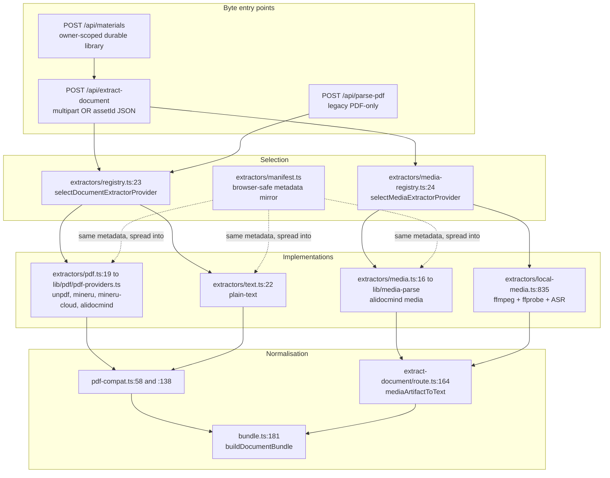
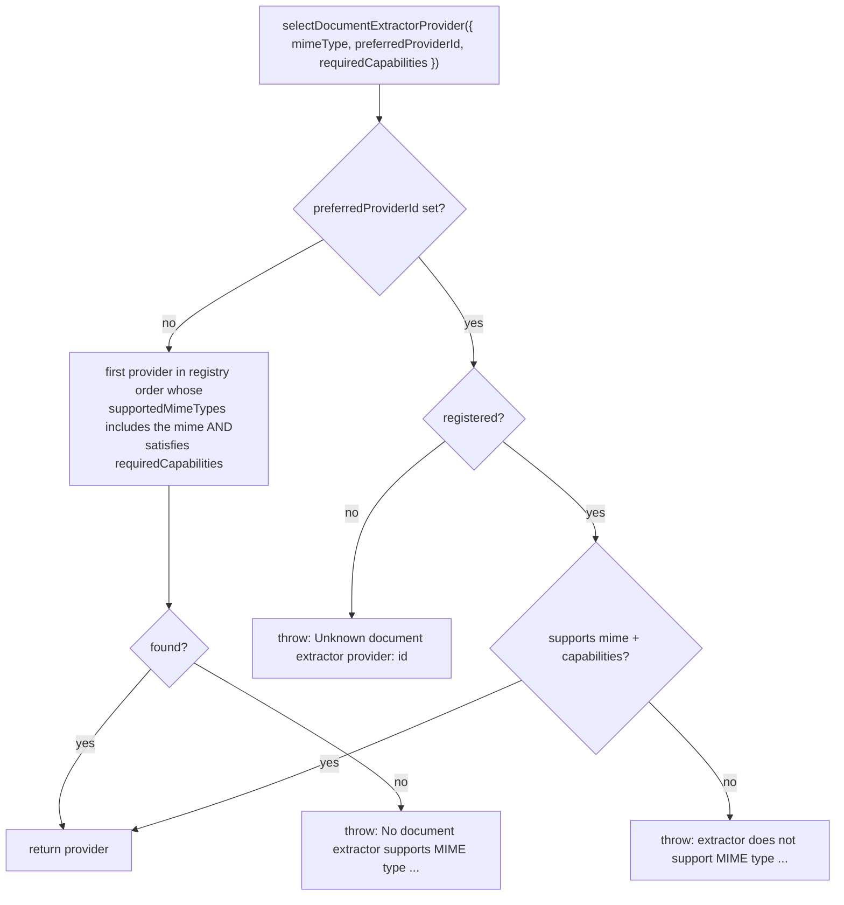

# Modules — app layer, part 1: ingestion

Part 2 of 3 in the module walkthrough. Package modules are in
`01a-modules-package.md`; generation routes, orchestration and UI are in
`01c-modules-app-generation.md`.

## `lib/document/types.ts` — the normalised intermediate representation

Two artifact shapes, both metadata + payload + diagnostics:

- `DocumentArtifact` (`:151`): `metadata { fileName, fileSize, mimeType, pageCount, providerId, processingTime }`,
  `blocks: DocumentBlock[]`, `assets: DocumentAsset[]`, optional `citations`,
  `diagnostics`, `transforms`, and `providerRaw` (the untouched provider payload).
- `MediaArtifact` (`:187`): `metadata { …, durationMs }`, `transcript`,
  `keyframes`, `assets`, `diagnostics`, `providerRaw`.

`DocumentBlockType` (`:94`) is `text | markdown | image | table | formula | layout`.
`ExtractionResult` (`:213`) is a discriminated `succeeded | failed` union — but
neither extraction route uses it; both call `provider.extract()` and let throws
propagate to the route's try/catch.

## Extractor registries and selection

Registry order **is** the auto-selection order:
`[textDocumentExtractorProvider, ...pdfDocumentExtractorProviders]`
([`registry.ts:5`](lib/document/extractors/registry.ts#L5)), where the PDF group follows `Object.keys(PDF_PROVIDERS)` —
`unpdf`, `mineru`, `mineru-cloud`, `alidocmind` ([`lib/pdf/constants.ts:14`](lib/pdf/constants.ts#L14)). So a
`.txt`/`.md` upload resolves to `plain-text`, a PDF to `unpdf`, and a
`.docx`/`.pptx` to `mineru` unless the caller pins a provider.

The media registry ([`extractors/media-registry.ts:24`](lib/document/extractors/media-registry.ts#L24)) adds an **availability**
probe: the cloud provider reports unavailable without AliDocMind credentials
([`extractors/media.ts:24`](lib/document/extractors/media.ts#L24)), and selection walks supported providers until one is
available ([`media-registry.ts:67`](lib/document/extractors/media-registry.ts#L67)), so a credential-less deployment falls
through to `local-ffmpeg`. The terminal error names both setup paths
([`media-registry.ts:70`](lib/document/extractors/media-registry.ts#L70)).

`extractors/manifest.ts` is a **browser-safe mirror** of both registries: plain
data only, so client pages can resolve the expected extractor id + version
without pulling `sharp`, `@alicloud/*`, `child_process` or `fs` into the bundle
([`manifest.ts:1-24`](lib/document/extractors/manifest.ts#L1-L24)). Provider implementations spread their own manifest entry
(`...pdfManifestEntry(id)`, [`extractors/pdf.ts:26`](lib/document/extractors/pdf.ts#L26);
`...getDocumentExtractorManifestEntry('plain-text')!`, [`extractors/text.ts:21`](lib/document/extractors/text.ts#L21))
so drift is structurally impossible, and
`selectDocumentExtractorManifestEntry` ([`manifest.ts:195`](lib/document/extractors/manifest.ts#L195)) /
`selectMediaExtractorManifestEntry` ([`manifest.ts:235`](lib/document/extractors/manifest.ts#L235)) reimplement selection
over the entries.

## The five document extractors

| id | Backing service | Path | MIME set | Async |
| --- | --- | --- | --- | --- |
| `plain-text` | none (in-process `TextDecoder`, BOM-sniffed) | [`extractors/text.ts:22`](lib/document/extractors/text.ts#L22) | `text/plain`, `text/markdown`, `text/x-markdown` ([`mime.ts:158`](lib/document/mime.ts#L158)) | no |
| `unpdf` | `unpdf` npm + `sharp` | [`lib/pdf/pdf-providers.ts:250`](lib/pdf/pdf-providers.ts#L250) | `application/pdf` only | no |
| `mineru` | self-hosted MinerU `POST /file_parse` | [`pdf-providers.ts:620`](lib/pdf/pdf-providers.ts#L620) | PDF + docx/pptx/xlsx + 6 image types ([`mime.ts:141`](lib/document/mime.ts#L141)) | no |
| `mineru-cloud` | `https://mineru.net/api/v4` batch → poll → ZIP | [`lib/pdf/mineru-cloud.ts:241`](lib/pdf/mineru-cloud.ts#L241) | self-host set + legacy `.doc/.ppt/.xls` ([`mime.ts:150`](lib/document/mime.ts#L150)) | yes |
| `alidocmind` | Aliyun Document Mind (`@alicloud/docmind-api20220711`) | [`lib/pdf/alidocmind-client.ts:100`](lib/pdf/alidocmind-client.ts#L100) | PDF + modern Office + png/jpeg/bmp/gif ([`mime.ts:170`](lib/document/mime.ts#L170)) | yes |

`unpdf` detail: `extractText(pdf, { mergePages: true })`, then per page
`extractImages` → `sharp(raw).png()` → `data:image/png;base64,…`, ids
`img_1..N` echoed into `metadata.imageMapping` and `metadata.pdfImages`
([`pdf-providers.ts:279-326`](lib/pdf/pdf-providers.ts#L279-L326)). In `textOnly` mode the image loop is skipped and
`maxImageSize` is capped at 16 000 000 px ([`pdf-providers.ts:254`](lib/pdf/pdf-providers.ts#L254)).

AliDocMind post-processing downloads the OSS image crops it returns, gated by an
SSRF allow-list restricted to `*.aliyuncs.com` ([`pdf-providers.ts:402`](lib/pdf/pdf-providers.ts#L402)), capped
at 200 images, 10 MB each, 6 concurrent ([`pdf-providers.ts:383-387`](lib/pdf/pdf-providers.ts#L383-L387)).

Self-hosted MinerU errors are translated: a lightweight `mineru-api` install
lacking the pipeline extras returns a Python traceback, and
`describeSelfHostedMinerUError` ([`pdf-providers.ts:168`](lib/pdf/pdf-providers.ts#L168)) turns
`ModuleNotFoundError` / `ImportError` / `Device string must not be empty` into an
actionable message, otherwise truncating the raw body to 300 chars. A filename
mismatch in the response falls back to the first result key with a warn
([`pdf-providers.ts:686`](lib/pdf/pdf-providers.ts#L686)).

## The two media extractors

- `alidocmind` media ([`extractors/media.ts:16`](lib/document/extractors/media.ts#L16) → [`lib/media-parse/media-parse-providers.ts:29`](lib/media-parse/media-parse-providers.ts#L29))
  — cloud transcript + keyframes + synopsis + OCR.
- `local-ffmpeg` ([`extractors/local-media.ts:835`](lib/document/extractors/local-media.ts#L835)) — resolves `ffmpeg`/`ffprobe`
  on `PATH`, probes duration, splits audio into `MEDIA_ASR_CHUNK_SEC = 600` s
  chunks ([`local-media.ts:32`](lib/document/extractors/local-media.ts#L32)), sends each to the configured server ASR
  provider, samples keyframes. Hard limits: 90 min media (`:37`), 45 min per job
  (`:35`), 8 min per ASR call (`:36`), 20 min per ffmpeg invocation (`:33`),
  50 000 keyframe candidates (`:39`). Failures are raised as
  `MaterialExtractionError` with an explicit `retryable` flag
  ([`lib/server/material-extraction/errors.ts:2`](lib/server/material-extraction/errors.ts#L2)), re-exported here as
  `LocalMediaExtractionError` ([`local-media.ts:75`](lib/document/extractors/local-media.ts#L75)).

## `lib/document/pdf-compat.ts` — the normalisation bridge

Bidirectional and lossy by design:

- `parsedPdfToDocumentArtifact` (`:58`) — one `document-text` block typed
  `markdown` when the parser is `mineru`/`mineru-cloud` else `text` (`:67`), plus
  `table_N`, `formula_N`, `layout_N` blocks; assets come from
  `metadata.pdfImages` when present, else from the flat `images[]` with
  synthesised `img_N` ids (`:104-121`). The whole `ParsedPdfContent` goes into
  `providerRaw`.
- `documentArtifactToParsedPdfContent` (`:138`) — concatenates `text`/`markdown`
  block text with `\n\n`, rebuilds `images`, `imageMapping` and `pdfImages` from
  image assets, re-derives `tables`/`formulas`/`layout`.

## `lib/document/bundle.ts` — multi-document bundling

`buildDocumentBundle(parts, options)` (`:181`) is the only place where several
uploaded documents become one prompt input:

1. Sort parts by `source.order`; rewrite each part's image ids to
   `doc_<order>_img_<n>` and rewrite the same ids inside its text
   (`replaceImageIds`, `:36`, word-boundary-guarded).
2. Budget text with `allocateDocumentTextBudgets` (`:72`): reserve
   `min(nDocs * 1500, 40 % of maxChars)` split evenly, then distribute the
   remainder proportionally to unmet demand. Framing (section headers +
   `\n\n---\n\n`) is subtracted first (`:212`).
3. Truncate each part at a word boundary (`truncateTextAtBoundary`, `:47`),
   renumber all images globally to `img_1..N`, rewrite text references again.
4. Pick the vision set with `pickVisionImageIds` (`:127`) — round-robin across
   source documents so one big PDF cannot monopolise the 20 vision slots — and
   emit a descending `visionPriority`.

Caps: `MAX_DOCUMENT_BUNDLE_FILES = 5`,
`MAX_DOCUMENT_BUNDLE_TOTAL_SIZE_BYTES = 150 MB` (`:4-5`); defaults
`maxChars = MAX_PDF_CONTENT_CHARS` (50 000), `maxVisionImages = MAX_VISION_IMAGES`
(20) from `lib/constants/generation.ts`.

## `lib/document/mime.ts` — the format registry

A single `DOCUMENT_FORMATS` array (`:19`) is the source of truth for MIME,
extensions, alias MIMEs and label; every lookup map derives from it. Per-provider
sets are then composed (`MINERU_SELFHOST_MIMES` `:141`,
`MINERU_CLOUD_MIMES` `:150` = self-host + legacy OLE, `ALIDOCMIND_MIMES` `:170`,
`PLAIN_TEXT_MIMES` `:158`), and `PROVIDER_SUPPORTED_MIME_TYPES` (`:178`) is what
the drift guard pins to the extractor registry. Media sets are kept separate
(`ALIDOCMIND_MEDIA_MIMES` `:195`, `LOCAL_FFMPEG_MEDIA_MIMES` `:207`).
`normalizeDocumentMimeType` (`:273`) prefers the extension when the browser sent
a generic `application/octet-stream` or a zip-family type (`:262`).

## Extraction routes

### `POST /api/extract-document` (659 lines)

Two request forms sharing one `runExtraction` helper (`:219`):

- `multipart/form-data` (`:451`) — `file` or `pdf` field plus provider config.
  MIME normalised, size capped at `MAX_EXTRACT_DOCUMENT_FILE_SIZE_BYTES` (50 MB).
- `application/json` with `{ assetId, fileName?, mimeType?, …providerConfig }`
  (`:497`) — bytes resolved via `resolveServerAsset`. Every field is type-checked
  before use (`:524`) and this form deliberately returns **generic** messages so
  caller-controlled input and extractor internals are never echoed (`:642`).

Inside `runExtraction`: media MIMEs branch to `extractMedia` and are flattened by
`mediaArtifactToText` (`:164`); an artifact with no usable content is a 422
rather than an empty 200 (`:292`). Document MIMEs run provider selection with
`requiredCapabilities: { text: true }` (`:331`).

Managed-provider handling: when `isServerConfiguredProvider('pdf', id)` the
client-sent key/baseUrl are ignored and server credentials resolved
(`resolveManagedAliDocMindCredentials`, `:397`); a client-supplied base URL runs
through `validateUrlForSSRF` in production (`:386`). The
self-hosted-MinerU-without-base-URL case falls back to MinerU Cloud **only**
under `ALLOW_MINERU_CLOUD_FALLBACK` (`:144`, checked at `:369`); otherwise 422
naming both remedies (`:375`).

### `POST /api/parse-pdf` (93 lines)

Legacy multipart PDF-only path. Defaults `providerId` to `unpdf` (`:40`), goes
through `extractDocument` → `documentArtifactToParsedPdfContent`. Same managed
provider and SSRF handling; no asset-id form, no media branch.

### `/api/materials` (416 lines)

The durable owner-scoped material library, not part of the LLM path. Uploads
stream the raw body through a sha256 meter into the material byte store,
reserving a quota-checked `uploading` row first (`:261`) and finalising to
`ready` with the digest (`:289`). Notable: per-class size caps (media vs
document, `:189`), a 24-hour sweep reclaiming crashed uploads before reserving
(`:236`), 429 on `MaterialQuotaExceededError` (`:279`), and an `x-request-id`
echo on every response (`:166`).

## Transform pipeline (present, not wired into generation)

`lib/document/transforms/` is a complete framework: a `DocumentTransform`
interface ([`transforms/types.ts:33`](lib/document/transforms/types.ts#L33)), a duplicate-id-rejecting registry
([`transforms/registry.ts:10`](lib/document/transforms/registry.ts#L10)), a `transformDocument` pipeline that clones the
artifact between steps, records a `DocumentTransformRecord` per step and supports
`fail-fast` vs `best-effort` ([`transforms/pipeline.ts:14`](lib/document/transforms/pipeline.ts#L14)), and two transforms —
`normalize` (control-char stripping, CRLF, blank-line collapsing, empty-block
removal, adjacent-block merging with citation remapping,
[`transforms/normalize.ts:60`](lib/document/transforms/normalize.ts#L60)) and `remove-noise`. Its only caller is
[`lib/rag/ingest/document.ts:138`](lib/rag/ingest/document.ts#L138); the generation path feeds raw provider text
straight into the prompt.
