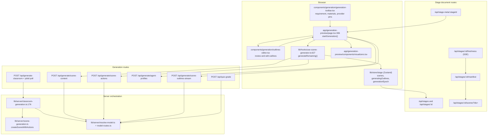
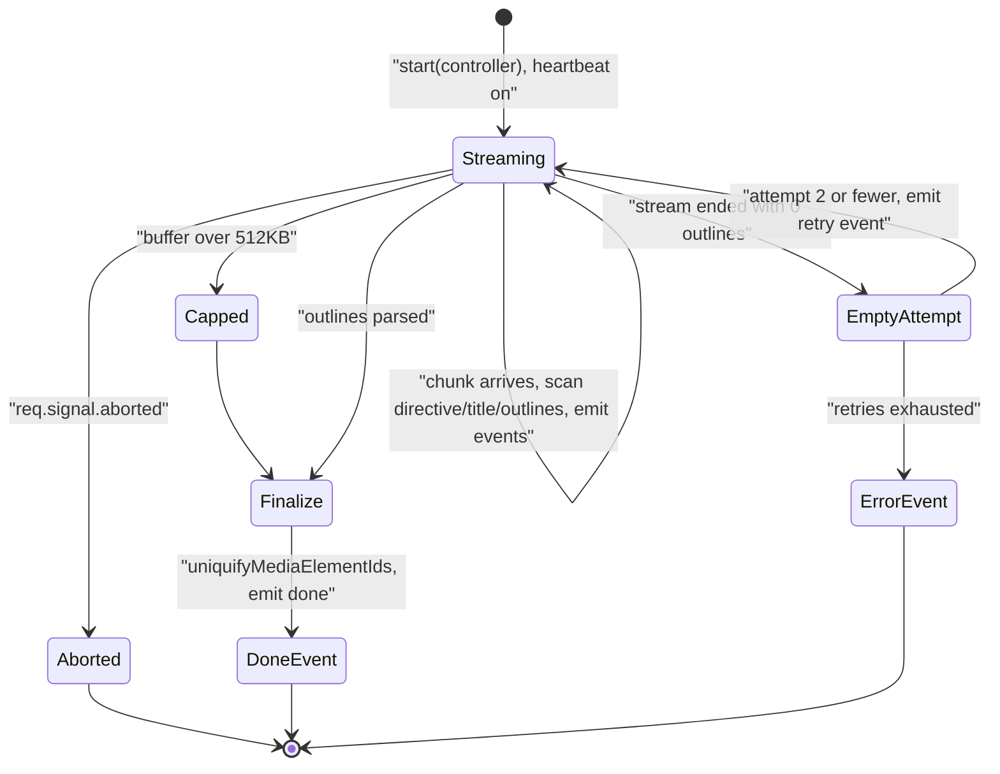

# Modules — app layer, part 2: generation routes, orchestration, UI

Part 3 of 3 in the module walkthrough. See `01a-modules-package.md` for the
package and `01b-modules-app-ingestion.md` for ingestion.

## `POST /api/generate/scene-outlines-stream` (716 lines)

The only streaming generation endpoint. `maxDuration = 300` (`:45`).

Prompt selection (`:421-448`): the default path calls the package's
`buildOutlinePrompt`; `taskEngineMode` (server flag + request opt-in via
`resolveVocationalActive`) selects the app-only `task-engine-outlines` template
and `interactiveMode` selects `interactive-outlines`, both built with
`lib/prompts`' `buildPrompt`.

Streaming parse: three head-bounded scanners over the growing buffer —
`extractLanguageDirective` (`:52`) and `extractCourseTitle` (`:90`), both limited
to the first 8192 bytes to keep per-chunk work O(1) — plus `extractNewOutlines`
(`:117`), a resumable brace-matching scanner that keeps a `scanFrom` cursor so the
total scan is O(n) rather than O(n²). A post-stream full-buffer title rescan runs
once if the head scan found nothing (`:102`, called at `:608`).

Per-outline normalisation while streaming (`:587`): `taskEngineMode` routes
through `normalizeTaskEngineOutline` (`:227`, which fills default
`procedureType`/`tools`/`steps`/`successCriteria`/`errorConsequences` for
procedural-skill outlines and demotes anything unrecognised to `slide`);
otherwise `sanitizeNonTaskEngineOutline` (`:247`) demotes `procedural-skill` to a
`diagram` widget. Ids are uniquified against a per-run set (`:272`).

Guards: 15 s SSE heartbeat comments (`:460`), a 512 KB accumulated-buffer ceiling
that stops reading and finalises with whatever parsed (`:486`, `:543`),
`req.signal` propagated into the LLM call and checked per chunk (`:504`, `:536`),
and up to 2 retries of the whole stream on an empty/unparsable attempt (`:482`,
`:519`) with a `retry` event emitted to the client (`:626`).

## `POST /api/generate/scene-content` (363 lines)

`maxDuration = 300`. Routes the model per outline type via the composite stage key
`scene-content:<type>` (`:110`) so quiz, interactive and pbl can each be pinned.

Its bulk is the **vision pre-resolution** phase (`:216-310`). Candidates come from
the shared `partitionImagesForVision` helper so route and generator cannot drift;
each candidate is resolved individually with refill until the `MAX_VISION_IMAGES`
cap, bounded by two stops that both degrade instead of failing: a 15 s aggregate
budget (`VISION_RESOLUTION_BUDGET_MS`, `:49`) raced against every probe, and a
3-consecutive-failure fuse (`:57`). Any candidate that did not resolve is stripped
from both `assignedImages` and the `imageMapping` handed onward (`:290-300`), so a
hallucinated reference takes the existing "no mapping → remove element" path in
`resolveImageIds`. PBL outlines get the app's agentic loop planner injected as
`pblLoopFallback` (`:337`).

## `POST /api/generate/scene-actions` (195 lines)

`maxDuration = 60`. Builds `SceneGenerationContext` from `allOutlines`
(`pageIndex` from the outline's index, `previousSpeeches` supplied by the caller,
`:142`), calls `generateSceneActions`, then `buildCompleteScene`, then extracts
this scene's `speech` action texts as the next call's `previousSpeeches` (`:179`).
Legacy PBL content is normalised first via `normalizeLegacyPBLContent` (`:153`).

## `POST /api/quiz-grade` (113 lines)

Short-answer grading. Validates `points` is a positive finite number (`:42`),
builds a zh/en system prompt pinning the JSON reply shape
`{"score": <0..points>, "comment": "…"}` (`:55`), calls the `quiz-grade` routed
model, then extracts the first `{…}` with a regex and clamps `score` to
`[0, points]` (`:92`). On any parse failure it awards **50 % partial credit** with
a generic comment (`:96`) rather than erroring.

## `POST /api/generate/agent-profiles` (368 lines)

Generates teacher/assistant/student personas plus voice design for the classroom;
`maxDuration = 120`. Consumed by the preview page's `agent-generation` step
([`page.tsx:841`](app/generation-preview/page.tsx#L841)), which then writes them into the agent registry
(`applyGeneratedAgentsToRegistry`, [`page.tsx:875`](app/generation-preview/page.tsx#L875)).

## Stage document routes

All of `/api/stages*` and `/api/stage-meta/*` are owner-scoped and gated on
`isAgentRuntimeConfigured()` — off, or on without `DATABASE_URL`, answers a plain
404 ([`app/api/stages/route.ts:36`](app/api/stages/route.ts#L36)).

| Route | Behaviour worth knowing |
| --- | --- |
| `POST /api/stages` (`:50`) | mints `stage-<base64url(9 bytes)>`, saves a shell document with `outline = { outlines: [], requirement: name, generationComplete: false }` |
| `GET/PATCH/PUT/DELETE /api/stages/[id]` | `PUT` is existence-gated so it cannot resurrect a deleted course, and the server always overwrites `stage.updatedAt` ([`route.ts:170`](app/api/stages/[id]/route.ts#L170)); a `DocumentVersionError` becomes a 400 telling the client to reload (`:50`) |
| `GET /api/stages/[id]/manifest` | `{rev, scenes:[{id,order,rev}]}` from DB triggers |
| `GET /api/stages/[id]/scenes?ids=` | narrow re-fetch, deduped, `\0`/lone-surrogate ids dropped, capped at `MAX_BATCH_SCENE_IDS = 200` ([`scenes/route.ts:33`](app/api/stages/[id]/scenes/route.ts#L33)) |
| `GET /api/stages/[id]/freshness` | polling SSE pushing the current rev; pure optimisation, a dead stream only costs latency |
| `POST /api/stages/[id]/generation-complete` | narrow monotonic UPDATE so a stale load-time repair cannot clobber newer content (`:41`) |
| `POST /api/stages/[id]/publish` / `unpublish` / `GET status` | publish refuses anonymous owners (`login_required`); `status` is unauthenticated and returns only the public flag |
| `GET /api/stage-meta/[stageId]` | returns only `{isOwner, isPublic, publishedAt, generationComplete, source}` — never `ownerId`, and 404s identically for absent and tombstoned courses (`:47`) |

## `lib/hooks/use-scene-generator.ts` (1053 lines)

`fetchSceneContent` (`:143`) and `fetchSceneActions` (`:198`) wrap their `fetch`
in `withGenerationRetry` with a result predicate
(`shouldRetryResult: (r) => !r.success || !r.content`, `:182`). HTTP errors become
`Error` objects carrying `errorCode` and `statusCode` (`createHttpError`, `:110`)
so the package's retry classifier can see the status. Provider selection travels
as request headers (`getApiHeaders`, `:71`: `x-model`, `x-api-key`, `x-base-url`,
`x-provider-type`, plus image/video provider fields and the
`x-image-generation-enabled` / `x-video-generation-enabled` toggles).

`generateRemaining` (`:627`) is the fan-out loop (traced in
`03b-flows-scenes-and-quiz.md`). `generateTTSForScene` (`:500`) fans out over a
scene's speech actions with its own concurrency (reusing the same concurrency
knob, `:558`) and `generateAndStoreTTS` (`:263`) handles the narrator-voice
fallback with a hard cap of one hop (`MAX_NARRATOR_VOICE_FALLBACK_HOPS`, `:260`).
`retrySingleOutline` (`:914`) reruns content → actions → TTS for one failed
outline, refuses to replace a scene open in edit mode (`isSceneEditLocked`,
`:929`), and then either resumes the batch or calls
`markGenerationCompleteIfDone` (`:1041`).

## `lib/server/classroom-generation.ts` (738 lines)

The headless path. `generateClassroom` (`:176`) resolves the
`generate-classroom` model once, fails fast if the provider needs a key and has
none (`:203`), then lazily resolves **per-stage** models through
`resolveStageModel` (`:257`) with a `Map` cache: unrouted stages reuse the
classroom model with no extra resolution, and a route that fails to resolve
degrades to the classroom model with a warn rather than aborting (`:288`). Stages
routed independently: `scene-content:<type>` (`:311`), `scene-actions` (`:361`),
`agent-profiles` (`:337`), `web-search-query-rewrite` (`:424`).

Its scene loop (`:558`) is strictly serial:
`applyOutlineFallbacks` → `withGenerationRetry(generateSceneContent)` →
`withGenerationRetry(generateSceneActions)` → `createSceneWithActions`, with
`onProgress` at every boundary and a `reportSceneRetry` hook that surfaces retries
as progress messages (`:572`). Agents are resolved **after** outlines so the
generated personas can honour the inferred `languageDirective` (`:505`).

## `lib/server/scene-generation.ts` (98 lines)

Two adapters. `createSceneWithActions` (`:30`) is live — the classroom job's
persistence hop, calling `buildCompleteScene` with an empty `stageId` and then
`api.scene.create`. `buildSceneFromOutline` (`:53`) is a full
content+actions+assemble helper whose only callers are one test and a README
snippet; it is also the only caller of `buildLanguageText`, so
`SceneOutline.languageNote` never reaches a live prompt.

## Client UI

- `components/generation/generation-toolbar.tsx` (1033) — requirement textarea,
  material attachment, PDF-provider picker built from `PDF_PROVIDERS`, web search
  provider, model/thinking pins.
- `components/generation/outlines-editor.tsx` (1523) — the human review gate:
  reorder, edit, delete, add outlines and change scene type via the package's
  `changeOutlineType`.
- `components/generation/media-popover.tsx` (495) — image/video/TTS/ASR provider
  and enablement toggles that become the `x-*-generation-enabled` headers.
- `components/generation/interactive-mode-button.tsx` (59) — a controlled
  `aria-pressed` toggle for `requirements.interactiveMode`.
- `app/generation-preview/components/visualizers.tsx` (848) — per-step animations
  keyed on the step ids from `app/generation-preview/types.ts`.
- `app/generation-preview/types.ts` (147) — `GenerationSessionState` and
  `getActiveSteps(session)`, which derive the visible step list from settings.
- `app/generation-preview/foreground-retry.ts` (4) — `{ maxRetries: 2 }` for the
  first visible scene.
- `app/generation-preview/vocational-mode.ts` (6) — reads
  `taskEngineMode`/`effectiveTaskEngineMode` off the SSE `done` event.
- `lib/import/use-import-classroom.ts` (575) and `use-import-pptx.ts` (113) —
  document *import* paths that build scenes without the LLM pipeline (ZIP
  manifest, and `@openmaic/importer` respectively).
