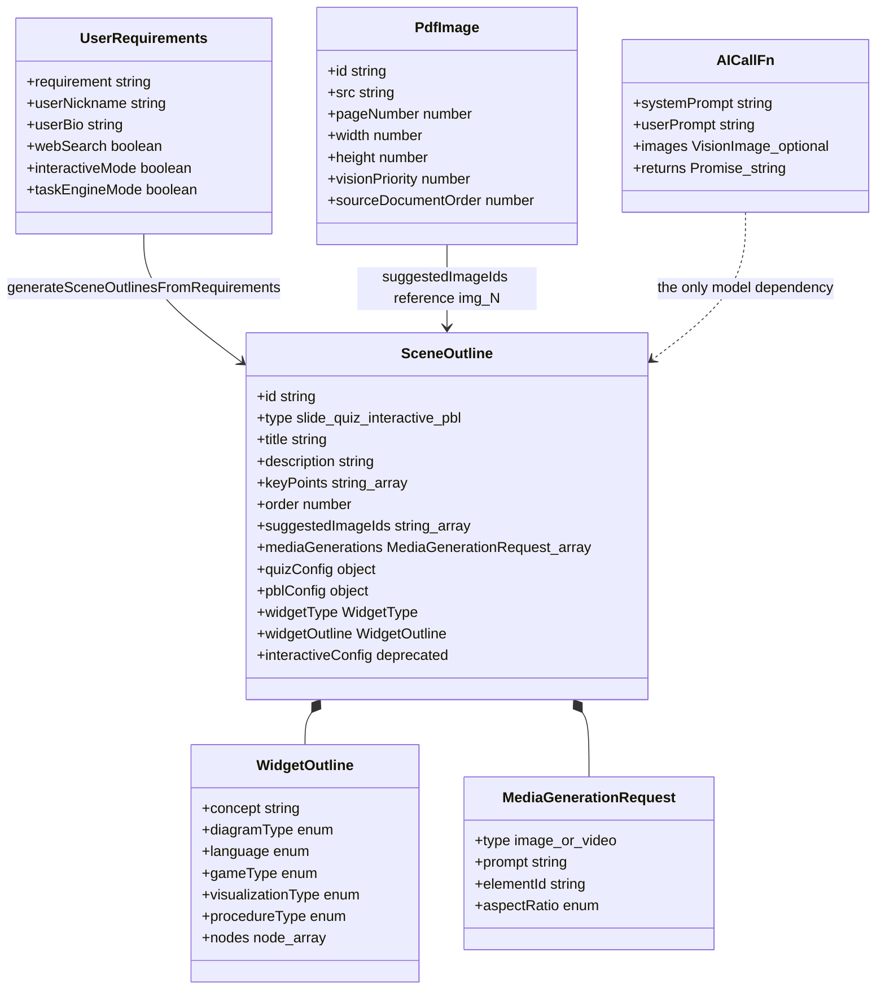
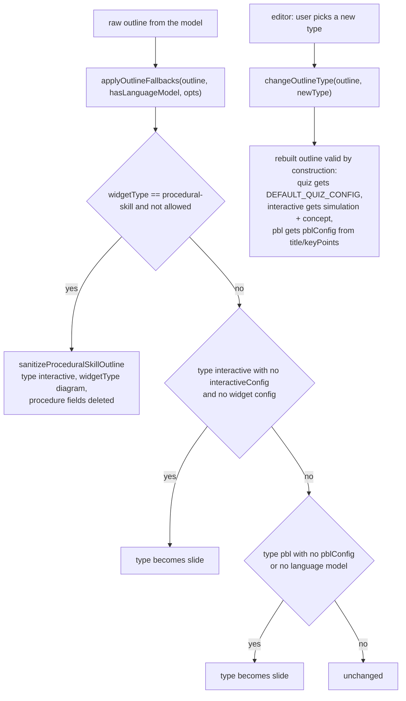

# Interfaces — package core: model seam and outline contracts

Part 1 of 5. Scene/retry contracts are in `02b-interfaces-scenes.md`; ingestion
contracts in `02c-interfaces-ingestion.md`; wire shapes and a real assembled
prompt in `02d-interfaces-wire-and-prompt.md`; the prompt system in
`02e-interfaces-prompt-system.md`.

## Type map



## The model seam and result envelope

`packages/@openmaic/generation/src/pipeline-types.ts:54`

```ts
export interface GenerationResult<T> {
  success: boolean;
  data?: T;
  error?: string;
}

export type AICallFn = (
  systemPrompt: string,
  userPrompt: string,
  images?: Array<{ id: string; src: string }>,
) => Promise<string>;
```

`pipeline-types.ts:8` and `:18`:

```ts
export interface AgentInfo {
  id: string;
  name: string;
  role: string;
  persona?: string;
}

export interface SceneGenerationContext {
  pageIndex: number; // Current page (1-based)
  totalPages: number; // Total number of pages
  allTitles: string[]; // All page titles in order
  previousSpeeches: string[]; // Speech texts from the previous page only
}
```

`pipeline-types.ts:31` — the *raw* parse target for slide generation, before DSL
normalisation:

```ts
export interface GeneratedSlideData {
  elements: Array<{
    type: 'text' | 'image' | 'video' | 'shape' | 'chart' | 'latex' | 'line';
    left: number;
    top: number;
    width: number;
    height: number;
    [key: string]: unknown;
  }>;
  background?: {
    type: 'solid' | 'gradient';
    color?: string;
    gradient?: {
      type: 'linear' | 'radial';
      colors: Array<{ pos: number; color: string }>;
      rotate: number;
    };
  };
  remark?: string;
}
```

## `SceneOutline` — the pivot type

`outline-types.ts:70`, the single most load-bearing type in the subsystem:

```ts
export interface SceneOutline {
  id: string;
  type: 'slide' | 'quiz' | 'interactive' | 'pbl';
  title: string;
  description: string;
  keyPoints: string[];
  teachingObjective?: string;
  estimatedDuration?: number;
  order: number;
  languageNote?: string;
  suggestedImageIds?: string[];
  mediaGenerations?: MediaGenerationRequest[];
  quizConfig?: {
    questionCount: number;
    difficulty: 'easy' | 'medium' | 'hard';
    questionTypes: ('single' | 'multiple' | 'text')[];
  };
  /**
   * @deprecated Use widgetType + widgetOutline instead
   * Legacy interactive config - kept for backward compatibility only
   */
  interactiveConfig?: {
    conceptName: string;
    conceptOverview: string;
    designIdea: string;
    subject?: string;
  };
  pblConfig?: {
    projectTopic: string;
    projectDescription: string;
    targetSkills: string[];
    issueCount?: number;
    scenarioRoleplay?: boolean;
    scenarioBrief?: string;
  };
  widgetType?: WidgetType;
  widgetOutline?: WidgetOutline;
}
```

Note the mismatch worth flagging to a doc reader: `quizConfig.questionTypes`
allows `'text'` (`:85`) while `generateQuizContent` branches on
`q.type === 'short_answer'` (`scene-generator.ts:896`) — the outline vocabulary
and the question vocabulary are not the same enum.

`outline-types.ts:33` — `WidgetOutline` is a flat union of every widget's fields
with no discriminant; the discriminant is the sibling `widgetType`:

```ts
export interface WidgetOutline {
  concept?: string;
  keyVariables?: string[];
  diagramType?: 'flowchart' | 'mindmap' | 'hierarchy' | 'system';
  language?: 'python' | 'javascript' | 'typescript' | 'java' | 'cpp';
  gameType?: 'quiz' | 'puzzle' | 'strategy' | 'card' | 'action';
  visualizationType?: 'molecular' | 'solar' | 'anatomy' | 'geometry' | 'physics' | 'custom';
  objects?: string[];
  interactions?: string[];
  procedureType?: 'repair' | 'assembly' | 'inspection' | 'operation' | 'custom';
  task?: string;
  tools?: string[];
  steps?: string[];
  successCriteria?: string[];
  errorConsequences?: string[];
  challenge?: string;
  playerControls?: string[];
  nodeCount?: number;
  nodes?: Array<{
    id: string;
    label: string;
    parentId?: string;
    icon?: string;
    details?: string;
  }>;
  challengeType?: string;
}
```

`outline-types.ts:6`, `:21`, `:24`, `:61`:

```ts
export interface PdfImage {
  id: string;
  src: string;
  pageNumber: number;
  description?: string;
  storageId?: string;
  width?: number;
  height?: number;
  originalId?: string;
  sourceDocumentId?: string;
  sourceDocumentName?: string;
  sourceDocumentOrder?: number;
  visionPriority?: number;
}

export type ImageMapping = Record<string, string>;

export interface UserRequirements {
  requirement: string;
  userNickname?: string;
  userBio?: string;
  webSearch?: boolean;
  interactiveMode?: boolean;
  taskEngineMode?: boolean;
}

export interface MediaGenerationRequest {
  type: 'image' | 'video';
  prompt: string;
  elementId: string;
  aspectRatio?: '16:9' | '4:3' | '1:1' | '9:16';
  style?: string;
}
```

`ImageMapping` is doing more work than its type suggests: its **values** decide
the asset transport. A browser-backed pool stores base64 data URLs; a
server-backed pool stores allocated asset ids, which the renderer resolves
through the pool registry. `resolveImageIds` writes the value verbatim so no flag
has to be threaded into the package (`scene-generator.ts:342-353`).

## Outline generation entry points

`outline-generator.ts:82` and `:120`:

```ts
export function buildOutlinePrompt(
  requirements: UserRequirements,
  context: OutlinePromptContext = {},
): { system: string; user: string }

export async function generateSceneOutlinesFromRequirements(
  requirements: UserRequirements,
  pdfText: string | undefined,
  pdfImages: PdfImage[] | undefined,
  aiCall: AICallFn,
  options?: OutlineGenerationOptions,
): Promise<
  GenerationResult<{ languageDirective: string; courseTitle?: string; outlines: SceneOutline[] }>
>
```

`outline-generator.ts:23`, `:34`, `:41`:

```ts
export interface OutlinePromptContext {
  pdfText?: string;
  pdfImages?: PdfImage[];
  visionEnabled?: boolean;
  imageMapping?: ImageMapping;
  imageGenerationEnabled?: boolean;
  videoGenerationEnabled?: boolean;
  researchContext?: string;
  teacherContext?: string;
}

export interface OutlineGenerationOptions extends Omit<
  OutlinePromptContext,
  'pdfText' | 'pdfImages'
> {
  logger?: GenerationLogger;
}

export interface OutlineFallbackOptions {
  allowProceduralSkill?: boolean;
  logger?: GenerationLogger;
}
```

`outline-generator.ts:20`:

```ts
export const DEFAULT_LANGUAGE_DIRECTIVE =
  'Teach in the language that matches the user requirement.';
```

Two more outline-shaping exports:

```ts
// outline-generator.ts:185
export function sanitizeProceduralSkillOutline(outline: SceneOutline): SceneOutline

// outline-generator.ts:205
export function applyOutlineFallbacks(
  outline: SceneOutline,
  hasLanguageModel: boolean,
  options: OutlineFallbackOptions = {},
): SceneOutline

// outline-type.ts:13
export function changeOutlineType(outline: SceneOutline, newType: SceneType): SceneOutline

// outline-media.ts:5
export function uniquifyMediaElementIds(outlines: SceneOutline[]): SceneOutline[]
```


