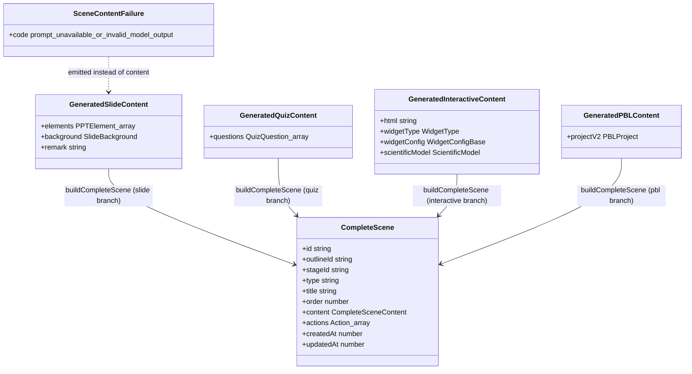
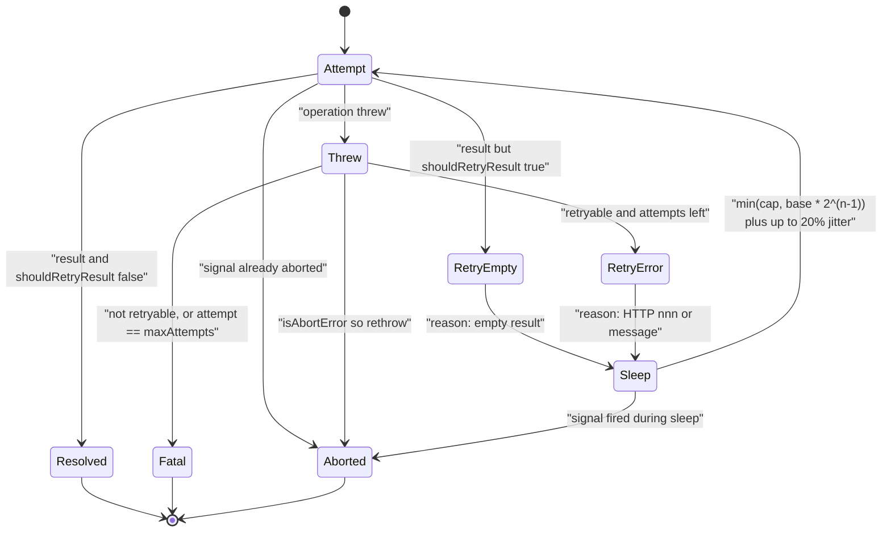

# Interfaces — scene, retry and prompt contracts

Part 2 of 5. Core/outline contracts are in `02a-interfaces-package.md`.

## Content type map



## Scene generation entry points

`scene-generator.ts:227`, `:1117`, `:1608`:

```ts
export async function generateSceneContent(
  outline: SceneOutline,
  aiCall: AICallFn,
  options: SceneContentOptions = {},
): Promise<
  | GeneratedSlideContent
  | GeneratedQuizContent
  | GeneratedInteractiveContent
  | GeneratedPBLContent
  | null
>

export async function generateWidgetContent(
  outline: SceneOutline,
  aiCall: AICallFn,
  languageDirective?: string,
  options: {
    allowProceduralSkill?: boolean;
    logger?: GenerationLogger;
    onFailure?: (failure: SceneContentFailure) => void;
  } = {},
): Promise<GeneratedInteractiveContent | null>

export async function generateSceneActions(
  outline: SceneOutline,
  content:
    | GeneratedSlideContent
    | GeneratedQuizContent
    | GeneratedInteractiveContent
    | GeneratedPBLContent,
  aiCall: AICallFn,
  options: SceneActionsOptions = {},
): Promise<Action[]>
```

`scene-generator.ts:75`, `:77`, `:121` — the failure contract and the actions
options:

```ts
export type SceneContentFailureCode = 'prompt-unavailable' | 'invalid-model-output';

export interface SceneContentFailure {
  code: SceneContentFailureCode;
}

export interface SceneActionsOptions {
  ctx?: SceneGenerationContext;
  agents?: AgentInfo[];
  userProfile?: string;
  languageDirective?: string;
  logger?: GenerationLogger;
}
```

`SceneContentOptions` (`scene-generator.ts:81`) is 39 lines of heavily commented
fields; its keys, in declaration order:

| Field | Type | Consumed by |
| --- | --- | --- |
| `assignedImages` | `PdfImage[]` | slide branch (prompt text + aspect-ratio refit) |
| `imageMapping` | `ImageMapping` | slide branch (`resolveImageIds`) |
| `visionEnabled` | `boolean` | slide branch (attach vs describe) |
| `generatedMediaMapping` | `ImageMapping` | slide branch (`gen_*` backfill) |
| `resolvedVisionImages` | `Array<{id, src, width?, height?}>` | slide branch; pre-resolved bytes so the caller's `aiCall` resolution is a no-op |
| `agents` | `AgentInfo[]` | slide branch (`formatTeacherPersonaForPrompt`) |
| `languageDirective` | `string` | every branch, as a prompt variable |
| `targetLanguage` | `string` | **PBL only** — authoritative UI locale |
| `userRequirements` | `UserRequirements` | PBL only — learner-level signals |
| `allowProceduralSkill` | `boolean` | widget branch gate |
| `editDirective` | `string` | slide only — EDIT MODE |
| `baselineContent` | `GeneratedSlideContent` | slide only — the edit baseline |
| `pblLoopFallback` | `(input: PBLPlannerV2Input) => Promise<PBLProject>` | PBL only |
| `onFailure` | `(failure: SceneContentFailure) => void` | slide / quiz / widget |
| `logger` | `GenerationLogger` | all |

Note `generateSlideContent` itself takes **13 positional parameters** rather than
this options object (`scene-generator.ts:602-615`); it is module-private and
`generateSceneContent` unpacks the options into it at `:284`.

## Content unions and assembly

`scene-types.ts:17`–`:60`:

```ts
export interface GeneratedSlideContent {
  elements: PPTElement[];
  background?: SlideBackground;
  remark?: string;
}

export interface GeneratedQuizContent {
  questions: QuizQuestion[];
}

export interface ScientificModel {
  core_formulas: string[];
  mechanism: string[];
  constraints: string[];
  forbidden_errors: string[];
}

export interface GeneratedInteractiveContent {
  html: string;
  scientificModel?: ScientificModel;
  widgetType?: WidgetType;
  widgetConfig?: WidgetConfigBase;
}

export interface GeneratedPBLContent {
  projectV2: PBLProject;
}

export type GeneratedSceneContent =
  | GeneratedSlideContent
  | GeneratedQuizContent
  | GeneratedInteractiveContent
  | GeneratedPBLContent;

export type CompleteSceneContent = SlideContent | QuizContent | InteractiveContent | PBLContent;

/** Scene assembled by the package, including the originating outline identity. */
export type CompleteScene = Scene<Action, CompleteSceneContent> & { outlineId: string };

/** Widget configuration emitted by the model and normalized by the scene layer. */
export type WidgetConfig = WidgetConfigBase;
```

`scene-builder.ts:12`, `:22`:

```ts
export interface BuildCompleteSceneOptions {
  /**
   * Stable identity supplied by retrying/upserting consumers. Reusing it turns
   * a replay into the same logical scene instead of appending a duplicate.
   * The default remains a random `nanoid()` for drop-in compatibility.
   */
  sceneId?: string;
}

export function buildCompleteScene(
  outline: SceneOutline,
  content:
    | GeneratedSlideContent
    | GeneratedQuizContent
    | GeneratedInteractiveContent
    | GeneratedPBLContent,
  actions: Action[],
  stageId: string,
  options: BuildCompleteSceneOptions = {},
): CompleteScene | null
```

The four branches are guarded by **both** `outline.type` and a content shape
check (`'elements' in content`, `'questions' in content`, `'html' in content`,
`'projectV2' in content`); any mismatch returns `null` (`scene-builder.ts:114`).
The slide branch is the only one that synthesises structure: `viewportSize: 1000`,
`viewportRatio: 0.5625`, and a hard-coded default `SlideTheme` (`:37`).

## Other exported scene helpers

```ts
// scene-generator.ts:355
export function resolveImageIds(
  elements: GeneratedSlideData['elements'],
  imageMapping?: ImageMapping,
  generatedMediaMapping?: ImageMapping,
  log: GenerationLogger = noopGenerationLogger,
): GeneratedSlideData['elements']

// scene-generator.ts:1264
export function extractWidgetConfig(html: string, widgetType: WidgetType): WidgetConfig | undefined

// scene-generator.ts:1289
export function extractInteractiveElements(html: string): string

// scene-generator.ts:962
export class PBLGenerationError extends Error {
  readonly statusCode?: number;
}

// action-parser.ts:41
export function parseActionsFromStructuredOutput(
  response: string,
  sceneType?: string,
  allowedActions?: string[],
  logger: GenerationLogger = noopGenerationLogger,
): Action[]

// interactive-post-processor.ts:16
export function postProcessInteractiveHtml(html: string): string
```

## Retry contract

`generation-retry.ts:1`, `:9`, `:177`:

```ts
export interface GenerationRetryEvent {
  label: string;
  attempt: number;
  maxAttempts: number;
  nextDelayMs: number;
  reason: string;
}

export interface GenerationRetryOptions<T> {
  label: string;
  maxRetries?: number;
  baseDelayMs?: number;
  maxDelayMs?: number;
  signal?: AbortSignal;
  sleep?: (ms: number, signal?: AbortSignal) => Promise<void>;
  random?: () => number;
  shouldRetryResult?: (result: T) => boolean;
  onRetry?: (event: GenerationRetryEvent) => Promise<void> | void;
}

export async function withGenerationRetry<T>(
  operation: (attempt: number) => Promise<T>,
  options: GenerationRetryOptions<T>,
): Promise<T>

export function isAbortError(error: unknown): boolean
export function isRetryableGenerationError(error: unknown, seen = new Set<unknown>()): boolean
```

`sleep` and `random` are injectable purely so the tests can be deterministic
(`test/generation-retry.test.ts`).



Prompt-system contracts (`PromptId`, `SnippetId`, the loader signatures and the
three parallel loaders) live in `02e-interfaces-prompt-system.md`.

## Logger seam

`logger.ts:2`:

```ts
export interface GenerationLogger {
  debug(message: string, ...meta: unknown[]): void;
  info(message: string, ...meta: unknown[]): void;
  warn(message: string, ...meta: unknown[]): void;
  error(message: string, ...meta: unknown[]): void;
}
```

Default is `noopGenerationLogger` (`logger.ts:10`) — the package is silent unless
a host injects a logger. The app routes and `classroom-generation.ts` pass
`createLogger(...)` instances.
