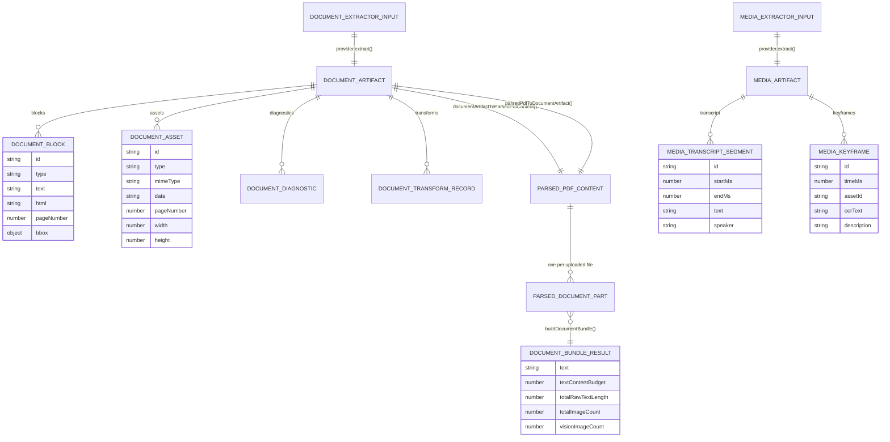
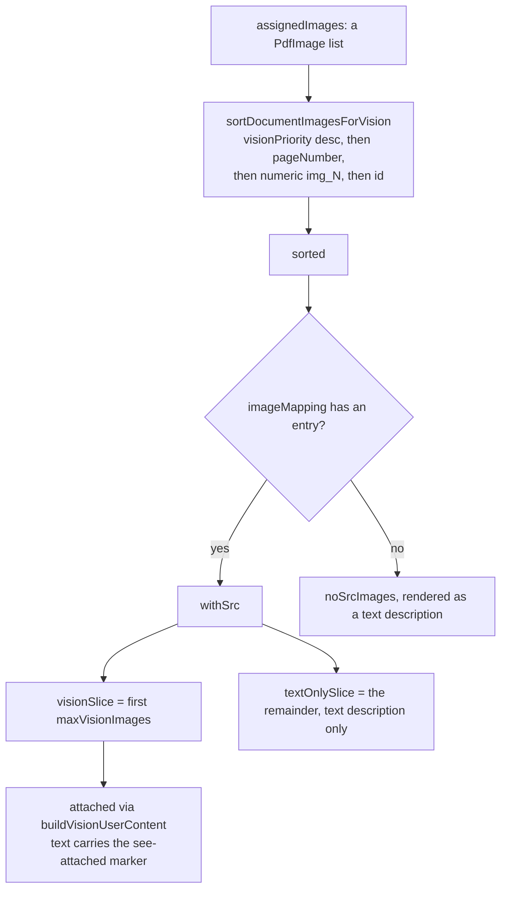

# Interfaces — ingestion and bundling contracts

Part 3 of 5. Wire shapes and a real assembled prompt are in
`02d-interfaces-wire-and-prompt.md`.

## Ingestion data model



## Provider contracts

[`lib/document/types.ts:35`](lib/document/types.ts#L35):

```ts
export interface DocumentExtractorProvider {
  id: DocumentExtractorProviderId;
  displayName: string;
  supportedMimeTypes: readonly string[];
  capabilities: DocumentExtractorCapabilities;
  /**
   * Provider version. Bump it whenever this provider's extraction output
   * shape or quality changes; it is the version half of the
   * (content identity, extractor identity) key under which extraction
   * artifacts are derived and cached. Nothing consumes it yet.
   */
  version: string;
  extract(input: DocumentExtractorInput): Promise<DocumentArtifact>;
}
```

[`lib/document/types.ts:3`](lib/document/types.ts#L3), [`:13`](lib/document/types.ts#L13), [`:27`](lib/document/types.ts#L27):

```ts
export interface DocumentExtractorCapabilities {
  text: boolean; images: boolean; tables: boolean;
  formulas: boolean; layout: boolean; ocr: boolean; async: boolean;
}

export interface DocumentExtractorConfig {
  providerId: DocumentExtractorProviderId;
  apiKey?: string;
  baseUrl?: string;
  /** Aliyun AccessKey ID (AliDocMind). */
  accessKeyId?: string;
  /** Aliyun AccessKey Secret (AliDocMind). */
  accessKeySecret?: string;
  /** Allow AliDocMind to use server env credentials (trusted context only). */
  allowEnvFallback?: boolean;
  /** Skip image extraction when the caller needs text only. */
  textOnly?: boolean;
}

export interface DocumentExtractorInput {
  buffer: Buffer;
  fileName?: string;
  fileSize?: number;
  mimeType: string;
  config: DocumentExtractorConfig;
}
```

[`lib/document/types.ts:72`](lib/document/types.ts#L72) — the media provider adds the optional availability
probe that makes registry selection credential-aware:

```ts
export interface MediaExtractorProvider {
  id: MediaExtractorProviderId;
  displayName: string;
  supportedMimeTypes: readonly string[];
  capabilities: MediaExtractorCapabilities;
  version: string;
  /** Resolve optional runtime requirements before this provider is selected. */
  availability?(input: MediaExtractorInput): Promise<{ available: boolean; reason?: string }>;
  extract(input: MediaExtractorInput): Promise<MediaArtifact>;
}
```

[`lib/document/types.ts:56`](lib/document/types.ts#L56):

```ts
export interface MediaExtractorCapabilities {
  transcript: boolean; keyframes: boolean; synopsis: boolean; ocr: boolean; async: boolean;
}
```

The two selection functions ([`extractors/registry.ts:23`](lib/document/extractors/registry.ts#L23),
[`extractors/media-registry.ts:24`](lib/document/extractors/media-registry.ts#L24)) plus their browser-safe manifest twins
([`extractors/manifest.ts:195`](lib/document/extractors/manifest.ts#L195), [`:235`](lib/document/extractors/manifest.ts#L235)):

```ts
export function selectDocumentExtractorProvider(options: {
  mimeType: string;
  preferredProviderId?: DocumentExtractorProviderId;
  requiredCapabilities?: Partial<DocumentExtractorProvider['capabilities']>;
}): DocumentExtractorProvider

export async function selectMediaExtractorProvider(options: {
  mimeType: string;
  preferredProviderId?: MediaExtractorProviderId;
  requiredCapabilities?: Partial<MediaExtractorProvider['capabilities']>;
  input: MediaExtractorInput;
  providers?: MediaExtractorProvider[];
}): Promise<MediaExtractorProvider>
```

Note the asymmetry: the media selector is **async** (it awaits `availability()`)
and accepts an injected provider list for tests; the document selector is
synchronous with no availability concept.

## Artifacts

[`lib/document/types.ts:151`](lib/document/types.ts#L151) and [`:187`](lib/document/types.ts#L187):

```ts
export interface DocumentArtifact {
  metadata: {
    fileName?: string;
    fileSize?: number;
    mimeType?: string;
    pageCount?: number;
    providerId?: string;
    processingTime?: number;
  };
  blocks: DocumentBlock[];
  assets: DocumentAsset[];
  citations?: DocumentCitation[];
  diagnostics?: DocumentDiagnostic[];
  transforms?: DocumentTransformRecord[];
  providerRaw?: unknown;
}

export interface MediaArtifact {
  metadata: {
    fileName?: string;
    fileSize?: number;
    mimeType?: string;
    durationMs?: number;
    providerId?: string;
    processingTime?: number;
  };
  transcript?: MediaTranscriptSegment[];
  keyframes?: MediaKeyframe[];
  assets?: DocumentAsset[];
  diagnostics?: DocumentDiagnostic[];
  providerRaw?: unknown;
}
```

[`lib/document/types.ts:205`](lib/document/types.ts#L205), [`:213`](lib/document/types.ts#L213), [`:225`](lib/document/types.ts#L225) — declared, type-re-exported by the
barrel, and **never constructed** by the extraction routes, which call
`extract()` directly and let exceptions reach the route's try/catch:

```ts
export interface ExtractionError {
  code: string;
  message: string;
  providerId?: string;
  retryable?: boolean;
  metadata?: Record<string, unknown>;
}

export type ExtractionResult =
  | { status: 'succeeded'; artifact: ExtractionArtifact; diagnostics?: DocumentDiagnostic[] }
  | { status: 'failed'; error: ExtractionError; diagnostics?: DocumentDiagnostic[] };
```

`ExtractionJob` (`:225`) wraps an `ExtractionResult` with
`{ id, status: 'pending'|'running'|'succeeded'|'failed', createdAt, updatedAt, providerId?, metadata? }`
and is likewise unconstructed.

## Transform contracts (framework present, generation does not use it)

[`lib/document/transforms/types.ts:3`](lib/document/transforms/types.ts#L3), [`:5`](lib/document/transforms/types.ts#L5), [`:33`](lib/document/transforms/types.ts#L33), [`:58`](lib/document/transforms/types.ts#L58):

```ts
export type DocumentTransformPurpose = 'course-generation' | 'question-bank' | 'reference' | 'rag';

export interface DocumentTransformContext {
  purpose: DocumentTransformPurpose;
  requirement?: string;
  budget: { maxTextChars: number; maxVisionImages: number; maxSummaryOutputTokens?: number };
  ai?: { textModel?: string; visionModel?: string };
  signal?: AbortSignal;
  options?: Record<string, unknown>;
}

export interface DocumentTransform {
  id: string;
  displayName: string;
  version: string;
  capabilities: DocumentTransformCapabilities;
  apply(
    artifact: DocumentArtifact,
    context: DocumentTransformContext,
  ): Promise<DocumentTransformOutput> | DocumentTransformOutput;
}
```

`DocumentTransformPipelineOptions` (`:58`) carries a single
`failurePolicy?: 'fail-fast' | 'best-effort'`. `'course-generation'` is the first
member of the purpose union, but the only caller of `transformDocument`
([`transforms/pipeline.ts:14`](lib/document/transforms/pipeline.ts#L14)) is [`lib/rag/ingest/document.ts:138`](lib/rag/ingest/document.ts#L138).

## Bundling contract

[`lib/document/bundle.ts:11`](lib/document/bundle.ts#L11), [`:15`](lib/document/bundle.ts#L15), [`:23`](lib/document/bundle.ts#L23):

```ts
export interface ParsedDocumentImage extends Omit<PdfImage, 'storageId' | 'visionPriority'> {
  src: string;
}

export interface ParsedDocumentPart {
  source: Omit<SessionDocumentSource, 'storageKey'>;
  text: string;
  rawTextLength: number;
  pageCount?: number;
  images: ParsedDocumentImage[];
}

export interface DocumentBundleResult {
  text: string;
  images: Array<ParsedDocumentImage & { visionPriority: number }>;
  textContentBudget: number;
  totalRawTextLength: number;
  totalImageCount: number;
  visionImageCount: number;
}
```

[`lib/document/bundle.ts:72`](lib/document/bundle.ts#L72), [`:165`](lib/document/bundle.ts#L165), [`:181`](lib/document/bundle.ts#L181):

```ts
export function allocateDocumentTextBudgets(lengths: number[], maxChars: number): number[]

export function sortDocumentImagesForVision<
  T extends Pick<PdfImage, 'visionPriority' | 'pageNumber' | 'id'>,
>(images: T[]): T[]

export function buildDocumentBundle(
  parts: ParsedDocumentPart[],
  options?: { maxChars?: number; maxVisionImages?: number },
): DocumentBundleResult
```

## Vision partition — the shared route/generator contract

[`packages/@openmaic/generation/src/outline-formatters.ts:50`](packages/@openmaic/generation/src/outline-formatters.ts#L50), [`:63`](packages/@openmaic/generation/src/outline-formatters.ts#L63):

```ts
export interface VisionImagePartition<T> {
  /** Assigned images in the vision-priority order. */
  sorted: T[];
  /** Sorted images that carry a mapping entry — the attachment candidates. */
  withSrc: T[];
  /** The first `maxVisionImages` of `withSrc` — the vision attachments. */
  visionSlice: T[];
  /** `withSrc` beyond the cap — plain text descriptions, never attached. */
  textOnlySlice: T[];
  /** Sorted images WITHOUT a mapping entry — plain text descriptions. */
  noSrcImages: T[];
}

export function partitionImagesForVision<
  T extends Pick<PdfImage, 'visionPriority' | 'pageNumber' | 'id'>,
>(
  images: T[],
  imageMapping: ImageMapping | undefined,
  maxVisionImages: number,
): VisionImagePartition<T>
```

This is the one contract that both [`app/api/generate/scene-content/route.ts:217`](app/api/generate/scene-content/route.ts#L217)
and [`scene-generator.ts:631`](packages/@openmaic/generation/src/scene-generator.ts#L631) call, precisely so the route's pre-resolution and the
generator's re-slice cannot disagree about which images are attached.



The formatters that turn these images into prompt text and multimodal message
parts (`formatImageDescription`, `formatImagePlaceholder`,
`buildVisionUserContent`, `buildCourseContext`, `formatAgentsForPrompt`,
`formatTeacherPersonaForPrompt`) are documented in
`02e-interfaces-prompt-system.md`.
