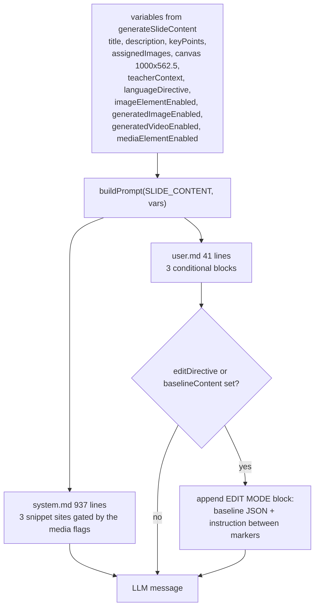

# Interfaces — wire shapes and one real assembled prompt

Part 4 of 5. Ingestion contracts are in `02c-interfaces-ingestion.md`; the
prompt system is in `02e-interfaces-prompt-system.md`.

The three-phase prompt assembly order is diagrammed in
`02e-interfaces-prompt-system.md`.

## Wire shapes

### Outline SSE ([`app/api/generate/scene-outlines-stream/route.ts:8`](app/api/generate/scene-outlines-stream/route.ts#L8))

```
{ type: 'languageDirective', data: string }
{ type: 'courseTitle', data: string }
{ type: 'outline', data: SceneOutline, index: number }
{ type: 'retry', attempt: number, maxAttempts: number }
{ type: 'done', outlines: SceneOutline[], languageDirective: string,
  courseTitle?: string, taskEngineMode: boolean }
{ type: 'error', error: string }
```

Framing: `data: <json>\n\n`, plus bare `:heartbeat\n\n` comments every 15 s.
Response headers `text/event-stream`, `no-cache`, `keep-alive` (`:703`).

Client-side reduction rules worth knowing ([`app/generation-preview/page.tsx:609-663`](app/generation-preview/page.tsx#L609-L663)):
a `retry` event clears the collected outlines **and** the latched
directive/title, `done` prefers `evt.outlines` over the collected array, and a
stream that ends without a `done` still resolves from the collected array —
carrying a latched `courseTitle` but forcing `taskEngineMode: false` (`:657`).

### Scene content / actions (JSON over POST)

Request bodies are structural, not schema-validated; the routes check presence
only. `scene-content` requires `outline`, non-empty `allOutlines`, `stageId`
([`route.ts:91-103`](app/api/generate/scene-content/route.ts#L91-L103)); `scene-actions` additionally requires `content`
([`route.ts:78`](app/api/generate/scene-actions/route.ts#L78)). Successful responses go through `apiSuccess`:

```
POST /api/generate/scene-content  -> { content, effectiveOutline }
POST /api/generate/scene-actions  -> { scene, previousSpeeches }
POST /api/quiz-grade              -> { score, comment }
```

Both scene routes carry provider selection in headers rather than the body
([`lib/hooks/use-scene-generator.ts:71`](lib/hooks/use-scene-generator.ts#L71)): `x-model`, `x-api-key`, `x-base-url`,
`x-provider-type`, `x-image-provider`, `x-image-model`, `x-image-api-key`,
`x-image-base-url`, `x-video-provider`, `x-video-model`, `x-video-api-key`,
`x-video-base-url`, `x-image-generation-enabled`, `x-video-generation-enabled`.
`x-user-locale` is read by `scene-content` only ([`route.ts:322`](app/api/generate/scene-content/route.ts#L322)).

Client result shapes ([`lib/hooks/use-scene-generator.ts:49`](lib/hooks/use-scene-generator.ts#L49), [`:58`](lib/hooks/use-scene-generator.ts#L58)):

```ts
interface SceneContentResult {
  success: boolean;
  content?: unknown;
  effectiveOutline?: SceneOutline;
  error?: string;
  errorCode?: string;
  statusCode?: number;
}

interface SceneActionsResult {
  success: boolean;
  scene?: Scene;
  previousSpeeches?: string[];
  error?: string;
  errorCode?: string;
  statusCode?: number;
}
```

`errorCode`/`statusCode` exist so the client's `withGenerationRetry` can classify
an upstream provider failure; `llmApiError` (`lib/server/llm-error-response.ts`)
extracts the status from `APICallError`, `RetryError.lastError`,
`RetryError.errors[]`, or a `statusCode`/`status`/`status_code` field walked
through `cause`/`lastError`.

### Classroom job ([`lib/server/classroom-generation.ts:48`](lib/server/classroom-generation.ts#L48), [`:62`](lib/server/classroom-generation.ts#L62), [`:72`](lib/server/classroom-generation.ts#L72), [`:80`](lib/server/classroom-generation.ts#L80))

```ts
export interface GenerateClassroomInput {
  requirement: string;
  pdfContent?: { text: string; images: string[] };
  enableWebSearch?: boolean;
  webSearchProviderId?: WebSearchProviderId;
  webSearchApiKey?: string;
  webSearchModelId?: string;
  baiduSubSources?: BaiduSubSources;
  enableImageGeneration?: boolean;
  enableVideoGeneration?: boolean;
  enableTTS?: boolean;
  agentMode?: 'default' | 'generate';
}

export type ClassroomGenerationStep =
  | 'initializing'
  | 'researching'
  | 'generating_outlines'
  | 'generating_scenes'
  | 'generating_media'
  | 'generating_tts'
  | 'persisting'
  | 'completed';

export interface ClassroomGenerationProgress {
  step: ClassroomGenerationStep;
  progress: number;
  message: string;
  scenesGenerated: number;
  totalScenes?: number;
}

export interface GenerateClassroomResult {
  id: string;
  url: string;
  stage: Stage;
  scenes: Scene[];
  scenesCount: number;
  createdAt: string;
}
```

`POST /api/generate-classroom` answers **202** with
`{ jobId, status, step, message, pollUrl, pollIntervalMs: 5000 }` ([`route.ts:50`](app/api/generate-classroom/route.ts#L50)).
`GET /api/generate-classroom/[jobId]` adds `progress`, `scenesGenerated`,
`totalScenes`, `result`, `error`, and `done` ([`[jobId]/route.ts:31`](app/api/generate-classroom/[jobId]/route.ts#L31)). The
progress percentages are fixed waypoints: 5 initializing, 10 researching,
15→30 outlines, 30→90 scenes (linear in scene index), 90 media, 94 TTS,
98 persisting, 100 completed ([`classroom-generation.ts:186`](lib/server/classroom-generation.ts#L186)–[`:728`](lib/server/classroom-generation.ts#L728)).

### Stage document routes

```
GET  /api/stages                     -> { stages }
POST /api/stages                     -> 201 { stage: {...,sceneCount:0} }
GET  /api/stages/[id]                -> MaicDocument { stage, scenes, outline }
PATCH/api/stages/[id]                -> { success: true, name }
PUT  /api/stages/[id]                -> { success: true }
DELETE /api/stages/[id]              -> { ok: true }
GET  /api/stages/[id]/manifest       -> { rev, scenes: [{ id, order, rev }] }
GET  /api/stages/[id]/scenes?ids=a,b -> { scenes }
GET  /api/stages/[id]/freshness      -> SSE frames carrying the current rev
POST /api/stages/[id]/generation-complete -> { ok: true }
GET  /api/stage-meta/[stageId]       -> { isOwner, isPublic, publishedAt,
                                          generationComplete, source }
```

Error vocabulary differs by family: the `apiError` routes use SCREAMING_SNAKE
codes (`MISSING_REQUIRED_FIELD`, `INVALID_REQUEST`, `GENERATION_FAILED`,
`PARSE_FAILED`, `INTERNAL_ERROR`, `ASSET_NOT_FOUND`, `UNAUTHENTICATED`,
`INVALID_URL`) while the stage-meta / publish / generation-complete routes answer
snake_case (`not_found`, `forbidden`, `login_required`, `internal_error`) — the
convention is documented in [`app/api/stages/[id]/status/route.ts:9`](app/api/stages/[id]/status/route.ts#L9).

### Browser session state ([`app/generation-preview/types.ts:13`](app/generation-preview/types.ts#L13))

`GenerationSessionState` is persisted in `sessionStorage` under the key
`generationSession` ([`page.tsx:223`](app/generation-preview/page.tsx#L223)) and carries `sessionId`, `requirements`,
`pdfText`, `documentSources`, `pdfImages`, `imageStorageIds`, `imageMapping`,
`sceneOutlines`, `currentStep: 'generating' | 'complete'`, and
`previewPhase: 'preparing' | 'outline-ready' | 'review' | 'generating-content'`,
plus the legacy single-PDF fields (`pdfStorageKey`, `pdfFileName`,
`documentMimeType`, `pdfProviderId`, `pdfProviderConfig`) that
`resolveSessionDocumentSources` ([`lib/document/session-sources.ts:23`](lib/document/session-sources.ts#L23)) still
understands.

## One real assembled prompt

Verbatim from the golden snapshot
[`packages/@openmaic/generation/test/__snapshots__/outline-prompt.test.ts.snap:928`](packages/@openmaic/generation/test/__snapshots__/outline-prompt.test.ts.snap#L928)
(case "pins every conditional on": vision enabled, one mapped image,
image + video generation on, research context and teacher persona present):

```
Please generate scene outlines based on the following course requirements.

---

## User Requirements

用中文讲解光合作用

---

## Student Profile

Student: Lin — Middle-school learner

Consider this student's background when designing the course. Adapt difficulty, examples, and teaching approach accordingly.

---

## Language Context

Infer the course language directive by applying the decision rules from the system prompt. Key reminders:
- Requirement language = teaching language (unless overridden by explicit request or learner context)
- Foreign language learning → teach in user's native language, not the target language
- PDF language does NOT override teaching language — translate/explain document content instead

---

## Reference Materials

### PDF Content Summary

Source notes about chlorophyll.

### Available Images

- **img_2**: image from biology.pdf page 2 | size: 800×600 (aspect ratio 1.33) [see attached]

### Web Search Results

A current source summary.

Teacher Persona:
Use a Socratic style.

---

## Output Requirements
…
```

### Reading the skeleton against its template

`packages/@openmaic/generation/templates/requirements-to-outlines/user.md`:

| Template line | Placeholder | Filled by |
| --- | --- | --- |
| 7 | `{{requirement}}` | `requirements.requirement` |
| 11 | `{{userProfile}}` | built in TS, not in the template ([`outline-generator.ts:91`](packages/@openmaic/generation/src/outline-generator.ts#L91)) |
| 26 | `{{pdfContent}}` | `pdfText.substring(0, MAX_PDF_CONTENT_CHARS)`, or the literal `None` |
| 30 | `{{availableImages}}` | `buildAvailableImages` ([`outline-generator.ts:46`](packages/@openmaic/generation/src/outline-generator.ts#L46)); `[see attached]` comes from `formatImagePlaceholder` |
| 34 | `{{researchContext}}` | web-search context, or the literal `None` |
| 36 | `{{teacherContext}}` | `formatTeacherPersonaForPrompt(agents)` |
| 87–89 | `{{#if hasSourceImages}}` | `(pdfImages?.length ?? 0) > 0` — adds the `suggestedImageIds` instruction |

The system half (`templates/requirements-to-outlines/system.md`, 386 lines) adds
three more conditionals, each pulling in a snippet:
`{{#if imageEnabled}}{{snippet:image-instructions}}{{/if}}` (`:124`),
`{{#if videoEnabled}}{{snippet:video-instructions}}{{/if}}` (`:128`),
`{{#if mediaEnabled}}{{snippet:media-safety-guidelines}}{{/if}}` (`:132`), plus
two more source-image/media blocks at `:308` and `:311`.

The required output shape is stated three times in the same user template —
the JSON skeleton at lines 54–60, a "Never return a bare array" sentence at 62,
and a "Final reminder" at 98 — and the parser then accepts a bare array anyway
([`outline-generator.ts:154`](packages/@openmaic/generation/src/outline-generator.ts#L154)).

### The corresponding slide-content user prompt

`templates/slide-content/user.md` is 41 lines and shows the conditional pattern
for media at three sites: `{{#if mediaElementEnabled}}` gates the
`**Available Media**` line (`:14`), `{{#if imageElementEnabled}}` gates the
"use only the provided image IDs" rule (`:32`), and
`{{#if generatedVideoEnabled}}` gates the `mediaRef` rule (`:35`). Its last line
is a single-line JSON example so the model has a concrete target shape.


