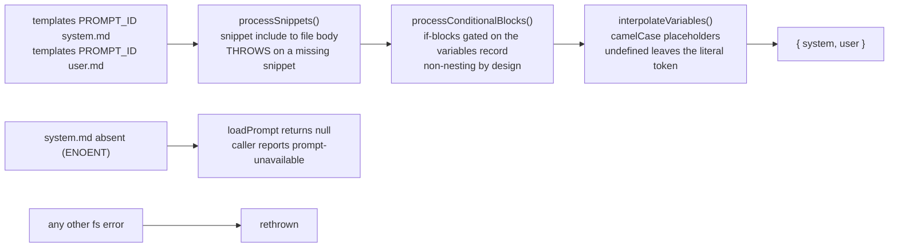
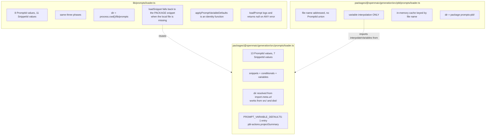

# Interfaces — the prompt system

Part 5 of 5 in the interface set. Referenced from
`02b-interfaces-scenes.md`, `02c-interfaces-ingestion.md` and
`02d-interfaces-wire-and-prompt.md`.

## Assembly order



Ordering matters: snippets are spliced **before** conditionals, so a snippet may
itself contain `{{#if}}` blocks and `{{variable}}` placeholders that the caller's
variables then resolve. Conditionals run **before** interpolation, so a removed
block's placeholders are never evaluated.

## Three parallel loaders



The app loader's snippet fallback is what lets an app-only template such as
`interactive-outlines` reuse `image-instructions` without keeping a second copy
on disk (`lib/prompts/loader.ts:40`). The PBL loader is deliberately separate:
adding its prompts to `PromptId` would touch a type shared across every
generation surface (`pbl/prompts/loader.ts:1-11`).

## Package prompt types

`packages/@openmaic/generation/src/prompts/types.ts:6`, `:22`, `:32`, `:38`:

```ts
export type PromptId =
  | 'requirements-to-outlines'
  | 'slide-content'
  | 'quiz-content'
  | 'simulation-content'
  | 'diagram-content'
  | 'code-content'
  | 'game-content'
  | 'visualization3d-content'
  | 'procedural-skill-content'
  | 'slide-actions'
  | 'quiz-actions'
  | 'interactive-actions'
  | 'pbl-actions';

export type SnippetId =
  | 'json-output-rules'
  | 'image-instructions'
  | 'video-instructions'
  | 'media-safety-guidelines'
  | 'slide-image-instructions'
  | 'slide-generated-image-instructions'
  | 'slide-video-instructions';

export interface LoadedPrompt {
  id: PromptId;
  systemPrompt: string;
  userPromptTemplate: string;
}

export type PromptVariableDefaults = Partial<Record<PromptId, Readonly<Record<string, unknown>>>>;
```

`PROMPT_IDS` (`prompts/index.ts:13`) is
`as const satisfies Record<string, PromptId>`, so a constant whose value is not
in the union fails to compile.

## Loader signatures

`prompts/loader.ts:27`, `:42`, `:52`, `:65`, `:99`, `:126`:

```ts
export function loadSnippet(snippetId: SnippetId, promptsDir?: string): string
export function processSnippets(template: string, promptsDir?: string): string
export function processConditionalBlocks(
  template: string,
  conditions: Record<string, unknown>,
): string
export function loadPrompt(promptId: PromptId, promptsDir?: string): LoadedPrompt | null
export function interpolateVariables(template: string, variables: Record<string, unknown>): string
export function buildPrompt(
  promptId: PromptId,
  variables: Record<string, unknown>,
  promptsDir?: string,
): { system: string; user: string } | null
```

The three regexes are the whole template language:

| Phase | Regex | Source |
| --- | --- | --- |
| snippet include | `/\{\{snippet:(\w[\w-]*)\}\}/g` | `loader.ts:46` |
| conditional block | `/\{\{#if (\w+)\}\}([\s\S]*?)\{\{\/if\}\}/g` | `loader.ts:57` |
| variable | `/\{\{(\w+)\}\}/g` | `loader.ts:101` |

`\w+` on the variable regex is deliberate: kebab-case placeholders such as
`{{next-agent}}` pass through untouched (`loader.ts:100`).

App-side equivalents: `lib/prompts/types.ts:8` (8 ids), `lib/prompts/types.ts:21`
(11 snippet ids), `lib/prompts/loader.ts:139` (`buildPrompt`, same three phases,
no `promptsDir` parameter).

PBL:

```ts
// packages/@openmaic/generation/src/pbl/prompts/loader.ts:41
export function loadPBLV2Prompt(name: string, variables: Record<string, unknown> = {}): string
```

## Formatters that produce prompt content

`prompt-formatters.ts:78`, `:93` (byte-identical copies at
`outline-formatters.ts:3`, `:14`):

```ts
export function formatImageDescription(img: PdfImage): string
// "- **img_2**: from biology.pdf page 2 | size: 800×600 (aspect ratio 1.33) | <description>"

export function formatImagePlaceholder(img: PdfImage): string
// "- **img_2**: image from biology.pdf page 2 | size: 800×600 (aspect ratio 1.33) [see attached]"
```

`prompt-formatters.ts:109` — the multimodal message builder:

```ts
export function buildVisionUserContent(
  userPrompt: string,
  images: Array<{ id: string; src: string; width?: number; height?: number }>,
): Array<{ type: 'text'; text: string } | { type: 'image'; image: string; mimeType?: string }>
```

It emits `[{type:'text', text:userPrompt}]`, then a
`\n\n--- Attached Images ---` marker, then per image a
`\n**img_N** (w×h, aspect ratio r):` text part followed by the image part, so the
model can bind each id to its picture. A `data:<mime>;base64,` src is split into
`{ image: base64, mimeType }` because the AI SDK accepts only http(s) URLs or raw
base64 (`prompt-formatters.ts:126`).

`prompt-formatters.ts:9`, `:53`, `:65`, `:145`:

```ts
export function buildCourseContext(ctx?: SceneGenerationContext): string
export function formatAgentsForPrompt(agents?: AgentInfo[]): string
export function formatTeacherPersonaForPrompt(agents?: AgentInfo[]): string
export function buildLanguageText(directive?: string, sceneNote?: string): string
```

`buildCourseContext` emits the full title list with a `← current` marker, a
"All pages belong to the SAME class session… NEVER say 'last class'" instruction
(`:24`), a first/middle/last position line, and the last 150 characters of the
previous page's final speech (`:46`).

`formatTeacherPersonaForPrompt` returns `''` unless a `teacher`-role agent has a
`persona`, and appends an explicit instruction that the teacher's name must not
appear on the slides (`:71`).

## Where each prompt id is built

| Prompt id | Built at | Key conditional variables |
| --- | --- | --- |
| `requirements-to-outlines` | `outline-generator.ts:99` | `hasSourceImages`, `imageEnabled`, `videoEnabled`, `mediaEnabled` |
| `slide-content` | `scene-generator.ts:710` | `imageElementEnabled`, `generatedImageEnabled`, `generatedVideoEnabled`, `mediaElementEnabled` |
| `quiz-content` | `scene-generator.ts:867` | none |
| `simulation-content` | `scene-generator.ts:1142` | none |
| `diagram-content` | `scene-generator.ts:1155` | `hasNodeCount`, `hasPrescribedNodes` |
| `code-content` | `scene-generator.ts:1171` | none |
| `game-content` | `scene-generator.ts:1185` | none |
| `visualization3d-content` | `scene-generator.ts:1197` | none |
| `procedural-skill-content` | `scene-generator.ts:1214` | none (gated by `allowProceduralSkill`) |
| `slide-actions` | `scene-generator.ts:1634` | none |
| `quiz-actions` | `scene-generator.ts:1664` | none |
| `interactive-actions` | `scene-generator.ts:1697` | none; receives `elementInventory` |
| `pbl-actions` | `scene-generator.ts:1734` | none; `projectSummary` has a loader default |
| `interactive-outlines` (app) | `scene-outlines-stream/route.ts:436` | same media flags as the outline template |
| `task-engine-outlines` (app) | `scene-outlines-stream/route.ts:436` | same media flags |
