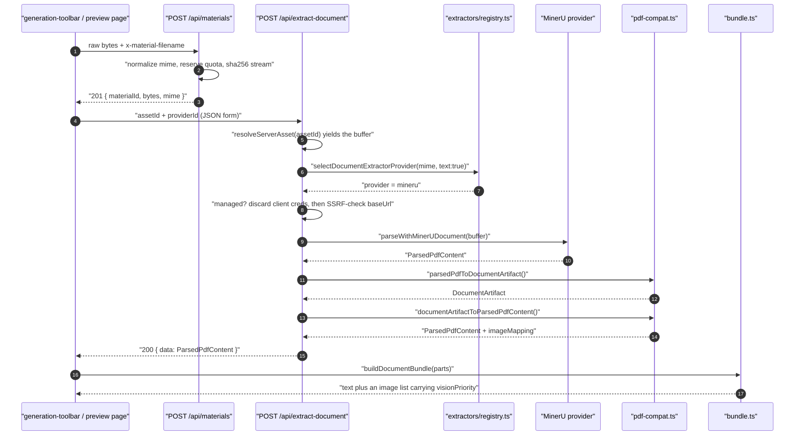
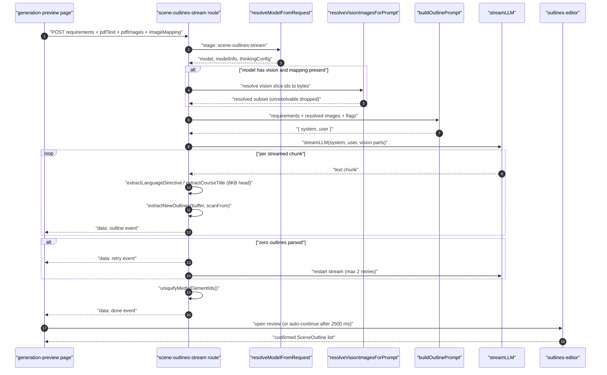
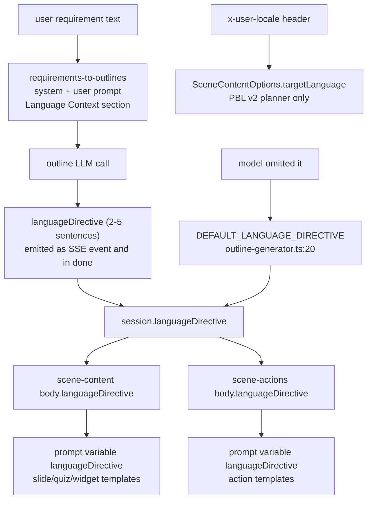

# Traced flows — ingestion and outline generation

Part 1 of 2. Scene, PBL, classroom-job and quiz flows are in
`03b-flows-scenes-and-quiz.md`.

## Flow A — a `.pptx` upload becomes bundle text plus `img_N` images

Scenario: the operator attaches two files in the toolbar (one `.pptx`, one
`.pdf`), the deployment has a server-backed asset pool, and the selected model
has vision. Every hop is a real function call.

| # | Where | Call | Effect |
| --- | --- | --- | --- |
| 1 | `components/generation/generation-toolbar.tsx` | file picker filtered by `COURSE_MATERIAL_ACCEPT` ([`lib/document/mime.ts:237`](lib/document/mime.ts#L237)) | duplicate files dropped by `dedupeCourseMaterialFiles` ([`lib/document/course-materials.ts:9`](lib/document/course-materials.ts#L9)) |
| 2 | browser | `POST /api/materials` per file, raw body, `x-material-filename` | `normalizeWorkbenchMaterialMime` → quota reserve → sha256 stream to byte store → row `ready` ([`app/api/materials/route.ts:177`](app/api/materials/route.ts#L177), [`:261`](app/api/materials/route.ts#L261), [`:289`](app/api/materials/route.ts#L289)) |
| 3 | [`app/generation-preview/page.tsx:327`](app/generation-preview/page.tsx#L327) | `resolveSessionDocumentSources(currentSession)` | ordered `SessionDocumentSource[]`; legacy single-PDF sessions synthesised ([`lib/document/session-sources.ts:23`](lib/document/session-sources.ts#L23)) |
| 4 | [`page.tsx:340`](app/generation-preview/page.tsx#L340) | `Promise.all` over sorted sources, each `POST /api/extract-document` | parallel extraction, one request per document |
| 5 | [`app/api/extract-document/route.ts:451`](app/api/extract-document/route.ts#L451) or [`:497`](app/api/extract-document/route.ts#L497) | multipart branch **or** asset-id branch | normalised `ExtractSource { fileName, fileSize, mimeType, buffer }` |
| 6 | [`route.ts:230`](app/api/extract-document/route.ts#L230) | `SUPPORTED_MEDIA_MIME_TYPES.includes(mimeType)` | `.pptx` is not media → document branch |
| 7 | [`route.ts:331`](app/api/extract-document/route.ts#L331) | `selectDocumentExtractorProvider({ mimeType, requiredCapabilities: { text: true } })` | registry order picks `mineru` for `.pptx` (plain-text and unpdf do not support it) |
| 8 | [`route.ts:355`](app/api/extract-document/route.ts#L355) | self-hosted-MinerU guard | no base URL and `ALLOW_MINERU_CLOUD_FALLBACK` unset → **422** naming both remedies ([`route.ts:375`](app/api/extract-document/route.ts#L375)) |
| 9 | [`route.ts:398`](app/api/extract-document/route.ts#L398) | build `DocumentExtractorConfig` | managed provider ⇒ client key/baseUrl discarded, server creds resolved; client baseUrl SSRF-checked in production (`:386`) |
| 10 | [`lib/document/extractors/pdf.ts:47`](lib/document/extractors/pdf.ts#L47) | `parseWithMinerUDocument(config, buffer, { fileName, mimeType })` | HTTP `POST /file_parse`; failures translated by `describeSelfHostedMinerUError` ([`lib/pdf/pdf-providers.ts:168`](lib/pdf/pdf-providers.ts#L168)) |
| 11 | [`lib/document/pdf-compat.ts:58`](lib/document/pdf-compat.ts#L58) | `parsedPdfToDocumentArtifact(parsed, input)` | `document-text` block typed `markdown` (MinerU), `table_N`/`formula_N`/`layout_N` blocks, image assets from `metadata.pdfImages` |
| 12 | [`route.ts:423`](app/api/extract-document/route.ts#L423) | `documentArtifactToParsedPdfContent(artifact)` | back to `{ text, images, imageMapping, pdfImages, tables, formulas, layout }` |
| 13 | [`page.tsx:386`](app/generation-preview/page.tsx#L386) | map `parseData.metadata.pdfImages` into `ParsedDocumentPart.images` | per-file part with `rawTextLength` and `pageCount` |
| 14 | [`page.tsx:419`](app/generation-preview/page.tsx#L419) | `buildDocumentBundle(parsedParts)` | ids renumbered `doc_<order>_img_<n>` → globally `img_1..N`, text budgeted (40 % reserved evenly, rest proportional), 20 vision slots round-robined across documents |
| 15 | [`page.tsx:420`](app/generation-preview/page.tsx#L420) | `storeImages(bundle.images)` | image bytes stored; ids kept in `session.imageStorageIds` |
| 16 | [`page.tsx:422`](app/generation-preview/page.tsx#L422) | build `pdfImages: PdfImage[]` + `imageMapping` | session now carries `pdfText`, `pdfImages`, `imageMapping`, ready for the outline call |

### The media variant of the same flow

An `.mp4` diverges at hop 6:

| # | Where | Call | Effect |
| --- | --- | --- | --- |
| 6a | [`app/api/extract-document/route.ts:264`](app/api/extract-document/route.ts#L264) | `extractMedia({ buffer, fileName, mimeType, config })` | media branch |
| 6b | [`lib/document/extractors/media-registry.ts:24`](lib/document/extractors/media-registry.ts#L24) | `selectMediaExtractorProvider(...)` | walks providers, calling `availability()`; AliDocMind reports unavailable without AK/SK ([`extractors/media.ts:24`](lib/document/extractors/media.ts#L24)) → falls through to `local-ffmpeg` |
| 6c | [`lib/document/extractors/local-media.ts:536`](lib/document/extractors/local-media.ts#L536) | `extractMediaMaterial(...)` | `ffprobe` duration (≤ 90 min), audio split into 600 s chunks, per-chunk ASR, keyframe sampling |
| 6d | [`route.ts:164`](app/api/extract-document/route.ts#L164) | `mediaArtifactToText(artifact)` | `## Synopsis` / `## Transcript` with `[MM:SS]` or `[HH:MM:SS]` markers / `## Keyframes` |
| 6e | [`route.ts:292`](app/api/extract-document/route.ts#L292) | empty-text guard | no transcript/keyframes/synopsis ⇒ **422**, never an empty 200 |
| 6f | [`route.ts:301`](app/api/extract-document/route.ts#L301) | wrap into `ParsedPdfContent` with `images: []`, `pageCount: 0` | media rejoins the identical downstream path |

## Flow B — requirement plus bundle becomes reviewed outlines

| # | Where | Call | Effect |
| --- | --- | --- | --- |
| 1 | [`app/generation-preview/page.tsx:568`](app/generation-preview/page.tsx#L568) | `fetch('/api/generate/scene-outlines-stream', …)` | body: `requirements`, `pdfText`, `pdfImages`, `imageMapping`, `researchContext` (+`thinkingConfig`); headers from `getApiHeaders()` |
| 2 | [`app/api/generate/scene-outlines-stream/route.ts:299`](app/api/generate/scene-outlines-stream/route.ts#L299) | `resolveModelFromRequest(req, body, 'scene-outlines-stream')` | `{ model, modelInfo, modelString, thinkingConfig }`; `modelInfo.capabilities.vision` decides vision mode |
| 3 | [`route.ts:339`](app/api/generate/scene-outlines-stream/route.ts#L339) | `sortDocumentImagesForVision` + slice at `MAX_VISION_IMAGES` | vision slice vs text-only remainder |
| 4 | [`route.ts:351`](app/api/generate/scene-outlines-stream/route.ts#L351) | `resolveVisionImagesForPrompt(slice, req.headers)` | allocated asset ids → real bytes **before** prompt assembly; unresolvable ids dropped |
| 5 | [`route.ts:383`](app/api/generate/scene-outlines-stream/route.ts#L383) | rebuild `resolvedPdfImages` + `resolvedImageMapping` | the mapping names only resolved ids, so `[see attached]` text can never promise a missing attachment |
| 6 | [`route.ts:421`](app/api/generate/scene-outlines-stream/route.ts#L421) | `buildOutlinePrompt(requirements, {...})` | package-owned prompt; byte-identical to the package path |
| 7 | [`route.ts:432`](app/api/generate/scene-outlines-stream/route.ts#L432) | `taskEngineMode ?? interactiveMode` | when set, replaces the prompt with `task-engine-outlines` / `interactive-outlines` from `lib/prompts` |
| 8 | [`route.ts:461`](app/api/generate/scene-outlines-stream/route.ts#L461) | `new ReadableStream({ async start(controller) … })` | SSE; 15 s heartbeat started at `:489` |
| 9 | [`route.ts:527`](app/api/generate/scene-outlines-stream/route.ts#L527) | `streamLLM(streamParams, 'scene-outlines-stream', thinkingConfig).textStream` | vision runs build a multimodal message via `buildVisionUserContent` (`:498`) |
| 10 | [`route.ts:533`](app/api/generate/scene-outlines-stream/route.ts#L533) per chunk | `extractLanguageDirective` → emit; `extractCourseTitle` → emit | head-bounded 8 KB scans, emitted the first time they match |
| 11 | [`route.ts:576`](app/api/generate/scene-outlines-stream/route.ts#L576) per chunk | `extractNewOutlines(fullText, scanFrom)` | resumable brace matcher; each complete object is normalised, id-uniquified, `order` assigned, then emitted as an `outline` event |
| 12 | [`route.ts:543`](app/api/generate/scene-outlines-stream/route.ts#L543) | 512 KB buffer ceiling | stop reading, finalise with whatever parsed |
| 13 | [`route.ts:603`](app/api/generate/scene-outlines-stream/route.ts#L603) | zero outlines? | emit `retry`, restart the whole stream (max 2 retries, `:482`) |
| 14 | [`route.ts:663`](app/api/generate/scene-outlines-stream/route.ts#L663) | `uniquifyMediaElementIds(parsedOutlines)` | `gen_img_1` → `gen_img_<nanoid(8)>` across the whole course |
| 15 | [`route.ts:665`](app/api/generate/scene-outlines-stream/route.ts#L665) | emit `done` | `{ outlines, languageDirective, courseTitle, taskEngineMode }` |
| 16 | [`page.tsx:626`](app/generation-preview/page.tsx#L626) | client resolves the promise on `done` | a `retry` event clears collected outlines **and** the latched directive/title ([`page.tsx:617`](app/generation-preview/page.tsx#L617)) |
| 17 | [`page.tsx:680`](app/generation-preview/page.tsx#L680) | `shouldReviewOutlines` | review gate: sticky mid-stream intent or the `reviewOutlineEnabled` setting; otherwise a 2500 ms auto-continue timer (`OUTLINE_REVIEW_AUTO_CONTINUE_MS`, [`page.tsx:66`](app/generation-preview/page.tsx#L66)) |
| 18 | `components/generation/outlines-editor.tsx` | edit / reorder / retype | `changeOutlineType` rebuilds an outline valid by construction for the new type ([`outline-type.ts:13`](packages/@openmaic/generation/src/outline-type.ts#L13)) |
| 19 | [`page.tsx:1161`](app/generation-preview/page.tsx#L1161) | `handleConfirmOutlines()` | resolves the review promise, persists `previewPhase: 'generating-content'` |

## Language control, end to end

Two distinct language signals exist and are **not** interchangeable:
`languageDirective` is model-inferred prose threaded into every downstream
prompt as a template variable, while `targetLanguage` is the authoritative UI
locale read from the `x-user-locale` header
([`app/api/generate/scene-content/route.ts:322`](app/api/generate/scene-content/route.ts#L322)) and consumed only by the PBL v2
planner ([`scene-generator.ts:1018`](packages/@openmaic/generation/src/scene-generator.ts#L1018)). A third path exists: `buildLanguageText`
([`prompt-formatters.ts:145`](packages/@openmaic/generation/src/prompt-formatters.ts#L145)) merges the course directive with a per-scene
`outline.languageNote`, and its only caller is `buildSceneFromOutline`
([`lib/server/scene-generation.ts:68`](lib/server/scene-generation.ts#L68)) — an adapter that no production code path
invokes (`git grep -n "buildSceneFromOutline" -- app lib components tests` →
its own definition, one test, and a README snippet). So `languageNote` is
carried in `SceneOutline` and never reaches a live prompt.
