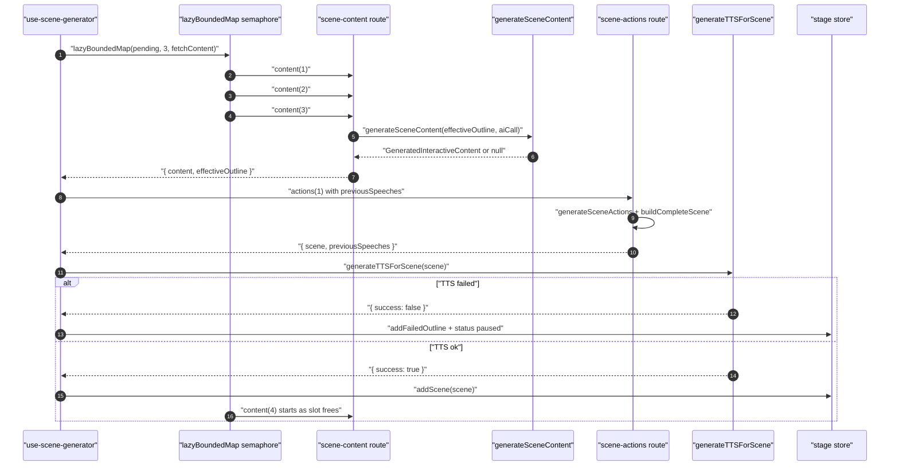
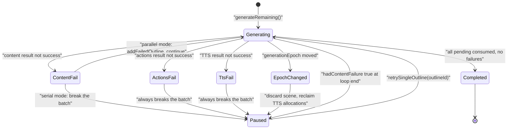
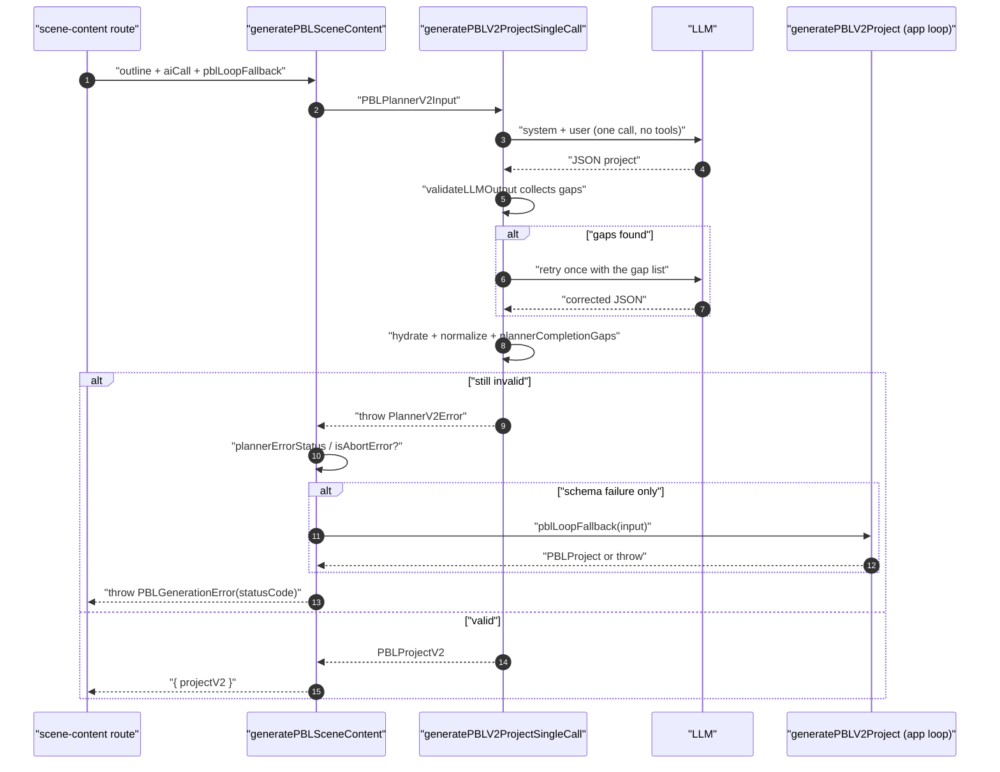
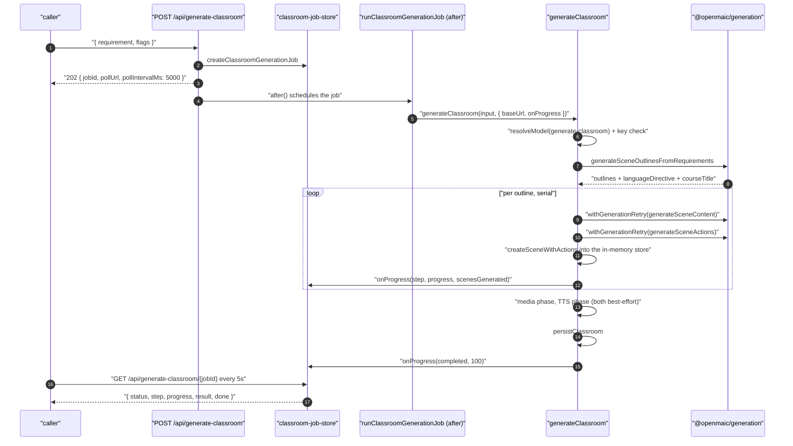
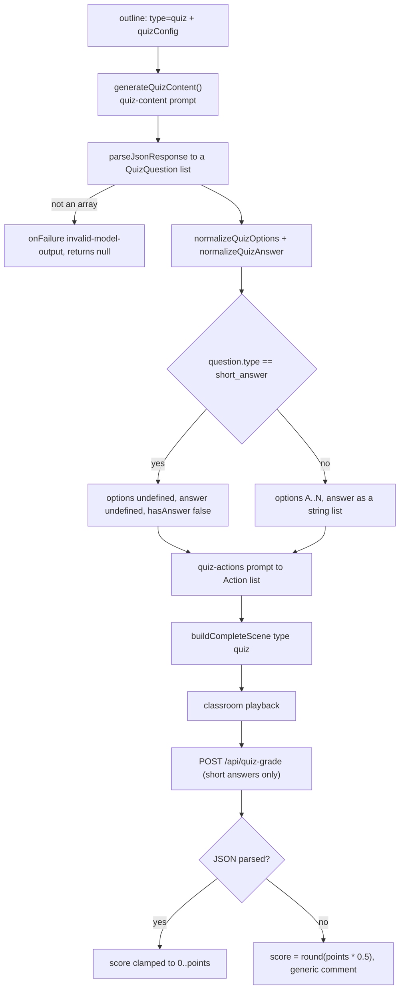
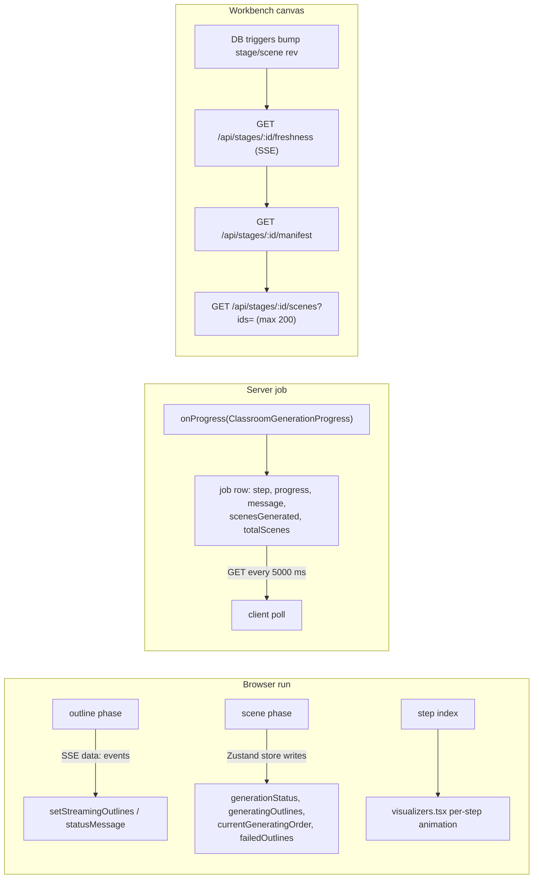

# Traced flows — scenes, PBL, classroom job, quiz

Part 2 of 2. Ingestion and outline flows are in
`03a-flows-ingestion-outline.md`.

## Flow C — one confirmed outline becomes a stored `Scene` (browser path)

Scenario: `PARALLEL_SCENE_CONCURRENCY=3`, 5 confirmed outlines, TTS enabled with
a non-browser provider, one outline is `type: 'interactive'` with
`widgetType: 'diagram'`.

| # | Where | Call | Effect |
| --- | --- | --- | --- |
| 1 | `lib/hooks/use-scene-generator.ts:651` | `setGenerationStatus('generating')` | store status; `startEpoch = state.generationEpoch` captured at `:645` |
| 2 | `:654` | pending = outlines whose `order` has no scene | resume-safe: already-generated orders are skipped |
| 3 | `:672` | `generateMediaForOutlines(outlines, stage.id, signal)` fire-and-forget | image/video generation runs **beside** the loop, never blocking it |
| 4 | `:677` | seed `previousSpeeches` from the highest-order existing scene | cross-scene speech coherence survives a resume |
| 5 | `:689` | clamp `parallelSceneConcurrency` a third time | store value re-floored so a stale value cannot spawn unbounded fan-out |
| 6 | `:727` | `lazyBoundedMap(pending, n, fetchContent, { shouldContinue })` | all promises created immediately, at most `n` executing (`lib/utils/concurrency.ts:47`); `shouldContinue` checks abort + epoch |
| 7 | `:753` loop | `await contentPromises.get(outline.id)` | consumed **in order**, so scene 1 paints after content(1)+actions(1)+TTS(1) |
| 8 | `:166` | `POST /api/generate/scene-content` inside `withGenerationRetry` | `shouldRetryResult: (r) => !r.success \|\| !r.content` (`:182`) |
| 9 | `app/api/generate/scene-content/route.ts:116` | `resolveModelFromRequest(req, body, 'scene-content:interactive')` | per-type model routing, falling back to the base `scene-content` route |
| 10 | `route.ts:179` | `applyOutlineFallbacks(outline, !!languageModel, { allowProceduralSkill })` | returns `effectiveOutline`, echoed back to the client |
| 11 | `route.ts:216` | vision pre-resolution (skipped here: interactive scenes carry no images) | — |
| 12 | `route.ts:324` | `generateSceneContent(effectiveOutline, aiCall, opts)` | interactive branch → `generateWidgetContent` |
| 13 | `scene-generator.ts:1153` | diagram case: `PROMPT_IDS.DIAGRAM_CONTENT` + `nodeCount`/`prescribedNodes` vars | `{{#if hasNodeCount}}` / `{{#if hasPrescribedNodes}}` blocks in `diagram-content/user.md` |
| 14 | `scene-generator.ts:1243` | `extractHtml(response)` | doctype scan → fenced block → raw body; `null` ⇒ `onFailure({code:'invalid-model-output'})` and a `null` return |
| 15 | `scene-generator.ts:1252` | `extractWidgetConfig(html, widgetType)` | reads `<script type="application/json" id="widget-config">` |
| 16 | `scene-generator.ts:1255` | `postProcessInteractiveHtml(html)` | `$$…$$` → `\[…\]`, `$…$` → `\(…\)` with `<script>` bodies protected; KaTeX injected when absent |
| 17 | `use-scene-generator.ts:804` | `POST /api/generate/scene-actions` | body carries `effectiveOutline`, `content`, `previousSpeeches` |
| 18 | `app/api/generate/scene-actions/route.ts:142` | build `SceneGenerationContext` | `pageIndex` from the outline's position in `allOutlines` |
| 19 | `scene-generator.ts:1694` | `extractInteractiveElements(content.html)` | recomputed per call; empty ⇒ literal `(no interactive elements detected)` |
| 20 | `scene-generator.ts:1716` | `parseActionsFromStructuredOutput(response, 'interactive', INTERACTIVE_WIDGET_ACTIONS)` | slide-only actions stripped; non-allow-listed action types stripped except `speech` |
| 21 | `scene-generator.ts:1724` / `:1727` | `processActions` **or** `generateDefaultInteractiveActions` | zero parsed actions ⇒ a single canned `speech` action |
| 22 | `route.ts:170` | `buildCompleteScene(outline, content, actions, stageId)` | `content: { type:'interactive', url:'', html, widgetType, widgetConfig }` |
| 23 | `route.ts:179` | extract this scene's `speech` texts | returned as `previousSpeeches` for the next scene |
| 24 | `use-scene-generator.ts:831` | `generateTTSForScene(scene, lang, signal)` | per-speech-action fan-out; TTS failure fails the **whole scene** (`:836`) |
| 25 | `:850` | epoch re-check | epoch moved ⇒ `removeFreshTtsAllocations(...)` and break, so a stage switch never leaks audio assets |
| 26 | `:857` | `useStageStore.getState().addScene(scene)` | scene visible; `previousSpeeches` advanced |

### Fan-out and partial-failure semantics

The asymmetry is deliberate and documented in place
(`use-scene-generator.ts:698-706`): scene **content** has no cross-scene
dependency so it can run ahead and a single failure only marks that outline
failed; **actions and TTS stay strictly serial** to preserve the
`previousSpeeches` chain and the pause-on-failure UX. With
`PARALLEL_SCENE_CONCURRENCY` unset (`0`), `useParallelContent` is false and the
loop is byte-for-byte the original one-at-a-time loop.

## Flow D — a PBL outline

| # | Where | Call | Effect |
| --- | --- | --- | --- |
| 1 | `app/api/generate/scene-content/route.ts:110` | stage key `scene-content:pbl` | PBL may be pinned to a stronger model |
| 2 | `route.ts:337` | inject `pblLoopFallback: (input) => generatePBLV2Project(input, languageModel, callLLM, { logger }, thinkingConfig)` | the agentic loop planner stays app-owned |
| 3 | `scene-generator.ts:988` | `generatePBLSceneContent` | builds `PBLPlannerV2Input` with `allOutlines: [outline]` and `targetLanguage` from `x-user-locale` |
| 4 | `pbl/planner-single-call.ts:495` | `buildPlannerSystemPrompt(...)` with `planner-single-call-system` or `planner-scenario-single-call-system` | scenario-roleplay outlines get the scenario spec |
| 5 | `planner-single-call.ts:514` | first `aiCall` → `parseJsonResponse` → `validateLLMOutput` | structure + topic + language gaps collected as strings |
| 6 | `planner-single-call.ts:522` | one targeted retry appending the concrete gap list to the user prompt | "Fix every one of them and output the corrected single JSON object." |
| 7 | `planner-single-call.ts:536` | `hydrateProject` then `normalizeProjectRuntime` / `normalizeSynthesisChecks` / `normalizeScenario` | identical order to the loop path |
| 8 | `planner-single-call.ts:559` | `plannerCompletionGaps(project, { scenarioRoleplay })` | surviving gap ⇒ throw `PlannerV2Error` |
| 9 | `scene-generator.ts:1042` | `skipLoopFallback = plannerErrorStatus(err) !== undefined \|\| isAbortError(err)` | provider/HTTP failure or user abort ⇒ do **not** run the loop |
| 10 | `scene-generator.ts:1047` | `pblLoopFallback(plannerInput)` | agentic loop attempt |
| 11 | `scene-generator.ts:1053` / `:1063` | throw `PBLGenerationError` with propagated `statusCode` | the only scene type that throws instead of returning `null` |
| 12 | `app/api/generate/scene-content/route.ts:361` | `llmApiError(error)` | maps the status onto the HTTP response so the client's retry classifier sees it |

## Flow E — the headless one-shot classroom job

| # | Where | Call | Effect |
| --- | --- | --- | --- |
| 1 | `app/api/generate-classroom/route.ts:19` | whitelist the body into `GenerateClassroomInput` | only known keys forwarded |
| 2 | `route.ts:45` | `createClassroomGenerationJob(jobId, body)` with `jobId = nanoid(10)` | job row created |
| 3 | `route.ts:48` | `after(() => runClassroomGenerationJob(jobId, body, baseUrl))` | work continues after the 202 response; `maxDuration = 30` applies to the *request*, not the job |
| 4 | `lib/server/classroom-generation.ts:192` | `resolveModel({ stage: 'generate-classroom' })` | server-side model only; no client headers |
| 5 | `:203` | `isProviderKeyRequired(providerId) && !apiKey` ⇒ throw | fail fast with the expected env var name |
| 6 | `:416` | optional web search: `buildSearchQuery` → `searchWeb` → `formatSearchResultsAsContext` | any failure logs and continues with no research context (`:459`) |
| 7 | `:474` | `generateSceneOutlinesFromRequirements(requirements, pdfText, undefined, aiCall, opts)` | **no** `teacherContext` — agents do not exist yet (`:483`) |
| 8 | `:508` | `agentMode === 'generate'` ⇒ `generateAgentProfiles(requirement, languageDirective, call)` | requires exactly 1 teacher and ≥ 2 agents (`:159`, `:163`); any throw falls back to `getDefaultAgents()` |
| 9 | `:522` | mint `stageId = nanoid(10)`, build `Stage` | `name = courseTitle ?? outlines[0].title ?? requirement.slice(0,50)`; `videoManifest` from `buildVideoManifestFromOutlines` |
| 10 | `:552` | `createInMemoryStore(stage)` + `createStageAPI(store)` | the store seam is faked in-process |
| 11 | `:558` loop | serial per outline: `applyOutlineFallbacks` → `withGenerationRetry(generateSceneContent)` → `withGenerationRetry(generateSceneActions)` → `createSceneWithActions` | `shouldRetryResult: (r) => r === null` (`:615`); retries surface as progress messages |
| 12 | `:620` | `containPBLGenerationError(error, title)` | a `PBLGenerationError` becomes `null` (scene skipped); anything else rethrows and fails the job (`:43`) |
| 13 | `:662` | zero scenes ⇒ `throw new Error('No scenes were generated')` | job fails |
| 14 | `:667` / `:686` | media then TTS phases | each wrapped in try/catch that logs and continues |
| 15 | `:711` | `persistClassroom({ id, stage, scenes }, baseUrl)` | returns `{ id, url, createdAt }` |
| 16 | client | `GET /api/generate-classroom/[jobId]` every 5000 ms | `done = status === 'succeeded' \|\| status === 'failed'` |

## Flow F — quiz generation and grading

Generation is a normal scene type; grading is a separate runtime call.

| # | Where | Call | Effect |
| --- | --- | --- | --- |
| 1 | outline stage | model emits `quizConfig { questionCount, difficulty, questionTypes }` | template requires it for quiz scenes (`requirements-to-outlines/user.md:79`) |
| 2 | `scene-generator.ts:861` | default `{3, 'medium', ['single']}` when absent | never fails on a missing config |
| 3 | `scene-generator.ts:867` | `buildPrompt(PROMPT_IDS.QUIZ_CONTENT, {...})` | `quiz-content/system.md` includes `{{snippet:json-output-rules}}` |
| 4 | `scene-generator.ts:884` | `parseJsonResponse<QuizQuestion[]>(response)` | non-array ⇒ `onFailure({code:'invalid-model-output'})`, return `null` |
| 5 | `scene-generator.ts:895` | id fill, `normalizeQuizOptions`, `normalizeQuizAnswer` | letters A/B/C/D synthesised; `answer`/`correctAnswer`/`correct_answer` all accepted |
| 6 | `scene-generator.ts:896` | `short_answer` ⇒ `hasAnswer: false`, no options, no answer | marks it for LLM grading at runtime |
| 7 | `scene-generator.ts:1664` | `buildPrompt(PROMPT_IDS.QUIZ_ACTIONS, { questions: formatQuestionsForPrompt(...) })` | question list rendered as `Q1 (single): …` blocks (`:1807`) |
| 8 | runtime | `POST /api/quiz-grade` with `{ question, userAnswer, points, commentPrompt?, language? }` | zh/en system prompt pinning `{"score": …, "comment": …}` |
| 9 | `app/api/quiz-grade/route.ts:88` | first-`{…}` regex + `JSON.parse` | score clamped to `[0, points]` and rounded |
| 10 | `route.ts:96` | parse failure ⇒ `score = round(points * 0.5)` | silent 50 % partial credit, generic comment |

## Progress reporting transports, side by side

Three independent transports, one per consumer: SSE only for the outline stage
(the only stage whose partial output is useful), in-memory store state for the
browser scene loop, a polled job row for the headless path, and a
rev-diffing manifest for the workbench canvas.
