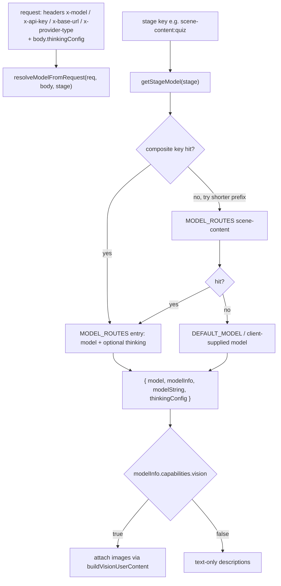
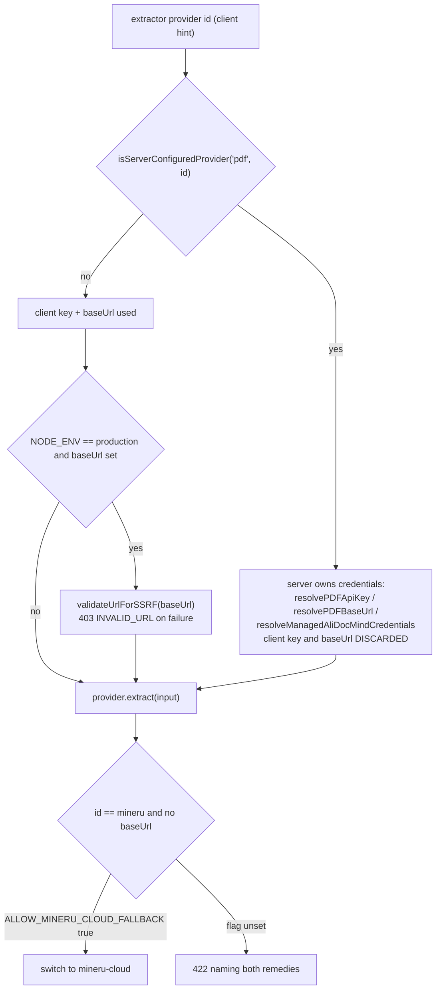
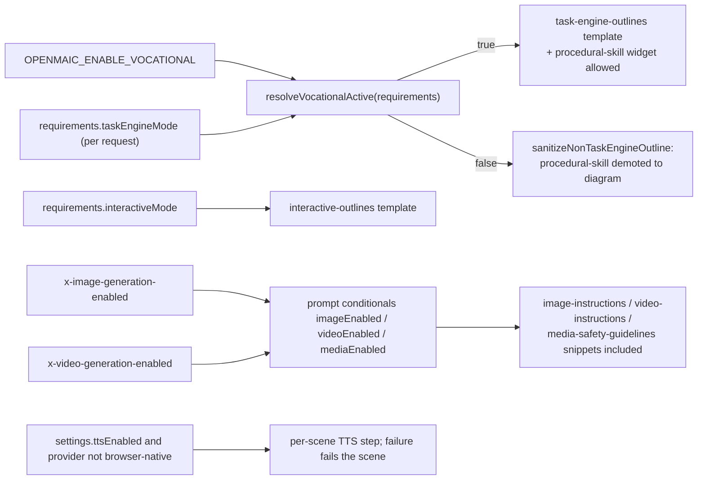

# Dependencies and configuration

## Package dependencies of `@openmaic/generation`

From `packages/@openmaic/generation/package.json` (version `0.3.5`), five
runtime dependencies — deliberately small because the package must run in a
browser-adjacent bundle as well as Node:

| Dependency | Used for | Call site |
| --- | --- | --- |
| `@openmaic/dsl` (`workspace:^`) | `normalizeElement`, `isWidgetType`, `SLIDE_ONLY_ACTIONS`, and every element/action/scene type | `scene-generator.ts:18`, `action-parser.ts:13`, `scene-builder.ts:2` |
| `jsonrepair` `^3.13.2` | repair attempt 3 in the JSON ladder, and the action-array fallback | `json-repair.ts:5`, `action-parser.ts:16` |
| `katex` `^0.16.22` | server-side rendering of `latex` elements to HTML | `scene-generator.ts:580` |
| `nanoid` `^5.1.6` | outline ids, element ids, action ids, scene ids, unique media ids | `outline-generator.ts:173`, `scene-generator.ts:827`, `scene-builder.ts:33`, `outline-media.ts:13` |
| `partial-json` `^0.1.7` | last-resort parse of a truncated action array | `action-parser.ts:15` |

`files` ships `dist`, `templates`, `snippets`, `prompts-pbl` — the Markdown is
part of the published artifact, and the loader resolves it from
`import.meta.url` so the same code path works from `src/` and `dist/`
(`prompts/loader.ts:13`, `pbl/prompts/loader.ts:23`).

## External dependencies of the app-side pipeline

| Name | Kind | Used for | Evidence |
| --- | --- | --- | --- |
| `unpdf` | npm-package | built-in PDF text + raw image extraction | `lib/pdf/pdf-providers.ts:140` |
| `sharp` | npm-package | raw PDF image buffers → PNG base64 | `pdf-providers.ts:141`, `:286` |
| `jszip` | npm-package | unpack the MinerU Cloud result ZIP | `lib/pdf/mineru-cloud.ts:8` |
| `@alicloud/docmind-api20220711`, `@alicloud/openapi-client`, `@alicloud/tea-util`, `@alicloud/credentials` | npm-package | AliDocMind submit/poll/get client | `lib/pdf/alidocmind-client.ts:12-14` |
| MinerU self-hosted service | infrastructure | `POST /file_parse` document extraction | `pdf-providers.ts:620` |
| MinerU Cloud (`https://mineru.net/api/v4`) | saas-api | batch upload → poll → ZIP | `lib/pdf/constants.ts:8`, `mineru-cloud.ts:1` |
| Aliyun Document Mind (`https://docmind-api.cn-hangzhou.aliyuncs.com`) | saas-api | document **and** audio/video extraction | `lib/pdf/constants.ts:9`, `lib/media-parse/media-parse-providers.ts:53` |
| Aliyun OSS | saas-api | AliDocMind image crop hosting; fetched under an SSRF allow-list | `pdf-providers.ts:402`, `:421` |
| `ffmpeg` / `ffprobe` | binary-tool | local audio extraction, duration probe, keyframe sampling | `lib/document/extractors/local-media.ts:1`, `:180` |
| server ASR provider | saas-api | per-chunk transcription in the local media path | `local-media.ts:8`, `:410` |
| `ai` (Vercel AI SDK) + `@ai-sdk/*` | npm-package | `callLLM` / `streamLLM`, `APICallError`/`RetryError` status extraction | `lib/server/llm-error-response.ts:1` |
| LLM providers (OpenAI/Anthropic/Google/Azure/Bedrock/…) | saas-api | every generation call | `package.json` `@ai-sdk/*`, resolved by `lib/server/resolve-model.ts` |

The generation package itself touches **none** of these: it only sees an
`AICallFn`.

## Configuration resolution

The managed/unmanaged split is applied identically in
`app/api/extract-document/route.ts:353` and `app/api/parse-pdf/route.ts:45`.

## Environment variables

Read directly by in-scope code:

| Var | Required | Effect | Evidence |
| --- | --- | --- | --- |
| `MODEL_ROUTES` | no | JSON map of stage → model (or `{model, thinking}`). Routable generation stages: `scene-outlines-stream`, `scene-content`, `scene-content:slide\|quiz\|interactive\|pbl`, `scene-actions`, `agent-profiles`, `quiz-grade`, `generate-classroom`, `web-search-query-rewrite` | `lib/server/model-routes.ts:131` |
| `DEFAULT_MODEL` | no (but resolution throws if a stage resolves to nothing) | fallback model for every unrouted stage | `.env.example:409`, `lib/server/model-routes.ts:14` |
| `PARALLEL_SCENE_CONCURRENCY` | no (default `0` = serial) | parsed with `parseInt`, `<= 0` → `0`, clamped to `10`; `> 1` enables parallel scene-content fetching | `lib/server/provider-config.ts:1112` |
| `PDF_MINERU_BACKEND` | no (default `pipeline`) | value of the `backend` multipart field on `POST {baseUrl}/file_parse`; `hybrid-auto-engine` needs GPU/device config on the MinerU service | `lib/pdf/pdf-providers.ts:153`, appended at `:654` |
| `PDF_MINERU_API_KEY`, `PDF_MINERU_BASE_URL` | no | self-hosted MinerU endpoint; absence is what triggers the 422/cloud-fallback branch | `.env.example:185-186` |
| `PDF_MINERU_CLOUD_API_KEY`, `PDF_MINERU_CLOUD_BASE_URL` | required for `mineru-cloud` | MinerU Cloud credentials; base defaults to `https://mineru.net/api/v4` | `.env.example:191-192`, `lib/pdf/constants.ts:8` |
| `ALLOW_MINERU_CLOUD_FALLBACK` | no (default OFF) | `'true'` or `'1'` opts a self-hosted deployment into the MinerU Cloud fallback | `app/api/extract-document/route.ts:144` |
| `ALIDOCMIND_ACCESS_KEY_ID`, `ALIDOCMIND_ACCESS_KEY_SECRET`, `ALIDOCMIND_BASE_URL` | required for AliDocMind (doc **and** media) | AK/SK pair; also the credential the media extractor's `availability()` probe checks | `lib/pdf/pdf-providers.ts:208`, `lib/document/extractors/media.ts:29` |
| `PDF_UNPDF_API_KEY`, `PDF_UNPDF_BASE_URL` | no | present in the provider-config surface; `unpdf` needs neither (`requiresApiKey: false`) | `.env.example:182-183`, `lib/pdf/constants.ts:15` |
| `OPENMAIC_ENABLE_VOCATIONAL` | no (default OFF) | server gate for the task-engine/procedural-skill generation path; combined with the request's `taskEngineMode` by `resolveVocationalActive` | `lib/config/feature-flags.ts:101`, `.env.example:327` |
| `NEXT_PUBLIC_SHOW_VOCATIONAL_TEST_UI` | no | client-only affordance for the task-engine toggle; explicitly *not* a routing gate | `lib/config/feature-flags.ts:111` |
| `DATABASE_URL` | required for `/api/stages*`, `/api/stage-meta`, `/api/materials`, asset-id extraction | absent ⇒ `isAgentRuntimeConfigured()` false ⇒ plain 404 from the whole family | `app/api/stages/route.ts:36` |
| `ALLOW_LOCAL_NETWORKS` | no | relaxes the SSRF guard for self-hosted extractors/models | `.env.example` "Local/Self-hosted Deployment" |
| `NODE_ENV` | — | `production` is what turns on `validateUrlForSSRF` for client-supplied base URLs | `app/api/extract-document/route.ts:386` |

## Constants that behave like configuration

| Constant | Value | Where |
| --- | --- | --- |
| `MAX_PDF_CONTENT_CHARS` | 50 000 | `packages/@openmaic/generation/src/constants.ts:1` and `lib/constants/generation.ts` (two independent copies) |
| `MAX_VISION_IMAGES` | 20 | same two files |
| `MAX_EXTRACT_DOCUMENT_FILE_SIZE_BYTES` | 50 MB | `lib/constants/generation.ts` |
| `MAX_DOCUMENT_BUNDLE_FILES` | 5 | `lib/document/bundle.ts:4` |
| `MAX_DOCUMENT_BUNDLE_TOTAL_SIZE_BYTES` | 150 MB | `lib/document/bundle.ts:5` |
| `BASE_BUDGET_PER_DOCUMENT` / `RESERVED_BUDGET_RATIO` | 1500 chars / 0.4 | `lib/document/bundle.ts:7-8` |
| `MAX_OUTLINE_STREAM_BYTES` | 512 KB | `app/api/generate/scene-outlines-stream/route.ts:486` |
| `MAX_STREAM_RETRIES` | 2 | `scene-outlines-stream/route.ts:482` |
| `HEARTBEAT_INTERVAL_MS` | 15 000 | `scene-outlines-stream/route.ts:460` |
| `VISION_RESOLUTION_BUDGET_MS` | 15 000 | `app/api/generate/scene-content/route.ts:49` |
| `MAX_CONSECUTIVE_UNRESOLVABLE_VISION_IMAGES` | 3 | `scene-content/route.ts:57` |
| `DEFAULT_MAX_RETRIES` / `DEFAULT_BASE_DELAY_MS` / `DEFAULT_MAX_DELAY_MS` | 5 / 1000 ms / 16 000 ms | `generation-retry.ts:21-23` |
| `FOREGROUND_SCENE_RETRY_OPTIONS.maxRetries` | 2 | `app/generation-preview/foreground-retry.ts:3` |
| `OUTLINE_REVIEW_AUTO_CONTINUE_MS` | 2500 | `app/generation-preview/page.tsx:66` |
| `maxDuration` | 300 s (outlines, scene-content), 60 s (scene-actions), 120 s (agent-profiles), 30 s (classroom create) | the respective route files |
| `ALIDOCMIND_MAX_IMAGES` / `_MAX_IMAGE_BYTES` / `_IMAGE_CONCURRENCY` | 200 / 10 MB / 6 | `lib/pdf/pdf-providers.ts:383-387` |
| `MEDIA_ASR_CHUNK_SEC` / `MEDIA_MAX_DURATION_SEC` / `MEDIA_JOB_TIMEOUT_MS` | 600 s / 5400 s / 45 min | `lib/document/extractors/local-media.ts:32,37,35` |
| `MAX_BATCH_SCENE_IDS` | 200 | `app/api/stages/[id]/scenes/route.ts:33` |

## Feature-gated behaviour

`resolveVocationalActive` is `Boolean(requirements?.taskEngineMode) && isVocationalTaskEngineEnabled()`
(`lib/config/feature-flags.ts:101`) — a client cannot enable the path on its
own, and the server flag alone does not enable it either.

## Prompt assets as configuration

Prompts are Markdown, editable without a rebuild (the app loader reads from
disk on every call; `lib/prompts/README.md` "Loading"). Counts:

- 13 package prompt ids × up to 2 files = 26 template files, 4583 lines
  (`cat packages/@openmaic/generation/templates/*/*.md | wc -l`).
- 7 package snippets, included from 7 sites across 3 package templates
  (`grep -rho "{{snippet:[a-z-]*}}" packages/@openmaic/generation/templates | wc -l`
  → 7; the sites are `quiz-content/system.md:5`,
  `requirements-to-outlines/system.md:125,129,133`,
  `slide-content/system.md:105,109,113`).
- 8 app prompt ids under `lib/prompts/templates/` with 8 snippet include sites,
  and 11 app snippet ids (`lib/prompts/types.ts:21`) — of which only 4 exist as
  local files (`ls lib/prompts/snippets` → `action-types.md`,
  `element-types.md`, `speech-guidelines.md`, `whiteboard-reference.md`); the
  rest resolve through the loader's fallback into the package snippet store
  (`lib/prompts/loader.ts:40`).
- 3 PBL planner prompts under `prompts-pbl/` (`planner-system.md`,
  `planner-single-call-system.md`, `planner-scenario-single-call-system.md`).
- The biggest single prompt is `templates/slide-content/system.md` at 937 lines.
