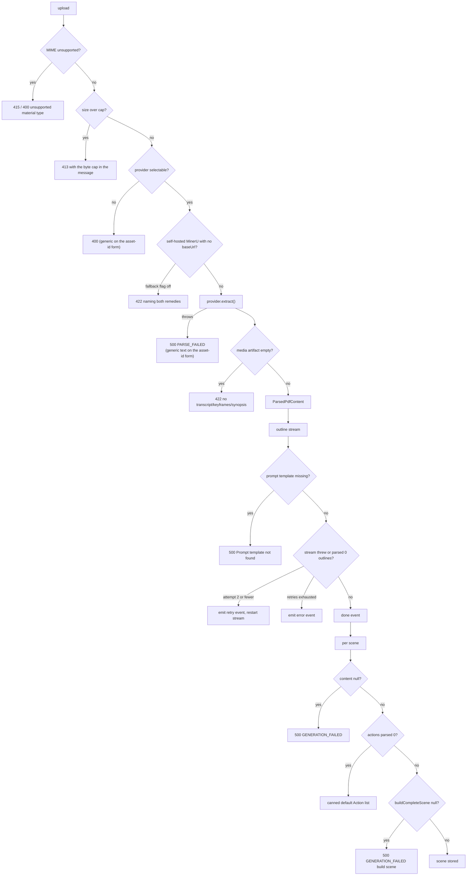
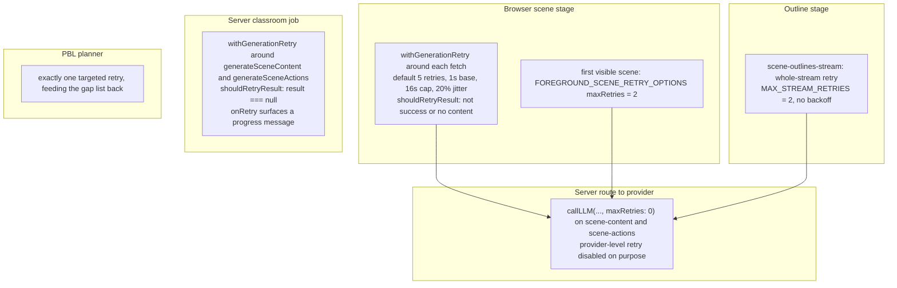
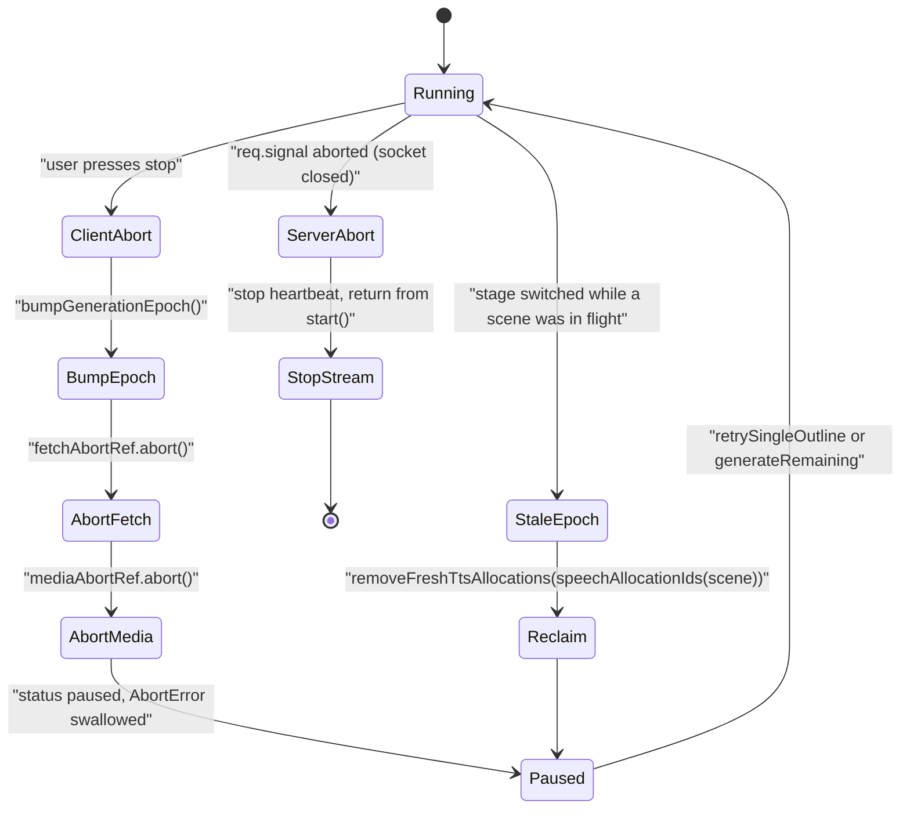

# Failure modes

The pipeline's governing convention: **degrade, do not fail**, with two
deliberate exceptions — PBL scene generation throws, and a scene's TTS failure
fails the whole scene.

## Where a failure can surface

## Failure catalogue

| Failure | Detected at | Behaviour |
| --- | --- | --- |
| Unsupported material MIME | `normalizeDocumentMimeType` returns undefined | `400 INVALID_REQUEST`; the multipart form names the file, the asset-id form stays generic ([`extract-document/route.ts:474`](app/api/extract-document/route.ts#L474), [`:591`](app/api/extract-document/route.ts#L591)) |
| Unsupported workbench upload MIME | `isWorkbenchMaterialMime` | `415` with the offending mime echoed ([`materials/route.ts:178`](app/api/materials/route.ts#L178)) |
| Over-size upload | declared `content-length` **and** streamed body | `413` on both checks ([`materials/route.ts:194`](app/api/materials/route.ts#L194); [`extract-document/route.ts:481`](app/api/extract-document/route.ts#L481), [`:570`](app/api/extract-document/route.ts#L570), [`:602`](app/api/extract-document/route.ts#L602)) |
| Owner quota exceeded | `MaterialQuotaExceededError` | `429` ([`materials/route.ts:279`](app/api/materials/route.ts#L279)) |
| Crashed upload leftovers | 24-hour sweep at the next upload | byte object deleted first, then the reservation; a delete failure **keeps** the reservation for the next pass so the pointer is never lost ([`materials/route.ts:239-249`](app/api/materials/route.ts#L239-L249)) |
| Unknown extractor id | registry lookup | throws `Unknown document extractor provider: <id>` → `400`; the asset-id form pre-blocks it with a static message ([`extract-document/route.ts:122`](app/api/extract-document/route.ts#L122)) |
| No extractor for MIME | `selectDocumentExtractorProvider` | throws; `400`, interpolated on multipart, generic on asset-id ([`route.ts:341`](app/api/extract-document/route.ts#L341)) |
| No available media extractor | `selectMediaExtractorProvider` exhausts providers | throws a message naming both setup paths (AliDocMind creds or ffmpeg + ASR) ([`media-registry.ts:70`](lib/document/extractors/media-registry.ts#L70)) |
| Self-hosted MinerU without base URL | `isSelfHostedMinerUProvider && !managed && !clientBaseUrl` | `422` unless `ALLOW_MINERU_CLOUD_FALLBACK` opts into cloud ([`route.ts:369`](app/api/extract-document/route.ts#L369)) |
| MinerU missing pipeline extras | HTTP error body pattern-matched | actionable message instead of a raw Python traceback ([`pdf-providers.ts:168`](lib/pdf/pdf-providers.ts#L168)) |
| MinerU filename mismatch in the response | `json.results[fileName]` miss | falls back to the first result key with a warn ([`pdf-providers.ts:686`](lib/pdf/pdf-providers.ts#L686)) |
| Single PDF page or single image fails | per-item try/catch | logged, extraction continues with the remaining pages/images ([`pdf-providers.ts:308`](lib/pdf/pdf-providers.ts#L308), [`:312`](lib/pdf/pdf-providers.ts#L312)) |
| Server asset store failure (asset-id form) | try/catch around `resolveServerAsset` | logged server-side, fixed generic `500` — never the raw error ([`route.ts:542`](app/api/extract-document/route.ts#L542)) |
| Persistence not configured / unauthenticated / asset missing | `resolveServerAsset` status | `503` / `401` / `404` ([`route.ts:549-569`](app/api/extract-document/route.ts#L549-L569)) |
| Empty media artifact | no synopsis, transcript or keyframes | `422 PARSE_FAILED`, deliberately not an empty 200 ([`route.ts:292`](app/api/extract-document/route.ts#L292)) |
| Prompt template missing | `buildPrompt` returns `null` | outline: `Error('Prompt template not found')` → `500`; scene content: `onFailure({code:'prompt-unavailable'})` + `null`; actions: silent fall-through to default actions ([`scene-generator.ts:1645`](packages/@openmaic/generation/src/scene-generator.ts#L1645)) |
| Model output unparsable (outline) | `parseJsonResponse` null or wrong shape | `{ success:false, error:'Failed to parse scene outlines response' }` ([`outline-generator.ts:164`](packages/@openmaic/generation/src/outline-generator.ts#L164)) |
| Model output unparsable (slide/quiz/widget) | shape guard after parse | `onFailure({code:'invalid-model-output'})` + `null` ([`scene-generator.ts:779`](packages/@openmaic/generation/src/scene-generator.ts#L779), [`:888`](packages/@openmaic/generation/src/scene-generator.ts#L888), [`:1247`](packages/@openmaic/generation/src/scene-generator.ts#L1247)) |
| Malformed single element | `normalizeElement` throws | that element is **dropped** with a warn; the slide survives ([`scene-generator.ts:511`](packages/@openmaic/generation/src/scene-generator.ts#L511)) |
| `latex` element unrenderable | KaTeX throw or missing `latex` | element dropped ([`scene-generator.ts:574`](packages/@openmaic/generation/src/scene-generator.ts#L574), [`:591`](packages/@openmaic/generation/src/scene-generator.ts#L591)) |
| Image id with no mapping entry | `resolveImageIds` | element removed rather than shipping a dangling id ([`scene-generator.ts:373`](packages/@openmaic/generation/src/scene-generator.ts#L373)) |
| Vision asset unresolvable | route-side probe returns empty | id stripped from `assignedImages` **and** `imageMapping`, so the prompt text and the attachments stay consistent ([`scene-content/route.ts:290`](app/api/generate/scene-content/route.ts#L290)) |
| Vision store down | 15 s aggregate budget or 3-in-a-row fuse | probing stops, one summary warn, generation proceeds text-only ([`scene-content/route.ts:301`](app/api/generate/scene-content/route.ts#L301)) |
| Zero actions parsed | `parseActionsFromStructuredOutput` returns `[]` | canned default `Action[]` per scene type ([`scene-generator.ts:1877`](packages/@openmaic/generation/src/scene-generator.ts#L1877), [`:1908`](packages/@openmaic/generation/src/scene-generator.ts#L1908), [`:1922`](packages/@openmaic/generation/src/scene-generator.ts#L1922), [`:1766`](packages/@openmaic/generation/src/scene-generator.ts#L1766)) |
| Invalid `spotlight.elementId` | `processActions` | repointed to the first element ([`scene-generator.ts:1845`](packages/@openmaic/generation/src/scene-generator.ts#L1845)) |
| Invalid `discussion.agentId` | `processActions` | replaced with a **random** student (or non-teacher) agent ([`scene-generator.ts:1861`](packages/@openmaic/generation/src/scene-generator.ts#L1861)) |
| Outline/content shape mismatch | `buildCompleteScene` guards | returns `null` → route answers `500 GENERATION_FAILED` ([`scene-actions/route.ts:172`](app/api/generate/scene-actions/route.ts#L172)) |
| PBL single-call invalid | `validateLLMOutput` gaps survive one retry | `PlannerV2Error` ([`planner-single-call.ts:529`](packages/@openmaic/generation/src/pbl/planner-single-call.ts#L529)) |
| PBL loop fallback also fails | catch around `pblLoopFallback` | `PBLGenerationError` with the propagated status ([`scene-generator.ts:1053`](packages/@openmaic/generation/src/scene-generator.ts#L1053)) |
| PBL provider/HTTP failure | `plannerErrorStatus(err) !== undefined` | loop fallback **skipped** — retrying the same provider is pointless ([`scene-generator.ts:1042`](packages/@openmaic/generation/src/scene-generator.ts#L1042)) |
| Quiz grade response unparsable | regex/`JSON.parse` failure | silent 50 % partial credit ([`quiz-grade/route.ts:96`](app/api/quiz-grade/route.ts#L96)) |
| Agent profile generation invalid | `< 2` agents or `!= 1` teacher | throws inside `generateAgentProfiles`; the classroom path catches it and uses `getDefaultAgents()` ([`classroom-generation.ts:514`](lib/server/classroom-generation.ts#L514)) |
| Web search failure | try/catch around the whole search block | logged, generation continues with no research context ([`classroom-generation.ts:459`](lib/server/classroom-generation.ts#L459)) |
| Media / TTS phase failure (server job) | try/catch per phase | logged, job continues to persistence ([`classroom-generation.ts:680`](lib/server/classroom-generation.ts#L680), [`:698`](lib/server/classroom-generation.ts#L698)) |
| Zero scenes produced (server job) | post-loop check | `throw new Error('No scenes were generated')` → job `failed` ([`classroom-generation.ts:663`](lib/server/classroom-generation.ts#L663)) |
| TTS failure (browser) | `generateTTSForScene` result | the scene is marked failed and the whole batch pauses ([`use-scene-generator.ts:836`](lib/hooks/use-scene-generator.ts#L836)) |
| Stage switched mid-generation | `generationEpoch !== startEpoch` | scene discarded and `removeFreshTtsAllocations(...)` reclaims freshly minted audio assets ([`use-scene-generator.ts:850`](lib/hooks/use-scene-generator.ts#L850)) |
| Client disconnect during outline stream | `req.signal.aborted` checked per chunk and in the catch | heartbeat stopped, handler returns immediately — no retry burn ([`scene-outlines-stream/route.ts:536`](app/api/generate/scene-outlines-stream/route.ts#L536), [`:636`](app/api/generate/scene-outlines-stream/route.ts#L636)) |
| Runaway outline generation | 512 KB accumulated buffer | stop reading, finalise with whatever parsed ([`scene-outlines-stream/route.ts:543`](app/api/generate/scene-outlines-stream/route.ts#L543)) |
| Stage document written by a newer client | `DocumentVersionError` | `400 "document was written by a newer client; reload before saving"` ([`stages/[id]/route.ts:50`](app/api/stages/[id]/route.ts#L50)) |
| Foreign or deleted stage id | owner-bound store reads it as absent | identical `404` for absent and tombstoned — no existence oracle ([`stages/[id]/route.ts:72`](app/api/stages/[id]/route.ts#L72), [`stage-meta/[stageId]/route.ts:47`](app/api/stage-meta/[stageId]/route.ts#L47)) |

## Retry topology

Deliberate design: the client owns the retry budget for the two scene calls and
the routes pass `maxRetries: 0` to `callLLM`
([`scene-content/route.ts:154`](app/api/generate/scene-content/route.ts#L154), [`scene-actions/route.ts:116`](app/api/generate/scene-actions/route.ts#L116)) so the two layers
cannot multiply. `withGenerationRetry` also honours the abort signal at four
points ([`generation-retry.ts:189`](packages/@openmaic/generation/src/generation-retry.ts#L189), [`:193`](packages/@openmaic/generation/src/generation-retry.ts#L193), [`:207`](packages/@openmaic/generation/src/generation-retry.ts#L207), [`:228`](packages/@openmaic/generation/src/generation-retry.ts#L228)) so a cancelled run
does not sit in a backoff sleep.

## Abort and cancellation

`isAbortError` ([`generation-retry.ts:63`](packages/@openmaic/generation/src/generation-retry.ts#L63)) recognises three shapes — an `Error`
with `name === 'AbortError'`, a `DOMException`, and a bare record — because the
same code runs in the browser, in Node route handlers and under Vitest. An
abort is never retryable ([`generation-retry.ts:133`](packages/@openmaic/generation/src/generation-retry.ts#L133)) and is rethrown rather than
converted to a result ([`use-scene-generator.ts:188`](lib/hooks/use-scene-generator.ts#L188), [`:237`](lib/hooks/use-scene-generator.ts#L237)).

## Partial-failure semantics summary

| Layer | Partial failure allowed? | What survives |
| --- | --- | --- |
| One document in a multi-document bundle | No — `Promise.all` at [`page.tsx:340`](app/generation-preview/page.tsx#L340) rejects the whole preparation step | nothing; the run reports a preparation error |
| One page / one image inside a document | Yes | the rest of the document ([`pdf-providers.ts:308`](lib/pdf/pdf-providers.ts#L308)) |
| One element inside a slide | Yes | the rest of the slide ([`scene-generator.ts:511`](packages/@openmaic/generation/src/scene-generator.ts#L511)) |
| One vision image | Yes | text-only description for the dropped image |
| One action | Yes | the remaining actions, or the canned default list |
| One scene, browser serial mode | No | batch pauses at that scene; earlier scenes are stored |
| One scene, browser parallel mode | Yes for the *content* phase | other scenes continue; failed ones land in `failedOutlines` and the run ends `paused` ([`use-scene-generator.ts:874`](lib/hooks/use-scene-generator.ts#L874)) |
| One scene, server job | Yes | scene skipped (`continue` at [`classroom-generation.ts:625`](lib/server/classroom-generation.ts#L625)), job succeeds if ≥ 1 scene exists |
| Media / TTS phase, server job | Yes | course persisted without the media |

## Silent-failure risks worth naming

- **Prompt placeholder typos ship to the model.** `interpolateVariables` leaves
  an unknown `{{token}}` untouched ([`prompts/loader.ts:103`](packages/@openmaic/generation/src/prompts/loader.ts#L103)). Mitigated by
  tests that assert rendered prompts contain no surviving `{{…}}`
  (`lib/prompts/README.md` "Silent-passthrough gotcha") but not by the runtime.
- **Quiz grading awards 50 % on a parse failure** with no signal to the caller
  ([`quiz-grade/route.ts:96`](app/api/quiz-grade/route.ts#L96)); a systematically broken grader model looks like
  lenient grading, not an outage.
- **A random agent is assigned to a `discussion` action** when the model names
  an unknown agent ([`scene-generator.ts:1861`](packages/@openmaic/generation/src/scene-generator.ts#L1861)); nothing records that the
  authored intent was lost.
- **`ExtractionResult` / `ExtractionError` are declared but unused** by the
  extraction routes ([`lib/document/types.ts:205`](lib/document/types.ts#L205)), so per-provider retryability
  never reaches a caller — every extractor failure is an opaque route-level 500.
