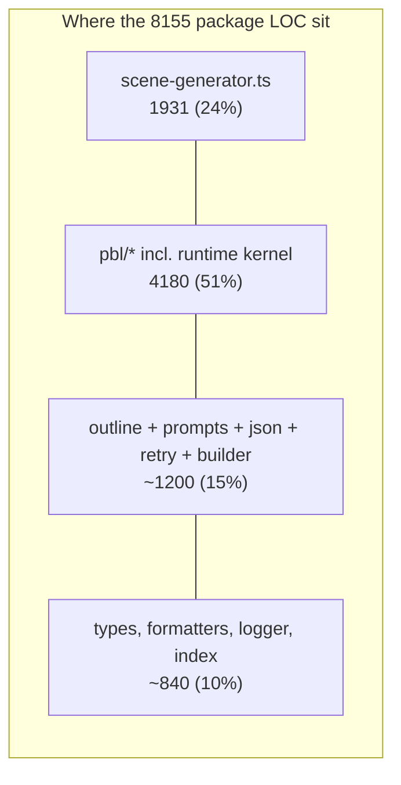
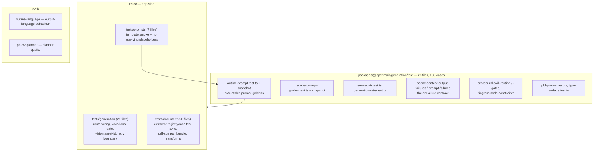

# Quality observations and measured metrics

## Measured metrics

Every number below is paired with the command that produced it, run at commit
`c2c9553a` from the repo root.

| # | Metric | Value | Command |
| --- | --- | --- | --- |
| M1 | `@openmaic/generation` source LOC | 8155 | `wc -l packages/@openmaic/generation/src/*.ts packages/@openmaic/generation/src/*/*.ts packages/@openmaic/generation/src/*/*/*/*.ts \| tail -1` |
| M2 | Package test LOC | 2977 | `wc -l packages/@openmaic/generation/test/*.ts \| tail -1` |
| M3 | Package test files | 26 | `ls packages/@openmaic/generation/test/*.test.ts \| wc -l` |
| M4 | Package test cases (`test(`/`it(`) | 130 | `grep -c "^\s*\(test\|it\)(" packages/@openmaic/generation/test/*.test.ts \| awk -F: '{s+=$2} END {print s}'` |
| M5 | Generation prompt template files | 26 | `ls packages/@openmaic/generation/templates/*/*.md \| wc -l` |
| M6 | Generation prompt template LOC | 4583 | `cat packages/@openmaic/generation/templates/*/*.md \| wc -l` |
| M7 | Package snippets | 7 | `ls packages/@openmaic/generation/snippets/*.md \| wc -l` |
| M8 | App-side prompt template dirs | 8 | `ls -d lib/prompts/templates/*/ \| wc -l` |
| M9 | In-scope app/lib/component LOC | 16287 | `wc -l $(git ls-files 'app/api/generate*' 'app/api/stages' 'app/api/stage-meta' 'app/api/quiz-grade' 'app/api/materials' 'app/api/extract-document' 'app/api/parse-pdf' lib/document lib/media-parse lib/pdf lib/import lib/prompts components/generation app/generation-preview \| grep -E '\.tsx?$') \| tail -1` |
| M10 | Test files across the four generation test dirs | 83 | `ls packages/@openmaic/generation/test/ tests/generation tests/prompts tests/document \| wc -l` |
| M11 | Named exports from the package barrel | 66 | `grep -c "^  [a-zA-Z]" packages/@openmaic/generation/src/index.ts` |
| M12 | `: any` occurrences in package source | 0 | `grep -rn ": any\b" packages/@openmaic/generation/src \| wc -l` |
| M13 | `log.warn`/`log.error` sites in `scene-generator.ts` (each one a silent degradation) | 23 | `grep -c "log.warn\|log.error" packages/@openmaic/generation/src/scene-generator.ts` |
| M14 | In-scope files over 800 LOC | 8 | `wc -l $(git ls-files … ) \| awk '$1>800 && $2!="total"'` (see below) |
| M15 | Positional parameters on `generateSlideContent` | 13 | `sed -n '602,616p' packages/@openmaic/generation/src/scene-generator.ts \| grep -c ","` |
| M16 | Chinese string literals in `scene-generator.ts` | 11 | `grep -oP "'[^']*[\x{4e00}-\x{9fff}][^']*'" packages/@openmaic/generation/src/scene-generator.ts \| wc -l` |
| M17 | Package source files containing CJK literals | 6 | `grep -rlP "[\x{4e00}-\x{9fff}]" packages/@openmaic/generation/src` |
| M18 | Eval harnesses touching generation | 2 of 5 (`outline-language`, `pbl-v2-planner`) | `ls eval` |
| M19 | Snippet include sites: 7 in package templates (3 files), 8 in app templates | 7 / 8 | `grep -rho "{{snippet:[a-z-]*}}" packages/@openmaic/generation/templates \| wc -l` and the same over `lib/prompts/templates` |
| M20 | Largest single prompt file | `templates/slide-content/system.md`, 937 lines | `wc -l packages/@openmaic/generation/templates/*/*.md \| sort -rn \| head -2` |

M14 detail (files over 800 LOC, in scope):

```
1931  packages/@openmaic/generation/src/scene-generator.ts
1554  app/generation-preview/page.tsx
1523  components/generation/outlines-editor.tsx
1033  components/generation/generation-toolbar.tsx
 969  packages/@openmaic/generation/src/pbl/operations/kernel/progress.ts
 893  packages/@openmaic/generation/src/pbl/operations/kernel/proficiency.ts
 848  app/generation-preview/components/visualizers.tsx
 835  lib/document/extractors/local-media.ts
```

**Not measured:** the test suite could not be executed — this checkout has no
`node_modules` (`ls -d node_modules` → exit 2; `npx vitest run` inside the
package fails with `Cannot find package 'vitest'`). Pass/fail counts and
coverage are therefore unknown; see `07-open-questions.md`.



## Strengths

| Observation | Evidence | Why it matters |
| --- | --- | --- |
| The package/host seam is honest. One function type (`AICallFn`) is the entire model dependency; no env reads, no provider imports, no persistence. | `pipeline-types.ts:60`; `package.json` dependencies are 5 libraries, none of them a provider SDK | The generation logic is testable without a network and genuinely publishable. |
| Prompts are reviewable data, not string concatenation. 26 Markdown template files with a 3-phase substitution and a closed `PromptId` union. | `prompts/loader.ts:126`, `prompts/types.ts:6` | A prompt change is a diffable content change; the union prevents a typo'd id from compiling. |
| Byte-stable prompt goldens. Four snapshot cases pin `buildOutlinePrompt` with every conditional off, all on, and two mixed states. | `test/outline-prompt.test.ts`, `test/__snapshots__/outline-prompt.test.ts.snap` (2034 lines) | Prompt regressions surface as a diff instead of as degraded model output. |
| A missing snippet throws; a missing template returns `null`. | `prompts/loader.ts:37` vs `:76` | The louder failure is reserved for the case that would otherwise ship `{{snippet:x}}` to the model. |
| The vision text/attachment consistency invariant is enforced by one shared helper. Route and generator both call `partitionImagesForVision`; ids the server cannot resolve are stripped from prompt text *and* from the mapping. | `outline-formatters.ts:63`; `scene-content/route.ts:217`, `:290`; `scene-outlines-stream/route.ts:383` | Kills a whole class of "prompt promises an image the model never got" bugs. |
| The vision resolution phase is bounded twice and degrades. 15 s aggregate budget raced against every probe plus a 3-consecutive-failure fuse; both proceed with fewer images rather than failing. | `scene-content/route.ts:231-309` | A down asset store costs image fidelity, not the request. |
| Streaming outline parse is O(n). Head-bounded 8 KB scans for the directive/title and a resumable `scanFrom` brace matcher instead of rescanning the growing buffer. | `scene-outlines-stream/route.ts:57`, `:117`, `:576` | The obvious implementation is O(n²) per stream; the comments say so and the code avoids it. |
| Retry budgets are not stacked. Client owns retries; the routes pass `maxRetries: 0` to `callLLM`. | `scene-content/route.ts:154`, `scene-actions/route.ts:116` | Worst-case attempts stay predictable instead of multiplying across layers. |
| Abort is threaded end to end, including out of backoff sleeps and into the upstream LLM request. | `generation-retry.ts:27`, `:189`; `scene-outlines-stream/route.ts:504`, `:536` | A closed tab stops burning tokens. |
| Epoch guarding prevents cross-stage contamination and reclaims orphaned TTS assets. | `use-scene-generator.ts:645`, `:850`, `:1025` | Switching courses mid-generation cannot inject a scene into the wrong document or leak audio blobs. |
| Malformed model output degrades at element granularity, and the reasoning is written down. | `scene-generator.ts:495-507` (the comment explains why keeping a malformed element would crash playback and PPTX export) | A single bad element loses one element instead of the scene. |
| The browser-safe extractor manifest is enforced structurally: implementations spread their manifest entry, and two tests pin both directions plus the import purity. | `extractors/manifest.ts:1-24`, `extractors/pdf.ts:26`, `extractors/text.ts:21`; `tests/document/extractor-manifest.test.ts`, `tests/document/extractor-registry.test.ts` | Client bundles cannot accidentally pull `sharp`/`@alicloud/*`, and metadata cannot drift. |
| Third-party data egress is opt-in, loudly. Self-hosted MinerU never silently forwards to MinerU Cloud. | `extract-document/route.ts:144`, `:369-384` | The failure message names both remedies; the privacy default is safe. |
| Extractor image fetches are SSRF-restricted and bounded. | `pdf-providers.ts:402`, `:383-387` | A compromised endpoint cannot turn image extraction into an internal port scanner. |
| The asset-id extraction form deliberately never echoes caller input or raw extractor text. | `extract-document/route.ts:103`, `:642` | The multipart form's legacy behaviour is preserved without extending its information leakage to the new path. |
| `0` `any` in package source. | M12 | Model output is narrowed through `unknown`/shape guards, not cast away. |
| Meaningful eval harnesses exist for the two hardest-to-unit-test behaviours: output language and PBL planning. | `eval/outline-language/runner.ts`, `eval/pbl-v2-planner/runner.ts`, wired as `pnpm eval:outline-language` / `eval:pbl-v2-planner` | Non-deterministic quality has a measurement path. |

## Real problems

| Severity | Observation | Evidence |
| --- | --- | --- |
| medium | `scene-generator.ts` is 1931 lines and mixes six unrelated concerns: scene routing, DSL element repair, KaTeX rendering, HTML scraping (an ad-hoc attribute/utility-class parser, `:1399-1564`), PBL fallback policy, and four canned action lists. Nothing forces the widget-HTML scraper to live in the same file as slide element normalisation. | M14; `scene-generator.ts:1289-1564` |
| medium | Byte-identical code exists in three places. `formatImageDescription` and `formatImagePlaceholder` are defined twice inside the same package (`outline-formatters.ts:3`,`:14` and `prompt-formatters.ts:78`,`:93`) and only the `prompt-formatters` pair is exported; `sortDocumentImagesForVision` is defined in `outline-formatters.ts:24` **and** re-implemented in `lib/document/bundle.ts:165`. A change to the vision ordering must be made in two repos-worth of places. | Q1 grep in this file's command list |
| medium | `MAX_PDF_CONTENT_CHARS` and `MAX_VISION_IMAGES` are duplicated constants (`packages/@openmaic/generation/src/constants.ts:1-2` and `lib/constants/generation.ts:7,10`) that currently agree by coincidence. They gate the *same* prompt; if they diverge, the route slices a different number of images than the generator expects — precisely the drift the shared `partitionImagesForVision` helper was introduced to prevent. | Q2 grep |
| medium | `generateSlideContent` takes 13 positional parameters (`:602-615`), eight of them optional, so a caller can silently transpose `visionEnabled` and `generatedMediaMapping`. Every sibling (`generateWidgetContent`, `generateSceneActions`) already uses an options object. | M15 |
| medium | Quiz grading awards 50 % of the marks on any parse failure, with no signal to the client (`quiz-grade/route.ts:96`). A grader model that always returns prose looks like a lenient grader, not an outage. | `quiz-grade/route.ts:95-103` |
| medium | Prompt-visible user text is hard-coded Chinese in the package. `generateSlideContent` seeds `assignedImagesText = '无可用图片，禁止插入任何 image 元素'` (`:618`) and detects its own sentinel with `assignedImagesText.includes('禁止插入')` (`:696`); the `elements` prompt variable is the literal `'（根据要点自动生成）'` (`:714`); and the four default action lists ship Chinese `title`/`text` (`:1771`, `:1886`, `:1898`, `:1913`, `:1927`) that reach the learner regardless of `languageDirective`. | M16, M17 |
| low-medium | `interpolateVariables` silently passes an unknown `{{token}}` through to the model (`prompts/loader.ts:103`). The defence is a test suite convention, not a runtime check, and it applies only to prompts those tests render. | `lib/prompts/README.md` "Silent-passthrough gotcha" |
| low-medium | An invalid `discussion.agentId` is replaced by `Math.random()` over the student pool (`scene-generator.ts:1861`). Generation output becomes non-deterministic for reasons unrelated to the model, which also makes a golden test of the actions stage impossible for that branch. | `scene-generator.ts:1859-1866` |
| low-medium | `ExtractionResult` / `ExtractionError` (with its `retryable` flag) and `ExtractionJob` are fully specified (`lib/document/types.ts:205-233`) but reachable only through the barrel's type re-export — no runtime code constructs them. Both extraction routes call `provider.extract()` directly and collapse every provider failure into a route-level 500, so provider-declared retryability never reaches the generation path. A *parallel* mechanism does exist for the workbench queue (`MaterialExtractionError` with a `retryable` field, `lib/server/material-extraction/errors.ts:2`), which means two competing error contracts for one concern. | `git grep -n "ExtractionResult\|ExtractionError\|ExtractionJob" -- app lib components tests` |
| info | A third extraction path exists alongside the two routes: `lib/server/material-extraction/` (417 LOC — `extract.ts`, `runner.ts`, `errors.ts`) is a claim/extract/complete queue over the same provider registries, started from `instrumentation.ts:51` when the agent runtime is configured and stopped at `:63`. It is not reachable from the generation UI, so ingestion has two independent drivers over one registry — worth knowing before changing extractor selection. | `instrumentation.ts:50-51`, `lib/server/material-extraction/runner.ts:51` |
| low | `extractors/manifest.ts:5-8` points readers at `lib/document/extraction-cache.ts` for `resolveExpectedExtractor` / `extractorVersionFor`. That file does not exist (`ls lib/document/extraction-cache.ts` → not found), so the manifest's stated *reason to exist* references a removed module. | `ls lib/document/extraction-cache.ts` |
| low-medium | `lib/document/transforms/` (5 files, 462 LOC: registry, pipeline, `normalize`, `noise-removal`, types) is a complete, tested transform framework that the generation path never invokes — its only caller is `lib/rag/ingest/document.ts:138`. Generation therefore feeds raw provider text straight into the prompt with no normalisation pass. | `git grep -n "transformDocument" -- app lib` |
| low-medium | `buildSceneFromOutline` (`lib/server/scene-generation.ts:53`) is the only caller of `buildLanguageText`, and it has no production callers — only one test and a README snippet. So `SceneOutline.languageNote` is a field the outline model can populate that never reaches a prompt. | `git grep -n "buildSceneFromOutline" -- app lib components tests` |
| low | One failing document fails the whole preparation step: `page.tsx:340` wraps per-document extraction in `Promise.all`, so a single unsupported or provider-erroring file discards the successful extractions of up to four others. `Promise.allSettled` plus a per-file warning would match the pipeline's own degrade-don't-fail convention. | `app/generation-preview/page.tsx:340` |
| low | Two prompt loaders exist with near-identical bodies (`packages/@openmaic/generation/src/prompts/loader.ts` and `lib/prompts/loader.ts`), differing in the prompts dir, the app version's `log.error` on failure, and its snippet fallback into the package. The app version's `applyPromptVariableDefaults` (`lib/prompts/loader.ts:124`) is an identity function kept only for symmetry. | both files |
| low | `inferWidgetType` (`scene-generator.ts:169`) routes widget type by a hand-written bilingual keyword regex. It only runs on the deprecated `interactiveConfig` path, so its blast radius is legacy classrooms — but it is undocumented model behaviour hiding in a regex. | `scene-generator.ts:169-195` |
| low | `DocumentExtractorProvider.version` is documented as the version half of a derivation cache key with "Nothing consumes it yet" (`lib/document/types.ts:40-46`), and all five entries are `'1'`. The comment is honest; the field is currently decoration on the server side. | `extractors/manifest.ts:63`, `:79`, `:94`, `:109`, `:124` |

## Test posture



The shape is good: deterministic contracts (prompt bytes, JSON repair, retry
classification, registry sync) are unit-tested; non-deterministic quality
(language selection, planner output) is pushed into eval harnesses rather than
faked in unit tests. The gap is that the *failure* paths with the widest blast
radius are untested. `tests/quiz/grading.test.ts` exercises
`gradeChoiceQuestions` / `isShortAnswer` from `lib/quiz/grading` — the *local*
deterministic grader — and never touches `app/api/quiz-grade/route.ts`
(`grep -c "quiz-grade" tests/quiz/grading.test.ts` → 0). The only reference to
the route is an E2E test that *stubs* it with a fixed 200
(`e2e/tests/quiz-content-surface-657.spec.ts:181`), so the 50 % partial-credit
fallback has no coverage at all. The random `discussion` agent assignment has no
test naming it either: `grep -rn "discussion" packages/@openmaic/generation/test`
returns one hit, and it is prose inside a prompt snapshot.
