# Open questions

Everything here is something I could **not** determine from the code in this
checkout. Each entry names why, and the cheapest way to settle it.

```mermaid
flowchart TD
  subgraph blocked["Blocked by the environment"]
    b1["test pass/fail + coverage<br/>no node_modules in this checkout"]
    b2["real provider behaviour<br/>no credentials, no live services"]
    b3["actual token/latency cost per stage<br/>needs a live run"]
  end
  subgraph blocked2["Blocked by missing sibling context"]
    c1["media-orchestrator placeholder backfill timing"]
    c2["asset pool: browser-backed vs server-backed selection"]
    c3["workbench material-extraction runner ownership"]
  end
  subgraph ambiguous["Ambiguous in the code itself"]
    d1["which deployment mode is canonical"]
    d2["is generateWidgetContent's null a fallback or a failure"]
    d3["interactiveConfig deprecation timeline"]
    d4["scene-outlines-stream retry has no backoff — intentional?"]
  end
  b1 --> ask["settle by: pnpm install then pnpm test"]
  b2 --> ask2["settle by: a staging run with real keys"]
  c1 --> ask3["settle by: media-audio-video research pack"]
  d1 --> ask4["settle by: asking the maintainers"]
```

## Blocked by the environment

1. **Do the tests pass, and what do they cover?**
   `ls -d node_modules` → exit 2; `npx vitest run` inside the package fails with
   `Cannot find package 'vitest'`. I counted 26 package test files / 130 cases
   and 48 app-side test files across `tests/generation`, `tests/prompts`,
   `tests/document`, but I did not execute any of them, so I cannot claim a
   green baseline or a coverage figure. Settle with `pnpm install && pnpm test`
   and `pnpm --filter @openmaic/generation test`.

2. **Which extractor a real deployment actually uses.** Selection depends on
   `isServerConfiguredProvider('pdf', id)`, which reads env vars and a
   `server-providers.yml` that is not in the repo. I documented the *selection
   algorithm* and the registry order, not what any particular deployment
   resolves to.

3. **Whether MinerU Cloud / AliDocMind response shapes still match the
   parsers.** `extractMinerUResult` ([`lib/pdf/mineru-parser.ts:13`](lib/pdf/mineru-parser.ts#L13)) and
   `aliDocMindLayoutsToParsedPdf` ([`lib/pdf/pdf-providers.ts:511`](lib/pdf/pdf-providers.ts#L511)) encode
   assumptions about upstream JSON. Without credentials I could not exercise
   either. `tests/document/alidocmind.smoke.test.ts` and
   `tests/document/mineru-cloud.test.ts` exist and presumably use fixtures — I
   did not read them closely enough to say whether the fixtures are current.

4. **Per-stage token cost and latency.** No instrumentation numbers are checked
   in and I could not run a generation. So "the slide-content system prompt is
   937 lines" is a size fact, not a cost fact; I cannot say what fraction of a
   run's spend each stage represents.

## Blocked by adjacent subsystems

5. **When generated-media placeholders get backfilled.** The scene generator
   deliberately keeps `gen_img_*` / `gen_vid_*` placeholders in elements
   ([`scene-generator.ts:386`](packages/@openmaic/generation/src/scene-generator.ts#L386)) and the route passes an empty
   `generatedMediaMapping` with the comment "Media generation is handled
   client-side in parallel (media-orchestrator.ts)"
   ([`scene-content/route.ts:312`](app/api/generate/scene-content/route.ts#L312)). `generateMediaForOutlines`
   ([`lib/media/media-orchestrator.ts:41`](lib/media/media-orchestrator.ts#L41)) is launched fire-and-forget from
   [`use-scene-generator.ts:672`](lib/hooks/use-scene-generator.ts#L672). I did not trace how or when the resolved URLs
   are written back into already-stored scenes — that is the media subsystem's
   contract, not this one's.

6. **Which asset transport a deployment uses, and who decides.** The code
   distinguishes a "browser-backed" pool (mapping values are base64 data URLs)
   from a "server-backed" pool (mapping values are allocated asset ids) and the
   comments say the *shape of `imageMapping`* is the whole switch
   ([`scene-generator.ts:342-353`](packages/@openmaic/generation/src/scene-generator.ts#L342-L353)). I did not find the module that decides which
   pool a deployment gets; `resolveVisionImagesForPrompt`
   ([`lib/persistence/resolve-vision-images.ts:59`](lib/persistence/resolve-vision-images.ts#L59)) and `storeImages`
   ([`lib/utils/image-storage.ts:64`](lib/utils/image-storage.ts#L64)) are the two ends I saw. Owner:
   persistence-storage-state pack.

7. **What the workbench material-extraction queue is *for*, relative to the
   generation routes.** `startMaterialExtractionRunner` is launched from
   [`instrumentation.ts:51`](instrumentation.ts#L51) when the agent runtime is configured, so it is live —
   but nothing in the generation UI path reaches it, and it duplicates provider
   selection, media flattening (`mediaArtifactText`,
   [`lib/server/material-extraction/extract.ts:59`](lib/server/material-extraction/extract.ts#L59)) and error classification.
   Whether `/api/extract-document` is meant to migrate onto this queue, or the
   two are permanently separate (session materials vs generation materials), I
   could not tell.

8. **What `lib/import/*` has to do with generation.** `use-import-classroom.ts`
   (575 LOC) and `use-import-pptx.ts` (113 LOC) are in the surveyed paths, but
   both are *import* paths that construct documents without the LLM pipeline:
   the classroom importer reads a ZIP manifest and the PPTX importer delegates
   to `@openmaic/importer`. I documented what they are, not how (or whether)
   an imported document is expected to interoperate with regenerating scenes —
   e.g. whether an imported outline can be re-run through
   `retrySingleOutline`.

## Ambiguous in the code

9. **Which execution mode is canonical.** Two full implementations of the same
   pipeline exist — the browser loop (`use-scene-generator.ts`) and the server
   job (`classroom-generation.ts`) — with different retry wiring, different
   partial-failure semantics (parallel content failures continue vs scenes get
   skipped), different progress transports, and different agent handling. I
   could not tell whether one is a deprecation target, whether the server job
   exists only for a skill/API surface, or whether both are permanent. This
   duplication is the single largest maintenance question in the subsystem.

10. **Is `generateWidgetContent` returning `null` a fallback or an error?** The
    warn text says "falling back to standard interactive"
    ([`scene-generator.ts:1132`](packages/@openmaic/generation/src/scene-generator.ts#L1132)) but the function returns `null` and
    `generateSceneContent` propagates it, which the route turns into a 500
    ([`scene-content/route.ts:346`](app/api/generate/scene-content/route.ts#L346)). Either the comment is stale or a
    standard-interactive fallback path was removed. Same question for the
    procedural-skill gate at `:1210`, which also warns and returns `null` even
    though the *outline* layer has a real demotion path
    (`sanitizeProceduralSkillOutline`).

11. **Deprecation timeline for `interactiveConfig`.** Marked
    `@deprecated` ([`outline-types.ts:88`](packages/@openmaic/generation/src/outline-types.ts#L88)) yet still load-bearing:
    `convertInteractiveConfigToWidget` + `inferWidgetType` (a keyword regex)
    run whenever it is present, and `generateSceneActions` still reads
    `outline.interactiveConfig` for `conceptName`/`designIdea`
    ([`scene-generator.ts:1701`](packages/@openmaic/generation/src/scene-generator.ts#L1701)). I cannot tell whether the regex inference is
    expected to survive or whether a migration is planned.

12. **Why the outline stream retries without backoff.** The scene calls use
    `withGenerationRetry` (exponential + jitter); the outline stream retries
    immediately up to twice ([`scene-outlines-stream/route.ts:519`](app/api/generate/scene-outlines-stream/route.ts#L519)). Given that
    the most likely reason for an empty attempt is a rate limit, an immediate
    retry looks like it could compound. It may be intentional (the SSE client
    is waiting, latency matters more) but nothing in the code says so.

13. **What `courseTitle` at 120 chars vs the prompt's "≤30 chars" is for.** The
    template asks for ≤ 30 characters
    ([`templates/requirements-to-outlines/user.md:57`](packages/@openmaic/generation/templates/requirements-to-outlines/user.md)) while both the
    non-streaming parser ([`outline-generator.ts:161`](packages/@openmaic/generation/src/outline-generator.ts#L161)) and the streaming
    normaliser ([`scene-outlines-stream/route.ts:87`](app/api/generate/scene-outlines-stream/route.ts#L87)) cap at 120. Whether 120 is
    a deliberate defensive margin or a stale number is unclear.

14. **Whether `DocumentTransform` was meant to run before outline generation.**
    The framework's `DocumentTransformPurpose` union includes
    `'course-generation'` as its **first** member
    ([`lib/document/transforms/types.ts:3`](lib/document/transforms/types.ts#L3)), which strongly suggests generation
    was an intended consumer, but the only caller is RAG ingestion. Was this
    descoped, or is wiring it still open work?

15. **Why `DocumentExtractorProvider.version` exists, and what happened to the
    derivation cache.** The field's doc comment says it is the version half of
    a derivation cache key and that "Nothing consumes it yet"
    ([`lib/document/types.ts:40-46`](lib/document/types.ts#L40-L46)), while the manifest header says the two
    client pages need it for `resolveExpectedExtractor` / `extractorVersionFor`
    in `lib/document/extraction-cache.ts` ([`extractors/manifest.ts:5-8`](lib/document/extractors/manifest.ts#L5-L8)). That
    file is absent from the repo (`ls lib/document/extraction-cache.ts` → not
    found). So either the cache was removed and both comments are stale, or it
    lives under a different name I did not find. All five manifest versions are
    `'1'`, so nothing observable depends on the answer today.

16. **Nothing pins the two `MAX_VISION_IMAGES` / `MAX_PDF_CONTENT_CHARS`
    copies together.** They agree today (20 / 50 000).
    `grep -rn "MAX_VISION_IMAGES" tests` returns exactly one hit, and it is a
    comment in [`tests/generation/scene-content-asset-id-vision.test.ts:273`](tests/generation/scene-content-asset-id-vision.test.ts#L273)
    ("25 candidates (> MAX_VISION_IMAGES = 20)") — a hard-coded assumption, not
    an equality assertion. Whether the duplication is intended (the package
    must not import app code) with the pinning simply missing, or whether one
    copy is meant to be re-exported from the other, is an open decision.

17. **The intended relationship between `languageDirective` and
    `targetLanguage`.** The first is model-inferred prose reaching every prompt;
    the second is the authoritative UI locale reaching only the PBL planner
    ([`scene-content/route.ts:322`](app/api/generate/scene-content/route.ts#L322) → [`scene-generator.ts:1018`](packages/@openmaic/generation/src/scene-generator.ts#L1018)). It is unclear
    whether the narrow scope is deliberate (only PBL needs a hard locale) or an
    unfinished rollout, and what should happen when the two disagree.

## Things I deliberately did not survey

Named here so a reader does not mistake the omission for a gap:

- `@openmaic/dsl` element/action schemas and `normalizeElement`'s internals.
- The PBL runtime kernel (`src/pbl/operations/kernel/*`, 2368 LOC) — exported by
  this package but consumed at classroom runtime.
- `lib/media/*`, `lib/audio/*` provider implementations.
- `lib/rag/*`.
- `lib/server/agent-runtime/*` beyond the owner-scoping helpers the stage routes
  call.
- The classroom playback path that consumes the generated `Scene`s.
