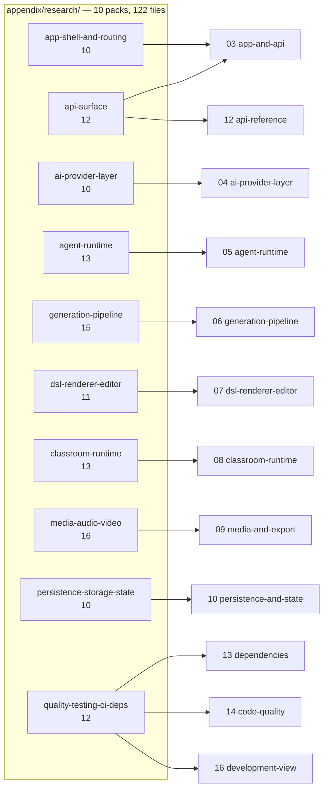
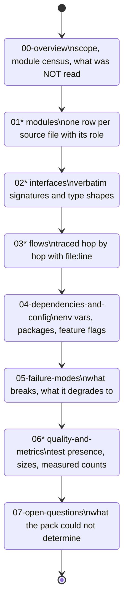

# Evidence packs — index

Ten subsystem evidence packs, 122 Markdown files plus this page. These are the working
notes the seventeen topics were written from: verbatim interface transcriptions, traced
flows with `file:line` per hop, failure-mode catalogues, recorded commands, and the
questions each pack could not answer. Go here when a topic page's summary is not enough
and you want the raw signatures before opening the file itself.

Every pack's entry point is its **`00-overview.md`**. No pack has an `index.md`; this page
is the only index above them.

## The ten packs

| Pack | Files | Entry point | Primarily feeds | What only this pack has |
| --- | --- | --- | --- | --- |
| `app-shell-and-routing` | 10 | [`00-overview.md`](./app-shell-and-routing/00-overview.md) | [03-app-and-api](../../03-app-and-api/index.md) | the session-handoff class model (`02c`), the feature-flag discipline audit, middleware boundary transcription |
| `api-surface` | 12 | [`00-overview.md`](./api-surface/00-overview.md) | [12-api-reference](../../12-api-reference/index.md), [03-app-and-api](../../03-app-and-api/index.md) | all 69 route modules transcribed across four alphabetical chapters (`01a`–`01d`), the error-envelope/identity/model interface split (`02a`, `02b`) |
| `ai-provider-layer` | 10 | [`00-overview.md`](./ai-provider-layer/00-overview.md) | [04-ai-provider-layer](../../04-ai-provider-layer/index.md) | the provider catalogue and server-module signatures verbatim (`01a`, `01b`, `02`, `02b`) |
| `agent-runtime` | 13 | [`00-overview.md`](./agent-runtime/00-overview.md) | [05-agent-runtime](../../05-agent-runtime/index.md) | the tool catalogue with argument shapes (`02b`), the durable-event catalogue (`02d`), the classroom-vs-external flow split (`03`, `03b`) |
| `generation-pipeline` | 15 | [`00-overview.md`](./generation-pipeline/00-overview.md) | [06-generation-pipeline](../../06-generation-pipeline/index.md) | the prompt system transcribed as interfaces (`02d`, `02e`), package-vs-app module split (`01a`–`01c`) |
| `dsl-renderer-editor` | 11 | [`00-overview.md`](./dsl-renderer-editor/00-overview.md) | [07-dsl-renderer-editor](../../07-dsl-renderer-editor/index.md) | the two-op-kernel comparison, the TypeBox mirror, the importer internals (`02a`–`02c`) |
| `classroom-runtime` | 13 | [`00-overview.md`](./classroom-runtime/00-overview.md) | [08-classroom-runtime](../../08-classroom-runtime/index.md) | the interactive-sandbox module map (`01c`), the choreography/buffer interfaces (`02c`), playback cancellation traced hop by hop (`03a`) |
| `media-audio-video` | 16 | [`00-overview.md`](./media-audio-video/00-overview.md) | [09-media-and-export](../../09-media-and-export/index.md) | seven interface chapters (`02a`–`02g`) covering TTS/ASR, media, whiteboard, the choreography IR, the passes and emitter, the export app, and the render service |
| `persistence-storage-state` | 10 | [`00-overview.md`](./persistence-storage-state/00-overview.md) | [10-persistence-and-state](../../10-persistence-and-state/index.md) | the storage abstraction transcribed (`02a`) and every entity with real column names (`02b`) |
| `quality-testing-ci-deps` | 12 | [`00-overview.md`](./quality-testing-ci-deps/00-overview.md) | [14-code-quality](../../14-code-quality/index.md), [13-dependencies](../../13-dependencies/index.md), [16-development-view](../../16-development-view/index.md) | the CI gate contracts (`02b`), the quality observations (`06b`) and the scale/gate metrics (`06c`) |

## The chapter convention

Every pack follows the same numbering, and the suffixed variants exist only because a
chapter outgrew one file. Reading the same chapter number across packs is the fastest way
to answer a cross-cutting question.

**All ten packs now have every chapter `00`–`07`.** `ai-provider-layer` was the outlier for
most of this survey — its `06-quality-and-metrics.md` and `07-open-questions.md` were
missing because the authoring agent for those two chapters died on an API error mid-run, not
because the material was deliberately folded elsewhere. Both chapters have since been
written directly into the pack (verified with `ls docs/appendix/research/ai-provider-layer/`),
and its `00-overview.md` no longer records the gap. `quality-testing-ci-deps` is the one
remaining departure from the plain `00`–`07` convention, and it is additive rather than
missing anything: it has *extra* chapters (`02b`, `06b`, `06c`) because three chapters
outgrew one file.

## Cross-chapter reading paths

Three questions are answered by reading *one chapter across all ten packs* rather than one
pack end to end. These are the paths the topic pages themselves were assembled from.

| Question | Read |
| --- | --- |
| How does anything actually happen at run time? | the `03*-flows*` chapter of all ten packs → assembled into [11-data-flows](../../11-data-flows/index.md) |
| What configuration exists, and where does it come from? | the `04-dependencies-and-config.md` chapter of all ten packs → assembled into [15-cross-cutting](../../15-cross-cutting/index.md) and [17-deployment-view](../../17-deployment-view/index.md) |
| What breaks, and what does it degrade to? | the `05-failure-modes.md` chapter of all ten packs → the failure-mode sections of the component topics |

## How these differ from the topic pages

| Property | Topic pages (01–18) | Evidence packs |
| --- | --- | --- |
| Audience | a staff engineer joining the team | someone verifying a specific claim |
| Structure | narrative, one concern per file | chapter-numbered, one artefact class per file |
| Signatures | summarised, cited by `path:line` | transcribed verbatim (the `02*` chapters are C4 Level 4 in practice) |
| Contradictions | resolved against the code, with the correction recorded | recorded as written when the pack was made — three inherited claims did not survive re-reading and are corrected in [14-code-quality/01-method.md](../../14-code-quality/01-method.md) |
| Currency | stated commit, `c2c9553a` | same commit, but not re-verified when a topic page was later corrected |

The last row is the one to remember: **where a topic page and a pack disagree, the topic
page is the one that was checked against the code more recently**, and it names the
correction.

## Related

- [`../../README.md`](../../README.md) — the documentation set root
- [`../../glossary.md`](../../glossary.md) — the canonical vocabulary these packs use
  locally and sometimes inconsistently
- [`../../14-code-quality/01-method.md`](../../14-code-quality/01-method.md) — the
  measurement method, including which pack claims were corrected and why
