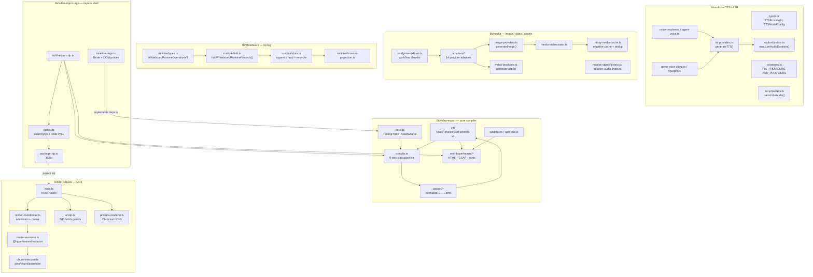
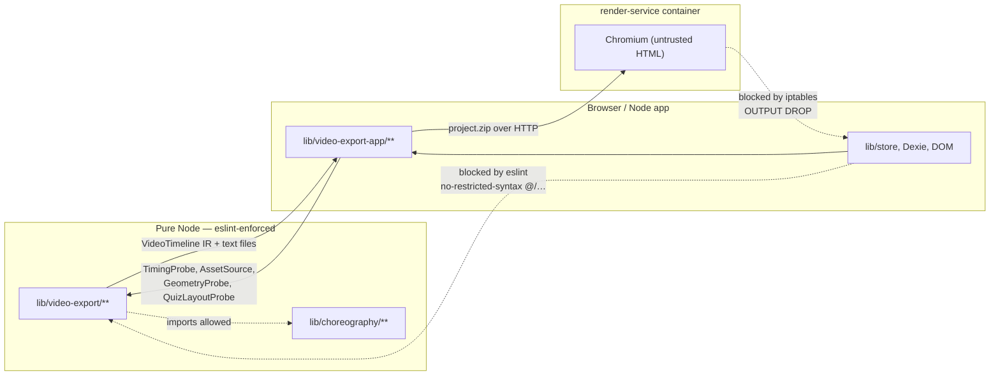

# media-audio-video — Overview

Survey of OpenMAIC's media subsystem: text-to-speech, speech recognition, the
narration/timing contract, the whiteboard operation log and its replay runtime,
image/video generation providers, transcription, web search, the classroom-video
compiler and its Hyperframes emitter, and the isolated MP4 `render-service`.

Everything below is grounded in the tree at `c2c9553a` (branch `main`).

## Charter

The subsystem owns four things the rest of the app treats as black boxes:

1. **Turning text into audio bytes and a duration.** A provider-neutral TTS
   adapter ([`lib/audio/tts-providers.ts:207`](lib/audio/tts-providers.ts#L207) `generateTTS`) plus a
   dependency-free container parser ([`lib/audio/audio-duration.ts:210`](lib/audio/audio-duration.ts#L210)
   `measureAudioDuration`) so a narration clip's dwell is known without decoding
   audio at render time.
2. **Turning classroom data into a deterministic, self-contained video project.**
   A pure compiler ([`lib/video-export/compile.ts:152`](lib/video-export/compile.ts#L152) `compileVideoTimeline`)
   produces the `VideoTimeline` IR; a pure emitter
   ([`lib/video-export/emit-hyperframes/index.ts:1229`](lib/video-export/emit-hyperframes/index.ts#L1229) `emitHyperframes`) turns it
   into one `index.html` driven by a single paused GSAP timeline.
3. **Reaching third-party media/search APIs safely.** Every outbound
   user-influenced URL goes through [`lib/server/ssrf-guard.ts:253`](lib/server/ssrf-guard.ts#L253)
   `validateUrlForSSRF`, and the render container blocks its own egress at the
   kernel ([`render-service/docker-entrypoint.sh:34`](render-service/docker-entrypoint.sh#L34) `lockdown`).
4. **Keeping the app runtime and the exporter numerically identical.** The
   shared spec in `lib/choreography/` (timing constants, the no-audio speech
   estimate, the index→time expansion) is imported by both the live playback
   engine and the compiler, so an export cannot drift from playback.

## Scope map

## File inventory

Counts from `git ls-files <dir> | wc -l` and `git ls-files <dir> | xargs wc -l | tail -1`.

| Directory | Files | Lines | Role |
| --- | --- | --- | --- |
| `lib/audio/` | 28 | 23131 | TTS/ASR registry + adapters + voice resolution. 15913 of those lines are the generated `azure.json` voice list. |
| `lib/media/` | 39 (14 in `adapters/`) | 6772 | Image/video providers, ComfyUI workflow discovery, asset resolution, proxy-media negative cache. |
| `lib/whiteboard/` | 7 | 1470 | Append-only whiteboard operation log, fold/replay, browser projection. |
| `lib/video-export/` | 29 (9 `passes/`, 9 `emit-hyperframes/`) | 5014 | Pure IR compiler + Hyperframes emitter + subtitle serializers + PBL v1 read-only shims. |
| `lib/video-export-app/` | 12 | 2205 | Impure browser companion: Dexie/DOM probes, byte collection, ZIP packaging, render store facade. |
| `lib/web-search/` | 14 | 1694 | 9 web-search backends behind one `searchWeb()`. |
| `render-service/src/` | 17 | 3933 | Standalone Node 22 + Chromium + FFmpeg MP4 renderer (Hono). |
| `components/audio/` | 2 | 433 | `SpeechButton` (ASR mic) and the TTS config popover. |
| `components/whiteboard/` | 3 | 840 | Whiteboard overlay, canvas, snapshot history. |
| `components/settings/tts-settings.tsx` | 1 | 1672 | The single largest UI file in scope: TTS provider/voice/clone settings. |

Route surface in scope (all under `app/api/`):

| Route | Methods | Purpose |
| --- | --- | --- |
| `app/api/generate/tts/route.ts` | POST | Synthesize one speech string → base64 audio + format. |
| `app/api/transcription/route.ts` | POST | multipart audio → text. |
| `app/api/azure-voices/route.ts` | POST | Proxy Azure `/cognitiveservices/voices/list`. |
| `app/api/comfyui-workflows/route.ts` | GET | List workflow JSON files in `public/`. |
| `app/api/proxy-media/route.ts` | POST | CORS/SSRF-checked remote media fetch, 25 MiB cap. |
| `app/api/web-search/route.ts` | POST | Query-rewrite + provider dispatch. |
| `app/api/export-video/capability/route.ts` | GET | Is one-click MP4 available (config **and** `/health`). |
| `app/api/export-video/render/route.ts` | POST | Stream the export ZIP to the render service. |
| `app/api/export-video/render/[jobId]/route.ts` | GET, DELETE | Poll / cancel a render job. |
| `app/api/export-video/render/[jobId]/download/route.ts` | GET | Relay the finished MP4. |

## Two hard boundaries worth internalising

- [`eslint.config.mjs:348-492`](eslint.config.mjs#L348-L492) forbids `@/…` literals, `react`/`react-dom`/`gsap`/
  `motion` imports, `import()` and `require()` anywhere under
  `lib/video-export/**`, with a *depth-specific* relative-import allowlist
  (root files may only reach `../choreography`; `passes/` and `legacy/` may only
  reach `../../choreography`).
- [`render-service/docker-entrypoint.sh:51-67`](render-service/docker-entrypoint.sh#L51-L67) fails **closed**: if the egress
  lockdown is requested (default `RENDER_EGRESS_LOCKDOWN=true`) and iptables
  cannot be installed, the process exits non-zero rather than serving a
  `/health: ok` that would advertise an unisolated renderer.

## Files in this pack

Sixteen files, the largest pack. Every row links, so this table is the pack's navigation as
well as its manifest.

| File | Contents |
| --- | --- |
| `00-overview.md` | This file — charter, scope map, inventory. |
| [`01a-modules-audio-media.md`](docs/appendix/research/media-audio-video/01a-modules-audio-media.md) | Module-by-module: `lib/audio`, `lib/media`, `lib/web-search`, the API routes. |
| [`01b-modules-video-whiteboard.md`](docs/appendix/research/media-audio-video/01b-modules-video-whiteboard.md) | Module-by-module: `lib/whiteboard`, `lib/video-export`, `lib/video-export-app`, `render-service`. |
| [`02a-interfaces-tts-asr.md`](docs/appendix/research/media-audio-video/02a-interfaces-tts-asr.md) | Verbatim TTS/ASR signatures, error classes, voice/model coupling. |
| [`02b-interfaces-media.md`](docs/appendix/research/media-audio-video/02b-interfaces-media.md) | Image/video generation, ComfyUI discovery, polled tasks, proxy cache, web search, SSRF guard. |
| [`02c-interfaces-whiteboard.md`](docs/appendix/research/media-audio-video/02c-interfaces-whiteboard.md) | The five whiteboard operations, record envelope, error codes, fold + service. |
| [`02d-interfaces-choreography-ir.md`](docs/appendix/research/media-audio-video/02d-interfaces-choreography-ir.md) | Timing spec, `resolveActionTimeline`, compiler DI boundary, `VideoTimeline` IR. |
| [`02e-interfaces-passes-emitter.md`](docs/appendix/research/media-audio-video/02e-interfaces-passes-emitter.md) | Pass signatures, subtitle serializers, Hyperframes emitter, generated font modules. |
| [`02f-interfaces-export-app.md`](docs/appendix/research/media-audio-video/02f-interfaces-export-app.md) | Export options, DI implementations, byte collection, packaging, render store. |
| [`02g-interfaces-render-service.md`](docs/appendix/research/media-audio-video/02g-interfaces-render-service.md) | Render-service HTTP contract, job types, executor seam, coordinator, resource profiles. |
| [`03a-flows-audio-media.md`](docs/appendix/research/media-audio-video/03a-flows-audio-media.md) | Traced flows: TTS synthesis→storage, ComfyUI image→asset, web search. |
| [`03b-flows-video-export.md`](docs/appendix/research/media-audio-video/03b-flows-video-export.md) | Traced flows: export ZIP build, render-service MP4 handover, whiteboard append→projection. |
| [`04-dependencies-and-config.md`](docs/appendix/research/media-audio-video/04-dependencies-and-config.md) | External deps, env vars, config resolution flowchart. |
| [`05-failure-modes.md`](docs/appendix/research/media-audio-video/05-failure-modes.md) | Error taxonomy, degradation paths, state machines. |
| [`06-quality-and-metrics.md`](docs/appendix/research/media-audio-video/06-quality-and-metrics.md) | Strengths, fragilities, every measured number with its command. |
| [`07-open-questions.md`](docs/appendix/research/media-audio-video/07-open-questions.md) | What could not be determined from the code. |

No deliverable section is omitted: every one has real material here. The
interfaces section is split seven ways because the verbatim signatures alone run
to roughly 2 400 lines; each part stays inside the 350-line ceiling.
