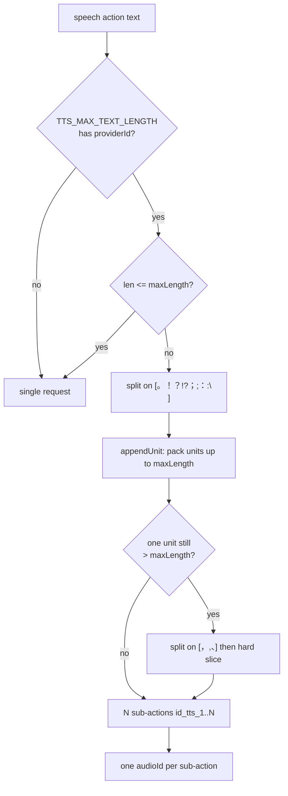
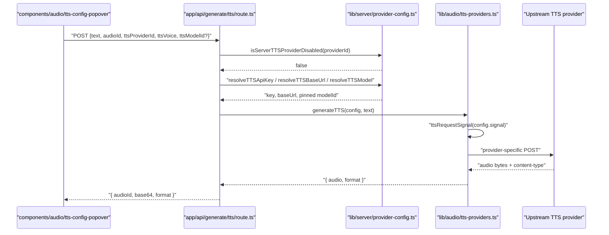

# Modules (a) — audio, media, web search, API routes

Per-module responsibilities with `path:line` anchors. Companion: `01b-modules-video-whiteboard.md`.

## 1. `lib/audio` — the TTS adapter layer

### 1.1 The adapter contract

`lib/audio/types.ts` is types-only and client-safe. Two shapes matter:

- `TTSProviderConfig` (`lib/audio/types.ts:113`) — registry metadata: `models`,
  `defaultModelId`, `voices`, `supportedFormats`, `speedRange`, plus two policy
  flags: `excludeFromAgentVoiceCatalog` (`:127`, drop a paid showcase provider
  from the agent's `list_voices`) and `requiresRegisteredVoice` (`:134`, the
  provider has *no* deployment default voice — only runtime-registered clones).
- `TTSModelConfig` (`lib/audio/types.ts:151`) — the per-call request:
  `providerId`, `modelId?`, `apiKey?`, `baseUrl?`, `voice`, `speed?`, `format?`,
  `providerOptions?`, `signal?`.

Provider ids are an open union (`lib/audio/types.ts:94`) with
`isCustomTTSProvider()` at `:216`; same pattern for ASR at `:187` / `:221`.

### 1.2 `constants.ts` — the registry (1454 lines)

`TTS_PROVIDERS` (`lib/audio/constants.ts:119`) is a
`Record<BuiltInTTSProviderId, TTSProviderConfig>` covering ten built-ins:
`openai-tts`, `azure-tts`, `glm-tts`, `qwen-tts`, `voxcpm-tts`, `doubao-tts`,
`elevenlabs-tts`, `minimax-tts`, `lemonade-tts`, `browser-native-tts`
(`lib/audio/types.ts:82-92`). `ASR_PROVIDERS` (`lib/audio/constants.ts:1078`)
covers `openai-whisper`, `browser-native`, `qwen-asr`, `funasr-asr`,
`lemonade-asr`, `azure-asr`.

Two lookup tables pin defaults per provider:
`DEFAULT_TTS_VOICES` (`:1336`) and `DEFAULT_TTS_MODELS` (`:1349`).

Voice/model coupling — the "model follows voice" invariant:

| Symbol | Location | Behaviour |
| --- | --- | --- |
| `isQwenVoiceCloneModel` | `constants.ts:86` | `/-tts-vc(?:-|$)/iu` on the model id, or an exact match with the operator-configured VC model. |
| `isQwenCatalogVoice` | `constants.ts:94` | Voice id present in `TTS_PROVIDERS['qwen-tts'].voices`. |
| `isQwenCloneVoice` | `constants.ts:99` | Any Qwen voice id **not** in the catalog. Local storage is deliberately not an authority. |
| `resolveTTSModelForVoice` | `constants.ts:107` | Client half of the invariant: a clone voice forces `QWEN_TTS_VOICE_CLONE_MODEL`; a catalog voice never gets a VC model. |
| `getManuallySelectableTTSModels` | `constants.ts:1404` | Filters the VC model out of manual pickers — it is only ever *derived*. |
| `isKnownTTSProviderId` | `constants.ts:1379` | Narrows an arbitrary string through two branches: `Object.hasOwn(TTS_PROVIDERS, id)` — deliberately not `in`, so prototype keys (`toString`) cannot pass — **or** `isCustomTTSProvider(id)`, a bare `id.startsWith('custom-tts-')` prefix test (`types.ts:216-218`) that consults no registry. Only the first branch is an allowlist. |

`DEFAULT_QWEN_TTS_VOICE_CLONE_MODEL = 'qwen3-tts-vc-2026-01-22'`
(`constants.ts:82`).

### 1.3 `tts-providers.ts` — dispatch and per-provider wire formats

`generateTTS(config, text)` (`lib/audio/tts-providers.ts:207`) validates the key
requirement, builds a combined abort signal, then switches on `config.providerId`.
An unrecognised id that matches `custom-tts-*` falls through to the
OpenAI-compatible implementation (`:252`); `browser-native-tts` throws because it
must be handled client-side (`:246`).

Bounding and cancellation: `DEFAULT_TTS_REQUEST_TIMEOUT_MS = 30_000` (`:152`),
overridable by `TTS_REQUEST_TIMEOUT_MS` (`:155`); `ttsRequestSignal()` (`:176`) =
`AbortSignal.any([callerSignal, AbortSignal.timeout(...)])`; the catch at `:257`
distinguishes three outcomes — caller cancel re-thrown verbatim, timeout →
`TTSRequestTimeoutError` (`:165`), everything else re-thrown.

Typed errors: `TTSRateLimitError` (`:123`), `QwenTTSError` (`:134`, `code =
'QWEN_TTS_ERROR'`), `TTSRequestTimeoutError` (`:165`), and the helper
`throwIfTtsRateLimited(provider, status)` (`:193`) that maps HTTP 429.

Per-provider wire shape (all in the same file):

| Provider | Fn | Endpoint / shape | Returned format |
| --- | --- | --- | --- |
| OpenAI | `:274` | `POST {base}/audio/speech`, JSON | sniffed from `content-type` via `getAudioResponseFormat` (`:438`), default `mp3` |
| Lemonade | `:315` | `POST {base}/audio/speech` (OpenAI-compatible), `response_format` defaults `wav` | sniffed |
| VoxCPM2 | `:362` | three backends: vLLM-Omni `/v1/audio/speech` (`:473`), Python API `/tts/upload` multipart (`:549`), nano-vLLM `/generate` (`:590`) | sniffed |
| Azure | `:647` | `POST {base}/cognitiveservices/v1` with SSML; rate → `((speed-1)*100)%`; `X-Microsoft-OutputFormat: audio-16khz-128kbitrate-mono-mp3` | `mp3` (hardcoded) |
| GLM | `:690` | `POST {base}/audio/speech`, `response_format: 'wav'` | `wav` |
| Qwen | `:739` | clone voices → `synthesizeQwenVoiceClone`; catalog → `POST {base}/services/aigc/multimodal-generation/generation`, then download the returned URL | `wav` |
| MiniMax | `:838` | `POST {base}/v1/t2a_v2`, `output_format: 'hex'`, 32 kHz / 128 kbps mono | `extra_info.audio_format` or `mp3` |
| ElevenLabs | `:904` | `POST {base}/text-to-speech/{voice}?output_format=…`; speed clamped to `[0.7, 1.2]` (`:911`) | the requested format |
| Doubao (Seed-TTS 2.0) | `:1002` | `POST {base}/unidirectional`; auth *shape-detected*: `appId:accessKey` → `X-Api-App-Id`/`X-Api-Access-Key`, single `ark-…` → `X-Api-Key` (`:1030`) | `mp3` |

The Doubao response is a run of **concatenated JSON objects with no delimiter**;
it is split by `splitConcatenatedJsonObjects` (`lib/audio/json-stream.ts`) rather
than a brace counter, because a `}` inside an error `message` would corrupt
boundaries (`tts-providers.ts:1060-1065`). Codes `45000000`/`45000292` map to
`TTSRateLimitError` (`:1078`); `20000000` terminates the stream.

### 1.4 Audio format and duration contract

`measureAudioDuration(bytes, format?)` (`lib/audio/audio-duration.ts:210`) is the
whole contract in one function. Magic-byte sniff first (`sniffFormat`, `:190`) —
the `format` hint from `Content-Type` is only trusted when the bytes are
unrecognisable, because `getAudioResponseFormat` defaults to `mp3` on a missing
header and would otherwise send WAV bytes through the MP3 frame-sync parser. WAV:
walk the RIFF chunk list for `fmt ` byte-rate and `data` size (`:55`), with a
declared size of 0 / `0xFFFFFFFF` falling back to remaining bytes (`:70-74`). MP3:
skip ID3v2 (`:105`), parse the first frame header, prefer a Xing/Info frame count
(`:161`) then VBRI (`:174`), else a CBR estimate with a trailing ID3v1 `TAG`
excluded (`:183`). Anything else returns `null` and the caller persists the audio
with `duration` undefined.

The only production caller is `lib/hooks/use-scene-generator.ts:472`, which
stores `duration` on the `AudioFileRecord` at TTS time. This is why the export
compiler's `TimingProbe` can be synchronous.

Reference-audio validation for Qwen voice enrolment is stricter and separate:
`validateReferenceAudio` (`lib/audio/wav-validate.ts:26`) requires PCM format 1,
mono, exactly 24 000 Hz, 16-bit, consistent `byteRate`/`blockAlign`, no trailing
bytes, and 1–60 s duration; anything else throws
`InvalidReferenceAudioError` (`:12`).

### 1.5 Voice resolution

- `resolveNarratorVoiceBinding` (`lib/audio/voice-resolver.ts:42`) prefers a
  persisted narrator binding, falling back to the global voice, and runs both
  through `resolveTTSModelForVoice`.
- `resolveAgentVoice` (`:86`) walks candidates in priority order — persisted
  per-agent override, then the agent's own `voiceConfig` — accepting each only if
  its provider is still in `enabledProviders`, then a deterministic index pick,
  then `null` (the caller must skip TTS rather than silently defaulting to
  browser-native).
- Server-side pinning is the authority: `resolveTTSModel` (`lib/server/provider-config.ts:805`).
  A managed provider's `${PREFIX}_MODELS` first entry wins over the client model;
  a client model outside the pin list throws `TTSModelNotAllowedError` (`:789`,
  HTTP 400). For `qwen-tts` it also self-heals a persisted "VC model + catalog
  voice" wedge (`:835`).
- Classroom generation goes through the same helper:
  `lib/server/classroom-media-generation.ts` now calls `resolveTTSModel(providerId,
  DEFAULT_TTS_MODELS[providerId], voice)` instead of using the default directly
  (commit `a5c71845`, "fix(tts): honor classroom TTS model pins").

### 1.6 Text chunking

`splitLongSpeechActions(actions, providerId)` (`lib/audio/tts-utils.ts:82`) is a
no-op unless the provider has an entry in `TTS_MAX_TEXT_LENGTH` — today only
`glm-tts: 1024` (`:12`). When it fires, the speech action is replaced by
`${id}_tts_${n}` sub-actions, each with its own audio file (explicitly *not*
byte concatenation, `:77-80`).

### 1.7 ASR

`transcribeAudio(config, audioBuffer)` (`lib/audio/asr-providers.ts:164`)
dispatches: `openai-whisper` (`:176`), `browser-native` throws (`:179`),
`qwen-asr` (`:182`), `azure-asr` (`:185`), and `funasr-asr`/`lemonade-asr` share
one WAV-only OpenAI-compatible multipart implementation
(`transcribeWavOpenAICompatibleASR`, `:188`/`:191`). `custom-asr-*` falls through
to `transcribeCustomOpenAICompatibleASR` (`:200`).

## 2. `lib/media` — image, video, asset resolution

### 2.1 Provider registries and dispatch

`IMAGE_PROVIDERS` (`lib/media/image-providers.ts:33`) and
`generateImage(config, options)` (`:191`) cover eight ids
(`lib/media/types.ts:73`): `seedream`, `openai-image`, `qwen-image`,
`nano-banana`, `minimax-image`, `grok-image`, `comfyui-image`, `lemonade`.
`testImageConnectivity` (`:163`) mirrors the same switch. `VIDEO_PROVIDERS`
(`lib/media/video-providers.ts:22`) covers `seedance`, `kling`, `veo`,
`minimax-video`, `grok-video`, `happyhorse` (`lib/media/types.ts:194`).

Dimension helpers live beside the registry: `aspectRatioToDimensions`
(`image-providers.ts:217`) and `applyMinPixelFloor` (`:231`), which scales a
width/height pair up to a minimum pixel area while rounding both edges up to a
multiple of 8.

`comfyui-image` deliberately declares `models: []`
(`image-providers.ts:144`); real selectable "models" are workflow **files**
discovered at runtime, so a placeholder model id would resolve to a dead path.

### 2.2 ComfyUI workflow discovery and the adapter

`lib/media/comfyui-workflows.ts` is the single source of truth shared by the API
route and the adapter:

- `isComfyuiWorkflowFilename(filename)` (`:49`) — rejects `/`, `\`, `..`; then
  requires `.json` **and** (`startsWith('comfyui')` or `includes('workflow')`).
- `listComfyuiWorkflows()` (`:72`) — reads `process.cwd()/public`, filters, sorts
  by display name. `fs`/`path` are **dynamically** imported inside a
  `typeof window === 'undefined'` guard so the bundler can dead-code-eliminate
  the branch for the browser build (`:57-71` explains why a static import breaks).
- `filenameToDisplayName` (`:31`) strips the extension and a leading
  `comfyui[-_]`, then title-cases.

`loadWorkflow` (`lib/media/adapters/comfyui-image-adapter.ts:105`) enforces
three-layer defence on the client-controlled `config.model` (which flows from the
`x-image-model` request header): the basename/traversal check (`:132`), live
directory allowlist membership (`:136`), and a post-`path.join`
`resolve().startsWith(publicDir + sep)` verification (`:174`) — with a comment
noting the join alone does not stop `..`.

`patchWorkflow` (`:299`) mutates a deep clone by `_meta.title` lookup
(`findNodeIdByTitle`, `:277`):

| Target | Preferred node title | Legacy fallback |
| --- | --- | --- |
| Prompt | `Input Prompt` | `String (Multiline - Prompt)` (`:310`) |
| Size | `Width` + `Height` primitives | `Empty Flux 2 Latent` `inputs.width/height` (`:361`) |
| Seed | `KSampler` `inputs.seed = Math.floor(Math.random()*1e15)` (`:391`) | — |

A missing prompt node throws (`:314`); a missing dimension or sampler node only
warns and falls back to workflow defaults. Timeouts: `GENERATION_TIMEOUT_MS =
300_000` on the polling loop, `FETCH_TIMEOUT_MS = 30_000` per HTTP call,
`CONNECTIVITY_TIMEOUT_MS = 10_000` for the probe (`:56-67`).

### 2.3 Orchestration and asset storage

`generateMediaForOutlines(outlines, stageId, abortSignal)`
(`lib/media/media-orchestrator.ts:41`) gathers every `mediaGenerations` entry
across outlines, filters by `imageGenerationEnabled` / `videoGenerationEnabled`,
skips tasks already `done`/`failed`, enqueues them, then processes **serially**
(`:69-73` — "image/video APIs have limited concurrency").

`generateSingleMedia` (`:130`) has two storage paths per media type:

1. **CDN path** — the server already uploaded to OSS, so the Dexie row is written
   with an empty blob plus `ossKey` (`:150`, `:188`).
2. **Blob path** — `fetchAsBlob(url)` (`:364`) routes remote URLs through
   `fetchProxiedMediaUrl` and stores the real bytes.

Non-retryable failures (those carrying an `errorCode`) are persisted as an empty
placeholder row with `error`/`errorCode` so they survive a refresh (`:248-264`).

`runPolledTask` (`lib/media/polled-task.ts:31`) is the shared submit→poll loop
used by the async video providers and by the client-side render poller: a
`submit()` returning `{status:'submitted', taskId}`, then `poll(taskId)` every
`intervalMs` up to `maxAttempts`, with a `formatTimeout` hook.

### 2.4 `proxy-media-cache.ts` — the outbound-fetch memory

`fetchProxiedMediaUrl(url, init?)` (`lib/media/proxy-media-cache.ts:234`) is the
only sanctioned way to POST `/api/proxy-media`. It provides three things:

- **Permanent verdicts.** A non-retryable 4xx is recorded in `permanentFailures`
  and short-circuits every later call for the session (`:154-158`). The retryable
  set is exactly `{408, 425, 429}` (`TRANSIENT_4XX_STATUSES`, `:118`).
- **Transient backoff.** 5xx / network failures increment `attempts` and arm an
  exponential window (`BACKOFF_BASE_MS = 400`, `BACKOFF_MAX_MS = 4_000`,
  `MAX_TRANSIENT_ATTEMPTS = 3`, `:110-121`). Hitting the cap sets
  `blockedUntil = Infinity` for the session.
- **Concurrency dedup.** One real request per URL, refcounted by `consumers`
  (`InFlightEntry`, `:86`). The fetch runs on an *internal* `AbortController`;
  each caller races only its own signal via `waitForCaller` (`:307`). The last
  caller leaving an unsettled entry records one transient failure with status 0
  (`:285-291`). A 2xx body is buffered once into a shared `Blob` and every
  consumer wraps that same Blob (`:356-379`).

`resetProxyMediaFailureCache()` (`:124`) and `proxyMediaRetainedBodyCount()`
(`:178`) are test hooks; the cache is deliberately in-memory only.

### 2.5 Byte resolution

`resolveAudioBlob(audioId)` (`lib/media/resolve-audio-bytes.ts:15`) is
pool-first, Dexie-fallback, and treats a zero-byte row as "no bytes" so the
caller keeps the reference retryable rather than playing silence. The media
counterpart is `resolveStoredBytes` (`lib/media/resolve-stored-bytes.ts`), whose
option flags (`resolutionGating`, `compatRowCdnFallback`, `taskUrlFallback`,
`fetchPolicy`) are exercised by `lib/video-export-app/collect.ts:171`.

## 3. `lib/web-search` — nine backends, one entry point

`searchWeb(params)` (`lib/web-search/index.ts:15`) switches over
`WebSearchProviderId` (`lib/web-search/types.ts:8`): `tavily`, `exa`, `bocha`,
`brave`, `baidu`, `claude`, `minimax`, `doubao`, `searxng`. The `default` branch
uses an `exhaustive: never` assignment (`:78`) so adding an id without a case is
a compile error. `AbortSignal` is threaded through as a conditional spread
(`abortOptions`, `:36`).

`WebSearchProviderConfig` (`types.ts:31`) carries `requiresApiKey`,
`requiresBaseUrl` ("self-hosted instances need an explicit base URL"),
`defaultBaseUrl`, and `endpointPath`. `WEB_SEARCH_PROVIDERS` lives at
`lib/web-search/constants.ts:10`. `formatSearchResultsAsContext` is re-exported
from `lib/web-search/format.ts` through `index.ts:13`.

## 4. API routes in scope

### 4.1 `app/api/generate/tts/route.ts`

`maxDuration = 30` (`:32`). Ordered gates:

1. Required fields `text, audioId, ttsProviderId, ttsVoice` (`:56`).
2. `browser-native-tts` rejected — client-side only (`:65`).
3. `isServerTTSProviderDisabled` → 403 `PROVIDER_DISABLED` (`:71`); operator
   disable beats any client key.
4. VoxCPM auto-voice with neither `voicePrompt` nor `registeredVoiceId` → 400
   `VOXCPM_AUTO_VOICE_REQUIRES_CONTEXT` (`:81`).
5. Managed providers ignore client `apiKey`/`baseUrl`; an unmanaged client base
   URL is SSRF-validated (`:97`). Keyed provider with no resolvable key → 400
   `MISSING_API_KEY` (`:113`).
6. `resolveTTSModel(...)` then `generateTTS(...)` (`:124`, `:144`), then
   `recordGenerationUsage({kind:'tts', unit:'character', quantity: text.length})`
   fire-and-forget (`:146`).
7. Response: `{ audioId, base64, format }` (`:157`).

A Qwen clone voice additionally forces `speed: 1` and sets
`providerOptions.qwenVoiceClone = true` (`:129`, `:134`).

### 4.2 The rest

- `app/api/transcription/route.ts` — `maxDuration = 60`. Falls back to the
  operator-configured provider when the client omits one, and **fails loudly**
  (`MISSING_PROVIDER`, 400) rather than guessing a vendor (`:40-44`). SSRF check
  on a client base URL is `NODE_ENV === 'production'`-gated (`:57`) — a
  deliberate asymmetry versus the TTS route, which always checks.
- `app/api/azure-voices/route.ts` — SSRF-validates the base URL (`:29`), fetches
  with `redirect: 'manual'`, rejects any 3xx as `REDIRECT_NOT_ALLOWED` (`:43`).
- `app/api/proxy-media/route.ts` — `maxDuration = 60`, `MAX_REDIRECTS = 5` with
  each hop re-validated (`:55`), 4xx forwarded verbatim while 5xx collapse to 502
  (`:60-65`), 25 MiB cap on both `content-length` and the realised `blob.size`.
- `app/api/web-search/route.ts` — prefers the operator's backend over stale client
  defaults (`:67`), enforces `PROVIDER_DISABLED` **after** that override (`:83`),
  never trusts a client base URL for `searxng` (`:98`), clamps the rewrite excerpt
  (`:123`), best-effort LLM query rewrite (`buildSearchQuery`, `:152`).
- `app/api/comfyui-workflows/route.ts` — one call to `listComfyuiWorkflows()`,
  returning `{ workflows: [] }` on any error (`:19`).

