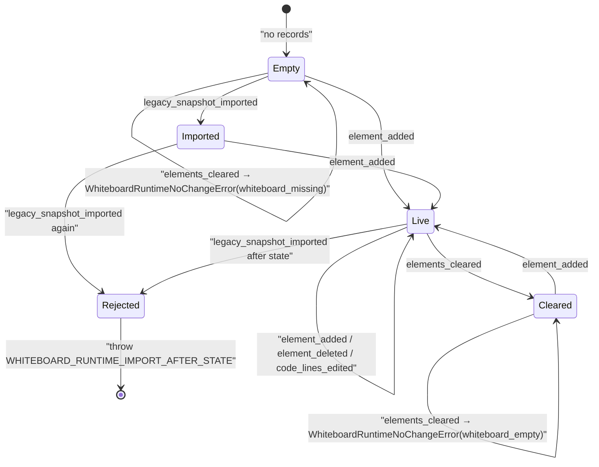
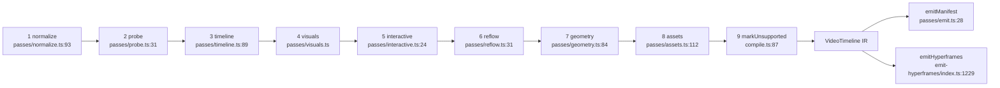
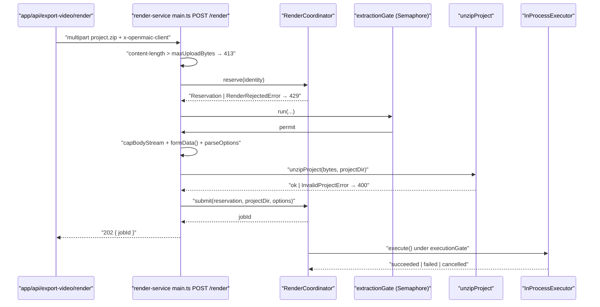

# Modules (b) — whiteboard, video-export, video-export-app, render-service

Continues `01a-modules-audio-media.md`.

## 5. `lib/whiteboard` — an append-only operation log

The whiteboard is not stored as a mutable document. It is a `RuntimeRecord`
stream folded into a `Whiteboard` on read.

### 5.1 The primitive model

`lib/whiteboard/runtime/types.ts` defines five operations
(`WhiteboardRuntimeOperationV1`, `:55`):

| Operation kind | Payload | Anchor |
| --- | --- | --- |
| `legacy_snapshot_imported` | `{ source: { kind: 'stage.whiteboard', fingerprint: sha256:… }, whiteboard }` | `:10` |
| `element_added` | `{ element: PPTElement }` | `:19` |
| `element_deleted` | `{ elementId }` | `:24` |
| `elements_cleared` | `{}` | `:29` |
| `code_lines_edited` | `{ elementId, edit }` where `edit` is `insert_after`/`insert_before`/`delete_lines`/`replace_lines` (`:33`) | `:49` |

Each record's payload is a `WhiteboardRuntimePayloadV1` (`:62`) —
`{ payloadVersion: 1, operationId, operation }` — and
`WhiteboardRuntimeRecord = RuntimeRecord<WhiteboardRuntimePayloadV1>` (`:164`).
There are no freehand strokes: every primitive is a `PPTElement` from
`@openmaic/dsl`, so board and slide canvas share one element model and one
renderer ([`components/whiteboard/whiteboard-canvas.tsx:15`](components/whiteboard/whiteboard-canvas.tsx#L15)).

Six typed errors with stable `code` fields: element-not-found (`:98`), type
mismatch (`:107`, `expectedType = 'code'`), code-line not found (`:122`),
code-line id conflict (`:136`), and `WhiteboardRuntimeNoChangeError` (`:152`)
whose `reason` is `'whiteboard_missing' | 'whiteboard_empty'`.

### 5.2 The fold (replay)

`applyWhiteboardRuntimeOperation(sessionId, current, operation)`
([`lib/whiteboard/runtime/fold.ts:51`](lib/whiteboard/runtime/fold.ts#L51)) is the single transition function:

- Every operation is deep-cloned and **recursively frozen** before use
  (`immutableClone`, `:30`), so the fold cannot alias caller state.
- A legacy import into non-null state throws
  `WHITEBOARD_RUNTIME_IMPORT_AFTER_STATE` (`:58`) and repairs an inverted
  `viewportRatio` on the way in (`:64`).
- `element_added` on `current === null` synthesises a board with
  `viewportSize: 1000`, `viewportRatio: 0.5625`, white solid background, and an
  id derived from the session (`deriveRuntimeWhiteboardId`, `:43`, namespaced
  `openmaic.whiteboard-runtime-board.v1`).
- `code_lines_edited` validates that every target line id exists (`:119`), that
  introduced line ids do not collide with retained or with each other
  (`assertIntroducedLineIdsDoNotConflict`, `:124`), and — after applying — that
  the edited element round-trips through
  `normalizeAndValidateWhiteboardElement` byte-identically, else
  `WHITEBOARD_RUNTIME_CODE_ELEMENT_NOT_CANONICAL` (`:162`).
- `replace_lines` anchors at the index of `edit.lineIds[0]` (`:154`), matching
  the legacy transition.

`foldWhiteboardRuntimeRecords(sessionId, records)` (`:170`) validates each
record's envelope, rejects records carrying playback anchors
(`sceneId`/`actionIndex`/`subAnchor`, `:184`), enforces `record.seq === index`
(`:194`) and `record.id === payload.operationId` (`:197`), and de-duplicates by
`operationId` via a canonical SHA-256 digest — a repeat with a *different* digest
throws `WHITEBOARD_RUNTIME_OPERATION_CONFLICT` (`:203`).

### 5.3 Store and projection

`createWhiteboardRuntimeService(deps)` ([`lib/whiteboard/runtime/store.ts:170`](lib/whiteboard/runtime/store.ts#L170))
exposes `read`, `append`, `reconcileOperation`. Notable invariants:

- Session id is deterministic:
  `whiteboard:${encodeURIComponent(stageId)}:${encodeURIComponent(learnerKey)}`
  (`:57`). `selectSession` (`:86`) rejects more than one active session
  (`WhiteboardRuntimeSessionAmbiguousError`) and any inactive session
  (`WhiteboardRuntimeSessionInvariantError`).
- `append` is optimistic-concurrency: `expectedLastSeq` must equal the folded
  `lastSeq` or `RuntimeAppendConflictError` is thrown (`:214`). An identical
  `operationId` replays idempotently (`findExactReplay`, `:158`).
- After a successful `appendRecord` the service **re-folds and verifies** the
  committed seq, throwing `WHITEBOARD_RUNTIME_POST_COMMIT_VERIFICATION_FAILED`
  on a mismatch (`:272`).
- Everything runs inside `withRuntimeStorageSharedLock` (`:174`).

`refreshWhiteboardRuntimeProjection(stageId, minimumLastSeq?)`
([`runtime/browser-projection.ts:8`](lib/whiteboard/runtime/browser-projection.ts#L8)) reads the folded state into `useCanvasStore`,
guarded by a generation token plus three staleness checks (stage changed,
generation superseded, or a projection with a *higher* `lastSeq` already present,
`:21-35`). It swallows all errors and returns `false`.

[`components/whiteboard/index.tsx:39`](components/whiteboard/index.tsx#L39) derives `runtimeAuthoritative` and, when
true, hides the clear/history controls (`:151`) — the op log is the authority and
the snapshot-history UI serves only the legacy document path. The clear-animation
duration in the component (`:81`, `Math.min(380 + n*55, 1400)`) is the same
formula as `wbClearMs` ([`lib/choreography/timing.ts:72`](lib/choreography/timing.ts#L72)) — **duplicated literals,
not a shared import**.

`normalizeWhiteboardViewportRatio` ([`lib/whiteboard/viewport.ts:22`](lib/whiteboard/viewport.ts#L22)) reciprocates
an inverted (>1) ratio, clamps into `[0.4, 1]`, and falls back to `9/16`.

## 6. `lib/video-export` — the pure compiler

### 6.1 The IR

`lib/video-export/ir.ts` authors everything in zod and infers the TS types from
the schema. Envelope constants: `VIDEO_TIMELINE_SCHEMA =
'openmaic.videoTimeline'` (`:32`), `VIDEO_TIMELINE_VERSION = 4` (`:35`),
`VIDEO_TIMELINE_COMPILER = 'openmaic-video-timeline'` (`:38`).

Scene shape (`VideoTimelineSceneSchema`, `:305`): `base` (one of
`slide-snapshot` / `visual-segments` / `placeholder` / `interactive-html`,
`:113`) plus four typed buckets — `visuals`, `narration`, `effects`, `videos` —
and a catch-all `markers` array so no beat is silently dropped (`:291`).

`CANVAS` (`:417`) fixes the coordinate contract: `viewBox` 100 × 100,
`pixelBase` 1000 × 562.5, `aspectRatio '16:9'`.

Thirteen stable diagnostic codes (`DiagnosticCodeSchema`, `:80`) make the
manifest an export report. `VideoTimelineCompileError` (`:424`) is the only
structural throw.

### 6.2 The DI boundary

`lib/video-export/deps.ts` declares four **synchronous** interfaces the app
implements: `TimingProbe` (`:61`), `AssetSource` (`:101`),
`InteractiveHtmlSource` (`:122`), `GeometryProbe` (`:142`), `QuizLayoutProbe`
(`:165`), plus `CompileConfig` (`:170`). The file's header states the reason
plainly: durations are pre-resolved at TTS time, so the whole compile is a pure
synchronous fold and a stub is a literal object rather than a promise mock.

`CompilerScene = SceneCore & { type: SceneType; content?: CompilerSceneContent }`
(`:50`) is deliberately looser than the app's `Scene`, so callers pass their
scenes without casting.

### 6.3 The pass pipeline

`compileVideoTimeline(input, deps)` ([`lib/video-export/compile.ts:152`](lib/video-export/compile.ts#L152)) runs nine
steps:

| Pass | Owns | Key detail |
| --- | --- | --- |
| `normalize` | ordering + action validation | Sorts by `order ?? inputIndex`, tie-broken by input index ([`normalize.ts:100`](lib/video-export/passes/normalize.ts#L100)). Drops unknown types (`unknown-action`) and actions missing a required field (`invalid-action`, `missingRequiredField`, `:29`). Empty speech text is legal — a dwell beat (`:40`). Zero scenes throws. |
| `probe` | adapt `TimingProbe` → `ResolveTimelineOptions` | Defaults `onUnresolvedVideoDuration` to `'cap'`, unlike choreography's `'throw'` ([`probe.ts:41`](lib/video-export/passes/probe.ts#L41)). An unavailable `play_video` is forced to a 0 ms dwell ([`:44`](lib/video-export/passes/probe.ts#L44)). |
| `timeline` | **timing only** | Calls `resolveActionTimeline`, buckets segments, derives one subtitle cue per non-empty speech, then splits cues via `splitCues` ([`timeline.ts:143`](lib/video-export/passes/timeline.ts#L143)). Emits `estimated-duration` diagnostics and sets `ttsEnabled`. Effect `params` merge descriptor defaults with authored overrides (`effectParams`, `:66`). |
| `visuals` | Quiz/PBL static covers | `prepareQuizQuestionList` ([`visuals.ts:65`](lib/video-export/passes/visuals.ts#L65)) is the only path from authored quiz data into the IR — answer keys, analysis, points and learner state are structurally unrepresentable. Quiz scroll timing constants at [`:90-95`](lib/video-export/passes/visuals.ts#L90-L95) (`96 px/s` at 720p, 4–24 s clamp). Legacy PBL v1 is read through `legacy/read.ts`. |
| `interactive` | prepared HTML → first-class base | Success promotes `base.kind = 'interactive-html'` with `readyTimeoutMs = 8000` / `settleMs = 250` from [`interactive-static.ts:4-7`](lib/video-export/interactive-static.ts#L4-L7). Failures map to three diagnostic codes via `failureCode` ([`interactive.ts:11`](lib/video-export/passes/interactive.ts#L11)). |
| `reflow` | absolute-time shift | Compiler-added Quiz tails extend their scene and shift every later timestamp, including subtitle cues ([`reflow.ts:31`](lib/video-export/passes/reflow.ts#L31)). Authored intra-scene timing is untouched. |
| `geometry` | element placement | Prefers the measured content box; a **rotated** element deliberately falls back to the authored box so the single downstream `rotate` is not applied twice ([`geometry.ts:59-68`](lib/video-export/passes/geometry.ts#L59-L68)). A miss yields `geometry: null`, `degraded: true`, `unresolved-element`. |
| `assets` | dedup + zip naming | Dedup key is `(assetId, kind)` — a ref may legitimately be both narration audio and video media ([`assets.ts:59`](lib/video-export/passes/assets.ts#L59)). Presence is a property of that key, not of an individual reference ([`:62-73`](lib/video-export/passes/assets.ts#L62-L73)). Paths: `frames/<seq>-<slug>.png`, `audio/<slug>/speech-NNN.<ext>`, `media/<elementId>.<ext>`, `interactive/<slug>.html`. Collisions get `-2`, `-3`… (`unique`, [`:101`](lib/video-export/passes/assets.ts#L101)). |

`resolveAvailableVideos` ([`compile.ts:137`](lib/video-export/compile.ts#L137)) keys availability by **action object
identity, not `action.id`**, because the DSL does not enforce stage-wide action-id
uniqueness.

`emitManifest` ([`passes/emit.ts:28`](lib/video-export/passes/emit.ts#L28)) re-parses the IR through
`VideoTimelineSchema` and then through `VideoExportManifestSchema` (which adds
`runtimeDiagnostics: []`), so a malformed IR fails at the compiler rather than in
the renderer.

### 6.4 Subtitles

`toSrt` / `toVtt` ([`lib/video-export/subtitles.ts:43`](lib/video-export/subtitles.ts#L43), [`:53`](lib/video-export/subtitles.ts#L53)) format the IR's cue
track. `usableCues` (`:38`) drops zero/negative spans and empty text so an
estimated 0 ms narration never emits a malformed block. `normalizeText` (`:29`)
collapses CRLF and trims trailing whitespace so a cue cannot end its own block
early. `splitCue`/`splitCues` (`lib/video-export/split-cue.ts`) chop each
per-speech cue into line-sized cues weighted by character count, and the **IR
carries the split track** so the burned-in overlay and the sidecar files cannot
diverge.

### 6.5 The Hyperframes emitter

`emitHyperframes(ir, options)` ([`lib/video-export/emit-hyperframes/index.ts:1229`](lib/video-export/emit-hyperframes/index.ts#L1229))
returns `EmittedProject` — text files only, plus `vendorAssets` describing binary
fonts by `{ path, sourceUrl }` (`:60`).

Output structure (`:1307-1351`): one `<html lang>` document, an inline `<style>`
carrying `INTER_FONT_FACE_CSS` (and, only when a Quiz question list exists,
`NOTO_CJK_EXPORT_CSS` + `KATEX_EXPORT_CSS` + the planned script fonts), a single
root `div#<compositionId>` with `data-composition-id`, `data-start="0"`,
`data-duration`, `data-width`, `data-height`, then scene bases, effects,
subtitles, a `<script type="application/json"
data-openmaic-runtime-diagnostics>` sink, the vendored GSAP `<script src>`, and
the timeline script.

Defaults: `width 1920` (`:187`), height derived from the IR's 16:9 pixel base
(`:1234`), `compositionId 'openmaic'`, `gsapVendorPath
'assets/vendor/gsap.min.js'` (`:188`), `manifestPath
'openmaic-video-manifest.json'` (`:189`), `locale 'en-US'` (`:190`),
`burnInSubtitles: false` (`:172` — clean video plus sidecar SRT/VTT is the
default).

Files written (`:1353-1391`): `index.html`, `LICENSES/Inter-OFL-1.1.txt`, the
manifest JSON, `subtitles.srt`, `subtitles.vtt`, `README.md`, plus — only for
Quiz-list exports — `LICENSES/KaTeX-MIT.txt`,
`LICENSES/Noto-Sans-SC-OFL-1.1.txt`, `LICENSES/Noto-Sans-KR-OFL-1.1.txt` and any
script-font licenses from `planQuizScriptFonts`.

Determinism rules the emitter obeys, enforced downstream by `hyperframes lint`
(`:19-20`): GSAP vendored locally (no CDN), no `Date.now` / `Math.random` /
network at render time, explicit root `data-duration`, no infinite repeats. RTL
is scoped to text-bearing cover panels rather than the document, because
Hyperframes cannot safely render a document-level RTL direction (`:156-164`).

Cover CSS is written against `COVER_DESIGN_WIDTH = 1280` (`:789`) and scaled by
`width / COVER_DESIGN_WIDTH` with a 1 px hairline floor (`coverCardCss`, `:1064`)
— no `vw` units anywhere, because viewport units track the browser window and
would differ between `hyperframes preview` and `hyperframes render`.

Effects are emitted per-descriptor rather than generically
([`emit-hyperframes/effects.ts:1-19`](lib/video-export/emit-hyperframes/effects.ts#L1-L19)): spotlight is an SVG mask, laser is nested
CSS divs, and a dependency-free `cubicBezier` implementation
([`effects.ts:44`](lib/video-export/emit-hyperframes/effects.ts#L44)) supplies the named eases so no easing library is needed.

### 6.6 Prebuilt font assets and the generator scripts

Three `package.json` scripts ([`package.json:12-14`](package.json#L12-L14)) regenerate committed modules:

| Script | Generator | Output module | Public bytes |
| --- | --- | --- | --- |
| `gen:video-export-katex` | `scripts/generate-video-export-katex.mjs` | `lib/video-export/emit-hyperframes/katex-assets.ts` | `public/vendor/video-export/fonts/KaTeX_*.woff2` |
| `gen:video-export-noto-cjk` | `scripts/generate-video-export-noto-cjk.mjs` | `emit-hyperframes/noto-cjk-assets.ts` | `noto-sans-sc-…`, `noto-sans-kr-…` |
| `gen:video-export-noto-script-fonts` | `scripts/generate-video-export-noto-script-fonts.mjs` | `emit-hyperframes/noto-script-font-assets.ts` | Cyrillic + Arabic faces |

The KaTeX generator reads `katex/dist/katex.min.css`, rewrites every
`@font-face` `src` to a `__OPENMAIC_QUIZ_FONT_BASE__` placeholder, copies the
WOFF2 files into `public/vendor/video-export/fonts`, and **asserts exactly 20
faces** ([`generate-video-export-katex.mjs:36`](scripts/generate-video-export-katex.mjs#L36)) before writing a
prettier-formatted module. The emitted module exposes the same CSS twice
([`katex-assets.ts:9`](lib/video-export/emit-hyperframes/katex-assets.ts#L9), [`:13`](lib/video-export/emit-hyperframes/katex-assets.ts#L13)): `KATEX_MEASUREMENT_CSS` pointing at
`/vendor/video-export/fonts` (for the app's off-screen measurement) and
`KATEX_EXPORT_CSS` pointing at `assets/fonts` (for the ZIP).

Why prebuilt at all: the render happens in a container with **zero outbound
network** (`render-service/docker-entrypoint.sh`), so any face the composition
references must already be inside the ZIP; and pixel-identical Quiz rendering
across hosts is only possible when the exact faces travel with the project — the
emitted README says as much ([`emit-hyperframes/index.ts:1194-1198`](lib/video-export/emit-hyperframes/index.ts#L1194-L1198)).

## 7. `lib/video-export-app` — the impure companion

| Module | Responsibility |
| --- | --- |
| [`timeline-deps.ts:205`](lib/video-export-app/timeline-deps.ts#L205) `createVideoTimelineDeps` | Load Dexie rows, probe real audio/video durations off-document, pre-measure slide geometry, and hand back the synchronous `TimingProbe`/`AssetSource`/`GeometryProbe`/`InteractiveHtmlSource` plus the loaded `records`. |
| [`collect.ts:326`](lib/video-export-app/collect.ts#L326) `collectVideoAssets` | Fill the asset plan's paths with bytes: render slide PNGs via `slideToPng`, read audio/media blobs, materialise packaged HTML. |
| [`package-zip.ts:53`](lib/video-export-app/package-zip.ts#L53) `packageVideoZip` | Lay text files at the project root, blobs under `assets/<planPath>`, vendor fonts at their declared paths, and GSAP at `project.gsapVendorPath`. JSZip is dynamically imported. |
| [`build-export-zip.ts:137`](lib/video-export-app/build-export-zip.ts#L137) `buildExportZip` | The shared prefix of both export paths. Also `compileSubtitles` ([`:209`](lib/video-export-app/build-export-zip.ts#L209)) for the subtitles-only download. |
| `cover-config.ts` | Resolve localized cover labels + `resolveVideoExportCta`. |
| `quiz-layout.ts` | Off-screen Quiz question-list measurement using `KATEX_MEASUREMENT_CSS` / `NOTO_CJK_MEASUREMENT_CSS`. |
| `prepare-interactive-html.ts` | Package embedded interactive HTML into a frozen, self-contained page and hash it. |
| `use-export-video.ts` / `use-render-video.ts` / `use-download-subtitles.ts` | React facades; each dynamically imports `build-export-zip` so it stays out of the main bundle (asserted by `tests/video-export/export-loading-boundary.test.ts`). |

Probe machinery in `timeline-deps.ts`: `PROBE_TIMEOUT_MS = 10_000`,
`PROBE_CONCURRENCY = 6` (`:112-114`), a shared-cursor `mapWithConcurrency`
(`:121`), and off-document `<video>`/`<audio>` metadata probes with watchdogs
(`:142`, `:177`). The audio probe exists because
`AudioFileRecord.duration` was only recorded from #861 onward, so older
classrooms would otherwise fall back to text-length estimates that run short
(`:164-176`).

Two subtle bridges live here:

1. **Element id → media ref, scoped by scene.** `mediaRefBySceneElement`
   (`:341`) — element ids are only unique within a slide, so a flat map would
   resolve an earlier scene's `play_video` to a later scene's media.
2. **Action-object-keyed video refs.** `videoRefByAction` (`:369`) because
   `TimingProbe.videoDurationMs` receives only the action, and action identity is
   stable through `normalize` and the choreography passes.

## 8. `render-service` — the isolated MP4 renderer

[`render-service/src/main.ts:229`](render-service/src/main.ts#L229) `createApp(deps)` builds a Hono app over
injected collaborators (`AppDeps`, `:76`). The entry file is deliberately named
`main.ts`: `@hyperframes/producer`'s main module auto-starts its own bundled HTTP
server when the process entry path ends in `/src/server.ts` (`:19-23`).

Routes: `GET /health` (`:241`), `POST /render` (`:252`), `POST /preview` (`:333`),
`GET /render/:jobId` (`:419`), `DELETE /render/:jobId` (`:435`),
`GET /render/:jobId/download` (`:441`).

Admission ordering is stated as the security boundary (`:216-228`): the route's
gate runs before a byte is read, then the entire RAM-heavy section — `formData()`,
parse, `file.arrayBuffer()`, `unzipProject` — runs inside `extractionGate`, so
waiting requests keep their bodies unconsumed and backpressured on the socket.

| Module | Responsibility |
| --- | --- |
| [`config.ts:46`](render-service/src/config.ts#L46) | One frozen `config` object; `boundedIntEnv` (`:15`) throws when a knob exceeds the selected resource profile. |
| [`resource-profile.ts:107`](render-service/src/resource-profile.ts#L107) `resolveResourceProfile` | Two profiles: `standard` (prefer-beginframe, ≥8 GiB, `maxParallelChunks 4`) and `low-memory` (screenshot-only, ≥4 GiB, 1). `assertCompatibleEnvironment` ([`:75`](render-service/src/resource-profile.ts#L75)) **rejects a conflicting override** and otherwise exports the required `PRODUCER_*` vars. `validateResourceProfileStartup` ([`:138`](render-service/src/resource-profile.ts#L138)) refuses to boot below the memory floor or without an existing `PRODUCER_HEADLESS_SHELL_PATH`. |
| [`render-coordinator.ts:73`](render-service/src/render-coordinator.ts#L73) | `reserve` → `submit` → `pump` → `run`. Reservation is claimed *before* extraction so a rejected caller never buffers ([`:140`](render-service/src/render-coordinator.ts#L140)). `accepting` ([`:130`](render-service/src/render-coordinator.ts#L130)) is aggregate-only by design — publishing per-identity counts would leak active users' IPs. |
| [`render-executor.ts:168`](render-service/src/render-executor.ts#L168) `InProcessExecutor` | Adapter over `@hyperframes/producer` (`createRenderJob`/`executeRenderJob`) with a deadline `AbortController`, `abortCause` discrimination (`cancelled` vs `deadline`), and `buildRenderExecutionMetrics` ([`:126`](render-service/src/render-executor.ts#L126)) recording requested-vs-actual capture mode and worker count. |
| [`chunk-executor.ts:1-25`](render-service/src/chunk-executor.ts#L1-L25) | Opt-in local plan → chunk → assemble path over `@hyperframes/producer/distributed`, with an immutable `ImmutableRenderPlan` ([`:67`](render-service/src/chunk-executor.ts#L67)) carrying `planHash`, `projectHash`, per-asset SHA-256, and six `ChunkFailureCode`s ([`:29`](render-service/src/chunk-executor.ts#L29)). |
| [`unzip.ts:31`](render-service/src/unzip.ts#L31) `unzipProject` | fflate async unzip with a synchronous `filter` gate that rejects on declared sizes before decompressing anything; then a `relative()`-based traversal check and an `index.html` requirement ([`:74`](render-service/src/unzip.ts#L74)). |
| [`preview-renderer.ts:43`](render-service/src/preview-renderer.ts#L43) | `PreviewRenderer` interface + `ChromiumPreviewRenderer`: server-renders one persisted scene with React, injects into the parsed `<head>` via parse5, and screenshots through puppeteer-core. |
| `preview-gate.ts` / `semaphore.ts` / `capped-stream.ts` | Independent preview admission, the counting semaphore with `tryAcquire`, and the byte-counting stream cap. |
| `job-store.ts` / `artifact-store.ts` | `InMemoryJobStore` with a TTL reap callback; `LocalDiskArtifactStore` behind `ArtifactStore.locate()`, which may return `{kind:'url'}` for a presigned redirect ([`main.ts:453`](render-service/src/main.ts#L453)). |

