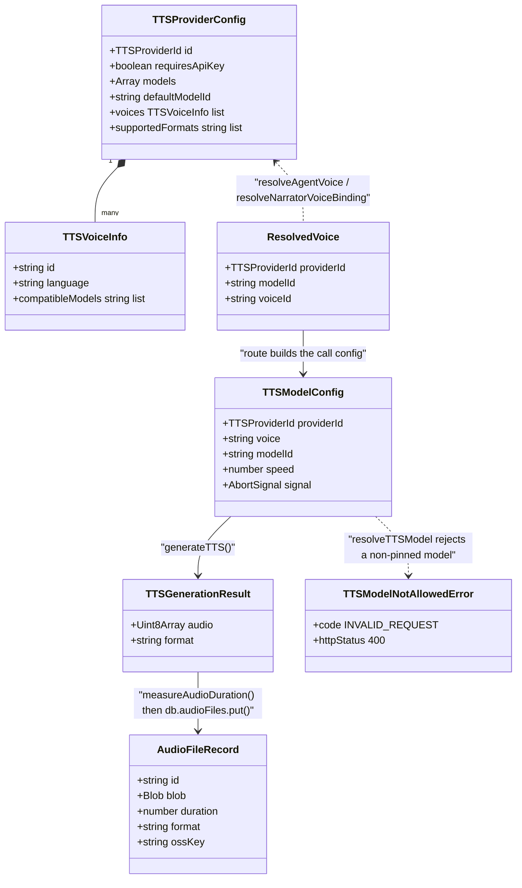
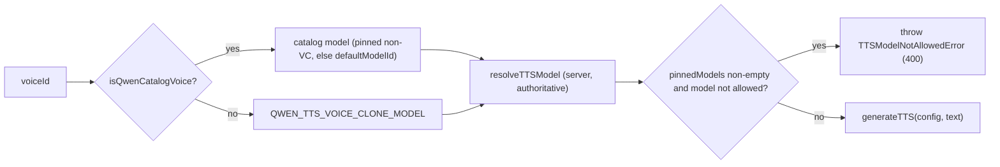

# Interfaces (a) — TTS and ASR

Every block below is copied from the file named above it. Doc comments are trimmed
where noted; identifiers, order and optionality are unmodified.

Companions: `02b-interfaces-media.md`, `02c-interfaces-whiteboard.md`,
`02d-interfaces-choreography-ir.md`, `02e-interfaces-passes-emitter.md`,
`02f-interfaces-export-app.md`, `02g-interfaces-render-service.md`.

## 1. Provider ids

`lib/audio/types.ts:94` and `:187`

```ts
export type BuiltInTTSProviderId =
  | 'openai-tts'
  | 'azure-tts'
  | 'glm-tts'
  | 'qwen-tts'
  | 'voxcpm-tts'
  | 'doubao-tts'
  | 'elevenlabs-tts'
  | 'minimax-tts'
  | 'lemonade-tts'
  | 'browser-native-tts';

export type TTSProviderId = BuiltInTTSProviderId | `custom-tts-${string}`;

export type BuiltInASRProviderId =
  | 'openai-whisper'
  | 'browser-native'
  | 'qwen-asr'
  | 'funasr-asr'
  | 'lemonade-asr'
  | 'azure-asr';

export type ASRProviderId = BuiltInASRProviderId | `custom-asr-${string}`;
```

`lib/audio/types.ts:216`, `:221`

```ts
export function isCustomTTSProvider(id: string): boolean; // id.startsWith('custom-tts-')
export function isCustomASRProvider(id: string): boolean; // id.startsWith('custom-asr-')
```

## 2. Registry shapes

`lib/audio/types.ts:99`, `:113`, `:192`

```ts
export interface TTSVoiceInfo {
  id: string;
  name: string;
  language: string;
  localeName?: string;
  gender?: 'male' | 'female' | 'neutral';
  description?: string;
  /** Model IDs this voice is compatible with. Undefined = all models. */
  compatibleModels?: string[];
}

export interface TTSProviderConfig {
  id: TTSProviderId;
  name: string;
  requiresApiKey: boolean;
  defaultBaseUrl?: string;
  icon?: string;
  excludeFromAgentVoiceCatalog?: boolean;
  requiresRegisteredVoice?: boolean;
  models: Array<{ id: string; name: string }>;
  defaultModelId: string;
  voices: TTSVoiceInfo[];
  supportedFormats: string[]; // ['mp3', 'wav', 'opus', etc.]
  speedRange?: {
    min: number;
    max: number;
    default: number;
  };
}

export interface ASRProviderConfig {
  id: ASRProviderId;
  name: string;
  requiresApiKey: boolean;
  defaultBaseUrl?: string;
  icon?: string;
  models: Array<{ id: string; name: string }>;
  defaultModelId: string;
  supportedLanguages: string[];
  supportedFormats: string[];
}
```

Registries and accessors, by anchor rather than repeated signature:
`TTS_PROVIDERS` (`lib/audio/constants.ts:119`), `ASR_PROVIDERS` (`:1078`),
`DEFAULT_TTS_VOICES` (`:1336`), `DEFAULT_TTS_MODELS` (`:1349`) — both default
tables are `Record<BuiltInTTSProviderId, string>`, so a missing provider is a
compile error. Accessors: `getAllTTSProviders` (`:1365`), `getTTSProvider`
(`:1388`), `getManuallySelectableTTSModels` (`:1404`), `getTTSVoices` (`:1415`),
`getAllASRProviders` (`:1425`), `getASRProvider` (`:1436`),
`getASRSupportedLanguages` (`:1449`) — each takes
`(providerId, customProviders?)`.

## 3. The call contract

`lib/audio/types.ts:151`, `:207`

```ts
export interface TTSModelConfig {
  providerId: TTSProviderId;
  modelId?: string;
  apiKey?: string;
  baseUrl?: string;
  voice: string;
  speed?: number;
  format?: string;
  providerOptions?: Record<string, unknown>;
  signal?: AbortSignal;
}

export interface ASRModelConfig {
  providerId: ASRProviderId;
  modelId?: string;
  apiKey?: string;
  baseUrl?: string;
  language?: string;
}
```

`lib/audio/tts-providers.ts:111`, `:193`, `:207`, `:960`;
`lib/audio/asr-providers.ts:164`

```ts
export interface TTSGenerationResult { audio: Uint8Array; format: string }

export function throwIfTtsRateLimited(provider: string, status: number): void;

export async function generateTTS(
  config: TTSModelConfig,
  text: string,
): Promise<TTSGenerationResult>;

/** Browser-only: reads the settings store. Throws outside a browser context. */
export async function getCurrentTTSConfig(): Promise<TTSModelConfig>;

export async function transcribeAudio(
  config: ASRModelConfig,
  audioBuffer: Buffer | Blob,
): Promise<ASRTranscriptionResult>;
```

## 4. Error classes

`lib/audio/tts-providers.ts:123`, `:134`, `:165`

```ts
export class TTSRateLimitError extends Error {
  constructor(public readonly provider: string, message: string);
}

export class QwenTTSError extends Error {
  readonly code = 'QWEN_TTS_ERROR';
  readonly httpStatus: number;
  constructor(message: string, httpStatus = 502);
}

export class TTSRequestTimeoutError extends Error {
  constructor(public readonly provider: string, message: string);
}
```

`lib/server/provider-config.ts:789`

```ts
export class TTSModelNotAllowedError extends Error {
  readonly code = 'INVALID_REQUEST';
  readonly httpStatus = 400;
  constructor(providerId: string, modelId: string);
}
```

`lib/audio/wav-validate.ts:12`

```ts
export class InvalidReferenceAudioError extends Error {
  readonly code = 'QWEN_VC_REFERENCE_AUDIO_INVALID';
}
```

## 5. Voice/model coupling

`lib/audio/constants.ts:82`, `:84`, `:86`, `:94`, `:99`, `:107`, `:1379`

```ts
export const DEFAULT_QWEN_TTS_VOICE_CLONE_MODEL = 'qwen3-tts-vc-2026-01-22';
export const QWEN_TTS_VOICE_CLONE_MODEL = DEFAULT_QWEN_TTS_VOICE_CLONE_MODEL;

export function isQwenVoiceCloneModel(modelId?: string, configuredModelId?: string): boolean;
export function isQwenCatalogVoice(voiceId?: string): boolean;
export function isQwenCloneVoice(voiceId?: string): boolean;
export function resolveTTSModelForVoice(
  providerId: TTSProviderId,
  voiceId: string,
  requestedModelId?: string,
): string | undefined;
export function isKnownTTSProviderId(id: string): id is TTSProviderId;
```

`lib/audio/voice-resolver.ts:23`, `:37`, `:42`, `:86` (`AgentVoiceOverride` at
`:30` is structurally identical to `ResolvedVoice`)

```ts
export interface ResolvedVoice {
  providerId: TTSProviderId;
  modelId?: string;
  voiceId: string;
}

export type AgentVoiceOverrides = Record<string, AgentVoiceOverride>;

export function resolveNarratorVoiceBinding(
  bound: AgentConfig['voiceConfig'] | undefined,
  globalVoice: ResolvedVoice,
  providerConfigs: ProviderConfigMap,
): ResolvedVoice;

export function resolveAgentVoice(
  agent: AgentConfig,
  agentIndex: number,
  enabledProviders: ProviderWithVoices[],
  overrides?: AgentVoiceOverrides,
): ResolvedVoice | null;
```

Server-side resolution — `lib/server/provider-config.ts`:

```ts
export function getServerTTSProviders(): Record<string, { disabled?: boolean }>; // :749
export function enabledServerTTSProviderIds(): string[];                         // :762
export function resolveTTSApiKey(providerId: string, clientKey?: string): string; // :768
export function isServerTTSProviderDisabled(providerId: string): boolean;         // :773
export function resolveTTSBaseUrl(providerId: string, clientBaseUrl?: string): string | undefined; // :777
export function resolveQwenVoiceCloneModel(): string;                            // :785
export function resolveTTSModel(providerId: string, clientModel?: string, voiceId?: string): string | undefined; // :805
```

## 6. Duration, chunking, reference-audio validation

`lib/audio/audio-duration.ts:55`, `:121`, `:210`

```ts
export function measureWavDuration(input: Uint8Array | ArrayBuffer): number | null;
export function measureMp3Duration(input: Uint8Array | ArrayBuffer): number | null;
export function measureAudioDuration(
  input: Uint8Array | ArrayBuffer,
  format?: string,
): number | null;
```

`lib/audio/tts-utils.ts:12`, `:21`, `:82`

```ts
export const TTS_MAX_TEXT_LENGTH: Partial<Record<TTSProviderId, number>>; // { 'glm-tts': 1024 }
export function splitLongSpeechText(text: string, maxLength: number): string[];
export function splitLongSpeechActions(actions: Action[], providerId: TTSProviderId): Action[];
```

`lib/audio/wav-validate.ts:1`, `:6`, `:26`

```ts
export const QWEN_REFERENCE_SAMPLE_RATE = 24_000;
export const QWEN_REFERENCE_CHANNELS = 1;
export const MIN_REFERENCE_DURATION_SECONDS = 1;
export const MAX_REFERENCE_DURATION_SECONDS = 60;

export interface ValidatedReferenceAudio {
  durationSeconds: number;
  sampleRate: number;
  channels: number;
}

export function validateReferenceAudio(audio: Uint8Array): ValidatedReferenceAudio;
```

## 7. How the audio types connect




