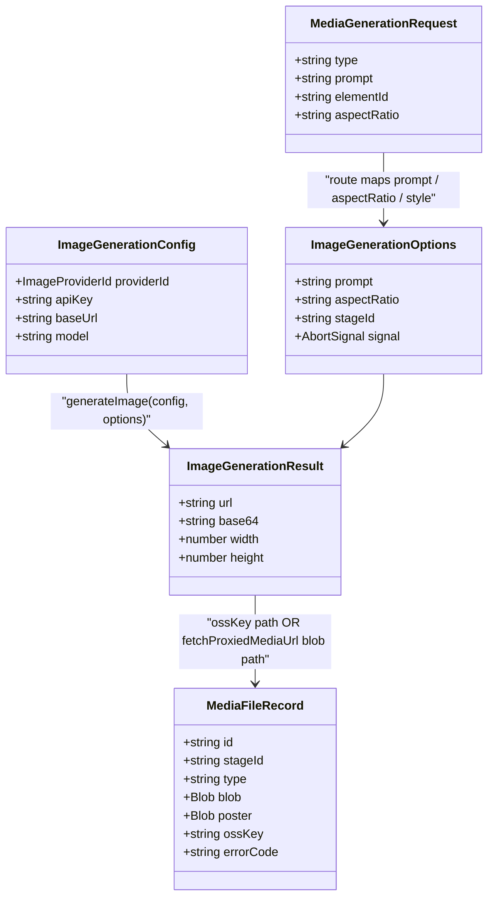
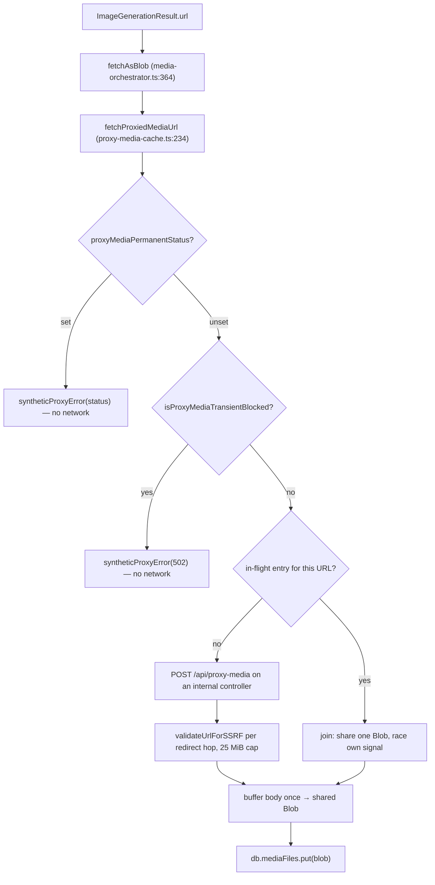

# Interfaces (b) — image/video generation, asset resolution, web search, SSRF

Continues `02a-interfaces-tts-asr.md`. Blocks are copied from the file named
above them, doc comments trimmed.

## 1. Image generation

[`lib/media/types.ts:73`](lib/media/types.ts#L73), [`:94`](lib/media/types.ts#L94), [`:101`](lib/media/types.ts#L101), [`:131`](lib/media/types.ts#L131), [`:148`](lib/media/types.ts#L148), [`:173`](lib/media/types.ts#L173)

```ts
export type ImageProviderId =
  | 'seedream'
  | 'openai-image'
  | 'qwen-image'
  | 'nano-banana'
  | 'minimax-image'
  | 'grok-image'
  | 'comfyui-image'
  | 'lemonade';

export interface ImageModelInfo {
  id: string;
  name: string;
}

export interface ImageProviderConfig {
  id: ImageProviderId;
  name: string;
  requiresApiKey: boolean;
  defaultBaseUrl?: string;
  icon?: string;
  models: ImageModelInfo[];
  supportedAspectRatios: Array<'16:9' | '4:3' | '1:1' | '9:16'>;
  supportedStyles?: string[];
  maxResolution?: { width: number; height: number };
}

export interface ImageGenerationConfig {
  providerId: ImageProviderId;
  apiKey: string;
  baseUrl?: string;
  model?: string;
}

export interface ImageGenerationOptions {
  prompt: string;
  negativePrompt?: string;
  width?: number;
  height?: number;
  aspectRatio?: '16:9' | '4:3' | '1:1' | '9:16';
  style?: string;
  stageId?: string;
  signal?: AbortSignal;
}

export interface ImageGenerationResult {
  url?: string;
  base64?: string;
  width: number;
  height: number;
}
```

`lib/media/image-providers.ts`

```ts
export const IMAGE_PROVIDERS: Record<ImageProviderId, ImageProviderConfig>;      // :33
export async function testImageConnectivity(config: ImageGenerationConfig): Promise<{ success: boolean; message: string }>; // :163
export async function generateImage(config: ImageGenerationConfig, options: ImageGenerationOptions): Promise<ImageGenerationResult>; // :191
export function aspectRatioToDimensions(ratio: string, maxWidth = 1024): { width: number; height: number }; // :217
export function applyMinPixelFloor(width: number, height: number, minPixels: number): { width: number; height: number }; // :231
```

## 2. Video generation

[`lib/media/types.ts:194`](lib/media/types.ts#L194), [`:212`](lib/media/types.ts#L212), [`:214`](lib/media/types.ts#L214), [`:243`](lib/media/types.ts#L243), [`:260`](lib/media/types.ts#L260), [`:281`](lib/media/types.ts#L281), [`:304`](lib/media/types.ts#L304)

```ts
export type VideoProviderId =
  | 'seedance'
  | 'kling'
  | 'veo'
  | 'minimax-video'
  | 'grok-video'
  | 'happyhorse';

export type VideoModelInfo = ImageModelInfo;

export interface VideoProviderConfig {
  id: VideoProviderId;
  name: string;
  requiresApiKey: boolean;
  defaultBaseUrl?: string;
  icon?: string;
  models: VideoModelInfo[];
  supportedAspectRatios: Array<'16:9' | '4:3' | '1:1' | '9:16' | '3:4' | '21:9'>;
  supportedDurations?: number[];
  supportedResolutions?: Array<'480p' | '720p' | '1080p'>;
  maxDuration?: number;
}

export interface VideoGenerationConfig {
  providerId: VideoProviderId;
  apiKey: string;
  baseUrl?: string;
  model?: string;
}

export interface VideoGenerationOptions {
  prompt: string;
  duration?: number;
  aspectRatio?: '16:9' | '4:3' | '1:1' | '9:16' | '3:4' | '21:9';
  resolution?: '480p' | '720p' | '1080p';
  stageId?: string;
  signal?: AbortSignal;
}

export interface VideoGenerationResult {
  url: string;
  duration: number;
  width: number;
  height: number;
  poster?: string;
}

export interface MediaGenerationRequest {
  type: 'image' | 'video';
  prompt: string;
  elementId: string;
  aspectRatio?: '16:9' | '4:3' | '1:1' | '9:16';
  style?: string;
}
```

`VIDEO_PROVIDERS` is at [`lib/media/video-providers.ts:22`](lib/media/video-providers.ts#L22); `generateVideo` and
`testVideoConnectivity` mirror the image dispatch switch in the same file.

## 3. ComfyUI workflow discovery

[`lib/media/comfyui-workflows.ts:25`](lib/media/comfyui-workflows.ts#L25), [`:31`](lib/media/comfyui-workflows.ts#L31), [`:49`](lib/media/comfyui-workflows.ts#L49), [`:72`](lib/media/comfyui-workflows.ts#L72), [`:101`](lib/media/comfyui-workflows.ts#L101)

```ts
export interface ComfyuiWorkflowEntry {
  id: string;
  name: string;
}

export function filenameToDisplayName(filename: string): string;
export function isComfyuiWorkflowFilename(filename: string): boolean;
export async function listComfyuiWorkflows(): Promise<ComfyuiWorkflowEntry[]>;
export async function listComfyuiWorkflowFilenames(): Promise<string[]>;
```

## 4. Orchestration and the polled-task contract

[`lib/media/media-orchestrator.ts:41`](lib/media/media-orchestrator.ts#L41), [`:79`](lib/media/media-orchestrator.ts#L79), [`:116`](lib/media/media-orchestrator.ts#L116)

```ts
export async function generateMediaForOutlines(
  outlines: SceneOutline[],
  stageId: string,
  abortSignal?: AbortSignal,
): Promise<void>;

export async function retryMediaTask(
  elementId: string,
  _target?: { readonly elementId: string; readonly sceneId?: string; readonly slideId?: string },
): Promise<void>;

export function mediaRetryTarget(
  elementId: string,
  sceneId: string | undefined,
  sceneData: unknown,
): { elementId: string; sceneId?: string; slideId?: string };
```

[`lib/media/polled-task.ts:1`](lib/media/polled-task.ts#L1), [`:9`](lib/media/polled-task.ts#L9), [`:18`](lib/media/polled-task.ts#L18), [`:31`](lib/media/polled-task.ts#L31)

```ts
export type TerminalResult<T> =
  | { status: 'done'; result: T }
  | { status: 'failed'; message: string };

export type SubmitResult<T> = { status: 'submitted'; taskId: string } | TerminalResult<T>;

export type PollResult<T> = { status: 'pending'; detail?: string } | TerminalResult<T>;

// PolledTaskTimeoutContext (:9): { label, taskId, attempts, intervalMs, elapsedMs, lastPendingDetail? }

export interface RunPolledTaskOptions<T> {
  submit: () => Promise<SubmitResult<T>>;
  poll: (taskId: string) => Promise<PollResult<T>>;
  intervalMs: number;
  maxAttempts: number;
  label: string;
  formatTimeout?: (context: PolledTaskTimeoutContext) => string;
}

export async function runPolledTask<T>(options: RunPolledTaskOptions<T>): Promise<T>;
```

## 5. Outbound media fetch and byte resolution

`lib/media/proxy-media-cache.ts`

```ts
export const MAX_TRANSIENT_ATTEMPTS = 3;                                   // :110
export function resetProxyMediaFailureCache(): void;                        // :124
export function proxyMediaPermanentStatus(url: string): number | undefined; // :130
export function isProxyMediaTransientBlocked(url: string, now = Date.now()): boolean; // :139
export function recordProxyMediaFailure(url: string, status: number, now = Date.now()): void; // :154
export function proxyMediaRetainedBodyCount(): number;                      // :178
export async function fetchProxiedMediaUrl(url: string, init?: RequestInit): Promise<Response>; // :234
```

[`lib/media/resolve-audio-bytes.ts:15`](lib/media/resolve-audio-bytes.ts#L15), [`:27`](lib/media/resolve-audio-bytes.ts#L27)

```ts
export async function resolveAudioBlob(audioId: string): Promise<Blob | null>;
export async function resolveAudioBlobs(
  audioIds: readonly string[],
): Promise<ReadonlyArray<Blob | null>>;
```

## 6. Web search

[`lib/web-search/types.ts:8`](lib/web-search/types.ts#L8), [`:22`](lib/web-search/types.ts#L22), [`:31`](lib/web-search/types.ts#L31); [`lib/web-search/index.ts:15`](lib/web-search/index.ts#L15)

```ts
export type WebSearchProviderId =
  | 'tavily'
  | 'exa'
  | 'bocha'
  | 'brave'
  | 'baidu'
  | 'claude'
  | 'minimax'
  | 'doubao'
  | 'searxng';

export interface BaiduSubSources {
  webSearch: boolean;
  baike: boolean;
  scholar: boolean;
}

export interface WebSearchProviderConfig {
  id: WebSearchProviderId;
  name: string;
  requiresApiKey: boolean;
  /** Self-hosted instances need an explicit base URL (no public default). */
  requiresBaseUrl?: boolean;
  defaultBaseUrl?: string;
  endpointPath: string;
  icon?: string;
}

export async function searchWeb(params: {
  providerId: WebSearchProviderId;
  query: string;
  apiKey?: string;
  maxResults?: number;
  baseUrl?: string;
  baiduSubSources?: BaiduSubSources;
  claudeModelId?: string;
  signal?: AbortSignal;
}): Promise<WebSearchResult>;
```

`WEB_SEARCH_PROVIDERS` is at [`lib/web-search/constants.ts:10`](lib/web-search/constants.ts#L10);
`formatSearchResultsAsContext` is re-exported from `lib/web-search/format.ts`
through [`index.ts:13`](lib/web-search/index.ts#L13).

## 7. SSRF guard (shared by every outbound route)

[`lib/server/ssrf-guard.ts:14`](lib/server/ssrf-guard.ts#L14), [`:33`](lib/server/ssrf-guard.ts#L33), [`:55`](lib/server/ssrf-guard.ts#L55), [`:178`](lib/server/ssrf-guard.ts#L178), [`:253`](lib/server/ssrf-guard.ts#L253)

```ts
export class UnsafeNetworkTargetError extends Error {}

export function assertSafeIp(value: string): void;
export function normalizeUrlForStrictFetch(value: string): URL;
export function isPrivateIP(ip: string): boolean;
export async function validateUrlForSSRF(url: string): Promise<string | null>;
```

`normalizeUrlForStrictFetch` is the stricter, DNS-free variant used for material
fetches: it additionally rejects userinfo in the URL and any port other than 80 or
443 (`:66`, `:69`). `validateUrlForSSRF` returns `null` for safe and a message
string for blocked — it never throws.

## 8. Relationships




