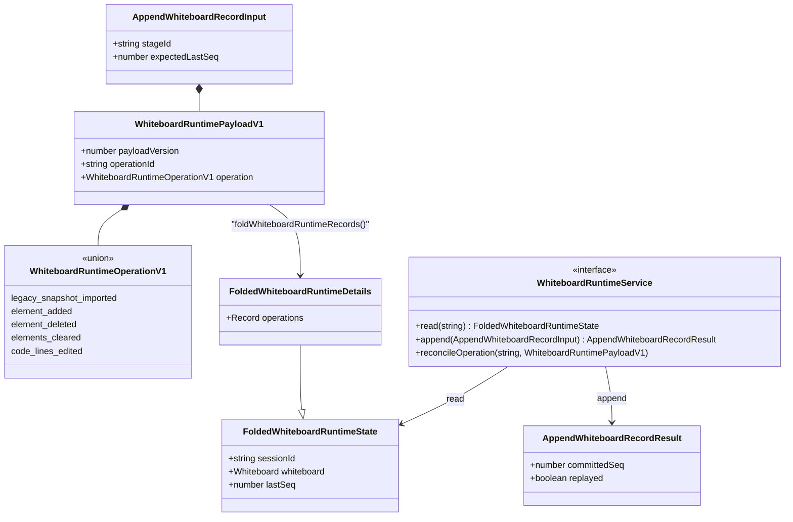
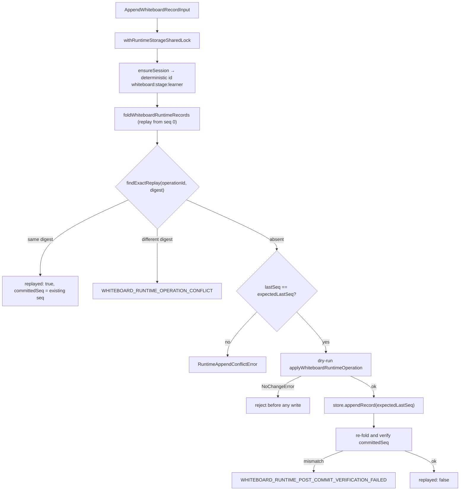

# Interfaces (c) — whiteboard operation log

Continues `02b-interfaces-media.md`. Blocks are copied from the file named above
them, doc comments trimmed.

## 1. Constants and identity

`lib/whiteboard/runtime/types.ts:3-8`

```ts
export const WHITEBOARD_RUNTIME_KIND = 'whiteboard';
export const WHITEBOARD_RUNTIME_PAYLOAD_VERSION = 1;
export const LEGACY_WHITEBOARD_SOURCE_KIND = 'stage.whiteboard';
export const LEGACY_WHITEBOARD_SOURCE_VERSION = 'maic.stage-whiteboard.v1';

export type Sha256Digest = `sha256:${string}`;
```

## 2. The five operations

`lib/whiteboard/runtime/types.ts:10`, `:19`, `:24`, `:29`, `:33`, `:49`, `:55`

```ts
export interface LegacySnapshotImportedOperation {
  kind: 'legacy_snapshot_imported';
  source: {
    kind: typeof LEGACY_WHITEBOARD_SOURCE_KIND;
    fingerprint: Sha256Digest;
  };
  whiteboard: Whiteboard;
}

export interface WhiteboardElementAddedOperation {
  kind: 'element_added';
  element: PPTElement;
}

export interface WhiteboardElementDeletedOperation {
  kind: 'element_deleted';
  elementId: string;
}

export interface WhiteboardElementsClearedOperation {
  kind: 'elements_cleared';
}

export type WhiteboardCodeLinesEdit =
  | {
      kind: 'insert_after' | 'insert_before';
      lineId: string;
      lines: CodeLine[];
    }
  | {
      kind: 'delete_lines';
      lineIds: string[];
    }
  | {
      kind: 'replace_lines';
      lineIds: string[];
      lines: CodeLine[];
    };

export interface WhiteboardCodeLinesEditedOperation {
  kind: 'code_lines_edited';
  elementId: string;
  edit: WhiteboardCodeLinesEdit;
}

export type WhiteboardRuntimeOperationV1 =
  | LegacySnapshotImportedOperation
  | WhiteboardElementAddedOperation
  | WhiteboardElementDeletedOperation
  | WhiteboardElementsClearedOperation
  | WhiteboardCodeLinesEditedOperation;
```

There is no freehand/stroke primitive: every drawable is a `PPTElement` from
`@openmaic/dsl`, the same element model the slide canvas uses — which is why
`components/whiteboard/whiteboard-canvas.tsx:15` can render board elements with
the slide renderer's `ScreenElement`.

## 3. Record envelope and folded state

`lib/whiteboard/runtime/types.ts:62`, `:68`, `:74`, `:86`, `:92`, `:164`

```ts
export interface WhiteboardRuntimePayloadV1 {
  payloadVersion: typeof WHITEBOARD_RUNTIME_PAYLOAD_VERSION;
  operationId: string;
  operation: WhiteboardRuntimeOperationV1;
}

export interface FoldedWhiteboardRuntimeState {
  sessionId: string | null;
  whiteboard: Whiteboard | null;
  lastSeq: number | null;
}

export interface FoldedWhiteboardRuntimeDetails extends FoldedWhiteboardRuntimeState {
  operations: Readonly<
    Record<
      string,
      Readonly<{
        digest: Sha256Digest;
        seq: number;
      }>
    >
  >;
}

export interface AppendWhiteboardRecordInput {
  stageId: string;
  expectedLastSeq: number | null;
  payload: WhiteboardRuntimePayloadV1;
}

export interface AppendWhiteboardRecordResult {
  committedSeq: number;
  state: FoldedWhiteboardRuntimeState;
  replayed: boolean;
}

export type WhiteboardRuntimeRecord = RuntimeRecord<WhiteboardRuntimePayloadV1>;
```

## 4. Error classes with stable codes

`lib/whiteboard/runtime/types.ts:98`, `:107`, `:122`, `:136`, `:150`, `:152`;
`lib/whiteboard/runtime/store.ts:26`, `:31`

```ts
export class WhiteboardRuntimeElementNotFoundError extends Error {
  override readonly name = 'WhiteboardRuntimeElementNotFoundError';
  readonly code = 'WHITEBOARD_RUNTIME_ELEMENT_NOT_FOUND';
  constructor(readonly elementId: string);
}

export class WhiteboardRuntimeElementTypeMismatchError extends Error {
  readonly code = 'WHITEBOARD_RUNTIME_ELEMENT_TYPE_MISMATCH';
  readonly expectedType = 'code';
  constructor(readonly elementId: string, readonly actualType: PPTElement['type']);
}

export class WhiteboardRuntimeCodeLineNotFoundError extends Error {
  readonly code = 'WHITEBOARD_RUNTIME_CODE_LINE_NOT_FOUND';
  constructor(readonly elementId: string, readonly lineId: string);
}

export class WhiteboardRuntimeCodeLineIdConflictError extends Error {
  readonly code = 'WHITEBOARD_RUNTIME_CODE_LINE_ID_CONFLICT';
  constructor(readonly elementId: string, readonly lineId: string);
}

export type WhiteboardRuntimeNoChangeReason = 'whiteboard_missing' | 'whiteboard_empty';

export class WhiteboardRuntimeNoChangeError extends Error {
  readonly code = 'WHITEBOARD_RUNTIME_NO_CHANGE';
  constructor(
    readonly reason: WhiteboardRuntimeNoChangeReason,
    readonly state?: FoldedWhiteboardRuntimeState,
  );
}

export class WhiteboardRuntimeSessionAmbiguousError extends Error {
  readonly code = 'WHITEBOARD_RUNTIME_SESSION_AMBIGUOUS';
}

export class WhiteboardRuntimeSessionInvariantError extends Error {
  readonly code = 'WHITEBOARD_RUNTIME_SESSION_INVARIANT';
}
```

Four further failures are raised as plain `Error`s with string codes rather than
classes, all from `runtime/fold.ts` / `runtime/store.ts`:
`WHITEBOARD_RUNTIME_IMPORT_AFTER_STATE`,
`WHITEBOARD_RUNTIME_OPERATION_CONFLICT`,
`WHITEBOARD_RUNTIME_RECORD_SEQUENCE_INVALID`,
`WHITEBOARD_RUNTIME_POST_COMMIT_VERIFICATION_FAILED` (plus
`…_RECORD_ENVELOPE_INVALID`, `…_RECORD_ANCHOR_INVALID`,
`…_RECORD_SESSION_MISMATCH`, `…_RECORD_OPERATION_ID_MISMATCH`,
`…_ELEMENT_ALREADY_EXISTS`, `…_CODE_ELEMENT_NOT_CANONICAL`,
`…_STAGE_ID_INVALID`, `…_LEARNER_KEY_INVALID`,
`…_EXPECTED_LAST_SEQ_INVALID`).

## 5. Fold and service

`lib/whiteboard/runtime/fold.ts:51`, `:170`, `:218`, `:228`

```ts
export async function applyWhiteboardRuntimeOperation(
  sessionId: string,
  current: Whiteboard | null,
  operation: WhiteboardRuntimeOperationV1,
): Promise<Whiteboard>;

export async function foldWhiteboardRuntimeRecords(
  sessionId: string,
  records: readonly RuntimeRecord[],
): Promise<FoldedWhiteboardRuntimeDetails>;

export function publicWhiteboardRuntimeState(
  details: FoldedWhiteboardRuntimeDetails,
): FoldedWhiteboardRuntimeState;

export const EMPTY_WHITEBOARD_RUNTIME_STATE: FoldedWhiteboardRuntimeState;
```

`lib/whiteboard/runtime/store.ts:36`, `:43`, `:57`, `:170`, `:314`

```ts
export interface WhiteboardRuntimeServiceDeps {
  store: RuntimeStore;
  resolveLearnerKey: () => string | Promise<string>;
  now?: () => string;
  withMaintenanceLock?: <T>(work: () => Promise<T>) => Promise<T>;
}

export interface WhiteboardRuntimeService {
  read(stageId: string): Promise<FoldedWhiteboardRuntimeState>;
  append(input: AppendWhiteboardRecordInput): Promise<AppendWhiteboardRecordResult>;
  /** Internal read-only recovery seam; never appends or retries a mutation. */
  reconcileOperation(
    stageId: string,
    payload: WhiteboardRuntimePayloadV1,
  ): Promise<
    | { status: 'exact'; committedSeq: number; state: FoldedWhiteboardRuntimeState }
    | { status: 'other'; state: FoldedWhiteboardRuntimeState }
    | { status: 'empty'; state: FoldedWhiteboardRuntimeState }
  >;
}

export function whiteboardRuntimeSessionId(stageId: string, learnerKey: string): string;
export function createWhiteboardRuntimeService(
  deps: WhiteboardRuntimeServiceDeps,
): WhiteboardRuntimeService;
export function getWhiteboardRuntimeService(): WhiteboardRuntimeService;
```

## 6. Projection and viewport

`lib/whiteboard/runtime/browser-projection.ts:8`; `lib/whiteboard/viewport.ts:12`, `:22`

```ts
export async function refreshWhiteboardRuntimeProjection(
  stageId: string,
  minimumLastSeq?: number,
): Promise<boolean>;

export const MIN_WHITEBOARD_VIEWPORT_RATIO = 0.4;
export const MAX_WHITEBOARD_VIEWPORT_RATIO = 1;
export function normalizeWhiteboardViewportRatio(ratio: number): number;
```

`viewportRatio` is **height/width**: canonical landscape 16:9 (1000 × 562.5) is
`9/16 = 0.5625`, never `16/9`. A persisted value > 1 is an inverted ratio written
by the old stage API and is reciprocated on read (`viewport.ts:1-9`).

## 7. Relationships




