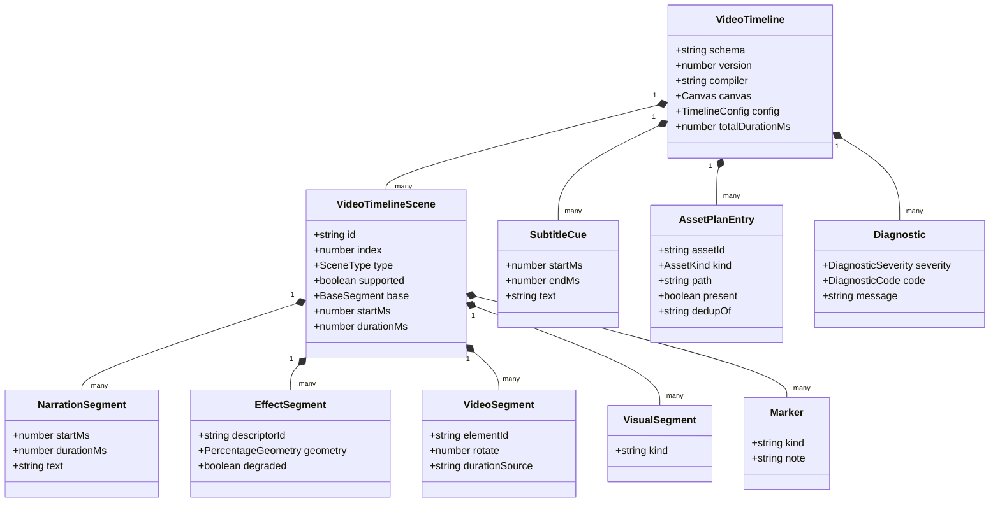
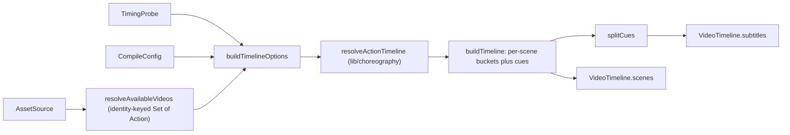

# Interfaces (d) — choreography spec, compiler DI boundary, `VideoTimeline` IR

Continues `02c-interfaces-whiteboard.md`. Blocks are copied from the file named
above them, doc comments trimmed.

## 1. Timing spec (imported by both the app runtime and the exporter)

`lib/choreography/timing.ts:18`, `:21`, `:31`, `:34`, `:43`, `:46`, `:49`, `:52`,
`:55`, `:58`, `:64`, `:72`, `:97`, `:113`

```ts
export const EFFECT_AUTO_CLEAR_MS = 5000;
export const DISCUSSION_TRIGGER_DELAY_MS = 3000;
export const DISCUSSION_AUTO_SKIP_MS = 5000;
export const MAX_VIDEO_WAIT_MS = 5 * 60 * 1000;
export const WB_OPEN_MS = 2000;
export const WB_DRAW_MS = 800;
export const WB_EDIT_MS = 600;
export const WB_DELETE_MS = 300;
export const WB_CLOSE_MS = 700;
export const WIDGET_MS = 300;

export function wbDrawCodeMs(lineCount: number): number;   // min(800 + 50n, 3000)
export function wbClearMs(elementCount: number): number;   // min(380 + 55n, 1400)

export interface SpeechEstimateOptions {
  /** Playback speed multiplier; the estimate is divided by it. Default 1. */
  speed?: number;
}

export function estimateSpeechDurationMs(text: string, opts?: SpeechEstimateOptions): number;
```

The no-audio estimate's private constants (`timing.ts:83-95`): a CJK regex over
CJK Unified Ideographs + Ext-A + Hiragana + Katakana + Hangul Syllables;
`CJK_RATIO_THRESHOLD = 0.3`; `MIN_READING_MS = 2000`; `CJK_MS_PER_CHAR = 150`;
`NON_CJK_MS_PER_WORD = 240` (≈250 WPM).

## 2. Index-domain → time-domain expansion

`lib/choreography/timeline.ts:61`, `:71`, `:128`, `:282`

```ts
export const IMPLICIT_WB_OPEN: Action = {
  id: '__implicit_wb_open__',
  type: 'wb_open',
} as Action;

export interface ResolveTimelineOptions {
  playbackSpeed?: number;
  getAudioDurationMs?: (action: SpeechAction) => number | null | undefined;
  getVideoDurationMs?: (action: PlayVideoAction) => number | null | undefined;
  onUnresolvedVideoDuration?: 'throw' | 'cap' | 'zero';
  getClearElementCount?: (action: WbClearAction) => number;
  isDiscussionSkipped?: (action: DiscussionAction) => boolean;
  isEditCodeNoop?: (action: WbEditCodeAction) => boolean;
  whiteboardOpen?: boolean;
}

export interface TimelineSegment {
  action: Action;
  sceneId: string;
  sceneIndex: number;
  actionIndex: number;
  /** Wall-clock start (ms) relative to the start of playback. */
  startMs: number;
  /** How long the action is visually present (ms). */
  durationMs: number;
  /** How much the playback cursor advances (ms) before the next action starts. */
  advancesCursorMs: number;
  blocking: boolean;
}

export function resolveActionTimeline(
  scenes: SceneCore[],
  opts: ResolveTimelineOptions = {},
): TimelineSegment[];
```

`lib/choreography/index.ts:22-25` re-exports `./timing`, `./cursor`, `./timeline`,
`./descriptors/index` — `EMPTY_SCENE_DWELL` / `resolvePlaybackCursor` from
`./cursor`, `DESCRIPTORS` / `getDescriptor` from the descriptors package.

## 3. Compiler DI boundary

`lib/video-export/deps.ts:38`, `:50`, `:61`, `:83`, `:101`, `:109`, `:122`,
`:142`, `:151`, `:165`, `:170`

`CompilerSceneContent` (`:38`) is the deliberately-loose structural slice the pure
compiler reads: `{ type?: string; canvas?: { elements?: PPTElement[] };
questions?: readonly unknown[]; projectV2?: unknown; projectConfig?: unknown;
html?: string }`.

```ts
export type CompilerScene = SceneCore & {
  type: SceneType;
  content?: CompilerSceneContent;
};

export interface TimingProbe {
  audioDurationMs(action: SpeechAction): number | null;
  videoDurationMs(action: PlayVideoAction): number | null;
  clearElementCount?(action: WbClearAction): number;
  isDiscussionSkipped?(action: DiscussionAction): boolean;
  isEditCodeNoop?(action: WbEditCodeAction): boolean;
}

export interface AssetMeta {
  id: string;
  mimeType?: string;
  format?: string;
  durationMs?: number;
  present: boolean;
}

export interface AssetSource {
  audio(action: SpeechAction): AssetMeta | null;
  media(elementId: string, scene: SceneCore): AssetMeta | null;
}

export interface InteractiveHtmlMeta {
  id: string;
  present: boolean;
  contentHash?: string;
  failure?: InteractiveHtmlFailure;
  message?: string;
}

export interface InteractiveHtmlSource {
  html(scene: SceneCore): InteractiveHtmlMeta | null;
}

export interface GeometryProbe {
  contentGeometry(elementId: string, scene: SceneCore): PercentageGeometry | null;
}

export interface QuizLayoutMeasurement {
  contentHeightPx: number;
  viewportHeightPx: number;
  frameHeightPx: number;
}

export interface QuizLayoutProbe {
  measureQuestionList(scene: SceneCore): QuizLayoutMeasurement | null;
}

export interface CompileConfig {
  playbackSpeed?: number;
  whiteboardInitiallyOpen?: boolean;
  onUnresolvedVideoDuration?: 'throw' | 'cap' | 'zero';
}
```

`lib/video-export/interactive-static.ts:4`, `:7`, `:10`, `:13`

```ts
export const INTERACTIVE_READY_TIMEOUT_MS = 8_000;
export const INTERACTIVE_SETTLE_MS = 250;
export const INTERACTIVE_STATIC_MESSAGE_FLAG = '__openmaicInteractiveStatic';

export type InteractiveHtmlFailure =
  | 'missing-html'
  | 'packaging-failed'
  | 'unresolved-resource'
  | 'too-large';
```

`lib/video-export/compile.ts:48`, `:54`, `:152`

```ts
export interface CompileInput {
  stage: { id: string; name: string };
  scenes: readonly CompilerScene[];
}

export interface CompileDeps {
  timing: TimingProbe;
  assets: AssetSource;
  geometry?: GeometryProbe;
  interactive?: import('./deps').InteractiveHtmlSource;
  quizLayout?: QuizLayoutProbe;
  config?: CompileConfig;
}

export function compileVideoTimeline(input: CompileInput, deps: CompileDeps): VideoTimeline;
```

## 4. IR envelope, enums and key schemas

`lib/video-export/ir.ts:32`, `:35`, `:38`, `:417`, `:424`

```ts
export const VIDEO_TIMELINE_SCHEMA = 'openmaic.videoTimeline';
export const VIDEO_TIMELINE_VERSION = 4;
export const VIDEO_TIMELINE_COMPILER = 'openmaic-video-timeline';

export const CANVAS: Canvas = {
  viewBox: { width: 100, height: 100 },
  pixelBase: { width: 1000, height: 562.5 },
  aspectRatio: '16:9',
};

export class VideoTimelineCompileError extends Error {}
```

`lib/video-export/ir.ts:59`, `:80`, `:110`, `:281`, `:333`

```ts
export const DiagnosticSeveritySchema = z.enum(['info', 'warn', 'error']);

export const DiagnosticCodeSchema = z.enum([
  'estimated-duration',
  'missing-audio',
  'unresolved-element',
  'skipped-media',
  'unsupported-scene',
  'cover-card',
  'quiz-layout-unavailable',
  'unknown-action',
  'invalid-action',
  'interactive-static-html',
  'missing-interactive-html',
  'interactive-html-packaging',
  'unresolved-interactive-resource',
]);

export const DurationSourceSchema = z.enum(['stored', 'estimated']);

// VideoSegment.durationSource
z.enum(['stored', 'capped', 'zero', 'skipped']);

export const AssetKindSchema = z.enum(['audio', 'image', 'video', 'poster', 'frame', 'html']);
```

`lib/video-export/ir.ts:113`, `:341`, `:365`

```ts
export const BaseSegmentSchema = z.discriminatedUnion('kind', [
  z.object({ kind: z.literal('slide-snapshot'), assetRef: z.string().optional() }),
  z.object({ kind: z.literal('visual-segments') }),
  z.object({ kind: z.literal('placeholder'), reason: z.string().optional() }),
  z.object({
    kind: z.literal('interactive-html'),
    assetId: z.string(),
    assetRef: z.string().optional(),
    contentHash: z.string(),
    readyTimeoutMs: z.number().int().positive(),
    settleMs: z.number().int().nonnegative(),
  }),
]);

export const AssetPlanEntrySchema = z.object({
  assetId: z.string(),
  kind: AssetKindSchema,
  /** Path within the export zip, e.g. `audio/001-intro/speech-001.mp3`. */
  path: z.string(),
  present: z.boolean(),
  dedupOf: z.string().optional(),
});
```

`TimelineConfigSchema` (`:365`) records the determinism inputs:
`{ playbackSpeed: number; ttsEnabled: boolean; whiteboardInitiallyOpen: boolean }`.

All 20 inferred type aliases (the schema is the single source) sit together at
`ir.ts:391-414` — `PercentageGeometry` through `VideoTimeline`.

## 5. Composition




