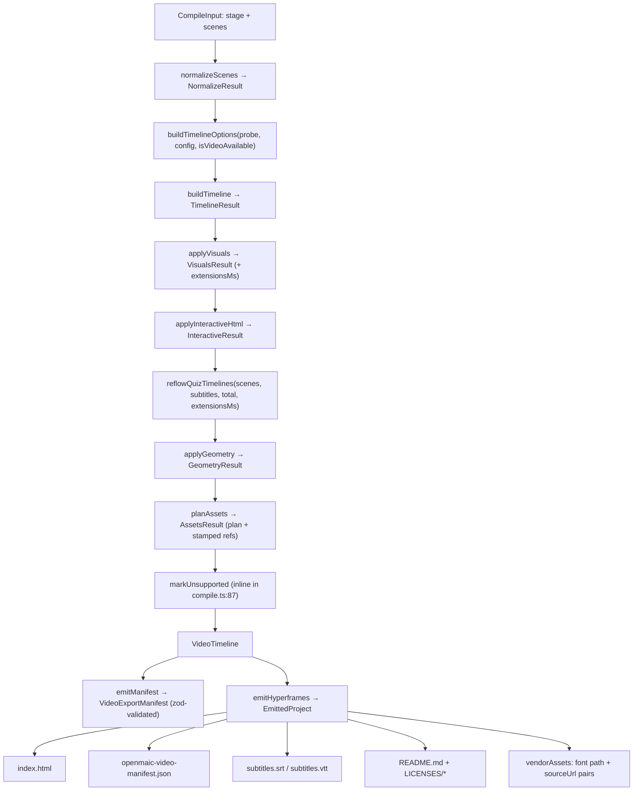
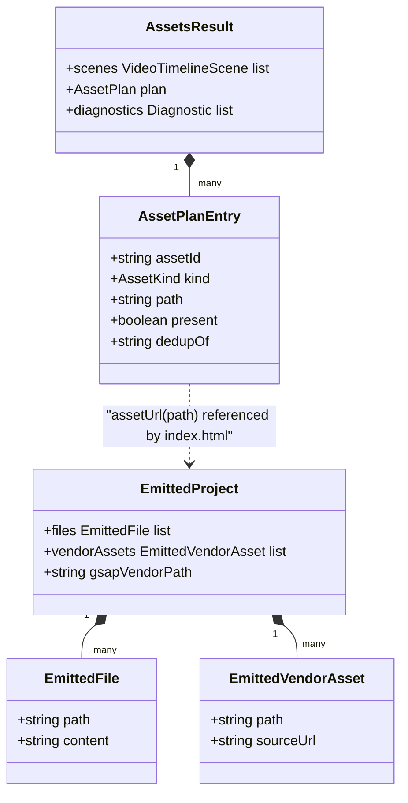

# Interfaces (e) — compiler passes, subtitles, Hyperframes emitter

Continues `02d-interfaces-choreography-ir.md`. Blocks are copied from the file
named above them, doc comments trimmed.

## 1. Pass exports

[`lib/video-export/index.ts:28-46`](lib/video-export/index.ts#L28-L46)

```ts
export { normalizeScenes, type NormalizeResult } from './passes/normalize';
export { buildTimelineOptions } from './passes/probe';
export { buildTimeline, type TimelineResult } from './passes/timeline';
export { applyVisuals, prepareQuizQuestionList, type VisualsResult } from './passes/visuals';
export { applyInteractiveHtml, type InteractiveResult } from './passes/interactive';
export { reflowQuizTimelines, type ReflowResult } from './passes/reflow';
export {
  applyGeometry,
  resolveEffectGeometry,
  resolveVideoPlacement,
  type GeometryResult,
} from './passes/geometry';
export { planAssets, sanitizeFilenamePart, type AssetsResult } from './passes/assets';
export {
  emitManifest,
  emitManifestJson,
  VideoExportManifestSchema,
  type VideoExportManifest,
} from './passes/emit';
```

## 2. Pass signatures

[`lib/video-export/passes/normalize.ts:17`](lib/video-export/passes/normalize.ts#L17), [`:93`](lib/video-export/passes/normalize.ts#L93)

```ts
export interface NormalizeResult {
  /** Scenes in deterministic order, each with only interpretable actions. */
  scenes: CompilerScene[];
  diagnostics: Diagnostic[];
}

export function normalizeScenes(scenes: readonly CompilerScene[]): NormalizeResult;
```

[`lib/video-export/passes/probe.ts:31`](lib/video-export/passes/probe.ts#L31)

```ts
export function buildTimelineOptions(
  probe: TimingProbe,
  config: CompileConfig = {},
  isVideoAvailable?: (action: PlayVideoAction) => boolean,
): ResolveTimelineOptions;
```

[`lib/video-export/passes/timeline.ts:45`](lib/video-export/passes/timeline.ts#L45), [`:89`](lib/video-export/passes/timeline.ts#L89)

```ts
export interface TimelineResult {
  scenes: VideoTimelineScene[];
  subtitles: SubtitleCue[];
  totalDurationMs: number;
  /** Whether any narration had stored TTS audio (vs. all durations estimated). */
  ttsEnabled: boolean;
  diagnostics: Diagnostic[];
}

export function buildTimeline(
  scenes: readonly CompilerScene[],
  opts: ResolveTimelineOptions,
): TimelineResult;
```

[`lib/video-export/passes/visuals.ts:26`](lib/video-export/passes/visuals.ts#L26), [`:65`](lib/video-export/passes/visuals.ts#L65)

```ts
export interface VisualsResult {
  scenes: VideoTimelineScene[];
  diagnostics: Diagnostic[];
  /** Per-scene duration inserted after the original authored scene timeline. */
  extensionsMs: number[];
}

export function prepareQuizQuestionList(scene: CompilerScene): QuizQuestionListQuestion[];
```

Quiz question-list timing constants ([`passes/visuals.ts:90-95`](lib/video-export/passes/visuals.ts#L90-L95)):
`QUIZ_TRANSITION_MS = 600`, `QUIZ_TOP_HOLD_MS = 1200`,
`QUIZ_BOTTOM_HOLD_MS = 1200`, `QUIZ_SCROLL_PX_PER_SECOND_720P = 96`,
`QUIZ_MIN_SCROLL_MS = 4000`, `QUIZ_MAX_SCROLL_MS = 24_000`.

[`lib/video-export/passes/interactive.ts:6`](lib/video-export/passes/interactive.ts#L6), [`:24`](lib/video-export/passes/interactive.ts#L24); [`passes/reflow.ts:8`](lib/video-export/passes/reflow.ts#L8), [`:31`](lib/video-export/passes/reflow.ts#L31)

```ts
export interface InteractiveResult { scenes: VideoTimelineScene[]; diagnostics: Diagnostic[] }
export function applyInteractiveHtml(
  timelineScenes: readonly VideoTimelineScene[],
  sourceScenes: readonly CompilerScene[],
  source?: InteractiveHtmlSource,
): InteractiveResult;

export interface ReflowResult {
  scenes: VideoTimelineScene[];
  subtitles: SubtitleCue[];
  totalDurationMs: number;
}
export function reflowQuizTimelines(
  scenes: readonly VideoTimelineScene[],
  subtitles: readonly SubtitleCue[],
  totalDurationMs: number,
  extensionsMs: readonly number[],
): ReflowResult;
```

[`lib/video-export/passes/geometry.ts:20`](lib/video-export/passes/geometry.ts#L20), [`:32`](lib/video-export/passes/geometry.ts#L32), [`:59`](lib/video-export/passes/geometry.ts#L59), [`:84`](lib/video-export/passes/geometry.ts#L84)

```ts
export interface GeometryResult { scenes: VideoTimelineScene[]; diagnostics: Diagnostic[] }

export function resolveEffectGeometry(
  effect: EffectSegment,
  elements: readonly PPTElement[] | undefined,
  measured?: ReturnType<GeometryProbe['contentGeometry']>,
): { effect: EffectSegment; unresolved: boolean };

export function resolveVideoPlacement(
  video: VideoSegment,
  elements: readonly PPTElement[] | undefined,
  measured?: ReturnType<GeometryProbe['contentGeometry']>,
): { video: VideoSegment; unresolved: boolean };

export function applyGeometry(
  timelineScenes: readonly VideoTimelineScene[],
  sourceScenes: readonly CompilerScene[],
  geometryProbe?: GeometryProbe,
): GeometryResult;
```

[`lib/video-export/passes/assets.ts:28`](lib/video-export/passes/assets.ts#L28), [`:35`](lib/video-export/passes/assets.ts#L35), [`:48`](lib/video-export/passes/assets.ts#L48), [`:112`](lib/video-export/passes/assets.ts#L112)

```ts
export interface AssetsResult {
  scenes: VideoTimelineScene[];
  plan: AssetPlan;
  diagnostics: Diagnostic[];
}

export function sanitizeFilenamePart(value: string): string;
export function canonicalAssetExtension(kind: ArchiveMediaKind, meta: AssetMeta): string;

export function planAssets(
  sourceScenes: readonly CompilerScene[],
  timelineScenes: readonly VideoTimelineScene[],
  assetSource: AssetSource,
): AssetsResult;
```

[`lib/video-export/passes/emit.ts:18`](lib/video-export/passes/emit.ts#L18), [`:28`](lib/video-export/passes/emit.ts#L28), [`:36`](lib/video-export/passes/emit.ts#L36)

```ts
export const VideoExportManifestSchema = VideoTimelineSchema.extend({
  runtimeDiagnostics: RuntimeDiagnosticSchema.array(),
});
export type VideoExportManifest = ReturnType<typeof VideoExportManifestSchema.parse>;

export function emitManifest(ir: VideoTimeline): VideoExportManifest;
export function emitManifestJson(ir: VideoTimeline, space: number = 2): string;
```

## 3. Subtitles

[`lib/video-export/subtitles.ts:38`](lib/video-export/subtitles.ts#L38), [`:43`](lib/video-export/subtitles.ts#L43), [`:53`](lib/video-export/subtitles.ts#L53); [`lib/video-export/index.ts:48`](lib/video-export/index.ts#L48)

```ts
export function usableCues(cues: readonly SubtitleCue[]): SubtitleCue[];
export function toSrt(cues: readonly SubtitleCue[]): string;
export function toVtt(cues: readonly SubtitleCue[]): string;

export { splitCue, splitCues, splitCueText, textUnits } from './split-cue';
```

## 4. Emitter contract

[`lib/video-export/emit-hyperframes/index.ts:54`](lib/video-export/emit-hyperframes/index.ts#L54), [`:60`](lib/video-export/emit-hyperframes/index.ts#L60), [`:68`](lib/video-export/emit-hyperframes/index.ts#L68), [`:73`](lib/video-export/emit-hyperframes/index.ts#L73), [`:93`](lib/video-export/emit-hyperframes/index.ts#L93),
`:141`, `:175`, `:234`, `:237`, `:1229`

```ts
export interface EmittedFile { path: string; content: string }

export interface EmittedVendorAsset {
  /** Project-relative path referenced by emitted HTML/CSS. */
  path: string;
  /** App-local URL used by the packaging boundary to load the committed bytes. */
  sourceUrl: string;
}

/** Normalized display destination without a URL scheme or trailing slash. */
export interface VideoExportCta { destination: string }

export interface EmitHyperframesOptions {
  width?: number;
  height?: number;
  compositionId?: string;
  gsapVendorPath?: string;
  manifestPath?: string;
  labels?: VideoExportLabelOverrides;
  cta?: VideoExportCta | null;
  locale?: string;
  burnInSubtitles?: boolean;
}

export interface EmittedProject {
  files: EmittedFile[];
  /** Font/runtime bytes required by this project; empty for exports without a Quiz list. */
  vendorAssets: EmittedVendorAsset[];
  width: number;
  height: number;
  compositionId: string;
  totalDurationMs: number;
  gsapVendorPath: string;
}

export const ASSETS_DIR = 'assets';
export function assetUrl(planPath: string): string; // `assets/${planPath}`

export function emitHyperframes(
  ir: VideoTimeline,
  options: EmitHyperframesOptions = {},
): EmittedProject;
```

`VideoExportLabels` (`:93`) is the injected learner-facing chrome — 18 string keys
(`quiz`, `questions`, `points`, `singleChoice`, `multipleChoice`, `shortAnswer`,
`answerPlaceholder`, `pbl`, `stages`, `tasks`, `gains`, `instructor`,
`instructorTagline`, `scenarioCharacter`, `scenarioCharacterTagline`,
`quizCtaPrompt`, `pblCtaPrompt`, `ctaVisit`) plus a nested
`interactive: InteractiveFallbackLabels` (`:73`: `fallback`, `readyTimeout`,
`loadFailure`, `readyFailure`, `runtimeFailure`). It extends
`QuizQuestionListLabels`, and every default is the `en-US` value of the same i18n
key the live QuizView / PBL Hero use (`:86-92`).
`CoverCardLabels` (`:135`) is a backward-compatible alias.

Emitter defaults ([`index.ts:187-190`](lib/video-export/emit-hyperframes/index.ts#L187-L190), `:1233-1249`): `DEFAULT_WIDTH = 1920`,
`DEFAULT_GSAP_PATH = 'assets/vendor/gsap.min.js'`,
`DEFAULT_MANIFEST = 'openmaic-video-manifest.json'`, `DEFAULT_LOCALE = 'en-US'`,
`compositionId = 'openmaic'`, height derived from the IR's 16:9 pixel base,
`burnInSubtitles` defaults to `false`.

## 5. Generated font/CSS modules the emitter consumes

[`emit-hyperframes/katex-assets.ts:9`](lib/video-export/emit-hyperframes/katex-assets.ts#L9), [`:13`](lib/video-export/emit-hyperframes/katex-assets.ts#L13), [`:17`](lib/video-export/emit-hyperframes/katex-assets.ts#L17), [`:99`](lib/video-export/emit-hyperframes/katex-assets.ts#L99);
`emit-hyperframes/noto-cjk-assets.ts`; `emit-hyperframes/inter-font.ts`;
`emit-hyperframes/quiz-script-font-plan.ts`

```ts
export const KATEX_MEASUREMENT_CSS: string; // src → /vendor/video-export/fonts
export const KATEX_EXPORT_CSS: string;      // src → assets/fonts
export const KATEX_FONT_ASSETS: readonly { path: string; sourceUrl: string }[]; // 20 faces
export const KATEX_MIT_LICENSE: string;

// noto-cjk-assets.ts mirrors this shape:
//   NOTO_CJK_EXPORT_CSS, NOTO_CJK_MEASUREMENT_CSS, NOTO_CJK_FONT_ASSETS,
//   NOTO_SANS_SC_OFL_LICENSE, NOTO_SANS_KR_OFL_LICENSE
// inter-font.ts: INTER_FONT_FACE_CSS, INTER_OFL_LICENSE

export type QuizScriptFont = 'cyrillic' | 'arabic';

export interface QuizFontPlan {
  readonly scripts: readonly QuizScriptFont[];
  readonly measurementCss: string;
  readonly exportCss: string;
  readonly assets: readonly { readonly path: string; readonly sourceUrl: string }[];
  readonly licenses: readonly { readonly path: string; readonly content: string }[];
  readonly requiredFontLoads: readonly { readonly family: string; readonly text: string }[];
}

export function planQuizScriptFonts(surfaceMarkup: readonly string[]): QuizFontPlan;
```

Script selection is by Unicode property, not locale
([`quiz-script-font-plan.ts:16-23`](lib/video-export/emit-hyperframes/quiz-script-font-plan.ts#L16-L23)): `\p{Script_Extensions=Cyrillic}` /
`\p{Script_Extensions=Arabic}` to collect candidates, plus a `\p{Script=…}`
*primary*-character gate for Cyrillic so a decomposed Latin accent (U+0301, whose
Script_Extensions include Cyrillic) cannot pull in the Cyrillic pack. Arabic
deliberately accepts the extended set because its punctuation and elongation marks
are `Script=Common` with `Script_Extensions=Arabic` (`:53-59`). Code points the
selected pack does not cover are re-emitted as an extra `requiredFontLoads` entry
(`:72-80`).

Also re-exported from [`lib/video-export/index.ts:62-67`](lib/video-export/index.ts#L62-L67): `quizQuestionListCss`,
`renderQuizQuestionListSurface`, `QuizQuestionListContent`,
`QuizQuestionListLabels` (all from `emit-hyperframes/quiz-question-list`).

## 6. Pass pipeline as data flow




