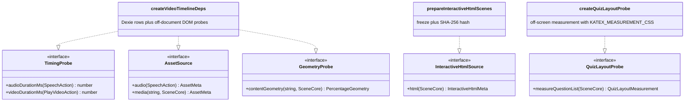
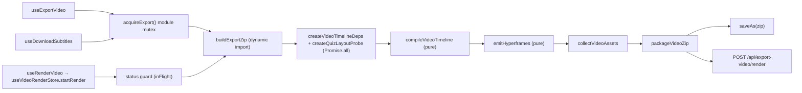

# Interfaces (f) — the app-side export companion

Continues `02e-interfaces-passes-emitter.md`. Blocks are copied from the file named
above them, doc comments trimmed. Everything here is `'use client'` and impure by
design — it is the half of video export the compiler's purity boundary keeps out.

## 1. Export options and the in-flight mutex

[`lib/video-export-app/export-options.ts:4`](lib/video-export-app/export-options.ts#L4), [`:10`](lib/video-export-app/export-options.ts#L10), [`:13`](lib/video-export-app/export-options.ts#L13), [`:17`](lib/video-export-app/export-options.ts#L17), [`:20`](lib/video-export-app/export-options.ts#L20), [`:22`](lib/video-export-app/export-options.ts#L22)

```ts
export const VIDEO_RESOLUTIONS = {
  '720p': { width: 1280, height: 720 },
  '1080p': { width: 1920, height: 1080 },
  '4k': { width: 3840, height: 2160 },
} as const;

export type VideoResolution = keyof typeof VIDEO_RESOLUTIONS;

export const VIDEO_FPS = [24, 30, 60] as const;
export type VideoFps = (typeof VIDEO_FPS)[number];

export const VIDEO_QUALITIES = ['draft', 'standard', 'high'] as const;
export type VideoQuality = (typeof VIDEO_QUALITIES)[number];

export class NoScenesError extends Error {}

export function sanitizeFilename(name: string): string; // [\\/:*?"<>|] → '_', empty → 'classroom'
```

[`lib/video-export-app/export-in-flight.ts:24`](lib/video-export-app/export-in-flight.ts#L24), [`:31`](lib/video-export-app/export-in-flight.ts#L31)

```ts
export function acquireExport(): boolean;
export function releaseExport(): void;
```

Module-level, not per-hook: the export UI unmounts when its dialog closes, so a
per-instance ref would reset and let a second pipeline start (`:10-15`). The
in-app render path uses the render store's `status` as its equivalent guard.

## 2. The shared build prefix

[`lib/video-export-app/build-export-zip.ts:39`](lib/video-export-app/build-export-zip.ts#L39), [`:125`](lib/video-export-app/build-export-zip.ts#L125), [`:137`](lib/video-export-app/build-export-zip.ts#L137), [`:184`](lib/video-export-app/build-export-zip.ts#L184), [`:204`](lib/video-export-app/build-export-zip.ts#L204), [`:209`](lib/video-export-app/build-export-zip.ts#L209)

```ts
export interface BuildExportZipResult {
  zipBlob: Blob;
  stageName: string;
  /** Number of asset-plan entries whose bytes couldn't be produced. */
  missingCount: number;
  /** Non-info diagnostics from the compiler. */
  errorCount: number;
}

export interface BuildExportZipOptions {
  resolution: VideoResolution;
  /** Burn the subtitle overlay into the video. Default false (sidecar SRT/VTT only). */
  burnInSubtitles?: boolean;
  /** Locale the card chrome and the emitted document are written in. */
  locale: Locale;
}

export async function buildExportZip(
  options: BuildExportZipOptions,
): Promise<BuildExportZipResult>;

export interface CompiledSubtitles {
  srt: string;
  vtt: string;
  stageName: string;
  /** Number of usable cues (positive-span, non-empty). 0 → nothing to download. */
  cueCount: number;
}

export interface CompileSubtitlesOptions {
  resolution: VideoResolution;
  locale: Locale;
}

export async function compileSubtitles(
  options: CompileSubtitlesOptions,
): Promise<CompiledSubtitles>;
```

`build-export-zip.ts` also re-exports the option surface so callers need one
import (`:28-37`): `NoScenesError`, `sanitizeFilename`, `VIDEO_FPS`,
`VIDEO_QUALITIES`, `VIDEO_RESOLUTIONS`, `VideoFps`, `VideoQuality`,
`VideoResolution`.

## 3. DI implementations

[`lib/video-export-app/timeline-deps.ts:52`](lib/video-export-app/timeline-deps.ts#L52), [`:63`](lib/video-export-app/timeline-deps.ts#L63), [`:205`](lib/video-export-app/timeline-deps.ts#L205)

```ts
export interface VideoTimelineRecords {
  /** Audio records by `audioId`. */
  audioById: Map<string, AudioFileRecord>;
  /** Media records by `elementId` (the `stageId:` prefix stripped). */
  mediaByElementId: Map<string, MediaFileRecord>;
  /** Probed video durations (ms) by `elementId`; absent when unprobeable. */
  videoDurationMsByElementId: Map<string, number>;
  /** Prepared self-contained HTML pages, addressable by asset id. */
  interactiveHtml: PreparedInteractiveHtmlSet;
}

export interface VideoTimelineDeps {
  timing: TimingProbe;
  assets: AssetSource;
  geometry: GeometryProbe;
  interactive: InteractiveHtmlSource;
  records: VideoTimelineRecords;
}

export async function createVideoTimelineDeps(input: {
  stage: Pick<Stage, 'id' | 'whiteboard' | 'videoManifest'>;
  scenes: Scene[];
  skipGeometry?: boolean;
  skipInteractiveHtml?: boolean;
}): Promise<VideoTimelineDeps>;
```

Internal bounds in the same file (`:112-114`):

```ts
/** Per-probe timeout (ms). A blob whose metadata never loads must not wedge export. */
const PROBE_TIMEOUT_MS = 10_000;
/** How many media-duration probes run at once (bounded so a big deck can't thrash). */
const PROBE_CONCURRENCY = 6;
```

## 4. Byte collection and packaging

[`lib/video-export-app/collect.ts:42`](lib/video-export-app/collect.ts#L42), [`:49`](lib/video-export-app/collect.ts#L49), [`:68`](lib/video-export-app/collect.ts#L68), [`:150`](lib/video-export-app/collect.ts#L150), [`:326`](lib/video-export-app/collect.ts#L326)

```ts
export interface CollectOptions {
  /** Slide-snapshot render width in px (frame height follows the slide ratio). Default 1920. */
  frameWidth?: number;
  onProgress?: (done: number, total: number) => void;
}

export interface CollectResult {
  /** zip-relative path → bytes, for every present asset the plan named. */
  blobs: Map<string, Blob>;
  /** Plan entries whose bytes could not be produced (missing record / render failure). */
  missing: string[];
}

/** Per-decode timeout (ms) so a video whose metadata/frame never loads can't wedge export. */
const FIRST_FRAME_TIMEOUT_MS = 8000;

export function resolveVideoExportMediaBinding(
  ref: string | undefined,
  task: MediaTaskState | undefined,
  lease: AssetUrlLeaseState = MISSING_ASSET_LEASE,
  mediaGenerationDisabled = false,
): { resolution: ReturnType<typeof resolveMediaRef>; src: string };

export async function collectVideoAssets(
  ir: VideoTimeline,
  scenes: Scene[],
  records: VideoTimelineRecords,
  options: CollectOptions = {},
): Promise<CollectResult>;
```

[`lib/video-export-app/package-zip.ts:19`](lib/video-export-app/package-zip.ts#L19), [`:21`](lib/video-export-app/package-zip.ts#L21), [`:53`](lib/video-export-app/package-zip.ts#L53)

```ts
/** Default location the app serves the vendored GSAP from (committed at public/vendor). */
const GSAP_PUBLIC_URL = '/vendor/gsap.min.js';

export interface PackageOptions {
  gsapSource?: string;
  /** Load one app-local vendored binary. Injectable for deterministic unit tests. */
  loadVendorAsset?: (sourceUrl: string) => Promise<Blob>;
  onProgress?: (message: string) => void;
}

export async function packageVideoZip(
  project: EmittedProject,
  assetBlobs: Map<string, Blob>,
  options: PackageOptions = {},
): Promise<Blob>;
```

## 5. Render lifecycle store

[`lib/store/video-render.ts:35`](lib/store/video-render.ts#L35), [`:38`](lib/store/video-render.ts#L38), [`:46`](lib/store/video-render.ts#L46), [`:48`](lib/store/video-render.ts#L48), [`:53`](lib/store/video-render.ts#L53), [`:64`](lib/store/video-render.ts#L64), [`:71`](lib/store/video-render.ts#L71), [`:80`](lib/store/video-render.ts#L80), [`:107`](lib/store/video-render.ts#L107)

```ts
const POLL_INTERVAL_MS = 3000;
const MAX_POLL_ATTEMPTS = Math.ceil((60 * 60 * 1000) / POLL_INTERVAL_MS);
/** Below this percent the extrapolated ETA is too noisy to show. */
const ETA_MIN_PERCENT = 3;
/** EMA weight for the newest *speed* sample (percent-per-ms). */
const SPEED_SMOOTHING = 0.3;

export type VideoRenderStatus = 'idle' | 'compiling' | 'rendering' | 'succeeded' | 'failed';

export interface RenderOptions {
  resolution?: VideoResolution;
  fps?: VideoFps;
  quality?: VideoQuality;
  /** Burn subtitles into the MP4. Default false (sidecar SRT/VTT only). */
  burnInSubtitles?: boolean;
}

const DEFAULT_OPTIONS: Required<RenderOptions> = {
  resolution: '1080p',
  fps: 30,
  quality: 'standard',
  burnInSubtitles: false,
};

interface JobStatusResponse {
  jobId: string;
  status: 'queued' | 'running' | 'succeeded' | 'failed' | 'cancelled';
  progress?: number;
  currentStage?: string;
  error?: string;
  done?: boolean;
}

interface VideoRenderState {
  status: VideoRenderStatus;
  /** 0..100. */
  percent: number;
  /** Estimated milliseconds remaining, or null while unknown. */
  etaMs: number | null;
  filename: string | null;
  error: string | null;
  options: Required<RenderOptions>;
  setOptions: (patch: Partial<Required<RenderOptions>>) => void;
  isActive: () => boolean;
  /** `locale` is the export's, not the store's: it is baked into the emitted card chrome. */
  startRender: (t: Translate, locale: Locale) => Promise<void>;
  reset: () => void;
}

export const useVideoRenderStore; // zustand create<VideoRenderState>()
```

React facades — [`use-export-video.ts:34`](lib/video-export-app/use-export-video.ts#L34), [`use-render-video.ts:16`](lib/video-export-app/use-render-video.ts#L16):

```ts
export function useExportVideo(): {
  exporting: boolean;
  exportVideo: (resolution?: VideoResolution, burnInSubtitles?: boolean) => Promise<void>;
};

export function useRenderVideo(): {
  rendering: boolean;
  percent: number;
  etaMs: number | null;
  options: Required<RenderOptions>;
  setOptions: (patch: Partial<Required<RenderOptions>>) => void;
  renderVideo: () => void;
};
```

## 6. App-side render-service helpers

[`lib/server/render-service.ts:15`](lib/server/render-service.ts#L15), [`:21`](lib/server/render-service.ts#L21), [`:36`](lib/server/render-service.ts#L36), [`:47`](lib/server/render-service.ts#L47)

```ts
export function getRenderServiceUrl(): string | null;
export function isRenderServiceConfigured(): boolean;
export function resolveRenderServiceUrl(): { url: string } | { error: 'not_configured' };
export async function checkRenderServiceHealth(): Promise<boolean>;
```

Route-level constants — [`app/api/export-video/render/route.ts:15`](app/api/export-video/render/route.ts#L15), [`:18`](app/api/export-video/render/route.ts#L18), [`:21`](app/api/export-video/render/route.ts#L21), [`:33`](app/api/export-video/render/route.ts#L33):

```ts
export const maxDuration = 300;
/** Reject uploads larger than this (compressed ZIP bytes), enforced on real bytes. */
const MAX_UPLOAD_BYTES = 300 * 1024 * 1024;
/** Upload-forwarding budget. Covers a large body over a slow link; the render is async. */
const SUBMIT_TIMEOUT_MS = 300_000;
function clientIdentity(req: NextRequest): string; // 'direct' unless TRUST_PROXY_HEADERS === 'true'
```

## 7. Who implements what




