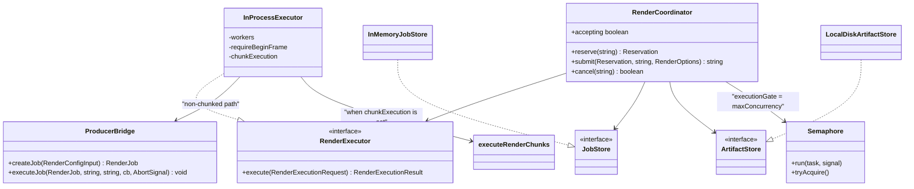
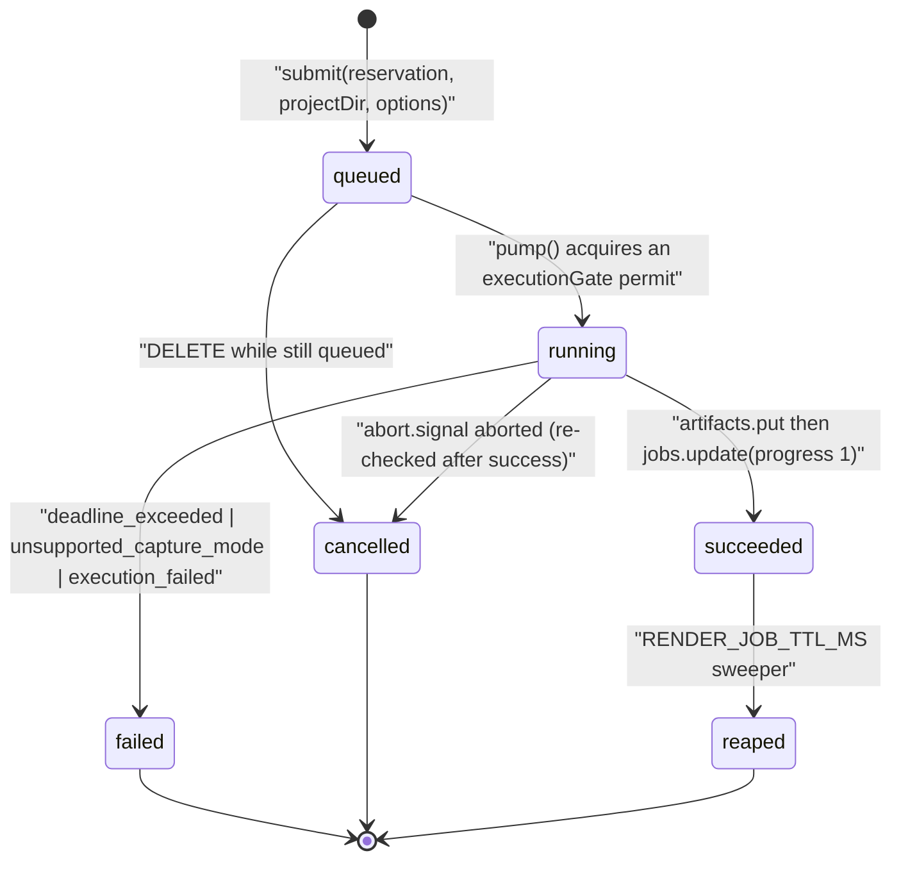

# Interfaces (g) — the render service

Continues `02f-interfaces-export-app.md`. Blocks are copied from the file named
above them, doc comments trimmed. Everything here lives in `render-service/`,
which has its own `package.json` / `tsconfig.json` / `vitest.config.ts` and runs
under Node 22 in a Chromium + FFmpeg container via `tsx`.

## 1. HTTP contract

[`render-service/src/main.ts:12-17`](render-service/src/main.ts#L12-L17) states it verbatim:

```
POST   /render                 multipart: project(zip) + fps/quality/format → 202 { jobId }
POST   /preview                JSON: scene + stage + viewport → PNG
GET    /render/:jobId          → { status, progress, currentStage, done, ... }
GET    /render/:jobId/download → stream MP4 (or 302 to a presigned URL)
DELETE /render/:jobId          → cancel
GET    /health                 → { ok: true, accepting: boolean, ... }
```

`/health` body ([`main.ts:241-250`](render-service/src/main.ts#L241-L250)): `{ ok, accepting, resourceProfile, versions }` —
`resourceProfile` is `publicResourceProfile(config.resourceProfile)`, `versions` is
`RuntimeVersions | null`, and `accepting` is aggregate-only (never queue depths,
never per-identity data).

## 2. Public job types

[`render-service/src/types.ts:15`](render-service/src/types.ts#L15), [`:18`](render-service/src/types.ts#L18), [`:26`](render-service/src/types.ts#L26), [`:37`](render-service/src/types.ts#L37), [`:48`](render-service/src/types.ts#L48), [`:57`](render-service/src/types.ts#L57)

```ts
export type RenderJobStatus = 'queued' | 'running' | 'succeeded' | 'failed' | 'cancelled';

export interface RenderOptions {
  fps: number; // integer
  quality: 'draft' | 'standard' | 'high';
  format: 'mp4'; // only mp4 in this phase; explicit for forward-compat
}

export interface RenderExecutionMetrics {
  resourceProfile: ResourceProfileName;
  capturePolicy: CapturePolicy;
  requestedCaptureMode: RequestedCaptureMode;
  actualCaptureMode: string; // what producer resolved; 'unknown' when unobservable
  requestedWorkers: number;
  actualWorkers: number | null;
  versions: RuntimeVersions;
}

export interface RenderProgress {
  progress: number; // fraction complete in the stable 0..1 service range
  stage: string;
  framesRendered?: number;
  totalFrames?: number;
}
```

`RuntimeVersions` (`:26`) is the runtime identity stamped into `/health` and every
job's metrics: `{ service, producer, node, chromium, chromiumPath, ffmpeg,
ffmpegPath, containerImage: string | null }`, collected by `collectRuntimeVersions()`
(`runtime-info.ts`). `RenderPerformanceSummary` (`:57`) is the executor-independent
diagnostics record: `{ totalElapsedMs, stages: Record<string, number>, workers,
totalFrames, captureMode?, peakRssMb?, tmpPeakBytes? }`.

[`render-service/src/types.ts:68`](render-service/src/types.ts#L68), [`:74`](render-service/src/types.ts#L74), [`:79`](render-service/src/types.ts#L79), [`:84`](render-service/src/types.ts#L84), [`:130`](render-service/src/types.ts#L130), [`:153`](render-service/src/types.ts#L153)

```ts
export type RenderFailureCode =
  | 'cancelled'
  | 'deadline_exceeded'
  | 'unsupported_capture_mode'
  | 'execution_failed';

export interface RenderCancelledFailure { code: 'cancelled'; message: string }
export interface RenderFailedFailure { code: Exclude<RenderFailureCode, 'cancelled'>; message: string }
export type RenderFailure = RenderCancelledFailure | RenderFailedFailure;
export function isTerminal(status: RenderJobStatus): boolean;
```

`RenderJobRecord` (`:130`) is the observable job row:
`{ id, userId?, status, progress, currentStage, framesRendered?, totalFrames?,
metrics?, error?, createdAtMs, updatedAtMs, projectDir, outputPath?, failure?,
performance? }`. `userId` exists *only* for the per-identity concurrency guard;
`projectDir` is retained for cleanup and `outputPath` is set once `succeeded`.
The domain `failure` is kept independently from the HTTP-compatible `error`
string.

## 3. The executor seam

[`render-service/src/types.ts:87`](render-service/src/types.ts#L87), [`:107`](render-service/src/types.ts#L107)

```ts
export interface RenderExecutionRequest {
  projectDir: string;
  outputPath: string;
  options: RenderOptions;
  signal: AbortSignal; // user or coordinator cancellation
  deadlineMs: number;  // wall-clock budget starting when execution begins
  onProgress: (progress: RenderProgress) => void | Promise<void>;
  /** Optional bounded local chunk execution requested by an internal caller. */
  chunkExecution?: {
    chunkCount?: number; chunkWorkers?: number; maxParallelChunks?: number;
    chunkSizeFrames?: number; targetChunkFrames?: number; planDir?: string;
  };
}

export type RenderExecutionResult =
  | { status: 'succeeded'; performance?: RenderPerformanceSummary; metrics?: RenderExecutionMetrics }
  | { status: 'cancelled'; failure: RenderCancelledFailure; performance?: RenderPerformanceSummary; metrics?: RenderExecutionMetrics }
  | { status: 'failed'; failure: RenderFailedFailure; performance?: RenderPerformanceSummary; metrics?: RenderExecutionMetrics };
```

[`render-service/src/render-executor.ts:26`](render-service/src/render-executor.ts#L26), [`:46`](render-service/src/render-executor.ts#L46), [`:66`](render-service/src/render-executor.ts#L66), [`:126`](render-service/src/render-executor.ts#L126), [`:168`](render-service/src/render-executor.ts#L168)

```ts
export interface RenderExecutor {
  execute(request: RenderExecutionRequest): Promise<RenderExecutionResult>;
}

export interface InProcessExecutorOptions {
  workers?: number; requireBeginFrame?: boolean; runtimeVersions?: RuntimeVersions;
  chunkExecutor?: typeof executeRenderChunks;
  chunkExecution?: NonNullable<RenderExecutionRequest['chunkExecution']>;
}

export function buildProducerJobConfig(options: RenderOptions, workers?: number): RenderConfigInput;
export function buildRenderExecutionMetrics(
  job: Pick<RenderJob, 'perfSummary' | 'errorDetails'>,
  versions: RuntimeVersions,
): RenderExecutionMetrics;

export class InProcessExecutor implements RenderExecutor { /* … */ }
```

## 4. Coordinator

[`render-service/src/render-coordinator.ts:29`](render-service/src/render-coordinator.ts#L29), [`:38`](render-service/src/render-coordinator.ts#L38), [`:55`](render-service/src/render-coordinator.ts#L55), [`:66`](render-service/src/render-coordinator.ts#L66), [`:73`](render-service/src/render-coordinator.ts#L73), [`:345`](render-service/src/render-coordinator.ts#L345)

```ts
export type RenderRejectionReason = 'queue_full' | 'per_identity_limit';

export class RenderRejectedError extends Error {
  constructor(message: string, readonly reason?: RenderRejectionReason);
}

/** An accepted admission slot, returned by RenderCoordinator.reserve. */
export interface Reservation { identity: string; consumed: boolean }

export interface RenderCoordinatorOptions {
  maxConcurrency?: number; maxQueue?: number; maxJobsPerUser?: number; jobDeadlineMs?: number;
}

export class RenderCoordinator {
  constructor(executor: RenderExecutor, jobs: JobStore, artifacts: ArtifactStore, options?: RenderCoordinatorOptions);
  runWithExecutionSlot<T>(task: () => Promise<T>, signal?: AbortSignal): Promise<T>;
  tryRunWithExecutionSlot<T>(task: () => Promise<T>, signal?: AbortSignal): Promise<T> | undefined;
  get accepting(): boolean;
  reserve(identity: string): Reservation;
  release(reservation: Reservation): void;
  submit(reservation: Reservation, projectDir: string, options: RenderOptions): Promise<string>;
  cancel(id: string): Promise<boolean>;
  cleanupProject(dir: string): Promise<void>;
}

export async function makeProjectDir(): Promise<string>;
```

## 5. Resource profiles

[`render-service/src/resource-profile.ts:6`](render-service/src/resource-profile.ts#L6), [`:10`](render-service/src/resource-profile.ts#L10), [`:107`](render-service/src/resource-profile.ts#L107), [`:129`](render-service/src/resource-profile.ts#L129), [`:138`](render-service/src/resource-profile.ts#L138), [`:168`](render-service/src/resource-profile.ts#L168)

```ts
export type ResourceProfileName = 'standard' | 'low-memory';
export type RequestedCaptureMode = 'beginframe' | 'screenshot';
export type CapturePolicy = 'prefer-beginframe' | 'screenshot-only';

export interface ResourceProfile {
  name: ResourceProfileName;
  capturePolicy: CapturePolicy;
  requestedCaptureMode: RequestedCaptureMode;
  requireBeginFrame: boolean;
  producerWorkers: 1;
  maxConcurrency: 1;
  maxConcurrentExtractions: 1;
  maxPreviewPixels: number;
  maxPreviewDeviceScaleFactor: number;
  /** Hard local chunk fan-out limits for the selected memory/CPU profile. */
  maxChunkWorkers: number;
  maxParallelChunks: number;
  minimumMemoryBytes: number;
}

export function resolveResourceProfile(env: NodeJS.ProcessEnv = process.env): ResourceProfile;
export function availableMemoryBytes(): number;
export function validateResourceProfileStartup(
  profile: ResourceProfile,
  options?: { memoryBytes?: number; headlessShellPath?: string; pathExists?: (p: string) => boolean },
): void;
export function publicResourceProfile(profile: ResourceProfile);
```

Concrete values ([`resource-profile.ts:47-48`](render-service/src/resource-profile.ts#L47-L48), [`:55-58`](render-service/src/resource-profile.ts#L55-L58)): `standard` =
`prefer-beginframe`, 8 GiB floor, 3840×2160 preview pixels, device scale ≤2,
`maxParallelChunks 4`; `low-memory` = `screenshot-only`, 4 GiB floor, 1920×1080,
device scale ≤1, `maxParallelChunks 1`. Both fix `producerWorkers`,
`maxConcurrency` and `maxConcurrentExtractions` to `1`, and both set
`requireBeginFrame: false` (`:45`) because producer may select screenshot for
compatibility-sensitive compositions such as iframe GenUI.

## 6. Archive extraction, chunking, preview

[`render-service/src/unzip.ts:25`](render-service/src/unzip.ts#L25), [`:31`](render-service/src/unzip.ts#L31)

```ts
export class InvalidProjectError extends Error {}
export async function unzipProject(zip: Uint8Array, destDir: string): Promise<void>;
```

[`render-service/src/chunk-executor.ts:29`](render-service/src/chunk-executor.ts#L29), [`:37`](render-service/src/chunk-executor.ts#L37), [`:67`](render-service/src/chunk-executor.ts#L67), [`:98`](render-service/src/chunk-executor.ts#L98), [`:104`](render-service/src/chunk-executor.ts#L104) (plus
`CHUNK_PLAN_SCHEMA_VERSION = 1`, `DEFAULT_CHUNK_COUNT = 1`,
`DEFAULT_CHUNK_WORKERS = 1` at `:25-27`)

```ts
export type ChunkFailureCode =
  | 'missing_chunk'
  | 'duplicate_chunk'
  | 'stale_chunk'
  | 'mismatched_chunk'
  | 'chunk_execution_failed'
  | 'assembly_failed';

export class ChunkExecutorError extends Error {
  readonly code: ChunkFailureCode;
}

export interface PlanAsset { path: string; sha256: string; bytes: number }
```

`ImmutableChunk` (`:104`) is `{ index, startFrame, endFrame, outputPath, sha256?,
framesEncoded?, … }`, and `ImmutableRenderPlan` (`:67`) additionally carries
`planHash`, `projectHash`, `producerVersion`, `ffmpegVersion`, `nodeVersion`,
`chromiumVersion`, `captureMode`, and per-asset/font `PlanAsset[]` — so a plan is
content-addressed and a stale or mismatched chunk is detectable.

[`render-service/src/preview-renderer.ts:19`](render-service/src/preview-renderer.ts#L19), [`:35`](render-service/src/preview-renderer.ts#L35), [`:43`](render-service/src/preview-renderer.ts#L43), [`:47`](render-service/src/preview-renderer.ts#L47)

```ts
export type PreviewScene = Scene<
  Action,
  SlideContent | QuizContent | InteractiveContent | PBLContent
>;

export interface PreviewRequest {
  scene: PreviewScene;
  stage: PreviewStageContext;   // :24  { id, name }
  viewport: PreviewViewport;    // :29  { width, height, deviceScaleFactor }
  signal: AbortSignal;
  deadlineMs: number;
}

export interface PreviewRenderer { render(request: PreviewRequest): Promise<Uint8Array> }
export class PreviewTimeoutError extends Error {}
```

## 7. Injected collaborators

[`render-service/src/main.ts:76`](render-service/src/main.ts#L76), [`:229`](render-service/src/main.ts#L229)

```ts
export interface AppDeps {
  jobs: JobStore;
  artifacts: ArtifactStore;
  coordinator: RenderCoordinator;
  /** Bounds concurrent *buffering + extraction* (the whole RAM-heavy section). */
  extractionGate: Semaphore;
  previewGate?: PreviewGate;
  previewRenderer?: PreviewRenderer;
  previewDeadlineMs?: number;
  previewMaxJsonBytes?: number;
  unzipProject?: (zip: Uint8Array, destDir: string) => Promise<void>;
  makeProjectDir?: () => Promise<string>;
  /** Runtime identity reported by health and copied into per-render metrics. */
  runtimeVersions?: RuntimeVersions;
}

export function createApp(deps: AppDeps): Hono;
```

Route-local error classes exist purely to translate to status codes
([`main.ts:62`](render-service/src/main.ts#L62), [`:64`](render-service/src/main.ts#L64), [`:66`](render-service/src/main.ts#L66)): `UploadTooLargeError` → 413, `BadRequestError` →
400, `UnprocessablePreviewError` → 422 (a valid payload whose scene cannot
produce a faithful preview).

## 8. Wiring




