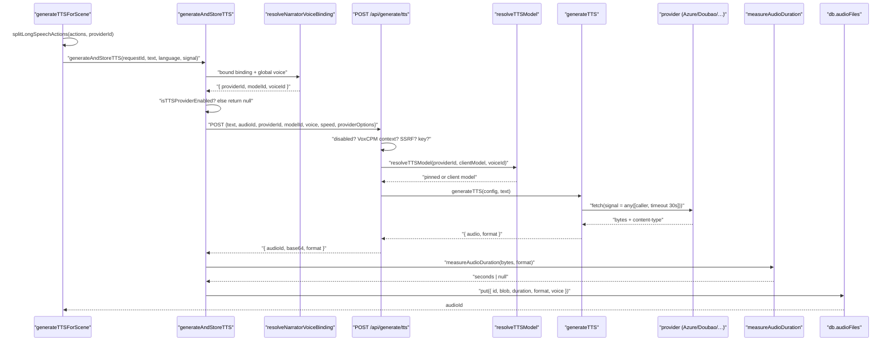
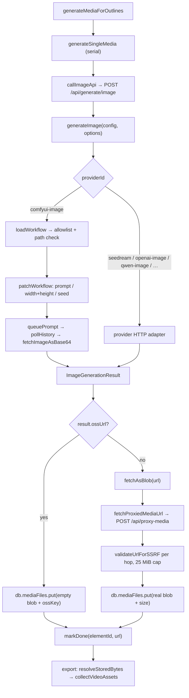
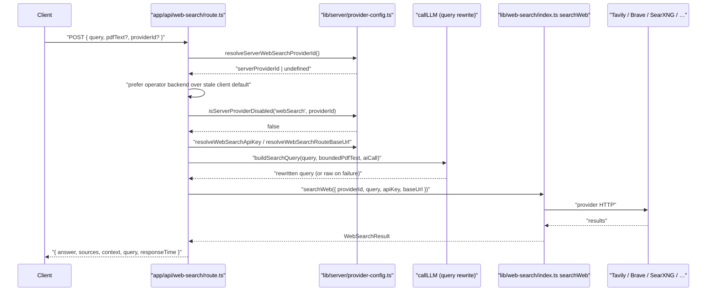
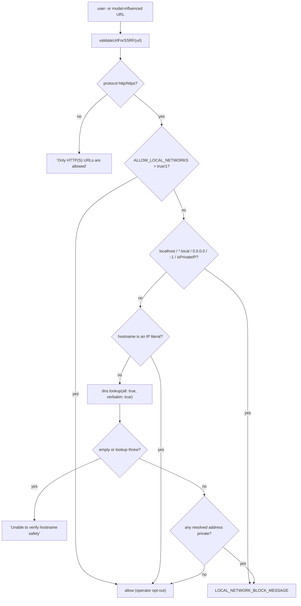

# Flows (a) — TTS, image generation, web search

Three end-to-end paths traced through real function names, in order. Video export
and whiteboard flows are in `03b-flows-video-export.md`.

## Flow 1 — narration: text → audio bytes → durable clip with a duration

Trigger: scene generation finishes and the client synthesizes each `speech`
action's audio (`generateTTSForScene`, `lib/hooks/use-scene-generator.ts:500`).

| # | Hop | Location | What happens |
| --- | --- | --- | --- |
| 1 | `generateTTSForScene(scene, language, signal, retryOptions)` | `lib/hooks/use-scene-generator.ts:500` | Re-splits the scene's actions via `splitLongSpeechActions` (provider text cap), filters to non-empty `speech` actions, and drives one `generateOne` per action. Failures are counted, never thrown. |
| 2 | `splitLongSpeechActions(actions, providerId)` | `lib/audio/tts-utils.ts:82` | Only fires when `TTS_MAX_TEXT_LENGTH[providerId]` exists (`glm-tts: 1024`). Produces `${id}_tts_${n}` sub-actions, each with its own audio file. |
| 3 | `generateAndStoreTTS(requestId, text, …)` | `lib/hooks/use-scene-generator.ts:263` | Picks the narrator agent (`pickNarratorAgent`), computes `boundKey`/`globalDiffers`, and resolves the voice. |
| 4 | `resolveNarratorVoiceBinding(bound, global, providerConfigs)` | `lib/audio/voice-resolver.ts:42` | Bound binding wins if its provider is enabled; otherwise the global voice. Both go through `resolveTTSModelForVoice`. |
| 5 | `isTTSProviderEnabled(...)` guard | `use-scene-generator.ts:344-346` | `browser-native-tts` returns `null` (client-only); a disabled/unconfigured provider returns `null` rather than calling the API. |
| 6 | `resolveAgentVoiceOptions(teacher, {...})` | `lib/audio/agent-voice.ts` | Produces `ttsProviderOptions` — e.g. a VoxCPM `voicePrompt` / `registeredVoiceId`, so timbre is referenced by id rather than re-uploaded. |
| 7 | `POST /api/generate/tts` inside `withGenerationRetry` | `use-scene-generator.ts:358-392` | Retries on `!success \|\| !base64 \|\| !format`. Sends `ttsApiKey`/`ttsBaseUrl` only for non-managed providers. |
| 8 | Route gates | `app/api/generate/tts/route.ts:56-119` | Required fields → `browser-native-tts` reject → server-disable 403 → VoxCPM auto-voice context 400 → SSRF check on a client base URL → `MISSING_API_KEY` 400. |
| 9 | `resolveTTSModel(providerId, ttsModelId, ttsVoice)` | `lib/server/provider-config.ts:805` | Server pin wins; a non-allowlisted client model throws `TTSModelNotAllowedError` (400). Qwen VC/catalog wedges self-heal. |
| 10 | `generateTTS(config, text)` | `lib/audio/tts-providers.ts:207` | Builds `AbortSignal.any([callerSignal, timeout(30s)])`, dispatches to the provider function, and re-throws caller cancels verbatim. |
| 11 | Provider call | e.g. `generateAzureTTS` `:647`, `generateDoubaoTTS` `:1002` | Returns `{ audio: Uint8Array, format }`. Format comes from `getAudioResponseFormat(content-type)` for OpenAI/Lemonade/VoxCPM, is hardcoded for Azure/GLM/Qwen/Doubao, and comes from the payload for MiniMax. |
| 12 | `recordGenerationUsage({kind:'tts', unit:'character', quantity: text.length})` | route `:146` | Fire-and-forget usage accounting. |
| 13 | Base64 response | route `:155-161` | `{ audioId, base64, format }`. |
| 14 | Client decodes to `Uint8Array` → `Blob` | `use-scene-generator.ts:463-468` | Blob type is `audio/${format}`. |
| 15 | `measureAudioDuration(bytes, data.format)` | `lib/audio/audio-duration.ts:210` | Magic-byte sniff decides the parser; the `format` hint is only a fallback. `null` → `duration` stays `undefined`. |
| 16 | `db.audioFiles.put({ id, stageId, blob, duration, format, text, voice, createdAt })` | `use-scene-generator.ts:474-483` | The `duration` written here is what makes the exporter's `TimingProbe` synchronous. |

Failure recovery at hop 8–11 is specific: a `QWEN_VC_VOICE_NOT_FOUND` error code
on the *bound* voice marks that binding unavailable
(`markVoiceBindingUnavailable`) and retries once — either against the global
voice when it differs, or against `resolveDeterministicFallbackVoice` when the
narrator is pinned so bound == global. `MAX_NARRATOR_VOICE_FALLBACK_HOPS = 1`
(`use-scene-generator.ts:260`) bounds this to two total `/api/generate/tts`
attempts per call.

## Flow 2 — a generated image reaches a slide and, later, the export ZIP

Trigger: outlines declare `mediaGenerations`; the client kicks off
`generateMediaForOutlines` alongside content generation.

| # | Hop | Location | What happens |
| --- | --- | --- | --- |
| 1 | `generateMediaForOutlines(outlines, stageId, abortSignal)` | `lib/media/media-orchestrator.ts:41` | Filters by `imageGenerationEnabled` / `videoGenerationEnabled`, skips `done`/`failed` tasks, `enqueueTasks`, then loops **serially**. |
| 2 | `generateSingleMedia(req, stageId, abortSignal)` | `:130` | `store.markGenerating(elementId)`, then branch on `req.type`. |
| 3 | `callImageApi(req, stageId, abortSignal)` | `:268` | `POST /api/generate/image` with provider/model/key/baseUrl in headers `x-image-provider`, `x-image-model`, `x-api-key`, `x-base-url`. |
| 4 | Route → `generateImage(config, options)` | `lib/media/image-providers.ts:191` | Switch on `config.providerId`. |
| 5 | `generateWithComfyuiImage(config, options)` | `lib/media/adapters/comfyui-image-adapter.ts` | The ComfyUI branch — see the sub-flow below. |
| 6a | **CDN path** | `media-orchestrator.ts:147-164` | `result.ossUrl` present → Dexie row with an **empty blob** plus `ossKey`, then `markDone(elementId, ossUrl)`. |
| 6b | **Blob path** | `:167-181` | `fetchAsBlob(result.url)` (`:364`) → `fetchProxiedMediaUrl` → Dexie row with real bytes and `size`, then `markDone` with an object URL. |
| 7 | `fetchProxiedMediaUrl(url)` | `lib/media/proxy-media-cache.ts:234` | Permanent-4xx short circuit, transient backoff, per-URL request dedup. |
| 8 | `POST /api/proxy-media` | `app/api/proxy-media/route.ts:23` | `validateUrlForSSRF` on the URL **and on every redirect hop** (max 5), 25 MiB cap on both the declared and realised size, 4xx forwarded verbatim. |
| 9 | Later, at export time: `resolveStoredBytes(assetId, {...})` | `lib/media/resolve-stored-bytes.ts` via `lib/video-export-app/collect.ts:171` | Pool-first, then the Dexie compatibility row (with `ossKey` as a byte source), then the task's resolved URL — each gated on the media-resolution state machine so an in-flight regeneration cannot serve stale bytes. |

ComfyUI sub-flow (hop 5):

| # | Hop | Location | Guard |
| --- | --- | --- | --- |
| 5.1 | `loadWorkflow(config)` | `comfyui-image-adapter.ts:105` | `config.workflowJson` → deep clone; else server-side disk read. |
| 5.2 | `isComfyuiWorkflowFilename(config.model)` | `lib/media/comfyui-workflows.ts:49` | Rejects `/`, `\`, `..`; requires `.json` and a `comfyui`/`workflow` name. |
| 5.3 | `listComfyuiWorkflowFilenames()` membership | `comfyui-workflows.ts:101` | Rejects any id the UI would not offer — no silent fallback, so the filesystem cannot be probed. |
| 5.4 | Default when no model id | `comfyui-image-adapter.ts:155-164` | Uses the **first discovered** file, not a hardcoded name; empty directory throws with a pointer to `comfyui-setup-instructions.md`. |
| 5.5 | `path.resolve(filePath).startsWith(resolve(publicDir) + sep)` | `:174` | Defence in depth — the comment notes `path.join` does not stop `..`. |
| 5.6 | `patchWorkflow(workflow, options, maxW, maxH)` | `:299` | Prompt node `Input Prompt` (fallback `String (Multiline - Prompt)`); `Width`+`Height` primitives (fallback `Empty Flux 2 Latent`); `KSampler.inputs.seed = Math.floor(Math.random()*1e15)`. |
| 5.7 | queue → poll history → fetch image | same file | `POLL_INTERVAL_MS 1500`, `GENERATION_TIMEOUT_MS 300_000`, `FETCH_TIMEOUT_MS 30_000`. A failed history entry's reason is lifted from the `execution_error` message tuple (`extractExecutionError`, `:434`). |

## Flow 3 — web search with query rewrite

| # | Hop | Location | What happens |
| --- | --- | --- | --- |
| 1 | `POST /api/web-search` | `app/api/web-search/route.ts:32` | Body: `{ query, pdfText?, providerId?, apiKey?, baseUrl?, baiduSubSources?, claudeModelId? }`. |
| 2 | `resolveServerWebSearchProviderId()` | `lib/server/provider-config.ts` | Operator's configured backend. |
| 3 | Provider selection | route `:59-77` | Client id wins **unless** the operator has a configured backend and the client's choice is not itself server-configured — then the operator's wins, with an info log. |
| 4 | `isServerProviderDisabled('webSearch', providerId)` | route `:83` | 403 `PROVIDER_DISABLED`. Checked *after* the override so a disabled client choice yields to the operator's enabled backend. |
| 5 | Credential/base-URL resolution | route `:95-113` | Managed providers ignore client key/base URL. `searxng` never accepts a client base URL. `resolveWebSearchRouteBaseUrl` may throw → 400. |
| 6 | `boundedPdfText = pdfText?.slice(0, SEARCH_QUERY_REWRITE_EXCERPT_LENGTH)` | route `:123` | Clamp at the route boundary. |
| 7 | `resolveModelFromRequest(req, body, 'web-search-query-rewrite')` + `callLLM` | route `:127-147` | Builds an `AICallFn` with `maxOutputTokens: 256`. A failure only logs a warning — search still runs. |
| 8 | `buildSearchQuery(query, boundedPdfText, aiCall)` | `lib/server/search-query-builder.ts` | Returns `{ query, hasPdfContext, rawRequirementLength, rewriteAttempted, finalQueryLength }`. |
| 9 | `searchWeb({ providerId, query, apiKey, baseUrl, … })` | `lib/web-search/index.ts:15` | Dispatch to one of nine backends; `default` is an `exhaustive: never` compile guard. |
| 10 | `formatSearchResultsAsContext(result)` | `lib/web-search/format.ts` | Flattens sources into prompt-ready context. |
| 11 | Response | route `:175-181` | `{ answer, sources, context, query, responseTime }`. |

## Egress controls that apply to all three flows

`isPrivateIP` (`lib/server/ssrf-guard.ts:178`) is not a naive RFC1918 check: it
un-maps `::ffff:` IPv4, and additionally unwraps **6to4** (`2002::/16`,
`:217`), **Teredo** (`2001:0000::/32` with XOR-inverted client IPv4, `:226`) and
**ISATAP** (`…:0000:5efe:` / `…:0200:5efe:`, `:238`) tunnels to test the embedded
IPv4. Cloud metadata addresses `169.254.169.254`, `100.100.100.200`,
`fd00:ec2::254` and the hostname `metadata.google.internal` are denied explicitly
(`:11-12`).

Route-level differences worth knowing:

| Route | SSRF check | Redirect policy |
| --- | --- | --- |
| `/api/generate/tts` | always, on a client-supplied `ttsBaseUrl` (`:98`) | n/a |
| `/api/transcription` | **only when `NODE_ENV === 'production'`** (`:57`) | n/a |
| `/api/azure-voices` | always (`:29`) | `redirect: 'manual'`; any 3xx → 403 `REDIRECT_NOT_ALLOWED` |
| `/api/proxy-media` | initial URL **and** each of ≤5 hops (`:33`, `:55`) | manual, re-validated per hop |
| Qwen VC audio download | strict host regex, not the shared guard (`lib/audio/qwen-voice-clone.ts:348`) | `redirect: 'error'`; http upgraded to https; `MAX_AUDIO_RESPONSE_BYTES` enforced |
| `RENDER_SERVICE_URL` | deliberately **not** guarded (`lib/server/render-service.ts:25-35`) — it is operator config that is *meant* to point at an internal host |
