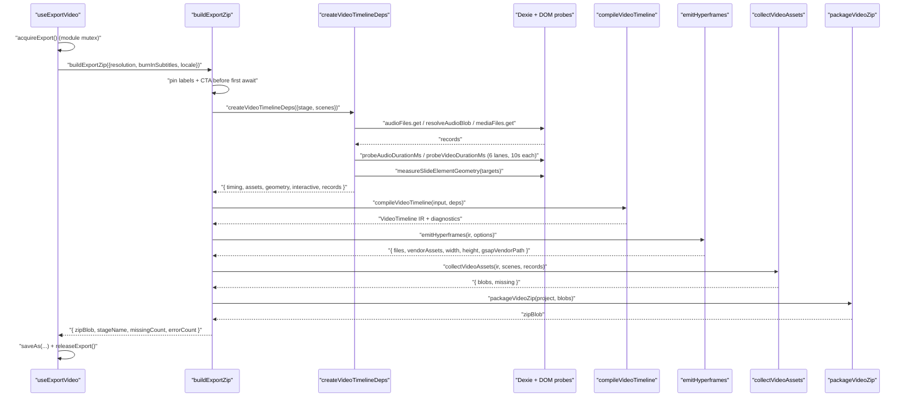
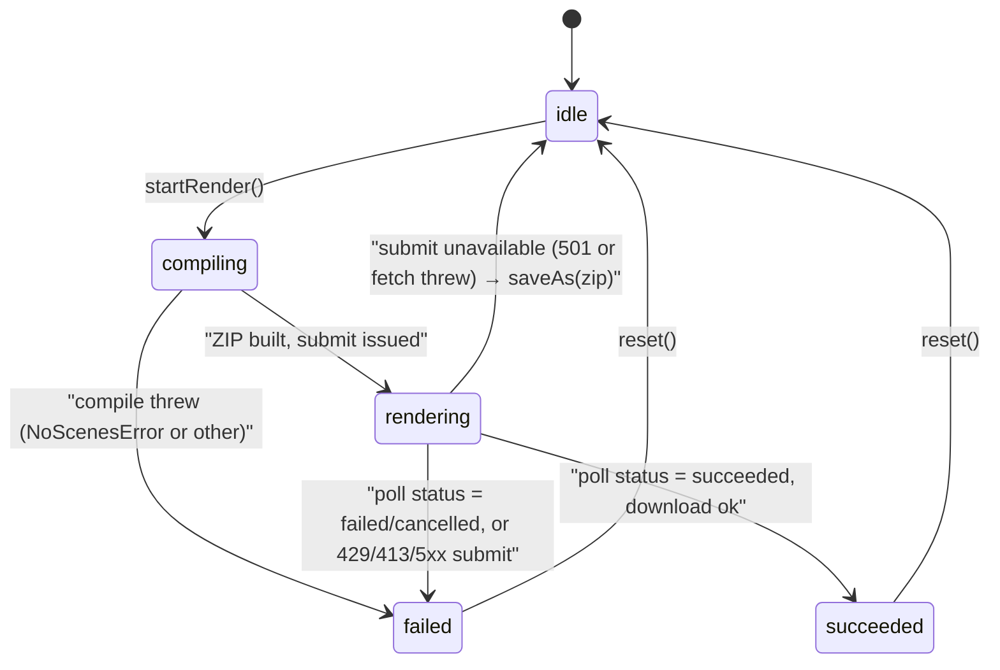
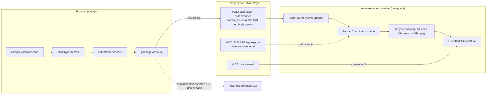
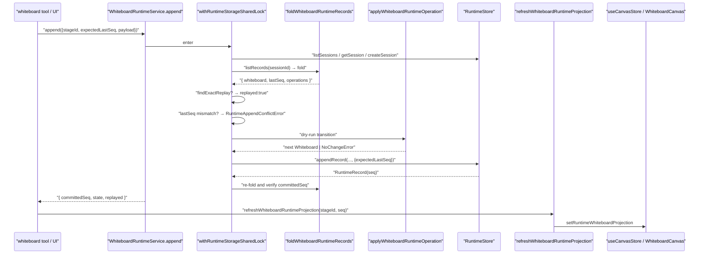

# Flows (b) — video export ZIP, render-service MP4, whiteboard replay

Continues `03a-flows-audio-media.md`.

## Flow 4 — classroom → self-contained Hyperframes project ZIP

Trigger: the export dialog (`components/stage/video-export-dialog.tsx`) calls
`useExportVideo().exportVideo(resolution, burnInSubtitles)`.

| # | Hop | Location | What happens |
| --- | --- | --- | --- |
| 1 | `acquireExport()` | [`lib/video-export-app/export-in-flight.ts:24`](lib/video-export-app/export-in-flight.ts#L24) | Module-singleton mutex shared with the subtitles-only download. A per-hook ref would reset when the dialog unmounts, so this is deliberately module-level. |
| 2 | `await import('./build-export-zip')` | [`use-export-video.ts:49`](lib/video-export-app/use-export-video.ts#L49) | Dynamic import keeps the compiler, emitter and JSZip out of the main bundle; asserted by `tests/video-export/export-loading-boundary.test.ts`. |
| 3 | `getVideoExportCoverLabels(locale)` + `configuredVideoExportCta()` | [`build-export-zip.ts:147-148`](lib/video-export-app/build-export-zip.ts#L147-L148) | Chrome is pinned **before the first `await`**, so a user switching UI language mid-compile cannot produce a mixed-locale export. |
| 4 | `compileStageIr({ resolution, locale, labels })` | [`build-export-zip.ts:74`](lib/video-export-app/build-export-zip.ts#L74) | Reads `useStageStore.getState()`; zero scenes → `NoScenesError`. Resolves the display name from `accessDocument(stage.id)`. |
| 5 | `createVideoTimelineDeps({ stage, scenes })` ∥ `createQuizLayoutProbe({...})` | [`timeline-deps.ts:205`](lib/video-export-app/timeline-deps.ts#L205), `quiz-layout.ts` | Run concurrently via `Promise.all` ([`build-export-zip.ts:95`](lib/video-export-app/build-export-zip.ts#L95)). |
| 5a | `prepareInteractiveHtmlScenes(scenes)` | `prepare-interactive-html.ts` | Packages each interactive scene's embedded HTML into a frozen page, hashes it (SHA-256), records a `failure` category on error. |
| 5b | `enumerateAssetManifest({ stage, scenes })` | `@openmaic/dsl` via [`timeline-deps.ts:233`](lib/video-export-app/timeline-deps.ts#L233) | The manifest gates which refs are loaded at all — an orphan Dexie row is not even read. |
| 5c | Audio load | [`timeline-deps.ts:258-302`](lib/video-export-app/timeline-deps.ts#L258-L302) | Per referenced `audioId`: `db.audioFiles.get(id)` for metadata + `resolveAudioBlob(id)` for bytes (pool-first). Unconverted documents' legacy `audioUrl`s are fetched only when the id produced no bytes. |
| 5d | Audio duration probes | `:311-316` | Off-document `<audio preload="metadata">` per local blob, `PROBE_CONCURRENCY = 6`, `PROBE_TIMEOUT_MS = 10_000`. This is the source of truth; the stored `duration` is the fallback. |
| 5e | Media load + element→ref bridge | `:321-360` | `mediaByElementId` keyed by ref; `mediaRefBySceneElement` bridges slide element `.id` → ref **per scene** because element ids are only slide-unique. |
| 5f | Video duration probes | `:382-389` | Off-document `<video>`; `ossKey`-only records are unprobeable, so the compiler caps their dwell. |
| 5g | Geometry pre-measure | `:475-495` | `measureSlideElementGeometry(slide, targetIds)` from `@openmaic/renderer/snapshot`, only for elements a spotlight/laser/`play_video` targets. Failure degrades to the authored box. |
| 6 | `compileVideoTimeline({stage, scenes}, {timing, assets, geometry, interactive, quizLayout})` | [`lib/video-export/compile.ts:152`](lib/video-export/compile.ts#L152) | Nine pure passes → `VideoTimeline`. |
| 7 | `emitHyperframes(ir, { width, height, burnInSubtitles, labels, locale, cta })` | [`emit-hyperframes/index.ts:1229`](lib/video-export/emit-hyperframes/index.ts#L1229) | Text files + `vendorAssets` descriptors. |
| 8 | `collectVideoAssets(ir, scenes, deps.records, { frameWidth: width })` | [`collect.ts:326`](lib/video-export-app/collect.ts#L326) | Iterates only owning plan entries (`present && !dedupOf`, [`:341`](lib/video-export-app/collect.ts#L341)). |
| 8a | `frame` entries | `:350-361` | `renderFrame` → `resolveGeneratedMedia` (swap placeholders for object URLs, decode a first-frame poster when a video has none, `decodeFirstFramePosterUrl`, `:80`) → `slideToPng({ width, pixelRatio: 1, backgroundColor: '#ffffff', format: 'blob' })` → `revoke()` in a `finally`. |
| 8b | `audio` entries | `:362-366` | `resolveBytes(record.blob, record.ossKey)` — local blob first, CDN URL second. |
| 8c | `video` / `image` entries | `:367-375` | `resolveStoredBytes` with `resolutionGating`, `compatRowCdnFallback`, `taskUrlFallback`. |
| 8d | `html` entries | `:381-384` | `records.interactiveHtml.content(assetId)` → `text/html;charset=utf-8` blob. |
| 9 | `packageVideoZip(project, blobs)` | [`package-zip.ts:53`](lib/video-export-app/package-zip.ts#L53) | Text files at the root; blobs at `assets/<planPath>` (via `assetUrl`); vendor fonts at their declared `path`; GSAP fetched from `/vendor/gsap.min.js` and written at `project.gsapVendorPath`. `DEFLATE`. |
| 10 | `saveAs(zipBlob, \`${sanitizeFilename(stageName)}-video.zip\`)` | [`use-export-video.ts:57`](lib/video-export-app/use-export-video.ts#L57) | Plus a warning toast when `missingCount > 0 \|\| errorCount > 0`. |

Resolution table ([`export-options.ts:4`](lib/video-export-app/export-options.ts#L4)): `720p` 1280×720, `1080p` 1920×1080,
`4k` 3840×2160. FPS choices `[24, 30, 60]`; qualities `['draft','standard','high']`.

## Flow 5 — the same ZIP becomes an MP4 (in-process vs render-service split)

The split is explicit: **the compile and ZIP build always happen in the browser**;
only frame capture and encoding move to the service. `buildExportZip` is the
shared prefix of both paths, "so the two paths can never drift"
([`build-export-zip.ts:11-13`](lib/video-export-app/build-export-zip.ts#L11-L13)).

| # | Hop | Location | What happens |
| --- | --- | --- | --- |
| 1 | `GET /api/export-video/capability` | [`app/api/export-video/capability/route.ts:13`](app/api/export-video/capability/route.ts#L13) | `checkRenderServiceHealth()` — configured **and** `/health` responds within 3 s. A configured-but-absent service reports `enabled: false` so the menu only offers "Download ZIP". Never leaks the service URL. |
| 2 | `useVideoRenderStore.startRender(t, locale)` | [`lib/store/video-render.ts:121`](lib/store/video-render.ts#L121) | Guards against a duplicate submit via `inFlight(status)` — the reason the lifecycle lives in a store rather than the menu component. |
| 3 | `buildExportZip(...)` | as Flow 4 | Status `compiling`. `NoScenesError` → dedicated toast. |
| 4 | `FormData`: `project` (zip), `fps`, `quality`, `format=mp4` | [`video-render.ts:169-173`](lib/store/video-render.ts#L169-L173) | Status flips to `rendering`. |
| 5 | `runPolledTask({ submit, poll, intervalMs: 3000, maxAttempts: ceil(3_600_000/3000) })` | `:177` | One hour of polling at 3 s. |
| 6 | `POST /api/export-video/render` | [`app/api/export-video/render/route.ts:46`](app/api/export-video/render/route.ts#L46) | `maxDuration = 300`. `MAX_UPLOAD_BYTES = 300 MiB`. Declared `content-length` gives a courtesy 413; the real bound is `capBodyStream` on the forwarded stream ([`:70`](app/api/export-video/render/route.ts#L70)). The body is **not** parsed — identity comes from the `x-openmaic-client` header. |
| 6a | `clientIdentity(req)` | `:33` | Honors `x-forwarded-for` / `x-real-ip` **only** when `TRUST_PROXY_HEADERS === 'true'`; otherwise every caller collapses to the single bucket `'direct'`. |
| 6b | `proxyFetch(url + '/render', { body: capped.stream, duplex: 'half', signal: AbortSignal.timeout(300_000) })` | `:74` | Streaming forward. |
| 6c | Status mapping | `:87-97` | Upstream 429 → 429 `RATE_LIMITED`; 413 → 413 `INVALID_REQUEST`; anything else → 502 `UPSTREAM_ERROR`. A cap trip surfaces as a fetch error and is translated to 413 (`:102`). |
| 7 | Service `POST /render` | [`render-service/src/main.ts:252`](render-service/src/main.ts#L252) | `coordinator.reserve(identity)` → `extractionGate.run(...)` → `capBodyStream` + `formData()` + `parseOptions` + `unzipProject` → `coordinator.submit(...)` → `202 { jobId }`. Every failure path releases the reservation and cleans the project dir ([`:322-330`](render-service/src/main.ts#L322-L330)). |
| 8 | `RenderCoordinator.run(job)` | [`render-coordinator.ts:261`](render-service/src/render-coordinator.ts#L261) | Under `executionGate` (size = `maxConcurrency`, fixed at 1 by both resource profiles): marks `running`/`preparing`, calls `executor.execute({ projectDir, outputPath: projectDir + '/output.mp4', options, signal, deadlineMs, onProgress })`. |
| 9 | `InProcessExecutor.execute(request)` | [`render-executor.ts:188`](render-service/src/render-executor.ts#L188) | Non-chunked path: `createRenderJob(buildProducerJobConfig(options, workers))` then `executeRenderJob(job, projectDir, outputPath, onProgress, abort.signal)`. Progress is normalized from producer percent to 0..1 ([`:314`](render-service/src/render-executor.ts#L314)). |
| 9' | Chunked path | `:196-284` | When `RENDER_CHUNK_EXECUTION=true`: `executeRenderChunks(chunkRequest)` over `@hyperframes/producer/distributed` plan/chunk/assemble; capture mode must be unanimous across chunks when `requireBeginFrame` is on (`:243`). |
| 10 | `artifacts.put(id, outputPath)` then `jobs.update(id, { status:'succeeded', progress:1, currentStage:'complete' })` | [`render-coordinator.ts:302-310`](render-service/src/render-coordinator.ts#L302-L310) | Followed by `cleanupProject` on any non-success (`finishNonSuccess`, [`:242`](render-service/src/render-coordinator.ts#L242)). |
| 11 | Client polls `GET /api/export-video/render/:jobId` | [`app/api/export-video/render/[jobId]/route.ts:12`](app/api/export-video/render/[jobId]/route.ts#L12) | Relays the service body plus `pollIntervalMs: 3000`; upstream 404 preserved, everything else 502. |
| 11a | ETA | [`video-render.ts:201-223`](lib/store/video-render.ts#L201-L223) | Percent from `progress*100`; instantaneous speed (percent/ms) EMA-smoothed with `SPEED_SMOOTHING = 0.3`; only forward progress updates the speed; ETA shown from `ETA_MIN_PERCENT = 3`. |
| 12 | On `succeeded`: `GET /api/export-video/render/:jobId/download` | `.../download/route.ts` → service [`main.ts:441`](render-service/src/main.ts#L441) | Service streams the MP4 with `Content-Disposition: attachment; filename="<jobId>.mp4"`, or 302s to a presigned URL when the artifact store is URL-backed. |
| 13 | `saveAs(mp4, filename)` | [`video-render.ts:237`](lib/store/video-render.ts#L237) | Plus a warning toast for missing assets / non-info diagnostics. |

Degradation on failure ([`video-render.ts:243-269`](lib/store/video-render.ts#L243-L269)) is deliberately narrow: the
client silently falls back to downloading the ZIP **only** when the submit never
succeeded *and* the service is genuinely unavailable — `submitStatus === null`
(fetch threw) or `501` (not configured). A real rejection (429 busy, 413 too
large, 5xx) surfaces the error instead of an unsolicited download. If the render
had already started, the store fires `DELETE /api/export-video/render/:jobId` to
free the slot before reporting failure.

## Flow 6 — whiteboard mutation → durable record → canvas projection

| # | Hop | Location | What happens |
| --- | --- | --- | --- |
| 1 | Caller builds a `WhiteboardRuntimePayloadV1` | [`lib/whiteboard/runtime/types.ts:62`](lib/whiteboard/runtime/types.ts#L62) | `{ payloadVersion: 1, operationId, operation }`. `operationId` doubles as the record id. |
| 2 | `service.append({ stageId, expectedLastSeq, payload })` | [`runtime/store.ts:188`](lib/whiteboard/runtime/store.ts#L188) | Validates `stageId`, `expectedLastSeq` (safe non-negative integer or `null`), clones + asserts the payload. |
| 3 | `withRuntimeStorageSharedLock(...)` | [`store.ts:174`](lib/whiteboard/runtime/store.ts#L174) | Whole append runs under the storage lock. |
| 4 | `ensureSession(store, stageId, learnerKey, now)` | `:121` | Deterministic id `whiteboard:<stageId>:<learnerKey>`; a create race re-reads the winner and asserts identity. |
| 5 | `foldSession` → `foldWhiteboardRuntimeRecords(session.id, records)` | [`runtime/fold.ts:170`](lib/whiteboard/runtime/fold.ts#L170) | Full replay from seq 0. Envelope validation, anchor rejection, `seq === index`, `record.id === payload.operationId`, digest-based idempotency. |
| 6 | `findExactReplay(before, payload)` | [`store.ts:158`](lib/whiteboard/runtime/store.ts#L158) | Same `operationId` + same digest → return `{ replayed: true }`. Same id, different digest → `WHITEBOARD_RUNTIME_OPERATION_CONFLICT`. |
| 7 | Concurrency check | `:214` | `before.lastSeq !== expectedLastSeq` → `RuntimeAppendConflictError`. |
| 8 | Import guard | `:220` | `legacy_snapshot_imported` with any existing record → `WHITEBOARD_RUNTIME_IMPORT_AFTER_STATE`. |
| 9 | **Dry-run** `applyWhiteboardRuntimeOperation(session.id, before.whiteboard, operation)` | [`fold.ts:51`](lib/whiteboard/runtime/fold.ts#L51) | The transition is applied *before* persisting, so a `WhiteboardRuntimeNoChangeError` (empty clear) or a validation failure never writes a record. |
| 10 | `store.appendRecord({ id, sessionId, createdAt, payload }, { expectedLastSeq })` | `:237` | On failure, re-folds and checks for an exact replay (crash-recovery), else re-raises with a conflict when `lastSeq` moved. |
| 11 | Post-commit verification | `:270-274` | Re-fold, re-find the operation, assert `committedSeq === appended.seq`, else `WHITEBOARD_RUNTIME_POST_COMMIT_VERIFICATION_FAILED`. |
| 12 | `refreshWhiteboardRuntimeProjection(stageId, minimumLastSeq?)` | [`runtime/browser-projection.ts:8`](lib/whiteboard/runtime/browser-projection.ts#L8) | Reads folded state, then three staleness guards: stage changed, generation superseded, or an existing projection with a strictly higher `lastSeq`. Sets `useCanvasStore.setRuntimeWhiteboardProjection`. |
| 13 | `Whiteboard` component | [`components/whiteboard/index.tsx:39-44`](components/whiteboard/index.tsx#L39-L44) | `runtimeAuthoritative` = projection present, matching stage id, non-null `lastSeq`. When true it renders the projected board and hides clear/history ([`:151`](components/whiteboard/index.tsx#L151)). Otherwise it falls back to `stage.whiteboard[0]`. |
| 14 | `WhiteboardCanvas` | `components/whiteboard/whiteboard-canvas.tsx` | Renders each `PPTElement` through the slide renderer's `ScreenElement` (`:15`), memoized so pan/zoom does not remeasure code rows (`:97-102`). |

## Browser-vs-node execution constraints, summarised

| Code | Runs where | Enforcement |
| --- | --- | --- |
| `lib/choreography/**`, `lib/video-export/**` | Pure Node **and** browser | eslint `no-restricted-syntax` / `no-restricted-imports` ([`eslint.config.mjs:348-492`](eslint.config.mjs#L348-L492)): no `@/…`, no React/DOM/GSAP/motion, no `import()`/`require()`, depth-specific relative allowlist |
| `lib/video-export-app/**` | Browser only (`'use client'`) | Dexie, `document.createElement('video'\|'audio'\|'canvas')`, `URL.createObjectURL`, `@openmaic/renderer/snapshot` |
| `lib/audio/constants.ts`, `lib/audio/types.ts` | Both | Header states the split explicitly: kept free of Node libs so client components can import it ([`constants.ts:5-8`](lib/audio/constants.ts#L5-L8)) |
| `lib/audio/tts-providers.ts` | Server (uses `Buffer`, `process.env`) | `browser-native-tts` throws with a client-side directive (`:246`) |
| `lib/media/comfyui-workflows.ts`, `comfyui-image-adapter.ts` | Module import-safe in both; `fs` paths server-only | `typeof window === 'undefined'` wrapping a **dynamic** `import('fs')` so the bundler can dead-code-eliminate it ([`comfyui-workflows.ts:57-71`](lib/media/comfyui-workflows.ts#L57-L71)) |
| `render-service/src/**` | Node 22 container only | Own `package.json`, `tsconfig.json`, `vitest.config.ts`; run through `tsx` |
| Emitted `index.html` | Chromium inside the render container, **offline** | ZIP is self-contained; iptables `OUTPUT DROP` blocks everything but loopback and established replies |
