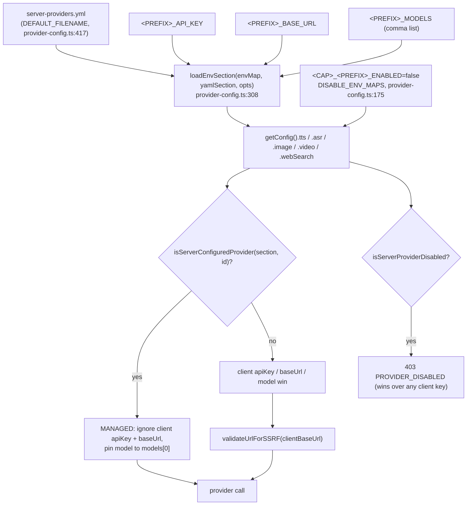
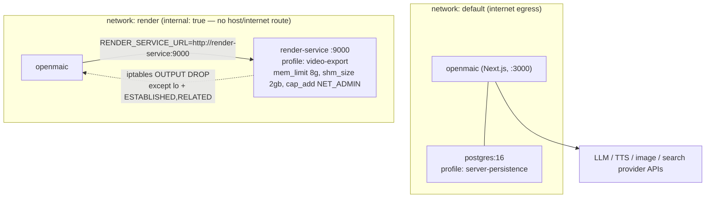
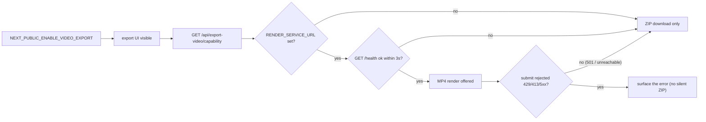

# Dependencies and configuration

## 1. External dependencies

### 1.1 npm packages the subsystem actually uses

Versions from the root `package.json` (`:70-167`) and
`render-service/package.json` (`:16-40`).

| Package | Version | Used by | For |
| --- | --- | --- | --- |
| `zod` | `^4.3.5` | `lib/video-export/ir.ts`, `passes/emit.ts` | The IR is authored in zod and the TS types inferred from it; `emitManifest` re-parses before writing. |
| `dexie` | `^4.2.1` | `lib/utils/database.ts` consumed by `timeline-deps.ts`, `collect.ts`, `media-orchestrator.ts` | `audioFiles` / `mediaFiles` tables. |
| `jszip` | `^3.10.1` | `lib/video-export-app/package-zip.ts:58` | Dynamically imported, `DEFLATE`. |
| `file-saver` | `^2.0.5` | `use-export-video.ts:16`, `lib/store/video-render.ts:20` | `saveAs` for the ZIP / MP4. |
| `katex` | `^0.16.33` | `scripts/generate-video-export-katex.mjs:11` (build-time only) | Source of the 20 vendored WOFF2 faces + the export CSS. |
| `ipaddr.js` | `^2.5.0` | `lib/server/ssrf-guard.ts:9` | Address classification (`range() !== 'unicast'`, IPv4-mapped IPv6 unwrapping). |
| `sonner` | `^2.0.7` | `use-export-video.ts`, `lib/store/video-render.ts:21` | Global toast singleton so progress survives an unmounted menu. |
| `zustand` | `^5.0.10` | `lib/store/video-render.ts:19`, media-generation store | Render lifecycle + media task state. |
| `motion` | `^12.27.5` | `components/whiteboard/*` | Whiteboard open/clear animations. Explicitly forbidden inside `lib/video-export/**`. |
| `@openmaic/dsl` | `workspace:*` | choreography, compiler, whiteboard fold, render-service preview | `Action`/`Scene`/`PPTElement` types, `FIRE_AND_FORGET_ACTIONS`, `isActionType`, `validateScene`, `enumerateAssetManifest`, `validateRuntimeRecord`. |
| `@openmaic/renderer` | `workspace:*` | `collect.ts:23` (`slideToPng`), `timeline-deps.ts:39` (`measureSlideElementGeometry`) | Slide snapshot + off-screen geometry measurement. |
| `@openmaic/storage` | `workspace:*` | `lib/whiteboard/runtime/store.ts:2` | `RuntimeStore`, `RuntimeAppendConflictError`. |
| `@hyperframes/producer` | `^0.7.107` | `render-service/src/render-executor.ts:7`, `chunk-executor.ts:12` | `createRenderJob`/`executeRenderJob` and the `/distributed` `plan`/`renderChunk`/`assemble` primitives. |
| `hono` + `@hono/node-server` | `^4.6.14` / `^1.13.7` | `render-service/src/main.ts:28-30` | The service's HTTP layer. |
| `fflate` | `^0.8.2` | `render-service/src/unzip.ts:22` | Worker-offloaded async unzip with a synchronous per-entry `filter`. |
| `puppeteer-core` | `^25.6.0` | `render-service/src/preview-renderer.ts:16` | Chromium control for `/preview`. |
| `parse5` | `^8.0.1` | `preview-renderer.ts:7` | Injects into the parsed `<head>` without importing app code. |
| `esbuild` | pinned `0.28.1` (+ `overrides`) | `preview-renderer.ts:6` | Builds the slide client bundle (`buildSlideClientBundle`, warmed at boot in `main.ts:504`). |
| `tsx` | `^4.19.2` | `render-service` entrypoint | The container runs TypeScript directly — no build step. |
| `echarts`, `shiki`, `motion`, `react`, `react-dom`, `tailwindcss` | see file | `render-service/package.json` | Duplicated in the service so the preview renderer can server-render real scene content. |

GSAP is **not** an npm dependency of the app: it is a committed file at
`public/vendor/gsap.min.js` (71.2 KiB), fetched by `loadGsapSource()`
(`package-zip.ts:34`) and written into the ZIP at `project.gsapVendorPath`.

### 1.2 SaaS / self-hosted APIs

| Kind | Providers | Registry |
| --- | --- | --- |
| TTS | OpenAI, Azure Speech, GLM (BigModel), Qwen (DashScope), VoxCPM2 (self-hosted, 3 backends), Doubao/Volcengine Seed-TTS 2.0, ElevenLabs, MiniMax, Lemonade (self-hosted) | `lib/audio/constants.ts:119` |
| ASR | OpenAI Whisper, Qwen ASR (DashScope), Azure Fast Transcription, FunASR (self-hosted), Lemonade (self-hosted) | `lib/audio/constants.ts:1078` |
| Image | Seedream (Volcengine Ark), OpenAI Image, Qwen Image (DashScope), Nano Banana (Gemini), MiniMax Image, Grok Image (xAI), ComfyUI (self-hosted), Lemonade (self-hosted) | `lib/media/image-providers.ts:33` |
| Video | Seedance, Kling, Veo, MiniMax Video, Grok Video, HappyHorse | `lib/media/video-providers.ts:22` |
| Web search | Tavily, Exa, Bocha, Brave, Baidu, Claude, MiniMax, Doubao, SearXNG (self-hosted) | `lib/web-search/constants.ts:10` |

### 1.3 Binary tools (render container only)

`render-service/Dockerfile` pins exact Debian package versions from one dated
snapshot (`DEBIAN_SNAPSHOT=20260731T162426Z`, `:18`):

| Tool | Version arg | Why |
| --- | --- | --- |
| `chromium-headless-shell` + `chromium-common` | `151.0.7922.71-1~deb12u1` | Producer's BeginFrame capture needs the **old headless shell**; regular Chromium exposes the resolver path but then rejects `HeadlessExperimental.beginFrame` and silently falls back to screenshots (`Dockerfile:5-7`). |
| `ffmpeg` | `7:5.1.9-0+deb12u1` | Encoding. |
| `iptables` | `1.8.9-2` | The entrypoint's egress lockdown. |
| `fonts-liberation`, `fonts-noto-core`, `fonts-noto-color-emoji`, `fonts-noto-cjk` | pinned | Text rendering inside headless Chrome. |

Base image is Debian bookworm-slim (`node:22.22.2-bookworm-slim`, digest-pinned),
**not** Alpine, because provisioning Chromium on glibc is far simpler than on musl
(`Dockerfile:3-7`).

### 1.4 Prebuilt asset dependencies

| Path | Measured size | Produced by |
| --- | --- | --- |
| `public/vendor/video-export/fonts/` | 25 files, 2.0 MiB | the three `gen:video-export-*` scripts |
| `public/vendor/gsap.min.js` | 71.2 KiB | committed vendor drop |
| `public/comfyui-workflow.json` | 4.7 KiB | example workflow (any `comfyui*.json` / `*workflow*.json` in `public/` is discovered) |

Command: `ls public/vendor/video-export/fonts | wc -l && du -sh public/vendor/video-export/fonts && ls -la public/vendor/gsap.min.js && ls public/*.json`

## 2. Configuration resolution

Provider credentials resolve through one shared mechanism in
`lib/server/provider-config.ts`: an optional YAML file, then environment
variables, then the client's own settings — with an operator force-off switch
that beats everything.

Env prefixes (`provider-config.ts:97-154`):

| Section | Prefixes |
| --- | --- |
| TTS | `TTS_OPENAI`, `TTS_AZURE`, `TTS_GLM`, `TTS_QWEN`, `TTS_VOXCPM`, `TTS_DOUBAO`, `TTS_ELEVENLABS`, `TTS_MINIMAX`, `TTS_LEMONADE` (+ `TTS_BROWSER_NATIVE` for disable only) |
| ASR | `ASR_OPENAI`, `ASR_QWEN`, `ASR_AZURE`, `ASR_FUNASR`, `ASR_LEMONADE` (+ `ASR_BROWSER_NATIVE` for disable only) |
| Image | `IMAGE_OPENAI`, `IMAGE_SEEDREAM`, `IMAGE_QWEN_IMAGE`, `IMAGE_NANO_BANANA`, `IMAGE_MINIMAX`, `IMAGE_GROK`, `IMAGE_LEMONADE` (+ `IMAGE_COMFYUI` for disable only) |
| Video | `VIDEO_SEEDANCE`, `VIDEO_KLING`, `VIDEO_VEO`, `VIDEO_MINIMAX`, `VIDEO_GROK`, `VIDEO_HAPPYHORSE` |
| Web search | `TAVILY`, `EXA`, `BOCHA`, `BRAVE`, `BAIDU`, `WEB_SEARCH_CLAUDE`, `WEB_SEARCH_MINIMAX`, `WEB_SEARCH_DOUBAO`, `SEARXNG` |

So e.g. `TTS_AZURE_API_KEY`, `TTS_AZURE_BASE_URL`, `TTS_QWEN_MODELS`,
`TTS_ELEVENLABS_ENABLED=false`. The `_ENABLED` vars can only *disable* — they
never force-enable a provider without credentials (`provider-config.ts:167-174`).
The `_MODELS` first entry is the managed pin used by `resolveTTSModel` (`:805`),
`resolveASRModel` (`:884`), `resolveImageModel` (`:960`), `resolveVideoModel`
(`:1019`) and `resolveWebSearchModel` (`:1074`).

## 3. Environment variables read by this subsystem

### 3.1 App process

| Variable | Required | Effect | Evidence |
| --- | --- | --- | --- |
| `TTS_REQUEST_TIMEOUT_MS` | no | Per-request TTS provider timeout; default 30 000 ms. Non-finite / ≤0 falls back to the default. | `lib/audio/tts-providers.ts:152-158` |
| `TTS_QWEN_VOICE_CLONE_MODEL` | no | Server-only override of the Qwen VC model; never exposed to clients. | `lib/server/provider-config.ts:786` |
| `ALLOW_LOCAL_NETWORKS` | no | `'true'`/`'1'` short-circuits the entire SSRF check — needed for self-hosted gateways and split-horizon DNS. | `lib/server/ssrf-guard.ts:266-269` |
| `RENDER_SERVICE_URL` | no | Presence is the on/off switch for one-click MP4. Deliberately **not** SSRF-guarded. Trailing slashes stripped. | `lib/server/render-service.ts:15-18`, `:25-35` |
| `TRUST_PROXY_HEADERS` | no | Only `'true'` makes the app honor `x-forwarded-for` / `x-real-ip` when deriving the render identity; otherwise every caller becomes `'direct'`. | `app/api/export-video/render/route.ts:34` |
| `NEXT_PUBLIC_ENABLE_VIDEO_EXPORT` | no | Client feature flag for the export UI. | `lib/config/feature-flags.ts:122` |
| `NEXT_PUBLIC_VIDEO_EXPORT_CTA_DESTINATION` | no | Informational destination printed on exported Quiz/PBL covers. Empty or `'off'` disables it silently; an invalid value logs one warning and disables it. | `lib/video-export-app/build-export-zip.ts:51-64` |
| `NEXT_PUBLIC_PERSISTENCE` | no | Read by the whiteboard legacy importer (`!== '1'` participates in a guard). | `lib/whiteboard/runtime/legacy-import.ts:45` |
| `NODE_ENV` | — | Gates the SSRF check on the transcription route's client base URL. | `app/api/transcription/route.ts:57` |
| `SEARXNG_BASE_URL` | for SearXNG | The only accepted source of a SearXNG base URL; client input is dropped. | `app/api/web-search/route.ts:98`, `:212` |
| `TAVILY_API_KEY`, `EXA_API_KEY`, `BAIDU_API_KEY`, `BOCHA_API_KEY`, `BRAVE_API_KEY`, `WEB_SEARCH_CLAUDE_API_KEY`, `WEB_SEARCH_MINIMAX_API_KEY`, `WEB_SEARCH_DOUBAO_API_KEY` | per provider | Named verbatim in the route's `MISSING_API_KEY` message. | `app/api/web-search/route.ts:196-217` |

### 3.2 Render service process

| Variable | Default | Effect | Evidence |
| --- | --- | --- | --- |
| `PORT` | 9000 | Listen port. | `render-service/src/config.ts:47` |
| `RENDER_RESOURCE_PROFILE` | `standard` | `standard` or `low-memory`; anything else throws at import. Fixes concurrency, workers, preview pixel limits, chunk fan-out, and the memory floor. | `resource-profile.ts:107-115` |
| `RENDER_MAX_CONCURRENCY`, `RENDER_MAX_CONCURRENT_EXTRACTIONS`, `PRODUCER_MAX_WORKERS`, `PRODUCER_LOW_MEMORY_MODE`, `PRODUCER_FORCE_SCREENSHOT`, `PRODUCER_BROWSER_GPU_MODE`, `PRODUCER_ENABLE_BROWSER_POOL`, `PRODUCER_EXPECTED_CHROMIUM_MAJOR`, `RENDER_REQUIRE_BEGINFRAME` | profile-derived | **Not free knobs.** `assertCompatibleEnvironment` throws if a value conflicts with the profile, and otherwise *writes* the required value into `process.env`. | `resource-profile.ts:60-105` |
| `PRODUCER_HEADLESS_SHELL_PATH` | `/usr/bin/chromium-headless-shell` (Dockerfile) | Must exist when the profile requests BeginFrame, or startup throws. | `resource-profile.ts:156-165` |
| `RENDER_CHUNK_EXECUTION` | `false` | Opt into the local plan→chunk→assemble path. | `config.ts:60` |
| `RENDER_CHUNK_COUNT`, `RENDER_CHUNK_WORKERS`, `RENDER_MAX_PARALLEL_CHUNKS`, `RENDER_CHUNK_SIZE_FRAMES`, `RENDER_TARGET_CHUNK_FRAMES` | 1 / profile / 1 / 0 / 0 | Chunk fan-out; workers and parallel chunks go through `boundedIntEnv` and **throw** above the profile ceiling. | `config.ts:61-75` |
| `RENDER_MAX_JOBS_PER_USER` | 1 (compose sets 0) | Per-identity active-job cap; 0 disables the guard. | `config.ts:79` |
| `RENDER_MAX_QUEUE` | 20 | Global in-system cap (`pending + queued + running`). | `config.ts:81` |
| `RENDER_JOB_TTL_MS` | 1 800 000 | Finished job record + artifact lifetime before the sweeper reaps. | `config.ts:83` |
| `RENDER_JOB_DEADLINE_MS` | 2 700 000 | Hard per-job wall clock; exceeded → `deadline_exceeded`. | `config.ts:88` |
| `RENDER_PREVIEW_TIMEOUT_MS` | 20 000 | Synchronous preview deadline → HTTP 504. | `config.ts:90` |
| `RENDER_PREVIEW_MAX_IN_FLIGHT` | 8 | Total admitted previews. | `config.ts:92` |
| `RENDER_PREVIEW_MAX_PER_USER` | 2 | Per-owner preview cap; 0 disables. | `config.ts:94` |
| `RENDER_PREVIEW_MAX_JSON_BYTES` | 33 554 432 (32 MiB) | Preview JSON ceiling → 413. | `config.ts:96` |
| `PRODUCER_TMP_PROJECT_DIR` | `/tmp/openmaic-renders` | Scratch root; `main.ts:519` creates it before accepting work. | `config.ts:98` |
| `RENDER_MAX_UPLOAD_BYTES` | 314 572 800 (300 MiB) | Compressed upload ceiling. | `config.ts:102` |
| `RENDER_MAX_ENTRIES` | 5000 | Archive entry count ceiling. | `config.ts:104` |
| `RENDER_MAX_ENTRY_BYTES` | 209 715 200 (200 MiB) | Per-entry expanded ceiling. | `config.ts:106` |
| `RENDER_MAX_EXPANDED_BYTES` | 536 870 912 (512 MiB) | Total expanded ceiling. | `config.ts:108` |
| `RENDER_MAX_COMPRESSION_RATIO` | 200 | Per-entry expanded:compressed ratio ceiling. | `config.ts:110` |
| `RENDER_EGRESS_LOCKDOWN` | `true` | `true` → install iptables rules or **exit non-zero**. `false` → start unisolated with a warning. | `docker-entrypoint.sh:51-67` |
| `RENDER_HOME` | `/app` | Resets `HOME` before `setpriv` so producer font caches don't resolve to `/root/.cache` and EACCES. | `docker-entrypoint.sh:27` |
| `RENDER_SERVICE_NO_LISTEN` | unset | `'true'` suppresses `main()` so tests can import `createApp`. | `main.ts:541` |
| `HF_STATIC_DEDUP` | compose sets `false` | Producer's static verification budget is exhausted by long slide exports and dedup is disabled anyway. | `docker-compose.yml:110` |
| `PRODUCER_PUPPETEER_PROTOCOL_TIMEOUT_MS` | compose sets 900 000 | CDP headroom for long compositions. | `docker-compose.yml:106` |
| `RENDER_SERVICE_MEMORY_LIMIT` | `8g` | Compose-level `mem_limit`; the `standard` profile requires 8 GiB, `low-memory` 4 GiB. | `docker-compose.yml:127` |

## 4. Deployment topology

The render container shares the `render` network with the app so the app can
reach it. To stop the untrusted Chromium reaching *back*, the entrypoint installs
`iptables -A OUTPUT -o lo -j ACCEPT`, `-m state --state ESTABLISHED,RELATED -j
ACCEPT`, `-P OUTPUT DROP` (`docker-entrypoint.sh:40-42`), with best-effort
`ip6tables` equivalents. Privileges are then dropped to the unprivileged `render`
user via `setpriv` (`:72`). `render-service/scripts/egress-smoke.sh` exists as the
smoke check for this.

## 5. Feature gating summary

