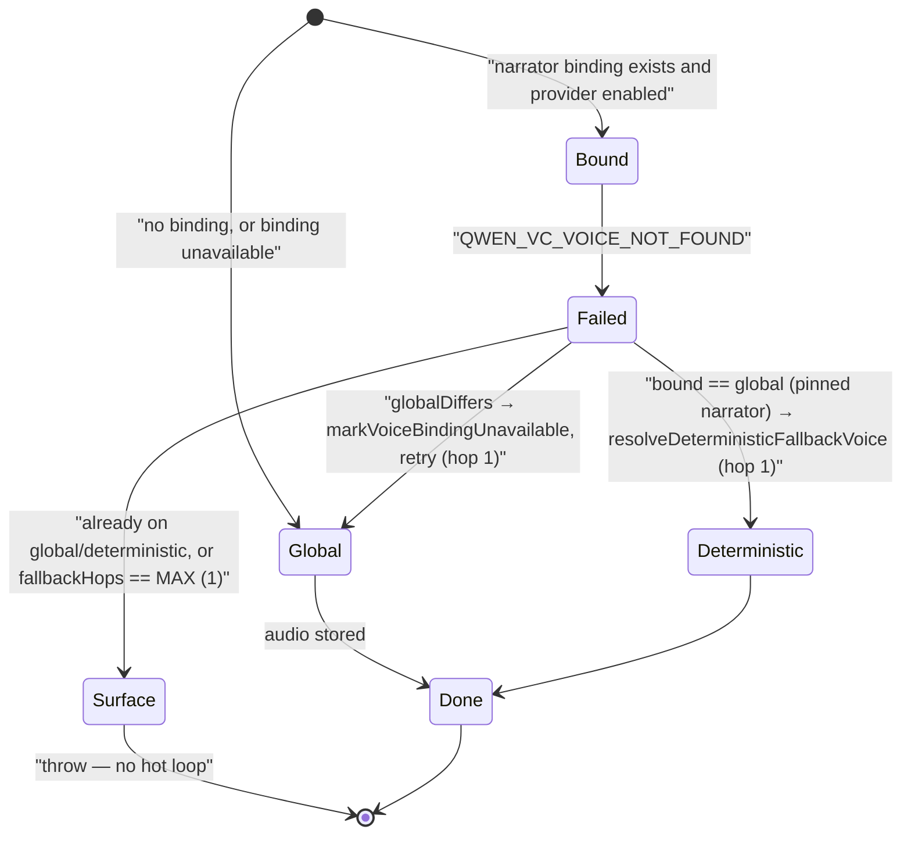
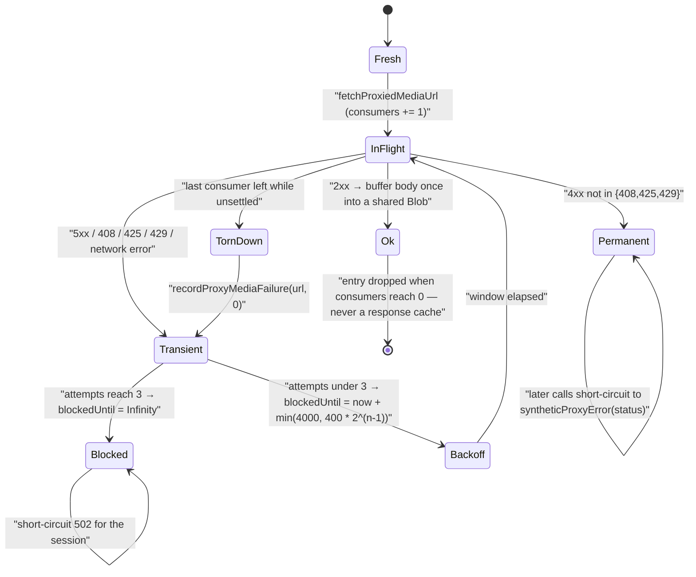
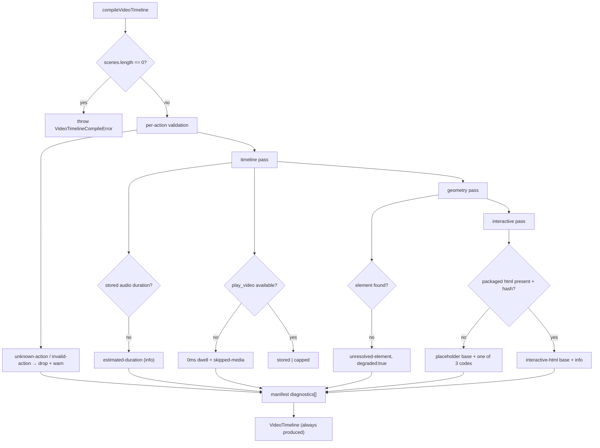
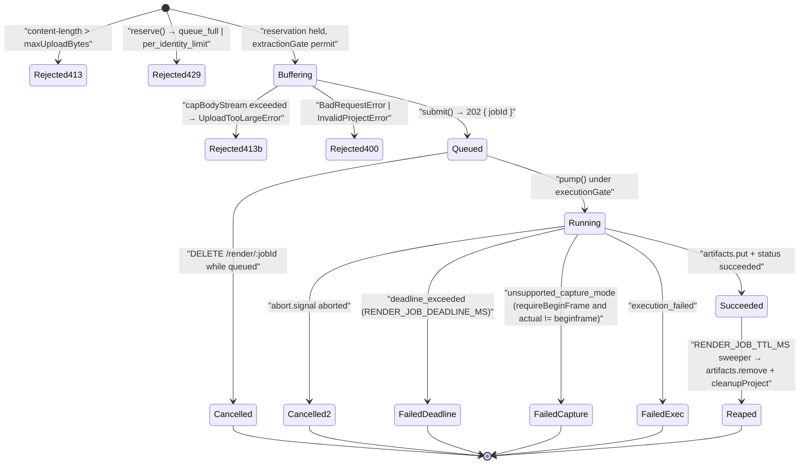

# Failure modes

The subsystem's dominant design choice is **degrade with a recorded diagnostic
rather than throw** — with a small, deliberate set of exceptions that fail loudly.
This file enumerates both.

## 1. TTS failure taxonomy

| Condition | Thrown / returned | HTTP | Where |
| --- | --- | --- | --- |
| Missing `text`/`audioId`/`ttsProviderId`/`ttsVoice` | `MISSING_REQUIRED_FIELD` | 400 | [`app/api/generate/tts/route.ts:56`](app/api/generate/tts/route.ts#L56) |
| `browser-native-tts` on the server | `INVALID_REQUEST` | 400 | route `:65`; the library also throws ([`tts-providers.ts:246`](lib/audio/tts-providers.ts#L246)) |
| Operator force-disabled the provider | `PROVIDER_DISABLED` | 403 | route `:71` |
| VoxCPM auto-voice with no prompt and no registered voice | `VOXCPM_AUTO_VOICE_REQUIRES_CONTEXT` | 400 | route `:81`; library mirror at [`tts-providers.ts:384`](lib/audio/tts-providers.ts#L384) |
| Client base URL fails SSRF | `INVALID_URL` | 403 | route `:97` |
| Keyed provider, no resolvable key | `MISSING_API_KEY` | 400 | route `:113` |
| Client model outside a managed pin list | `TTSModelNotAllowedError` (`code = 'INVALID_REQUEST'`) | 400 | [`lib/server/provider-config.ts:789`](lib/server/provider-config.ts#L789), mapped at route [`:176`](app/api/generate/tts/route.ts#L176) |
| Upstream HTTP 429 | `TTSRateLimitError` | 429 `RATE_LIMITED` | [`tts-providers.ts:193`](lib/audio/tts-providers.ts#L193), route [`:167`](app/api/generate/tts/route.ts#L167) |
| Doubao concurrency codes `45000000` / `45000292` | `TTSRateLimitError` | 429 | [`tts-providers.ts:1078`](lib/audio/tts-providers.ts#L1078) |
| Provider did not respond within `TTS_REQUEST_TIMEOUT_MS` | `TTSRequestTimeoutError` | 500 `GENERATION_FAILED` | [`tts-providers.ts:261`](lib/audio/tts-providers.ts#L261) |
| Qwen voice-clone errors (`QWEN_VC_*`) | `QwenVoiceCloneError` with its own `httpStatus` | 502 / 504 / 400 | `lib/audio/qwen-voice-clone.ts`, route `:170` |
| Ordinary Qwen TTS failure | `QwenTTSError` (`code = 'QWEN_TTS_ERROR'`) | provider status | [`tts-providers.ts:134`](lib/audio/tts-providers.ts#L134), route [`:173`](app/api/generate/tts/route.ts#L173) |
| Malformed Doubao `appId:accessKey` (empty half) | plain `Error` with a specific message | 500 | [`tts-providers.ts:1021`](lib/audio/tts-providers.ts#L1021) |
| Caller aborted | the original abort error, re-thrown verbatim | — | [`tts-providers.ts:260`](lib/audio/tts-providers.ts#L260) |

Two things this taxonomy gets right and one it does not:

- Rate limiting and timeout are **distinguished** from generic failures, and the
  timeout is distinguished from a session cancel (`isTimeoutSignal`,
  [`tts-providers.ts:182`](lib/audio/tts-providers.ts#L182)). That distinction is what lets a session cancel abort
  an in-flight synthesis within seconds instead of wedging until restart.
- `TTSRateLimitError`'s own doc comment (`:117-121`) admits the route "currently
  catches all errors uniformly as GENERATION_FAILED"; that is now stale — the
  route does map 429 (`:167`) — but no retry/backoff exists yet, so a 429 is
  surfaced to the client rather than retried.
- `TTSRequestTimeoutError` is **not** mapped to a distinct status: it falls
  through to `GENERATION_FAILED` 500 (route `:179`), so a client cannot tell a
  slow provider from a broken one without reading the message.

Client-side voice fallback ([`lib/hooks/use-scene-generator.ts:393-453`](lib/hooks/use-scene-generator.ts#L393-L453)):

`MAX_NARRATOR_VOICE_FALLBACK_HOPS = 1` ([`use-scene-generator.ts:260`](lib/hooks/use-scene-generator.ts#L260)) caps this
at two `/api/generate/tts` attempts per clip, explicitly to prevent a
`bound-dead → global-dead → deterministic-dead → …` chain.

## 2. Outbound media failure state machine

Anchors: `TRANSIENT_4XX_STATUSES` [`lib/media/proxy-media-cache.ts:118`](lib/media/proxy-media-cache.ts#L118);
`MAX_TRANSIENT_ATTEMPTS = 3` `:110`; backoff arithmetic `:159-167`; teardown
recording `:285-291`; "arriving after the shared request settled starts a FRESH
fetch" `:51-56`.

Server-side proxy failure translation (`app/api/proxy-media/route.ts`):

| Condition | Response |
| --- | --- |
| URL fails SSRF (initial or any redirect hop) | 403 `INVALID_URL` |
| Redirect without a `Location` header | 502 `UPSTREAM_ERROR` |
| More than 5 redirects | 502 `TOO_MANY_REDIRECTS` |
| Unparseable redirect target | 502 `INVALID_URL` |
| Upstream 4xx | forwarded **verbatim** (so the client cache marks it permanent) |
| Upstream 5xx | collapsed to 502 |
| `content-length` or realised size > 25 MiB | 502 `UPSTREAM_ERROR` |

## 3. Media generation failures

`generateSingleMedia` ([`lib/media/media-orchestrator.ts:229-265`](lib/media/media-orchestrator.ts#L229-L265)):

- **Abort** — the task is marked *failed with an explanatory message* rather than
  left in `generating`, and the message says a video retry submits a **new job**
  because the MaaS task keeps running to a billable terminal state server-side
  (`:230-240`).
- **Structured errorCode** — persisted to Dexie as an empty placeholder row with
  `error`/`errorCode` so the failure survives a refresh and `retryMediaTask`
  (`:79`) can distinguish it. The write is best-effort (`.catch(() => {})`).
- **Unstructured error** — store-only; a refresh re-attempts.
- `retryMediaTask` re-checks the global enable flags and marks
  `GENERATION_DISABLED` rather than calling the API (`:89-96`).

ComfyUI-specific failures (`lib/media/adapters/comfyui-image-adapter.ts`):

| Condition | Behaviour |
| --- | --- |
| Client workflow id fails the basename check | throws `"…is not a valid workflow filename."` (`:134`) |
| Client workflow id not in the live directory listing | throws, pointing at `/api/comfyui-workflows` (`:139`) — **no silent fallback**, so the filesystem cannot be probed |
| No workflow files at all in `public/` | throws, pointing at `comfyui-setup-instructions.md` (`:158`) |
| Resolved path escapes `public/` | throws (`:177`) |
| Prompt node absent | throws with the required node titles (`:316`) |
| Prompt node has no `inputs` object | throws, telling the operator to re-export in API format (`:325`) |
| `Width`/`Height` or `Empty Flux 2 Latent` absent or malformed | **warn only**, workflow defaults used (`:349`, `:371`, `:380`) |
| `KSampler` absent or malformed | **warn only**, seed not randomised (`:396`, `:400`) — repeated generations then return identical images |
| Failed ComfyUI history entry | reason lifted from the `execution_error` message tuple (`extractExecutionError`, `:434`) |

## 4. Compiler degradation — thirteen diagnostic codes

Only `VideoTimelineCompileError` ([`lib/video-export/ir.ts:424`](lib/video-export/ir.ts#L424)) is thrown, and
only for "no scenes" ([`passes/normalize.ts:94`](lib/video-export/passes/normalize.ts#L94)). Everything else degrades:

| Code | Trigger | Degradation |
| --- | --- | --- |
| `unknown-action` | `!isActionType(action.type)` | action dropped | 
| `invalid-action` | required field missing (`elementId`, `text`, `code`, `topic`) | action dropped |
| `estimated-duration` | no stored audio duration | `estimateSpeechDurationMs` used; `audio.source = 'estimated'` |
| `missing-audio` | narration has text but `AssetSource.audio()` returned `null` | estimated timing, no plan entry |
| `skipped-media` | asset referenced but bytes unavailable, or no media associated with a `play_video` | for video: `durationSource = 'skipped'` and a **0 ms** dwell so later actions do not shift |
| `unresolved-element` | effect/video `elementId` has no geometry | `geometry: null`, `degraded: true` |
| `unsupported-scene` | scene family the compiler cannot render | `base.kind = 'placeholder'` + a whole-scene marker |
| `cover-card` | Quiz/PBL rendered as a static cover | deterministic cover visual |
| `quiz-layout-unavailable` | question list could not be measured | stays on the cover-only path |
| `interactive-static-html` | HTML packaged successfully | info-level note |
| `missing-interactive-html` | scene has no embedded HTML | placeholder base |
| `interactive-html-packaging` | preparation failed or exceeded its bound | placeholder base |
| `unresolved-interactive-resource` | an external/relative resource remained | placeholder base |

Note the asymmetry in `resolveVideoDurationMs`
([`lib/choreography/timeline.ts:161`](lib/choreography/timeline.ts#L161)): choreography's default policy for an
unresolved `play_video` duration is `'throw'` — "a missing duration would
silently shift later actions early" — but the exporter's `probe` pass overrides
it to `'cap'` ([`passes/probe.ts:41`](lib/video-export/passes/probe.ts#L41)) because it "prefers to degrade with a
diagnostic over failing the whole compile". The `capped` vs `stored`
`durationSource` label exists so a consumer cannot mistake the 5-minute cap for a
real clip length ([`passes/timeline.ts:237-244`](lib/video-export/passes/timeline.ts#L237-L244)).

## 5. Collection and packaging failures

`collectVideoAssets` never throws for one bad asset: each entry is wrapped in
`try/catch` and pushed to `missing` ([`lib/video-export-app/collect.ts:386-388`](lib/video-export-app/collect.ts#L386-L388)).
`missing.length` surfaces to the user only as a warning toast
([`use-export-video.ts:60-64`](lib/video-export-app/use-export-video.ts#L60-L64), [`lib/store/video-render.ts:240`](lib/store/video-render.ts#L240)).

Bounded sub-failures that cannot wedge an export:

| Probe | Bound | On failure |
| --- | --- | --- |
| `probeVideoDurationMs` / `probeAudioDurationMs` | `PROBE_TIMEOUT_MS = 10_000` watchdog per blob | resolves `null` → compiler estimates or caps |
| `decodeFirstFramePosterUrl` | `FIRST_FRAME_TIMEOUT_MS = 8000` | resolves `null`; also catches CORS-tainted canvas ([`collect.ts:107`](lib/video-export-app/collect.ts#L107)) |
| `measureSlideElementGeometry` | wrapped in `try/catch` | degrades to the authored-box calc ([`timeline-deps.ts:491-494`](lib/video-export-app/timeline-deps.ts#L491-L494)) |
| `accessDocument(stage.id)` | `.catch(() => undefined)` | falls back to `stage.name` then `'classroom'` ([`build-export-zip.ts:91`](lib/video-export-app/build-export-zip.ts#L91)) |
| legacy `audioUrl` fetch | `fetchMediaUrl(url, 15_000)` in `try/catch` | clip stays missing ([`timeline-deps.ts:299-301`](lib/video-export-app/timeline-deps.ts#L299-L301)) |

`packageVideoZip` is the exception: a failed GSAP or vendor-font fetch **throws**
([`package-zip.ts:37`](lib/video-export-app/package-zip.ts#L37), [`:43`](lib/video-export-app/package-zip.ts#L43)), failing the whole export. That is correct — a ZIP
without GSAP renders nothing.

## 6. Render-service failure modes

Invariants worth calling out:

- **Every failure path releases the reservation.** [`main.ts:322-330`](render-service/src/main.ts#L322-L330) calls
  `coordinator.release(reservation)` and `cleanupProject(projectDir)` before
  translating the error, and the comment at `:276` states the rule.
- **Non-success always cleans up.** `finishNonSuccess`
  ([`render-coordinator.ts:242`](render-service/src/render-coordinator.ts#L242)) puts `cleanupProject` in a `finally`, and
  `cleanupProject` (`:334`) removes the project dir plus the derived plan dir,
  `.local.json`, and `.chunks` siblings — all `.catch(() => {})`.
- **A succeeded-but-aborted job is reported cancelled.** `run()` re-checks
  `abort.signal.aborted` *after* a successful execution (`:292`) so a cancel
  racing completion does not produce a downloadable artifact.
- **`accepting` is aggregate-only.** `/health` never publishes queue depths or
  per-identity data, because identity keys are client IPs behind a trusted proxy
  and publishing them would leak active users' addresses
  ([`render-coordinator.ts:123-129`](render-service/src/render-coordinator.ts#L123-L129)).

Archive rejection (`render-service/src/unzip.ts`) happens on **declared** sizes
before any decompression:

| Guard | Limit | Anchor |
| --- | --- | --- |
| Entry count | `maxEntries` 5000 | `:42` |
| Single expanded entry | `maxEntryBytes` 200 MiB | `:45` |
| Expansion ratio (`originalSize / size`) | `maxCompressionRatio` 200 | `:50` |
| Total expanded | `maxExpandedBytes` 512 MiB | `:54` |
| Path traversal | `relative(destRoot, target)` must not start with `..` | `:82` |
| Missing `index.html` | required, root or one level down | `:74` |

Preview failures map to distinct statuses ([`main.ts:399-412`](render-service/src/main.ts#L399-L412)): 413 too large,
400 malformed, **422** a valid payload whose scene cannot produce a faithful
preview (`UnprocessablePreviewError` from `previewabilityError`), 429 admission
or `capacity_busy`, 504 deadline, 500 otherwise.

## 7. Fail-closed cases

Three places deliberately refuse to continue:

1. **Egress lockdown.** `RENDER_EGRESS_LOCKDOWN=true` (the default) with no root,
   no iptables, or failing rules → `exit 1`, with the reasoning spelled out: a
   started-but-unisolated service would still report `/health: ok` and the app
   would advertise MP4 rendering while Chromium could reach the app
   ([`docker-entrypoint.sh:16-21`](render-service/docker-entrypoint.sh#L16-L21), [`:51-63`](render-service/docker-entrypoint.sh#L51-L63)).
2. **Resource-profile validation.** `validateResourceProfileStartup`
   ([`resource-profile.ts:138`](render-service/src/resource-profile.ts#L138)) throws below the memory floor, and throws when a
   BeginFrame profile has no existing `PRODUCER_HEADLESS_SHELL_PATH`.
   `assertCompatibleEnvironment` (`:75`) throws on any conflicting override
   instead of silently honouring it: *"Select a different resource profile
   instead of overriding it."*
3. **Manifest validation.** `emitManifest` ([`passes/emit.ts:28`](lib/video-export/passes/emit.ts#L28)) re-parses the IR
   through zod; a malformed IR is a compiler bug and fails at the compiler.

## 8. Whiteboard failure modes

| Condition | Error | Consequence |
| --- | --- | --- |
| Two active whiteboard sessions for one (stage, learner) | `WhiteboardRuntimeSessionAmbiguousError` | read/append refuse |
| Any inactive session present | `WhiteboardRuntimeSessionInvariantError` | read/append refuse |
| `expectedLastSeq` stale | `RuntimeAppendConflictError` | caller must re-read and retry |
| Same `operationId`, different canonical digest | `WHITEBOARD_RUNTIME_OPERATION_CONFLICT` | fold refuses the whole stream |
| `seq !== index` | `WHITEBOARD_RUNTIME_RECORD_SEQUENCE_INVALID` | fold refuses |
| Record carries `sceneId`/`actionIndex`/`subAnchor` | `WHITEBOARD_RUNTIME_RECORD_ANCHOR_INVALID` | fold refuses |
| `legacy_snapshot_imported` after any state | `WHITEBOARD_RUNTIME_IMPORT_AFTER_STATE` | append refuses (checked in both the service and the fold) |
| Clear on a missing / empty board | `WhiteboardRuntimeNoChangeError('whiteboard_missing' \| 'whiteboard_empty')` | dry-run rejects before any record is written |
| Edited code element is not canonical after the edit | `WHITEBOARD_RUNTIME_CODE_ELEMENT_NOT_CANONICAL` | append refuses |
| Post-commit re-fold disagrees with the appended seq | `WHITEBOARD_RUNTIME_POST_COMMIT_VERIFICATION_FAILED` | loud — a storage bug |

`refreshWhiteboardRuntimeProjection` is the one place that swallows everything:
it returns `false` on any error ([`browser-projection.ts:42-44`](lib/whiteboard/runtime/browser-projection.ts#L42-L44)), so a projection
failure leaves the previous board on screen rather than blanking the canvas.
