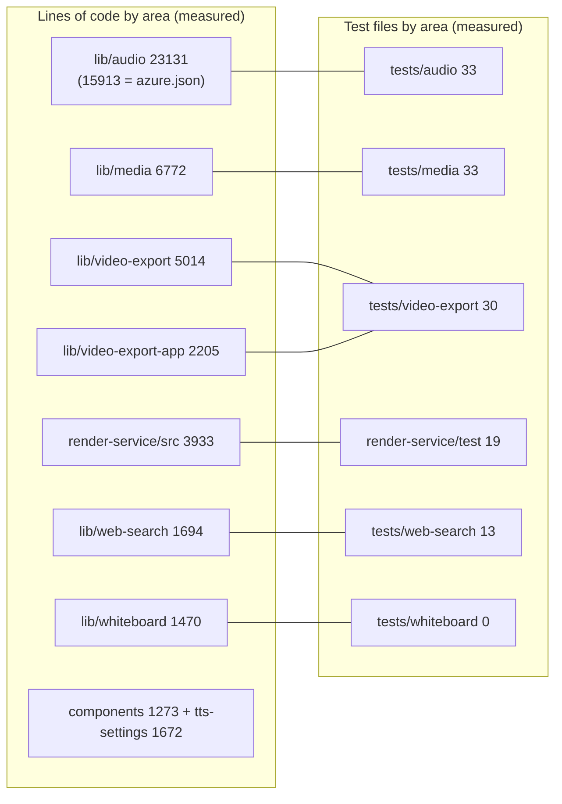
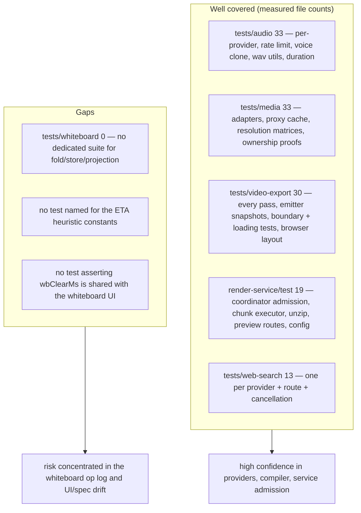

# Quality observations and measured metrics

## 1. Measured metrics

Every number below is followed by the exact command that produced it, run from
the repo root at commit `c2c9553a`.

| Metric | Value | Command |
| --- | --- | --- |
| Total lines in scoped source | 47 909 | `git ls-files lib/audio lib/media lib/whiteboard lib/video-export lib/video-export-app render-service/src lib/web-search app/api/export-video app/api/transcription app/api/azure-voices app/api/comfyui-workflows app/api/proxy-media app/api/web-search components/audio components/whiteboard components/settings/tts-settings.tsx \| xargs wc -l \| sort -rn \| head -1` |
| `lib/audio` | 28 files / 23 131 lines | `git ls-files lib/audio \| wc -l`; `git ls-files lib/audio \| xargs wc -l \| tail -1` |
| … of which `lib/audio/azure.json` | 15 913 lines (69 % of `lib/audio`) | same `wc -l` listing, first row |
| `lib/media` | 39 files / 6 772 lines | `git ls-files lib/media \| wc -l`; `… \| xargs wc -l \| tail -1` |
| `lib/media/adapters` | 14 files | `git ls-files lib/media/adapters \| wc -l` |
| `lib/whiteboard` | 7 files / 1 470 lines | `git ls-files lib/whiteboard \| wc -l`; `… \| xargs wc -l \| tail -1` |
| `lib/video-export` | 29 files / 5 014 lines | `git ls-files lib/video-export \| wc -l`; `… \| xargs wc -l \| tail -1` |
| `lib/video-export-app` | 12 files / 2 205 lines | as above |
| `lib/web-search` | 14 files / 1 694 lines | as above |
| `render-service/src` | 17 files / 3 933 lines | as above |
| `components/whiteboard` | 3 files / 840 lines | as above |
| `components/audio` | 2 files / 433 lines | as above |
| Largest scoped files | `components/settings/tts-settings.tsx` 1 672; `lib/audio/constants.ts` 1 454; `lib/video-export/emit-hyperframes/index.ts` 1 404; `lib/audio/tts-providers.ts` 1 110; `render-service/src/chunk-executor.ts` 926 | `git ls-files <scope> \| xargs wc -l \| sort -rn \| head -10` |
| Test files: `tests/audio` | 33 | `git ls-files 'tests/audio/*' \| wc -l` |
| Test files: `tests/media` | 33 | `git ls-files 'tests/media/*' \| wc -l` |
| Test files: `tests/video-export` | 30 | `git ls-files 'tests/video-export/*' \| wc -l` |
| Test files: `render-service/test` | 19 | `git ls-files 'render-service/test/*' \| wc -l` |
| Test files: `tests/web-search` | 13 | `git ls-files 'tests/web-search/*' \| wc -l` |
| Test files: `tests/whiteboard` | **0** | `git ls-files 'tests/whiteboard/*' \| wc -l` |
| Total repo test files | 680 | `git ls-files tests \| wc -l` |
| Vendored export fonts | 25 files / 2.0 MiB | `ls public/vendor/video-export/fonts \| wc -l`; `du -sh public/vendor/video-export/fonts` |
| Vendored GSAP | 71.2 KiB | `ls -la public/vendor/gsap.min.js` |
| Committed ComfyUI example workflow | 4.7 KiB | `ls public/*.json` |
| Explicit `: any` annotations in scope | 0 | `rtk grep -c ": any" lib/audio lib/media lib/video-export lib/video-export-app lib/whiteboard lib/web-search render-service/src` |
| ` as any` / ` as unknown as ` casts in scope | 3 (in 3 files) | `rtk grep -c " as unknown as \| as any" <same scope>` |
| Bare `catch {` blocks in `lib/audio`, `lib/media`, `lib/video-export-app` | 32 (in 14 files) | `rtk grep -c "catch \{" lib/audio lib/media lib/video-export-app` |
| `TODO`/`FIXME`/`HACK`/`XXX` in scope | 1 (`lib/audio/tts-providers.ts:120`) | `rtk grep -c "TODO\|FIXME\|HACK\|XXX" <scope>` |
| Commits touching `lib/video-export` or `render-service` since 2026-06-01 | 21 | `git log --oneline --since=2026-06-01 -- lib/video-export render-service \| wc -l` |
| IR diagnostic codes | 13 | `lib/video-export/ir.ts:80-94` enum members |
| Compiler passes | 8 named + 1 inline (`markUnsupported`) | `lib/video-export/compile.ts:152-202` |
| TTS providers / ASR providers | 10 / 6 built-in | `lib/audio/types.ts:82-92`, `:179-185` |
| Image / video / web-search providers | 8 / 6 / 9 | `lib/media/types.ts:73`, `:194`; `lib/web-search/types.ts:8` |

## 2. What is genuinely well built

**The purity boundary is machine-enforced, not aspirational.**
`eslint.config.mjs:348-492` blocks `@/…` string literals *and* template literals,
`react`/`react-dom`/`gsap`/`framer-motion`/`motion` imports, `import()` and
`require()` across `lib/video-export/**`, with a *depth-specific* relative-import
allowlist so a single `../` means different things at root vs `passes/`. There is
also a test asserting the boundary (`tests/video-export/eslint-boundary.test.ts`)
and an LLM-entry guard listing `lib/video-export/probe`
(`tests/lint-llm-entry-guard.test.ts:53`). This is the difference between a
documented convention and an invariant.

**One numeric source of truth for playback timing.** `lib/choreography/timing.ts`
holds the literals with a header explaining that they were moved *verbatim* from
`lib/action/engine.ts` and `lib/playback/engine.ts` so "if either side
re-implemented them, the exported video would silently drift whenever the app is
tuned". `resolveActionTimeline` reads the blocking/non-blocking partition from the
DSL's `FIRE_AND_FORGET_ACTIONS` rather than hardcoding it (`timeline.ts:51`).

**`clampFireAndForgetLifetimes` is unusually careful.**
`lib/choreography/timeline.ts:368` models three real engine behaviours that a
naive 5-second lifetime would get wrong: scene-boundary teardown, completion
teardown, and the fact that `ActionEngine.scheduleEffectClear` uses *one* shared
timer that each new effect resets — so back-to-back effects are *extended*, not
cleared on their own schedule. The chain-break condition even handles exact
equality with a stated reason (`:392-396`).

**Diagnostics as a first-class product.** Thirteen stable codes, every degradation
recorded, and the manifest doubles as an export report
(`lib/video-export/ir.ts:61-94`). `AssetPlanEntry.present: false` keeps a
referenced-but-missing asset *structurally* representable so the emitter can tell
"no association" (no `assetId`) from "referenced but missing" (`assetId` present,
`present: false`) without parsing message strings (`passes/assets.ts:204-208`).

**Identity-keyed rather than id-keyed lookups, with the reason written down.**
`resolveAvailableVideos` keys by action object identity because the DSL does not
enforce stage-wide action-id uniqueness (`compile.ts:126-135`).
`mediaRefBySceneElement` is keyed by scene because element ids are only
slide-unique (`timeline-deps.ts:335-341`). `AssetPlanner.owners` is keyed by
`(kind, assetId)` because one ref may legitimately be both narration audio and
video media (`passes/assets.ts:59`). Each of these is a bug class that was found
and then documented at the fix site.

**`proxy-media-cache.ts` is a serious piece of concurrency engineering.** One real
request per URL with an internal `AbortController`, per-caller signal racing so
one caller's cancel cannot poison the URL for others, a single buffered `Blob`
that N consumers wrap without copying, and an explicit non-goal ("deduplication
covers the concurrency window only and never acts as a response cache",
`:51-56`). It even exposes `proxyMediaRetainedBodyCount()` so tests can assert
zero retention.

**The SSRF guard covers tunnel encodings.** 6to4, Teredo and ISATAP embedded-IPv4
unwrapping (`lib/server/ssrf-guard.ts:217-241`) plus IPv4-mapped IPv6 and cloud
metadata addresses. Redirects are re-validated per hop in `/api/proxy-media`
(`:55`) and outright rejected in `/api/azure-voices` (`:43`).

**Defence in depth on the ComfyUI path.** Three independent checks on one
client-controlled value — basename/traversal, live directory allowlist,
post-resolve prefix check — with the comment that `path.join` alone does not stop
`..` (`comfyui-image-adapter.ts:171-178`). And the workflow-name predicate is
shared by the API route and the adapter so "a filename the UI offers is always a
filename the adapter will accept" (`comfyui-workflows.ts:5-9`).

**The render container fails closed.** `docker-entrypoint.sh:16-21` names the
exact failure it is preventing: an unisolated service whose `/health` still says
ok, causing the app to advertise MP4 rendering while Chromium could reach the
app. Combined with `resource-profile.ts:75` refusing conflicting overrides rather
than honouring them, the operational posture is "refuse to run wrong" rather than
"warn and continue".

**Admission before buffering.** `main.ts:216-228` states the ordering as the
security boundary and the code matches: `reserve()` → `extractionGate.run(...)` →
`formData()`. So at most `maxConcurrentExtractions` (1 in both profiles) bodies
are ever in memory, and everything else is backpressured on the socket.

**Audio duration is measured once at the right moment.** Storing `duration` on
the `AudioFileRecord` at TTS time is what makes the compiler's whole DI surface
synchronous — and the sniff-before-hint rule in `measureAudioDuration:198-208`
prevents a wrong `Content-Type` from false-syncing WAV bytes through the MP3
parser.

## 3. What is fragile

**`tests/whiteboard/` does not exist.** The whiteboard runtime is 1 470 lines of
optimistic-concurrency, canonical-digest, replay-verified logic with ten distinct
error codes, and there is no test directory for it (measured: 0 files). Some
coverage may exist elsewhere under `tests/`, but there is no dedicated suite for
`fold.ts` / `store.ts`, which is where an off-by-one in `seq` handling or a digest
regression would silently corrupt a board.

**The whiteboard clear-animation duration is duplicated, not shared.**
`components/whiteboard/index.tsx:81` computes `Math.min(380 + elementCount * 55,
1400)` inline while `lib/choreography/timing.ts:72` exports `wbClearMs` with
exactly that formula — and the choreography header is explicit that duplicated
literals are the drift risk it exists to eliminate. The component could import
`wbClearMs`; today a change to the constant fixes the exporter and leaves the UI
behind (or vice versa).

**`lib/audio/constants.ts` is a 1 454-line hand-maintained registry** sitting next
to a 15 913-line generated `azure.json`. Adding a provider means edits in four
places (`types.ts` union, `constants.ts` registry, `tts-providers.ts` switch,
`lib/i18n.ts`) — the file documents this as a five-step procedure
(`types.ts:29-49`), which is honest but is still four opportunities to get out of
sync. `DEFAULT_TTS_VOICES` / `DEFAULT_TTS_MODELS` (`:1336`, `:1349`) are
`Record<BuiltInTTSProviderId, …>` so the compiler at least catches a missing
provider there.

**`components/settings/tts-settings.tsx` is 1 672 lines** — the largest file in
scope, and larger than the entire `lib/whiteboard` package. Nothing in the code
suggests it has been decomposed.

**`TTSRequestTimeoutError` is not distinguishable over HTTP.** It is a typed error
with a specific message telling the caller to retry, but the route maps it to
`GENERATION_FAILED` 500 (`app/api/generate/tts/route.ts:179`) alongside every
other failure. The client's `withGenerationRetry` retries on payload shape, not on
this class.

**The SSRF asymmetry on `/api/transcription`.** The check is gated on
`process.env.NODE_ENV === 'production'` (`:57`), while `/api/generate/tts`
(`:98`), `/api/azure-voices` (`:29`) and `/api/proxy-media` (`:33`) check
unconditionally. There is no comment justifying the difference, and a dev/staging
build with `NODE_ENV !== 'production'` accepts an arbitrary client `baseUrl` for a
server-side multipart POST.

**32 bare `catch {}` blocks across `lib/audio`, `lib/media`,
`lib/video-export-app`.** Most are deliberate and commented (a probe timing out,
a best-effort Dexie write). But `refreshWhiteboardRuntimeProjection` swallowing
every error and returning `false` (`browser-projection.ts:42`) means a genuine
storage fault is indistinguishable from "nothing to project", and
`quiz-layout.ts:212` / `timeline-deps.ts:491` silently degrade measurement with no
diagnostic reaching the manifest — unlike every *compiler* degradation, which
does.

**`Math.random()` in the ComfyUI seed patch.** `comfyui-image-adapter.ts:391`
randomises the KSampler seed, which is right for generation but means an image
cannot be reproduced from the stored `params` JSON. If the `KSampler` node is
absent the adapter only warns, so a workflow without it silently produces
identical images on every retry (`:400`).

**`decodeFirstFramePosterUrl` returns a data URL.** `collect.ts:106` uses
`canvas.toDataURL('image/png')` for a full video frame, embedded into the cloned
slide before snapshotting. At 4K that is a multi-megabyte base64 string per video
element, and the comment notes there is "no object-URL lifecycle to revoke"
(`:288-292`) — i.e. it lives until the clone is dropped.

**The ETA model is a heuristic with a known non-uniform workload.**
`lib/store/video-render.ts:39-46` documents that the render is not uniform (prep →
capture, which drops 4→1 worker mid-way, → encode) and smooths *speed* rather than
the run average. It is a reasonable design, but `SPEED_SMOOTHING = 0.3` and
`ETA_MIN_PERCENT = 3` are unvalidated constants with no test named for them.

**`MAX_POLL_ATTEMPTS` allows a one-hour client poll** (`video-render.ts:36`:
`ceil(3_600_000 / 3000)` = 1200 attempts) while the service's own
`RENDER_JOB_DEADLINE_MS` default is 45 minutes. The client therefore keeps
polling for ~15 minutes after the server has already given up; it will see the
`failed` status, so this is wasted work rather than a correctness bug.

**Chunked execution mutates `process.env` in place.**
`chunk-executor.ts:621-640` and `:816-871` save, overwrite and restore
`PRODUCER_MAX_WORKERS` around producer calls. With `maxConcurrency` fixed at 1 by
both resource profiles this is safe today, but it is a global mutation that would
race the moment concurrency rose above one.

**`lib/video-export/emit-hyperframes/index.ts` is 1 404 lines** and mixes HTML
string assembly, CSS generation, a text-metrics/line-count layout estimator, the
README generator, and the composition script. The file's own comment concedes the
cover layout numbers are "less than a proof" and are backed by a browser test
(`:978`).

## 4. Coverage shape

Notable test *shapes* (not just counts) that indicate maturity:

- `tests/video-export/eslint-boundary.test.ts` runs ESLint programmatically over
  synthetic source at `lib/video-export/emit-hyperframes/probe.ts` and asserts
  `no-restricted-syntax` fires for `@/lib/store`, `../../store` (import, named
  re-export and star re-export), `react`, `import()` and `require()` — while
  allowing the one intentional app-module dependency, the pure Quiz math renderer
  at `../../quiz/math-text` (`:17-27`, matching `eslint.config.mjs:493-499`).
- `tests/video-export/export-loading-boundary.test.ts` asserts the dynamic-import
  boundary keeps the compiler out of the always-loaded bundle.
- `tests/security/iframe-sandbox.test.ts:52` extracts sandbox attribute values
  out of `lib/video-export/emit-hyperframes/index.ts` and asserts packaged
  interactive HTML stays in a null-origin sandbox.
- `tests/media/resolve-stored-bytes-equivalence.test.ts` freezes the pre-refactor
  behaviour of `collect.ts` at a named commit and asserts equivalence.
- `render-service/test/fixtures/hanging-chunk-worker.mjs` exists specifically to
  exercise the hung-worker path.
- `tests/video-export/e2e-materialize.test.ts` can materialise a real project to
  `HF_E2E_DIR` for an actual `hyperframes` run.
