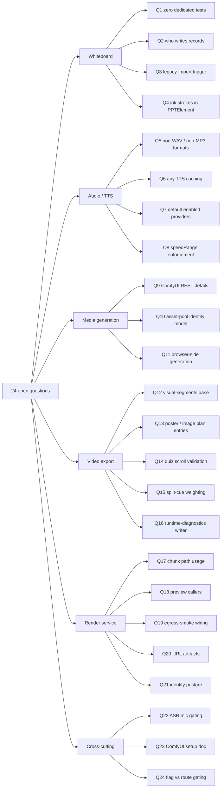

# Open questions

Things this survey could not settle from the code in `lib/audio`, `lib/media`,
`lib/whiteboard`, `lib/video-export`, `lib/video-export-app`, `lib/web-search`,
the in-scope `app/api/` routes, `components/audio`, `components/whiteboard` and
`render-service`. Each entry says what was checked and why the answer is not in
scope.

## 1. Whiteboard

**Q1. Is there any test coverage for `lib/whiteboard/runtime/**`?**
`git ls-files 'tests/whiteboard/*'` returns 0. Coverage may exist under another
directory (`tests/runtime/`, `tests/storage/`, package-level tests in
`packages/@openmaic/storage`), but nothing in the whiteboard modules names a test
file, and a repo-wide search for the whiteboard error codes was not performed
because it would leave the scoped subsystem.

**Q2. Who actually calls `getWhiteboardRuntimeService()` in production?**
`lib/whiteboard/runtime/store.ts:313` says "Internal foundation service. No
Agent/UI caller is registered in PR1." The only in-scope caller is
`refreshWhiteboardRuntimeProjection` (read path). The **write** path — which
agent tool or UI action builds a `WhiteboardRuntimePayloadV1` and calls `append`
— lives in `lib/agent-runtime/tools/classroom-actions.ts` (out of scope; a grep
showed `wb_open` / `wb_clear` tool definitions there but the append call site was
not traced).

**Q3. What produces `legacy_snapshot_imported` records, and when?**
`lib/whiteboard/runtime/legacy-import.ts` exists (150 lines) and references
`process.env.NEXT_PUBLIC_PERSISTENCE !== '1'` at `:45`, but the file was not read
in full, so the exact trigger condition and the `stage.whiteboard[0]` →
`Whiteboard` mapping are unverified.

**Q4. Are there freehand/ink strokes anywhere?**
Nothing in the operation model or the canvas component suggests it — every
primitive is a `PPTElement`. But the `PPTElement` union is defined in
`@openmaic/dsl` (out of scope), so whether a path/ink element *type* exists in
that union is unconfirmed.

## 2. TTS / audio

**Q5. What is the actual audio format contract at the storage layer?**
`measureAudioDuration` handles only WAV and MP3 and its header says those are
"the two formats OpenMAIC's TTS providers actually emit"
(`lib/audio/audio-duration.ts:12-14`). But `getAudioResponseFormat`
(`tts-providers.ts:438`) can return `flac`, `ogg` and `webm`, and
`TTSProviderConfig.supportedFormats` is an open `string[]`. So a provider
returning FLAC would be stored with `duration: undefined` and fall back to a text
estimate. Whether any configured provider does this in practice depends on the
per-provider `supportedFormats` arrays, which were not enumerated for all ten
providers.

**Q6. Is there any caching of TTS output?**
No cache was found: `/api/generate/tts` synthesizes on every call and the client
writes the result to Dexie keyed by `audioId`. `resolveAudioBlob`
(`lib/media/resolve-audio-bytes.ts:15`) reads pool-first then Dexie, which is
*reuse* of a previously stored clip rather than a cache with invalidation. Whether
an "asset pool" layer (`lib/media/asset-pool.ts`, `asset-pool-config.ts`) does
content-addressed dedup of identical narration text was not determined — those two
files were not read.

**Q7. Which providers are actually reachable in a default deployment?**
`enabledServerTTSProviderIds()` (`lib/server/provider-config.ts:762`) derives this
from `getConfig().tts`, i.e. from `server-providers.yml` plus env. No default
YAML file is committed (`loadYamlFile` returns `{}` when absent,
`provider-config.ts:220`), so with no env vars the answer is "none server-managed;
the client must supply keys". Whether the shipped `.env.example` or docs set any
is out of scope.

**Q8. What are the `speedRange` values per provider, and does anything enforce
them?** `TTSProviderConfig.speedRange` exists (`lib/audio/types.ts:141`) and the
UI presumably clamps, but only ElevenLabs clamps server-side
(`tts-providers.ts:911`, `[0.7, 1.2]`). Azure/Qwen/Doubao convert `speed` into
provider-specific rate units without a range check. Whether the settings UI
prevents out-of-range values was not verified (`components/settings/tts-settings.tsx`
was not read).

## 3. Media generation

**Q9. Where does the ComfyUI adapter's output actually come from?**
`loadWorkflow`/`patchWorkflow` and the polling constants were read, but the
queue/history/fetch functions (`queuePrompt`, `pollHistory`,
`fetchImageAsBase64`) past line ~440 of the 682-line adapter were not, so the
exact `/prompt` and `/history` request shapes and the `SaveImage` node
expectations are unverified.

**Q10. What does `lib/media/asset-pool.ts` + `asset-manifest.ts` +
`reclaim-stage-assets.ts` do?** These are referenced by
`timeline-deps.ts` (via `enumerateAssetManifest`) and by
`resolve-audio-bytes.ts` (via `withAssetUrl`), and there are tests
(`tests/media/asset-pool.test.ts`, `asset-manifest.test.ts`,
`reclamation-matrix.test.ts`, `prove-exclusive-ownership.test.ts`), but the
modules themselves were not read. The "pool" is clearly an authoritative byte
store that supersedes the Dexie compatibility rows; its identity/GC model is
unverified.

**Q11. Does image generation ever run in the browser?**
`comfyui-image-adapter.ts:193-200` keeps a browser branch and says it "is
currently unreachable for real generations". Whether any other adapter is invoked
client-side (e.g. from a connectivity test in settings) was not traced.

## 4. Video export

**Q12. What are `visual-segments` bases used for?**
`BaseSegmentSchema` includes `{ kind: 'visual-segments' }`
(`lib/video-export/ir.ts:119`) but no pass in `compile.ts` was observed producing
it — `timeline` sets `slide-snapshot` or `placeholder`, `interactive` sets
`interactive-html`, and `visuals` adds to `scene.visuals` rather than replacing
`base`. It may be dead, or set inside `passes/visuals.ts` past line 110 (only the
first 110 lines were read).

**Q13. `AssetKind` includes `'poster'` and `'image'` — who plans them?**
`passes/assets.ts` only plans `frame`, `html`, `audio` and `video` entries, yet
`collect.ts:367-380` has handlers for `image` and `poster`. Either another code
path plans them or those branches are currently unreachable. Not determined.

**Q14. Are Quiz question-list scroll timings validated against real renders?**
`passes/visuals.ts:90-95` fixes `QUIZ_SCROLL_PX_PER_SECOND_720P = 96` and a
4–24 s clamp. `tests/video-export/cover-card-layout.browser.test.ts` measures
cover layout in a browser, but whether it asserts the scroll timing (as opposed to
panel geometry) was not checked.

**Q15. How does `split-cue.ts` weight cue splits exactly?**
The file (294 lines) was not read; only its role (character-weighted line-sized
cues, invoked from `passes/timeline.ts:143`) is established from the call site and
the module header quoted in `lib/video-export/index.ts`.

**Q16. What does `runtime-diagnostics.ts` collect at render time?**
`RUNTIME_DIAGNOSTIC_CODES` is imported by the emitter (`emit-hyperframes/index.ts:34`)
and a ``
sink plus `window.__openmaicVideoManifest.runtimeDiagnostics` are emitted, but the
19-line module was not read and nothing in scope was observed *writing* to that
sink apart from the interactive bridge.

## 5. Render service

**Q17. Is chunked execution used anywhere by default?**
`RENDER_CHUNK_EXECUTION` defaults to `false` (`config.ts:60`) and compose passes
`${RENDER_CHUNK_EXECUTION:-false}`. `chunk-executor.ts` is 926 lines — the largest
file in the service — for an off-by-default path. Whether it is exercised in CI
beyond `render-service/test/chunk-executor.test.ts` is unknown.

**Q18. Who calls `POST /preview`?**
The route, gate, validation and renderer all exist, and compose comments say
"Preview callers send a durable owner identity in x-openmaic-client"
(`docker-compose.yml:120-122`), but no in-scope app code calls it. The caller is
presumably in the editor/snapshot path (out of scope).

**Q19. What is `render-service/scripts/egress-smoke.sh` wired into?**
The file exists; its contents and whether CI runs it were not examined.

**Q20. Does `LocalDiskArtifactStore` ever return a `{kind:'url'}` location?**
`main.ts:453` handles a 302 redirect for "presigned-URL stores (demo layer)", but
`artifact-store.ts` is 42 lines and was not read, so whether the local
implementation can ever produce that branch is unconfirmed.

**Q21. Is `RENDER_MAX_JOBS_PER_USER=0` (the compose default) the right posture?**
The compose comment explains it: without `TRUST_PROXY_HEADERS` every caller
collapses to `'direct'`, so a per-identity limit of 1 would throttle the whole
deployment to one render (`docker-compose.yml:111-117`). Whether any deployment
guide tells operators to set both together was not checked.

## 6. Cross-cutting

**Q22. Where is the ASR mic UI's availability gate?**
`components/audio/speech-button.tsx` (168 lines) and `lib/audio/asr-enablement.ts`
(10 lines) exist, and the CHANGELOG mentions "gate the speech button on ASR
availability", but neither file was read.

**Q23. What exactly does `comfyui-setup-instructions.md` require of a workflow?**
The adapter's error messages point at it (`comfyui-image-adapter.ts:160`, `:327`)
and it is in the declared scope, but the document itself was not read — so the
authoritative list of required node titles as documented for operators is not
reproduced here. The adapter's own expectations are: a node titled
`Input Prompt` (or `String (Multiline - Prompt)`), optionally `Width` + `Height`
primitives or an `Empty Flux 2 Latent`, optionally `KSampler`, exported in **API
format** (so each node has an `inputs` object).

**Q24. Do the `NEXT_PUBLIC_*` flags gate anything server-side?**
`NEXT_PUBLIC_ENABLE_VIDEO_EXPORT` is read only in
`lib/config/feature-flags.ts:122` (client). Nothing in
`app/api/export-video/**` checks it, so the render routes appear reachable with
the UI flag off — mediated only by `RENDER_SERVICE_URL`. Whether that is
intentional is unclear from the code.

## Method note

Files read in full: `lib/audio/{types,tts-providers,audio-duration,tts-utils,wav-validate}.ts`,
`lib/audio/constants.ts` (head + tail), `lib/audio/voice-resolver.ts` (head),
`lib/audio/asr-providers.ts` (dispatch), `lib/audio/qwen-voice-clone.ts`
(download path), `lib/media/{types,image-providers,comfyui-workflows,media-orchestrator,polled-task,proxy-media-cache,resolve-audio-bytes}.ts`,
`lib/media/adapters/comfyui-image-adapter.ts` (head + patch),
`lib/whiteboard/runtime/{types,fold,store,browser-projection}.ts`,
`lib/whiteboard/viewport.ts`,
`lib/choreography/{index,timing,timeline}.ts`,
`lib/video-export/{index,ir,deps,compile,subtitles,interactive-static,legacy/read}.ts`,
`lib/video-export/passes/{normalize,probe,timeline,interactive,reflow,geometry,assets,emit}.ts`,
`lib/video-export/passes/visuals.ts` (head),
`lib/video-export/emit-hyperframes/{index (head + tail),katex-assets,effects (head)}.ts`,
`lib/video-export-app/{build-export-zip,timeline-deps,collect,package-zip,use-export-video,use-render-video,export-options,export-in-flight}.ts`,
`lib/store/video-render.ts`, `lib/server/{ssrf-guard,render-service}.ts`,
`lib/server/provider-config.ts` (env maps + TTS section),
`render-service/src/{main,config,resource-profile,render-coordinator,render-executor,unzip,types}.ts`,
`render-service/src/{chunk-executor,preview-renderer}.ts` (heads),
`render-service/{package.json,Dockerfile,docker-entrypoint.sh}`,
all six in-scope `app/api/` route files plus `app/api/generate/tts/route.ts`,
`components/whiteboard/index.tsx`, `components/whiteboard/whiteboard-canvas.tsx`
(head), `scripts/generate-video-export-katex.mjs`, `docker-compose.yml`,
`eslint.config.mjs:325-499`, `lib/utils/database.ts:120-237`,
`tests/video-export/eslint-boundary.test.ts` (head).
