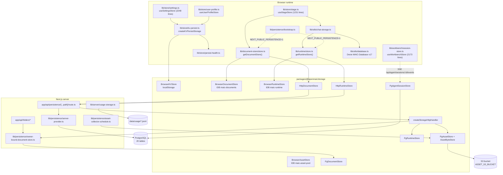
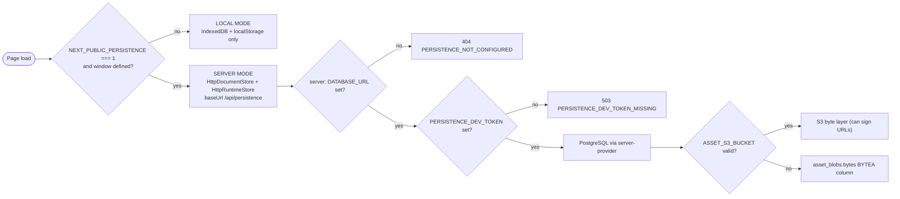

# Persistence, storage adapters, client state, sessions, i18n — overview

Survey scope: the OpenMAIC persistence seam (`packages/@openmaic/storage/` +
`lib/persistence/` + `lib/document-store/`), the browser-side state stores
(`lib/store/`, `lib/workbench/session-store.ts`), the chat-persistence cutover
(`lib/utils/chat-storage.ts`), the HTTP surfaces that expose persistence
(`app/api/persistence`, `app/api/folders`, `app/api/access-code`), and the i18n
locale trees (`lib/i18n/`).

## Charter

`packages/@openmaic/storage/src/index.ts:1-23` states the package's charter
verbatim: `@openmaic/dsl` owns *what* persists (document/runtime shape,
validation, migration, the asset `StorageProvider` interface); `@openmaic/storage`
owns *where/how* it persists. The pluggable seam is deliberately **the backend,
not the database driver** — every PostgreSQL backend takes an injected
`Queryable`/`WithTransaction` and imports no driver
(`packages/@openmaic/storage/src/runtime/pg.ts:41-53`).

Five storage primitives exist, each with its own interface plus 1–3 backends:

| Primitive | Interface | Backends shipped |
| --- | --- | --- |
| KV (small keyed values, 2 scopes) | `KVStore` (`src/kv/types.ts:15`) | browser (`kv/browser.ts`), HTTP account-only (`kv/http.ts`) |
| Document (a course aggregate) | `DocumentStore` (`src/document/types.ts:180`) | browser IndexedDB, HTTP, PostgreSQL |
| Runtime (learner sessions/records) | `RuntimeStore` (`src/runtime/types.ts`) | browser IndexedDB, HTTP, PostgreSQL |
| Asset (content-addressed bytes) | `AssetStore` (`src/asset/types.ts:140`) | browser IndexedDB pool, HTTP, PostgreSQL registry over a pluggable byte layer (PG column or S3) |
| Agent session / material / user skill | `AgentSessionStore` etc. (`src/agent-session/types.ts:269`) | PostgreSQL only |

Usage metering is the one entity with a **filesystem** backend:
`lib/server/usage-storage.ts:132` appends JSONL to
`data/usage/<YYYY>-<MM>.jsonl`.

## Internal parts

## File inventory

Measured with
`git ls-files <scope> | xargs wc -l | sort -rn` (83 562 lines in scope total).

| Path | Lines | Role |
| --- | --- | --- |
| `lib/store/settings.ts` | 2248 | provider/model/media/TTS settings; `account`-scope KV persist |
| `lib/workbench/session-store.ts` | 2173 | pure fold over the agent-session SSE event log |
| `packages/@openmaic/storage/src/agent-session/pg.ts` | 1710 | PostgreSQL agent-session lifecycle, event log, entry tree, owner projection |
| `lib/utils/chat-storage.ts` | 1455 | chat persistence on `RuntimeStore` + Dexie cutover |
| `lib/store/stage.ts` | 1231 | live course editing state + save orchestration |
| `packages/@openmaic/storage/src/document/pg.ts` | 1089 | PG document backend, `DOCUMENT_PG_SCHEMA`, revision triggers |
| `packages/@openmaic/storage/src/asset/http.ts` | 842 | HTTP asset client |
| `packages/@openmaic/storage/src/server/asset.ts` | 804 | `/assets` HTTP handler |
| `packages/@openmaic/storage/src/server/index.ts` | 791 | composed runtime + document + asset handler |
| `lib/store/kv-persist.ts` | 735 | zustand `persist` ⇄ `KVStore` adapter + per-key state machine |
| `lib/i18n/workbench.ts` | 731 | workbench product copy (en + zh in TS) |
| `lib/document-store/migration.ts` | 701 | Dexie → `DocumentStore` legacy migration, asset-ref conversion |
| `lib/i18n/locales/*.json` (12 files) | 2035 each | app locale trees, 1801 leaf keys each |
| `lib/i18n/workbench-locales/*.json` (10 files) | 289 each | workbench overlays |
| `app/api/persistence/[...path]/route.ts` | 329 | Node-handler adapter for the storage HTTP contract |
| `lib/persistence/*` (13 files) | 1783 | server provider, owner binding, stage meta, asset bytes, collector |
| `lib/document-store/*` (10 files) | 1354 | app document seam: config, store, validators, migration |
| `packages/@openmaic/storage/src/*` | 14 904 | the package |
| `packages/@openmaic/storage/test/*` | 17 068 | contract + PG + HTTP conformance suites |

Directories named in the survey brief that **do not exist**: `lib/materials/`
(there is no such directory — `ls lib/` lists 45 subdirectories, none named
`materials`). Material persistence lives in
`packages/@openmaic/storage/src/material/` (session-scoped) and
`lib/persistence/owner-materials.ts` (owner-scoped). `lib/storage/` contains a
single 32-line client helper (`lib/storage/client.ts`), unrelated to the
`@openmaic/storage` package.

## Deployment modes

Local mode is the default: `lib/persistence/bootstrap.ts:15-17` gates the whole
HTTP wiring on `typeof window !== 'undefined' && process.env.NEXT_PUBLIC_PERSISTENCE === '1'`.

Every planned section of this pack is present; nothing was omitted. Two sections
outgrew the 350-line ceiling and are split, both registered below.

## Topic index

Ten files. Every row links, so this table is the pack's navigation as well as its manifest.

| File | Contents |
| --- | --- |
| `00-overview.md` | this file — charter, inventory, deployment modes |
| [`01a-modules-package.md`](./01a-modules-package.md) | `packages/@openmaic/storage` module by module |
| [`01b-modules-app.md`](./01b-modules-app.md) | `lib/persistence`, `lib/document-store`, client stores, i18n |
| [`02a-interfaces-abstraction.md`](./02a-interfaces-abstraction.md) | verbatim interface signatures + backend `classDiagram` |
| [`02b-entities.md`](./02b-entities.md) | real column/field names, `erDiagram`s, browser store table |
| [`03-flows.md`](./03-flows.md) | five traced end-to-end flows with hop tables and sequence diagrams |
| [`04-dependencies-and-config.md`](./04-dependencies-and-config.md) | npm deps, platform APIs, env vars, config resolution |
| [`05-failure-modes.md`](./05-failure-modes.md) | per-component failure behaviour and error taxonomy |
| [`06-quality-and-metrics.md`](./06-quality-and-metrics.md) | measured metrics with commands, strengths, fragility |
| [`07-open-questions.md`](./07-open-questions.md) | what could not be determined, and why |

Pack→topic mapping and the shared chapter convention: [`../index.md`](../index.md).
The three name collisions this pack's subject suffers from — five things called "storage" —
are disambiguated in
[`../../../10-persistence-and-state/01b-adjacent-modules-and-name-collisions.md`](../../../10-persistence-and-state/01b-adjacent-modules-and-name-collisions.md).
