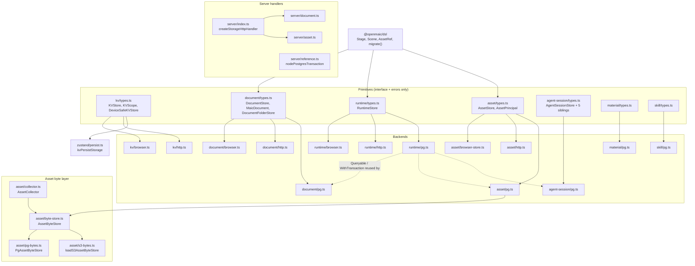
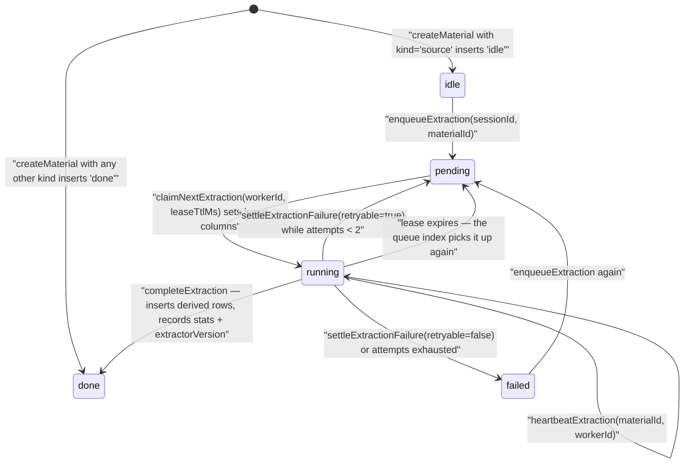

# Modules — `packages/@openmaic/storage`

Version `0.28.1` ([`packages/@openmaic/storage/package.json:3`](packages/@openmaic/storage/package.json#L3)). Sole runtime
dependency: `@openmaic/dsl` (workspace). Two optional peers:
`@aws-sdk/client-s3`, `@aws-sdk/s3-request-presigner`
([`package.json:110-121`](packages/@openmaic/storage/package.json#L110-L121)). 16 subpath exports ([`package.json:9-74`](packages/@openmaic/storage/package.json#L9-L74)); the root
barrel re-exports 159 named symbols
(`/usr/bin/grep -cE "^  [A-Za-z]" packages/@openmaic/storage/src/index.ts` → 159).



## KV — `src/kv/`

`KVScope` is a fixed two-value axis: `'device' | 'account'`
([`src/kv/types.ts:8`](packages/@openmaic/storage/src/kv/types.ts#L8)). `account` values are user data a server-backed deployment
may sync; `device` values are machine-local and "must never leave the device —
every backend honours that" ([`src/kv/types.ts:1-7`](packages/@openmaic/storage/src/kv/types.ts#L1-L7)). Default scope is `account`
(`DEFAULT_KV_SCOPE`, [`src/kv/types.ts:58`](packages/@openmaic/storage/src/kv/types.ts#L58)).

Three type-level layers encode the device guarantee:

- `KVStore` ([`kv/types.ts:15`](packages/@openmaic/storage/src/kv/types.ts#L15)) — `get`/`set`/`remove`/`keys`, all scope-taking.
- `DeviceSafeKVStore` ([`kv/types.ts:40`](packages/@openmaic/storage/src/kv/types.ts#L40)) — brand `servesDeviceScopeLocally: true`.
  The doc comment explains why the brand exists: a remote store structurally
  satisfies `KVStore`, so a `KVStore`-typed parameter would happily accept a pure
  network transport ([`kv/types.ts:22-39`](packages/@openmaic/storage/src/kv/types.ts#L22-L39)).
- `LocalKVStore` ([`kv/types.ts:53`](packages/@openmaic/storage/src/kv/types.ts#L53)) — additionally `isLocalKVStore: true`; what a
  composite demands of the backend it injects for `device`.

`assertKVScope` ([`kv/types.ts:83`](packages/@openmaic/storage/src/kv/types.ts#L83)) fails closed on an unrecognised scope, and the
comment names both failure modes it prevents. Deliberately **no key validator**:
[`kv/types.ts:95-117`](packages/@openmaic/storage/src/kv/types.ts#L95-L117) argues the key domain is opaque and unbounded, and that
transport limits (URL length, `.`/`..` normalisation, unpaired surrogates) belong
to `HttpAccountKV`, not to the primitive.

`BrowserKVStore` ([`kv/browser.ts:24`](packages/@openmaic/storage/src/kv/browser.ts#L24)) stores both scopes in one `Storage` behind
key prefix `<namespace>:<scope>:` with `namespace` defaulting to `'maic'`
([`kv/browser.ts:34,37-41`](packages/@openmaic/storage/src/kv/browser.ts#L34)). `set` treats `undefined`/function/symbol as a
removal and throws when `JSON.stringify` returns `undefined`, explicitly so the
browser and HTTP backends "must not disagree about whether a write was a delete"
([`kv/browser.ts:58-83`](packages/@openmaic/storage/src/kv/browser.ts#L58-L83)).

`kvPersistStorage` ([`zustand/persist.ts:54-75`](packages/@openmaic/storage/src/zustand/persist.ts#L54-L75)) is the zustand adapter. Two
overloads and no `(KVStore, KVScope)` overload — "it would match every call the
two above reject, handing the guard straight back" ([`zustand/persist.ts:56-58`](packages/@openmaic/storage/src/zustand/persist.ts#L56-L58)).
The `device` overload requires the brand and re-checks at runtime.

## Document — `src/document/`

`MaicDocument` ([`document/types.ts:87`](packages/@openmaic/storage/src/document/types.ts#L87)) is `{ stage, scenes, outline?, dslVersion? }`.
`outline` is app-owned, persisted verbatim, never validated or migrated
([`document/types.ts:82-85`](packages/@openmaic/storage/src/document/types.ts#L82-L85)). `DocumentStore` ([`document/types.ts:180`](packages/@openmaic/storage/src/document/types.ts#L180)) is
whole-aggregate `saveDocument`/`loadDocument` plus incremental
`putStage`/`putScene`/`getScene`/`deleteScene`. The incremental methods require
the stored document to already be at the current DSL version, so a stale row
cannot strand unmigrated siblings above the migrate-on-read line
([`document/types.ts:223-232`](packages/@openmaic/storage/src/document/types.ts#L223-L232)).

`listDocuments` returns only version-independent fields and deliberately
tolerates a corrupt `dslVersion` so one bad row cannot fail a whole listing
([`document/types.ts:196-204`](packages/@openmaic/storage/src/document/types.ts#L196-L204)).

`DocumentFolderStore` ([`document/types.ts:136`](packages/@openmaic/storage/src/document/types.ts#L136)) is available "only on a bound
server store: callers choose the trusted owner with `forOwner`, never with method
parameters" ([`document/types.ts:131-135`](packages/@openmaic/storage/src/document/types.ts#L131-L135)). `deleteFolder` has two modes,
`'ungroup'` (documents kept, `folder_id` cleared) and `'remove'` (returns
`removedStageIds` for the caller's own cascade).

`StageFreshnessManifestStore` ([`document/types.ts:276`](packages/@openmaic/storage/src/document/types.ts#L276)) reads the
trigger-maintained `document_stage_revision` / `document_scene_revision` rows —
PG backend only.

`document/pg.ts` holds `DOCUMENT_PG_SCHEMA` ([`pg.ts:58-225`](packages/@openmaic/storage/src/document/pg.ts#L58-L225)) and
`splitSqlStatements` ([`pg.ts:234`](packages/@openmaic/storage/src/document/pg.ts#L234)), a real SQL tokeniser that skips quoted
strings, `$tag$` bodies, and comments, because a plain `split(';')` would carve
the plpgsql trigger bodies apart. The trigger block documents a
**lock-order invariant** — the scene trigger bumps `document_stage_revision`
before `document_scene_revision`, matching `saveDocument`'s stage-then-scene
order, "or the deadlock (40P01) between concurrent stage-first and scene-first
writers comes back" ([`pg.ts:129-133`](packages/@openmaic/storage/src/document/pg.ts#L129-L133)). Both triggers `pg_notify` on channel
`openmaic_agent_event_wakeup` with `json_build_object('kind','stage','stageId',…)`,
suppressible per-transaction via `SET LOCAL openmaic.suppress_stage_notify = 'on'`
([`pg.ts:142-147`](packages/@openmaic/storage/src/document/pg.ts#L142-L147)).

## Runtime — `src/runtime/`

[`runtime/pg.ts:41-53`](packages/@openmaic/storage/src/runtime/pg.ts#L41-L53) defines the injected surface reused by every PG backend:

```ts
export interface QueryResult<TRow extends Record<string, unknown> = Record<string, unknown>> {
  rows: TRow[];
}
export interface Queryable {
  query<TRow extends Record<string, unknown> = Record<string, unknown>>(
    text: string,
    params?: unknown[],
  ): Promise<QueryResult<TRow>>;
}
export type WithTransaction = <T>(body: (queryable: Queryable) => Promise<T>) => Promise<T>;
```

The module comment names the unsafe shortcut explicitly:
`(body) => body(sharedClient)` "is unsafe because concurrent calls can interleave
in one transaction" ([`runtime/pg.ts:9-11`](packages/@openmaic/storage/src/runtime/pg.ts#L9-L11)). Payloads are narrowed to values that
round-trip losslessly through JSONB — `Date`, `Map`, nested `undefined`,
non-finite numbers, and strings containing NUL are rejected
([`runtime/pg.ts:11-12`](packages/@openmaic/storage/src/runtime/pg.ts#L11-L12), enforced by `runtime/json-value.ts`).

Default payload validators cover two kinds, `chat` and `quizAttempt`
([`runtime/pg.ts:114-131`](packages/@openmaic/storage/src/runtime/pg.ts#L114-L131)).

## Asset — `src/asset/`

`AssetPrincipal.key` is required and non-optional by design: an optional field
"would make `{}` a conforming principal and collapse every principal lacking one
into a single shared partition they could all read, replace, and delete"
([`asset/types.ts:30-37`](packages/@openmaic/storage/src/asset/types.ts#L30-L37)).

`AssetStore` ([`asset/types.ts:140`](packages/@openmaic/storage/src/asset/types.ts#L140)) has five methods plus optional
`resolveIndirect`. The invariants are unusually explicit:

- `put` allocates a **new** id every time, including for bytes already held —
  returning an existing id would be an existence oracle over data the caller
  never stored ([`asset/types.ts:141-161`](packages/@openmaic/storage/src/asset/types.ts#L141-L161)).
- Quota is accounted on the principal's *logical* bytes and checked before any
  physical write ([`asset/types.ts:155-161`](packages/@openmaic/storage/src/asset/types.ts#L155-L161)).
- Unknown id, another principal's id, and reclaimed bytes are all indistinguishable
  misses ([`asset/types.ts:164-191`](packages/@openmaic/storage/src/asset/types.ts#L164-L191)).
- `revision` is a counter starting at 1, "never derived from the content" — a
  content-derived validator would be the hash under another name
  ([`asset/types.ts:284-293`](packages/@openmaic/storage/src/asset/types.ts#L284-L293)).

`EXCLUDED_RENDERABLE_TYPES` ([`asset/types.ts:114`](packages/@openmaic/storage/src/asset/types.ts#L114)) is the hard denylist —
`image/svg+xml`, `text/html`, `application/xhtml+xml`, `text/xml`,
`application/xml`, `application/pdf` — rejected at handler construction, not
merely documented, because "this is the one setting that converts a storage bug
into cross-site scripting" ([`asset/types.ts:104-113`](packages/@openmaic/storage/src/asset/types.ts#L104-L113)).

`asset/pg.ts` documents the write ordering as load-bearing at both ends: claim
the blob row, then write bytes, then write the entry
([`asset/pg.ts:1-23`](packages/@openmaic/storage/src/asset/pg.ts#L1-L23)). A byte layer whose writes cannot join the registry
transaction must declare `writesOutsideRegistryDatabase` or the registry refuses
the configuration ([`asset/pg.ts:13-18`](packages/@openmaic/storage/src/asset/pg.ts#L13-L18)) — otherwise it self-deadlocks on the
blob-row lock in a way PostgreSQL cannot detect.

## Agent session — `src/agent-session/`

Four interfaces are deliberately split so "a control-plane reader [cannot]
accidentally gain lease-bound write authority" ([`agent-session/types.ts:1-9`](packages/@openmaic/storage/src/agent-session/types.ts#L1-L9)):
`AgentSessionStore` (lifecycle + leases), `AgentSessionEventLog` (the per-session
stream), `AgentSessionEntryTree` (append-only tree), `OwnerSessionEventProjection`
(sparse per-owner projection). Plus `AgentSessionTitleStore` and
`AgentSessionUrlStore`.

Notable semantics, all from doc comments on the interface:

- `claimNextSession` scans optimistically, then locks and rechecks; the second
  check is the authority. Attempt charging is per takeover — a cleanly released
  (null) lease costs no attempt, an abandoned one does
  ([`agent-session/types.ts:275-294`](packages/@openmaic/storage/src/agent-session/types.ts#L275-L294)).
- `postUserMessage` locks, persists, classifies delivery (`steer` vs `queued`)
  and revives a terminal session in one transaction, "so a message cannot fall
  into the runner's settle window" ([`types.ts:328-337`](packages/@openmaic/storage/src/agent-session/types.ts#L328-L337)).
- `OwnerSessionEventProjection.append` runs inside the caller's transaction
  through a SAVEPOINT and returns `null` on error: "derived navigation data must
  never veto the authoritative lifecycle write" ([`types.ts:455-462`](packages/@openmaic/storage/src/agent-session/types.ts#L455-L462)).
- `AgentSessionUrlStore` is the fetch trust gate: only URLs the user typed or
  `web_search` surfaced are registered; "links scraped from fetched pages are
  never registered, so a page cannot widen the allowlist by itself"
  ([`types.ts:569-575`](packages/@openmaic/storage/src/agent-session/types.ts#L569-L575)). `extractObservedUrls` ([`types.ts:45`](packages/@openmaic/storage/src/agent-session/types.ts#L45)) strips trailing
  prose including CJK punctuation.

`AgentSessionHooks` ([`types.ts:495-567`](packages/@openmaic/storage/src/agent-session/types.ts#L495-L567)) documents each hook's transaction
semantics, including which ones are abort points (`onUserMessagePosted` vetoes
the whole `postUserMessage`) and which are lossy wakeups (`onSessionEventAppended`
is intended for `pg_notify`).

## Material — `src/material/`

A material row records asset ids, never bytes: `textAssetId` for extracted
markdown, `rawAssetId` for the optional raw download
([`material/types.ts:1-15,98-100`](packages/@openmaic/storage/src/material/types.ts#L1-L15)). Ids are `mat_` + a Crockford-base32 encoding of
128 random bits (`createMaterialId`, [`material/types.ts:21-38`](packages/@openmaic/storage/src/material/types.ts#L21-L38)). Six kinds —
`source`, `extraction`, `transcript`, `audio-track`, `image`, `web`
([`material/types.ts:44-51`](packages/@openmaic/storage/src/material/types.ts#L44-L51)) — chosen so derivatives need no schema migration.

Extraction is a leased state machine on the source row
([`material/types.ts:55-63,183-206`](packages/@openmaic/storage/src/material/types.ts#L55-L63)), with `MAX_MATERIAL_EXTRACTION_RETRIES = 2`
(`:156`). `createMaterial` inserts `'idle'` for `kind='source'` and `'done'`
otherwise, and the `INSERT … SELECT … FROM agent_sessions WHERE session.id = $2
AND session.deleted_at IS NULL` shape means a material can only be attached to a
live session ([`material/pg.ts:249-257`](packages/@openmaic/storage/src/material/pg.ts#L249-L257)). `enqueueExtraction` only moves rows in
`('idle','failed')` ([`material/pg.ts:334-342`](packages/@openmaic/storage/src/material/pg.ts#L334-L342)).



The partial index `agent_session_materials_extraction_queue_idx` is what makes the
claim scan cheap: `ON (created_at) WHERE kind = 'source' AND extraction_status IN ('pending','running')`
([`material/pg.ts:86-88`](packages/@openmaic/storage/src/material/pg.ts#L86-L88)). `listMaterials` is keyset-paged on a material id, default
50, capped at 200 ([`material/types.ts:158-163`](packages/@openmaic/storage/src/material/types.ts#L158-L163)).

## Server handlers — `src/server/`

`createStorageHttpHandler` ([`server/index.ts:728`](packages/@openmaic/storage/src/server/index.ts#L728)) composes three handlers and
routes purely on pathname prefix ([`server/index.ts:769-790`](packages/@openmaic/storage/src/server/index.ts#L769-L790)): `/documents*` →
document handler, `/assets*` → asset handler, everything else → runtime handler.
All three share one `authenticate` hook.

**There is no server-side KV handler.** `src/kv/http.ts` is a client for a
`/kv/entries/:key` + `/kv/keys` contract ([`kv/http.ts:306,351,357,364`](packages/@openmaic/storage/src/kv/http.ts#L306)) and
[`docs/kv-http-contract.md`](packages/@openmaic/storage/docs/kv-http-contract.md) specifies it, but `src/server/` contains only
`asset.ts`, `document.ts`, `index.ts`, `read-json.ts`, `reference.ts`
(`git ls-files packages/@openmaic/storage/src`).
