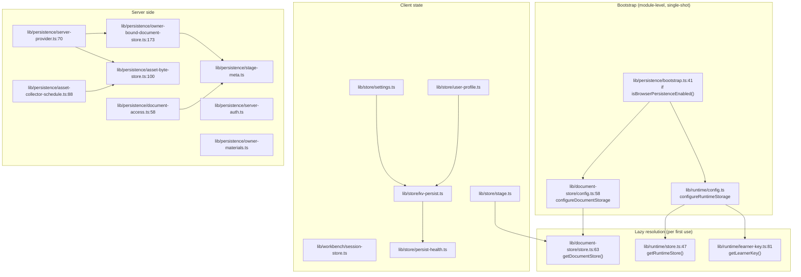
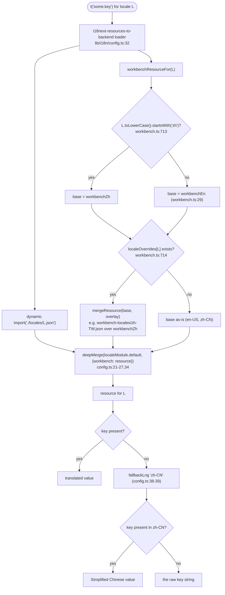

# Modules — app side (`lib/`, `app/api/`)

Companion to `01a-modules-package.md`. This file covers the app's wiring of the
storage package, the client state stores, and the i18n trees.

## `lib/persistence/bootstrap.ts` (75 lines)

The single seam that flips the app from local to server-backed persistence.
`isBrowserPersistenceEnabled()` (`bootstrap.ts:15`) requires both
`typeof window !== 'undefined'` and `process.env.NEXT_PUBLIC_PERSISTENCE === '1'`.
When enabled it constructs `HttpRuntimeStore` and `HttpDocumentStore` factories
against `baseUrl: '/api/persistence'` (`bootstrap.ts:45-61`) and configures both
seams. The two `assert*Configurable()` preflight calls run before either
`configure*` so a partial configuration is impossible
(`bootstrap.ts:62-68`: "All checks are mutation-free"). A failure logs
`FATAL: server-backed persistence bootstrap failed` and leaves local storage in
place.

Request headers: `x-learner-key` plus `authorization: Bearer <NEXT_PUBLIC_PERSISTENCE_TOKEN>`
(`bootstrap.ts:31-39`).

## `lib/document-store/` (10 files, 1354 lines)

- `config.ts` — single-shot, client-bootstrap-only configuration.
  `assertDocumentStorageConfigurable()` (`config.ts:69`) throws once resolution
  has started *or* once options exist. Configuration stays sealed even if
  resolution failed (`config.ts:70-78`). Factories receive
  `{ validateScene, validateStage }` so a server-backed store keeps the app's
  widened write boundary.
- `store.ts` — `getDocumentStore()` (`store.ts:63`). Uses `defaultStore ??= (…)()`
  so a throwing factory is retried rather than cached (`store.ts:66-71`). Browser
  fallback opens IndexedDB `maic-documents` and is a **capability probe, not an
  environment probe** — node test runners inject a fake `indexedDB`
  (`store.ts:47-50`).
- `plain-json-store.ts` — wraps every store with `withPlainJsonDocumentWrites`.
- `validators.ts` — `validateAppScene`/`validateAppStage`, the app's widened
  scene union.
- `migration.ts` (701 lines) — the Dexie → `DocumentStore` migration; see
  `03-flows.md`.
- `storage-generation.ts` — a monotonic `device`-scoped counter
  (`document-storage-generation`) bumped by `clearDatabase`, used to fence writes
  that would resurrect wiped data (`storage-generation.ts:21-26`).
- `current-scene.ts`, `canonicalize.ts`, `persistence-types.ts`.

`AppStage = Stage` and `AppDocument = MaicDocument<AppScene, AppStage>`
(`persistence-types.ts:8,56`). `AppDocumentOutline` (`persistence-types.ts:29`)
is the opaque outline snapshot and carries `producer: 'client' | 'server-job'`,
which is deliberately a separate axis from `generationComplete`
(`persistence-types.ts:10-25`).

## `lib/persistence/` (13 files, 1783 lines)

`server-provider.ts:36-67` is the one place the server touches PostgreSQL. It
provisions five schemas in a fixed order — `ensureSchema` (runtime),
`ensureDocumentSchema`, `ensureStageMetaSchema`, `ensureOwnerMaterialSchema`,
`ensureAssetSchema` — then builds `PgRuntimeStore`, `PgDocumentStore`,
`PgAssetStore`. The provider promise is cached on
`Symbol.for('openmaic.persistence.provider')` on `globalThis`
(`server-provider.ts:30-34`) so dev-time module reloads reuse one pool, and a
failed init clears the cache so the next request retries
(`server-provider.ts:79-88`).

`owner-bound-document-store.ts:173` builds a `WithTransaction` that, *inside every
transaction*, takes `SELECT … FROM stage_meta WHERE stage_id = $1 FOR SHARE`
(reads) or `FOR UPDATE` (writes) and enforces four refusals
(`owner-bound-document-store.ts:186-212`): `foreign`, `tombstoned`,
`reserved-document`, `unclaimed`. A `create` claims `stage_meta` after the body
succeeds (`:215-217`). `listDocuments` intersects the inner listing with live
`stage_meta` rows (`:129-139`).

`stage-meta.ts` owns the app's own table (`STAGE_META_SCHEMA`, `stage-meta.ts:24`)
and its backfill `INSERT … SELECT id, owner_id FROM document_stages … ON CONFLICT DO NOTHING`
(`stage-meta.ts:43-47`). `StageAccessError extends DocumentNotFoundError`
(`stage-meta.ts:92`) so the storage layer's 404 mapping applies unchanged.

`document-access.ts:27` re-parses the document path itself (`parseDocumentAction`)
and `decideDocumentAccess` (`:58`) returns `allow | forbid | not-found` per action
kind. `list` and `unknown` always `forbid`. A `read` of another owner's live
document is `allow` — reads are capability-by-id, writes are owner-fenced
(`:70-80`).

`server-auth.ts` is labelled `DEVELOPMENT-ONLY` in its first line and spells out
exactly what it does not provide: `NEXT_PUBLIC_PERSISTENCE_TOKEN` is compiled
into the public bundle, so "anyone who can load the page can read and write EVERY
learner partition and all documents by supplying an arbitrary x-learner-key"
(`server-auth.ts:1-13`). All assets go to one `'shared'` principal
(`server-auth.ts:26,53`).

`asset-byte-store.ts:100` (`lazyAssetByteStore`) defers byte-layer construction to
first use so a bad `ASSET_S3_BUCKET` fails asset requests only, never document or
runtime traffic (`:87-99`). Without a bucket it forwards
`writeWith`/`readWith`/`deleteWith` so the registry's duck-typed transaction
coordination applies — without them the registry would fall back to the byte
store's own pooled connection and self-deadlock (`:124-131`).

`asset-collector-schedule.ts:88` schedules `AssetCollector.collect()` once per
server process from `instrumentation.ts`, keyed on
`Symbol.for('openmaic.asset-collector.schedule')`. Defaults: 15-minute interval
(`:35`), one-hour grace from the package. The header states that concurrent
collectors are fine and asks not to add a distributed lock
(`asset-collector-schedule.ts:13-17`).

`owner-materials.ts` is the owner-scoped material library table
(`OWNER_MATERIAL_SCHEMA`, `:102-130`) with a two-phase upload
(`status='uploading'` → `'ready'`) and a 24-hour reclaim of abandoned rows
(`:14-22`).

## Client state

### `lib/store/kv-persist.ts` (735 lines)

A `PersistStorage<S>` over `KVStore` with a per-key state machine. The header
explains the shape: async storage fails in ways `localStorage` never did, and the
same two bugs kept recurring — "a backend failure read as 'there is nothing
there', and the result of an operation that nobody looked at"
(`kv-persist.ts:16-33`).

`Outcome<T>` (`:65`) seals the result behind a `#result` private field whose only
reader is `into(state, operation)` (`:91`) — you cannot inspect success without
feeding the machine. `UNAVAILABLE` is a `Symbol`, deliberately not `null`.

`KeyState<S>` (`:171`) has four phases — `unhydrated | settled | unavailable | clearing`
— and the full transition table is tabulated in the doc comment
(`kv-persist.ts:135-159`). Two rows carry the weight: `clearing` is entered
*synchronously* in `removeItem` so a racing `set()` cannot queue behind the
delete and rewrite the deleted value (`:266-273,701-706`); and `clearFinished`
reaches `settled` without replaying.

`RefusedWrite.replayable` (`:113-123`) turns on whether the store held the
*authoritative* value: a write taken over defaults must never be replayed.
Recovery is capped by `DEFAULT_RECOVERY_BACKOFF_MS = [0, 250, 1000]` (`:452`);
the array's length is the attempt cap, and the comment names the treadmill it
prevents — a readable-but-unwritable backend (`:374-382`).

### `lib/store/persist-health.ts` (174 lines)

A framework-free one-way channel with three statuses:
`unavailable | changes-lost | recovered` (`:13-19`). Two independent latches per
key because "`unavailable` describes the state of the world right now … 
`changes-lost` describes something that already happened" (`:29-38`). Publishing
is deferred one macrotask so a fast recovery cancels the notice before anyone
sees it (`:47-65`), and late subscribers get a catch-up that re-reads current
state rather than replaying a stale snapshot (`:128-153`).

### `lib/store/settings.ts` (2248 lines)

Why it is large: it is one zustand store holding the *entire* provider
configuration surface — LLM providers + models + thinking configs, TTS, ASR, PDF,
image, video, and web-search provider maps, each a `Record<ProviderId, {...}>`
with `apiKey`, `baseUrl`, `enabled`, `modelId`, `customModels`, `providerOptions`,
`isServerConfigured`, `serverDisabled`, custom-provider fields
(`settings.ts:81-400` is the `SettingsState` interface). Plus UI layout prefs
(`chatAreaWidth`, `chatAreaCollapsed`).

Persistence: `name: 'settings-storage'`, `storage: createKVPersistStorage<Partial<SettingsState>>('account', …)`,
`version: SETTINGS_PERSIST_VERSION = 4` (`settings.ts:48,1984-1996`). A four-step
`migrate` ladder plus a large amount of unconditional normalisation
(`ensureBuiltInProviders`, `ensureBuiltInAudioProviders`, …) runs on *every*
rehydrate through the custom `merge` (`settings.ts:2213-2235`) "so newly added
providers/models appear without clearing cache".

`purgeLegacyPersistKey('settings-storage')` at `settings.ts:2248` best-effort
deletes the pre-cutover raw `localStorage` blob, which "holds plaintext provider
API keys" — a stated small security win, no correctness depends on it.

`lib/store/user-profile.ts` is the same pattern at 73 lines
(`name: 'user-profile-storage'`, `account` scope).

These two are the **only** `createKVPersistStorage` consumers
(`/usr/bin/grep -rn "createKVPersistStorage" lib components app` → 5 hits, 2 of
them call sites).

### `lib/workbench/session-store.ts` (2173 lines)

A pure fold over the agent-session SSE log. Two inherited properties are stated
as invariants (`session-store.ts:13-22`): the rendered UI is a pure function of
the applied event prefix (so `Last-Event-ID` resumption is exact), and it lives
outside React (unmounting tears down the `EventSource`, the fold survives).

Why it is large: `WorkbenchFold` (`:249`) is 29 fields of derived run state
(status, `lastEventId`, chat node list, plan, built pages, `libraryRevision`,
`stageLinkStageIds`, `touchedStageIds`, `runCourseStageIds`, in-flight markers
`thinkingKey`/`assistantKey`/`waitingKey`, `epoch` fence), and `foldEvent`
(`:913`) is one big pure reducer over ~30 event types plus ~20 small pure
helpers. `createInitialSessionState()` (`:511`) is the single total reset; its doc
comment records that the "one field left behind" bug arrived three times
(`:490-510`) and that
`tests/workbench/draft-conversation-reset.test.ts` walks the live store's keys
against the factory.

The only thing this store persists is one `device`-local preference per session:
`localStorage['workbench.panel.<sessionId>']` = `'open' | 'closed'`, written
directly via `window.localStorage` (`:570-590`) — not through `KVStore`.

### `lib/utils/chat-storage.ts` (1455 lines)

Chat persistence on the learner `RuntimeStore`, with the legacy Dexie table as a
one-time migration source (`chat-storage.ts:1-7`). Public API:
`saveChatSessions` (`:1005`), `loadChatSessions` (`:1170`),
`clearRuntimeChatSessions` (`:1304`), `restoreChatSessionsFromBackup` (`:1328`),
`deleteChatSessions` (`:1453`). Three error classes at `:119-121`
(`ChatStorageLockUnavailableError`, `…SnapshotInvalidatedByRestoreError`,
`…SnapshotInvalidatedByDeletionError`). Retry bounds: 8 sync attempts, 8 plan
steps per attempt, 500 ms max backoff (`:47-49`). Details in `03-flows.md`.

## i18n — `lib/i18n/`

`supportedLocales` (`locales.ts:16-29`) is 12 entries: `zh-CN`, `zh-TW`, `en-US`,
`ja-JP`, `ru-RU`, `ar-SA`, `pt-BR`, `ko-KR`, `es-MX`, `fr-FR`, `vi-VN`, `de-DE`.
`defaultLocale = 'zh-CN'` and is also `fallbackLng` (`types.ts:5`,
`config.ts:38-39`).

Two trees:

- `lib/i18n/locales/<code>.json` — 12 files, 2035 lines each, **1801 leaf keys**
  in `en-US` (measured with a recursive Node count).
- `lib/i18n/workbench-locales/<code>.json` — 10 files, 289 lines each. English and
  Chinese workbench copy live in TypeScript (`lib/i18n/workbench.ts:29`
  `workbenchEn`, plus `workbenchZh`) because the presentation table, progress
  captions and the session store "are pure functions with no hook to read a
  language from" (`workbench.ts:1-17`).

`config.ts:21-35` deep-merges `workbenchResourceFor(language)` under the
`workbench.*` namespace into the JSON resource, so `t('workbench.chat.jumpToBottom')`
resolves through i18next and through the hook-free translator identically.

The `raw` leaf is what `pnpm check:i18n-keys` exists to make unreachable for the
12 JSON locales, and `tests/workbench/workbench-i18n.test.ts` for the 10 overlays.
The hook-free path has the same terminal behaviour by hand:
`createWorkbenchTranslator` returns the key itself when the resolved value is not
a string (`lib/i18n/workbench.ts:723-729`), and
`defaultWorkbenchTranslator = createWorkbenchTranslator('zh-CN')` (`:731`) is the
translator the session store uses when no locale has been threaded in
(`lib/workbench/session-store.ts:26`).

### The `check:i18n-keys` contract

`package.json:24` → `node scripts/check-i18n-keys.mjs`. The script
(`scripts/check-i18n-keys.mjs`) enforces, against `en-US.json` as source:

1. No arrays anywhere in a locale file (`:16-19`).
2. No empty objects anywhere (`:25-28`).
3. Root must be a plain object (`:39-41`, `:52-54`).
4. Every non-source locale's leaf-key set must equal the source's — both
   `missing` and `extra` are failures (`:76-81`), reported per file with full key
   lists, exit code 1 (`:111`).

Scope limits worth knowing: the script only reads `lib/i18n/locales`
(`:4`). It does **not** check `workbench-locales/` — those ten files are held to
`workbenchEn`'s shape by `tests/workbench/workbench-i18n.test.ts`
(`lib/i18n/workbench.ts:12-16`). It also does not check that a key is *used*, nor
that a value is translated rather than copied English.

## `lib/brand/` and `lib/contexts/`

`lib/brand/brand-config.ts:27` is a static `DEFAULT_BRAND`
(`productName: 'OpenMAIC'`, `themeColor: '#722ed1'`). The comment records that the
reference deployment resolved brand per-vendor from a desktop shell User-Agent
token; this workspace is single-brand and the desktop flag is always off
(`brand-config.ts:1-9`). `brand-context.tsx:22` defaults the context so hooks work
with no provider mounted.

`lib/contexts/` is two files: `scene-context.tsx` (239 lines, a
`useSyncExternalStore` bridge over `useStageStore` with an optional
caller-owned `SceneDataController` for edit surfaces) and
`media-stage-context.tsx` (18 lines, propagates `stageId` so media elements only
consume tasks for the current course).
