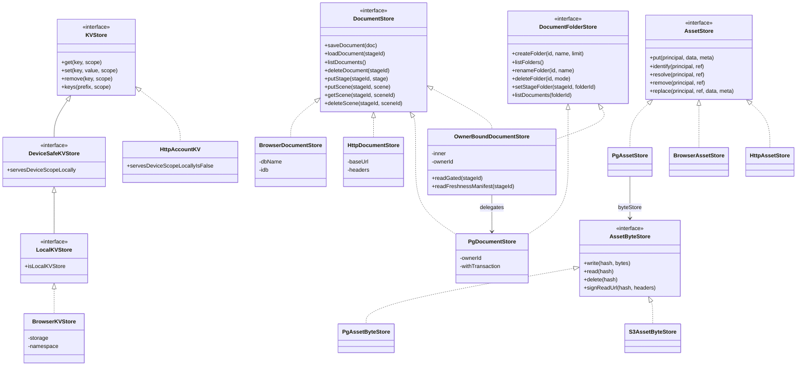
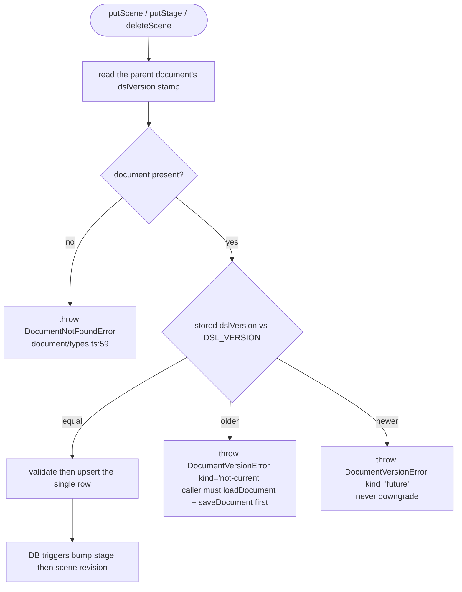

# Interfaces — the storage abstraction

All signatures below are copied verbatim from the cited file:line. Persisted
column and field names live in the companion file `02b-entities.md`.

## The storage abstraction

### `KVStore` — `packages/@openmaic/storage/src/kv/types.ts:15`

```ts
export type KVScope = 'device' | 'account';

export interface KVStore {
  get<T>(key: string, scope?: KVScope): Promise<T | null>;
  set<T>(key: string, value: T, scope?: KVScope): Promise<void>;
  remove(key: string, scope?: KVScope): Promise<void>;
  keys(prefix?: string, scope?: KVScope): Promise<string[]>;
}

export interface DeviceSafeKVStore extends KVStore {
  readonly servesDeviceScopeLocally: true;
}

export interface LocalKVStore extends DeviceSafeKVStore {
  readonly isLocalKVStore: true;
}
```

### `DocumentStore` — `src/document/types.ts:180`

```ts
export interface DocumentStore<TScene extends SceneLike = Scene, TStage extends Stage = Stage> {
  saveDocument(doc: MaicDocument<TScene, TStage>): Promise<void>;
  loadDocument(stageId: string): Promise<MaicDocument<TScene, TStage> | null>;
  listDocuments(): Promise<DocumentSummary[]>;
  deleteDocument(stageId: string): Promise<void>;
  putStage(stageId: string, stage: TStage): Promise<void>;
  putScene(stageId: string, scene: TScene): Promise<void>;
  getScene(stageId: string, sceneId: string): Promise<TScene | null>;
  deleteScene(stageId: string, sceneId: string): Promise<void>;
}
```

Supporting shapes (`src/document/types.ts:23,87,98,113`):

```ts
export interface SceneLike { id: string; stageId: string; order: number; }

export interface MaicDocument<TScene extends SceneLike = Scene, TStage extends Stage = Stage> {
  stage: TStage;
  scenes: TScene[];
  outline?: unknown;
  dslVersion?: string;
}

export interface DocumentSummary {
  id: string;
  name: string;
  description?: string;
  interactiveMode?: boolean;
  taskEngineMode?: boolean;
  createdAt: number;
  updatedAt: number;
  sceneCount: number;
  folderId?: string;
}

export interface DocumentFolder {
  id: string;
  name: string;
  order: number;
  createdAt: number;
  updatedAt: number;
}
```

### `AssetStore` — `src/asset/types.ts:140`

```ts
export interface AssetPrincipal {
  readonly key: string;
  readonly learnerKey?: string;
}

export interface AssetStore {
  put(principal: AssetPrincipal, data: BinaryBlob, meta?: AssetMeta): Promise<AssetId>;
  identify(principal: AssetPrincipal, ref: AssetRef): Promise<AssetIdentity | null>;
  resolve(principal: AssetPrincipal, ref: AssetRef): Promise<AssetBytes | null>;
  remove(principal: AssetPrincipal, ref: AssetRef): Promise<void>;
  replace(
    principal: AssetPrincipal,
    ref: AssetId,
    data: BinaryBlob,
    meta?: AssetMeta,
  ): Promise<number>;
  resolveIndirect?(
    principal: AssetPrincipal,
    ref: AssetRef,
    request: AssetIndirectReadRequest,
  ): Promise<AssetIndirectRead | null | undefined>;
}
```

### The injected database surface — `src/runtime/pg.ts:41`

```ts
export interface QueryResult<TRow extends Record<string, unknown> = Record<string, unknown>> {
  rows: TRow[];
}

export interface Queryable {
  query<TRow extends Record<string, unknown> = Record<string, unknown>>(
    text: string,
    params?: unknown[],
  ): Promise<QueryResult<TRow>>;
}

export type WithTransaction = <T>(body: (queryable: Queryable) => Promise<T>) => Promise<T>;
```

### `AgentSessionMeta` and the store — `src/agent-session/types.ts:77,269`

```ts
export interface AgentSessionMeta {
  id: string;
  ownerId: string;
  prompt: string;
  title?: string;
  /** The immutable stage with which the conversation was created. */
  stageId: string;
  skillId?: string;
  origin?: string;
  existingCourse: boolean;
  status: AgentSessionStatus;
  /** The consecutive-failure generation, incremented by every successful claim. */
  attempt: number;
  /** Highest durable user-message event sequence appended to the run transcript. */
  deliveredUserMessageSeq: number;
  createdAt: number;
  updatedAt: number;
  lease?: AgentSessionLease;
  error?: string;
}

export interface AgentSessionLease {
  workerId: string;
  workerPid: number;
  heartbeatAt: number;
}
```

`AGENT_SESSION_STATUSES = ['queued','running','succeeded','failed','cancelled']`
(`types.ts:11`). `OWNER_SESSION_EVENT_TYPES = ['session_created','session_status','session_deleted','session_cancel_requested','session_title']`
(`types.ts:424`) — note the **type-level list omits `session_active_stage`**,
which the SQL `CHECK` constraint and the client both accept (see
`07-open-questions.md`).

### Zustand adapter — `src/zustand/persist.ts:14,54`

```ts
export interface PersistedValue<S> { state: S; version?: number; }

export interface PersistStorageLike<S> {
  getItem(name: string): Promise<PersistedValue<S> | null>;
  setItem(name: string, value: PersistedValue<S>): Promise<void>;
  removeItem(name: string): Promise<void>;
}

export function kvPersistStorage<S>(kv: DeviceSafeKVStore, scope: 'device'): PersistStorageLike<S>;
export function kvPersistStorage<S>(kv: KVStore, scope?: 'account'): PersistStorageLike<S>;
```

## Backend selection



Diagram notes: `HttpAccountKV` declares `servesDeviceScopeLocally: false`
(rendered above as `servesDeviceScopeLocallyIsFalse` because a class member cannot
carry a literal value) — `false` is not assignable to the `true` the brand
requires, so "claiming the capability would mean writing the lie out by hand"
(`kv/types.ts:34-38`). `AssetByteStore.signReadUrl` is optional; the PostgreSQL
byte column omits it entirely so `resolveIndirect` does not take a blob-row lock
before declining (`lib/persistence/asset-byte-store.ts:117-123`).

## The DSL-version gate on incremental writes



`DocumentVersionError` carries `stageId`, `kind: 'future' | 'not-current'` and
`storedVersion` (`document/types.ts:45-56`). Whole-document `deleteDocument` is
deliberately **not** version-guarded — "a whole-document removal is a deliberate
coarse action" (`document/types.ts:206-211`).

