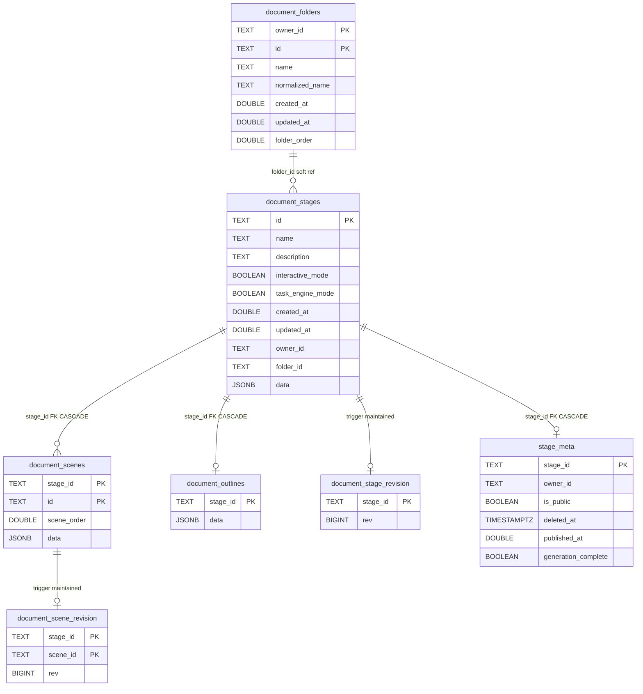
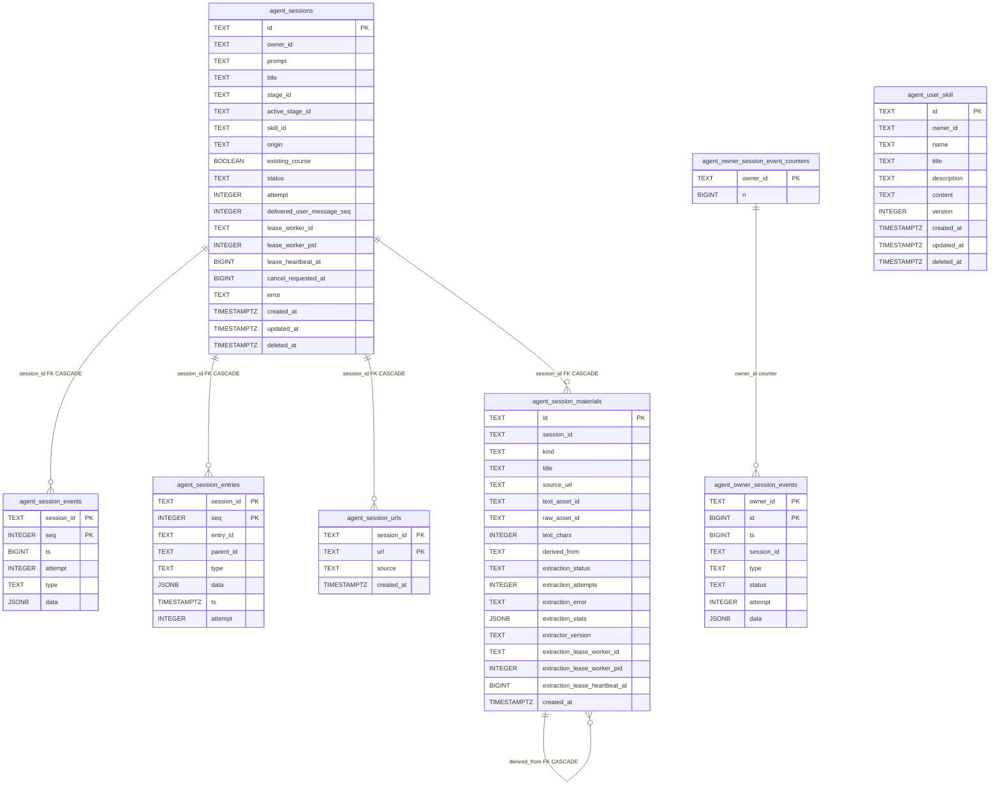
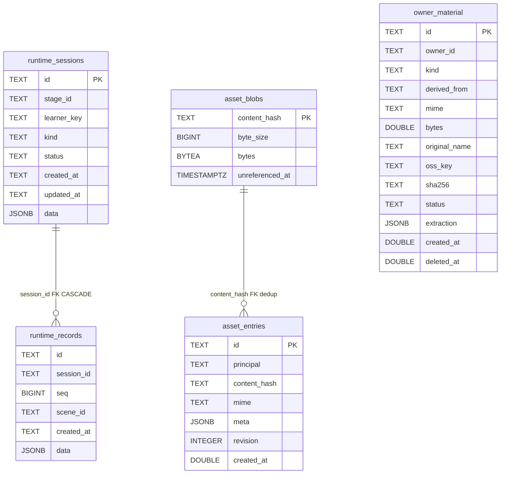

# Persisted entities — real column and field names

Companion to `02a-interfaces-abstraction.md`. Every table and store below is
declared in the cited file:line; nothing here is inferred from a name.

## Persisted PostgreSQL entities

20 tables are declared across the package and the app
(`/usr/bin/grep -rhoE "CREATE TABLE IF NOT EXISTS [a-z_]+" packages/@openmaic/storage/src lib/persistence | sed 's/.*EXISTS //' | sort -u | wc -l` → 20).

Source: `packages/@openmaic/storage/src/document/pg.ts:58-225`,
`lib/persistence/stage-meta.ts:24-48`. `document_folders` has
`UNIQUE (owner_id, normalized_name)`; `folder_id` on `document_stages` is a plain
column with no FK.

Source: `packages/@openmaic/storage/src/agent-session/pg.ts:87-245`,
`material/pg.ts:55-89`, `skill/pg.ts:50-76`. `agent_session_entries` has a
self-referential composite FK `(session_id, parent_id) → (session_id, entry_id)`
(`agent-session/pg.ts:148-151`). `agent_user_skill` carries five CHECK constraints
including `name ~ '^my-[a-z0-9]+(?:-[a-z0-9]+)*$'`, `length(title) BETWEEN 1 AND 80`,
`octet_length(content) BETWEEN 1 AND 65536` (`skill/pg.ts:62-69`).

Source: `runtime/pg.ts:68-97`, `asset/pg.ts:63-85`,
`lib/persistence/owner-materials.ts:102-130`. `runtime_records` has
`UNIQUE (session_id, seq)` rather than a primary key. `asset_entries.content_hash`
is many-to-one on `asset_blobs`, which is what makes global deduplication
reclaimable; `asset_blobs.unreferenced_at` is stamped, never deleted, on the
request path.

## Browser-side stores

| Store | Kind | Name / key | Declared at |
| --- | --- | --- | --- |
| Documents | IndexedDB | `maic-documents` (`STAGES`, `SCENES` keyed `['stageId','id']`, `OUTLINES` keyed `stageId`) | `document/browser.ts:150,163-172` |
| Runtime | IndexedDB | `maic-runtime` (`SESSIONS` keyed `id`, `RECORDS` keyed `['sessionId','seq']`) | `runtime/browser.ts:152,164-176` |
| Asset pool | IndexedDB | `maic-asset-pool` (`ASSETS`, `BLOBS` in the same database) | `asset/browser-store.ts:164,183-189` |
| Legacy app DB | IndexedDB (Dexie) | `MAIC-Database`, version 17 | `lib/utils/database.ts:299-300,562` |
| KV | localStorage | `maic:account:*`, `maic:device:*` | `kv/browser.ts:34,37-41` |
| Settings blob | KV `account` | `settings-storage` | `lib/store/settings.ts:1984` |
| Profile blob | KV `account` | `user-profile-storage` | `lib/store/user-profile.ts:53` |
| Learner key | KV `device` | `runtime.learnerKey` (`anon:<uuid>`) | `lib/runtime/learner-key.ts:17,31-37` |
| Storage generation | KV `device` | `document-storage-generation` | `lib/document-store/storage-generation.ts:3` |
| Migration markers | KV `device` | `document-migration:<stageId>` | `lib/document-store/migration.ts:98` |
| Workbench panel pref | raw localStorage | `workbench.panel.<sessionId>` | `lib/workbench/session-store.ts:570` |
| Access cookie | HTTP cookie | `openmaic_access` (HttpOnly, SameSite=Lax, 7 d) | `app/api/access-code/verify/route.ts:32-38` |
| Anonymous owner cookie | HTTP cookie | `anonymous_id` (HttpOnly, SameSite=Lax, 30 d) | `lib/server/agent-runtime/owner.ts:3-4,22-28` |

Dexie table set at v17 (`lib/utils/database.ts:307-322`): `stages`, `scenes`,
`audioFiles`, `imageFiles`, `snapshots`, `chatSessions`, `chatRestoreStaging`,
`playbackState`, `stageOutlines`, `mediaFiles`, `generatedAgents`,
`voiceProfiles`, `autoVoiceCache`, `agentEditSessions`, `folders`, `stageFolders`.
Version 13 was skipped deliberately — it "briefly added `chatStorageLocks` on the
draft chat cutover branch"; v14 drops it with `chatStorageLocks: null`
(`database.ts:524-542`).
