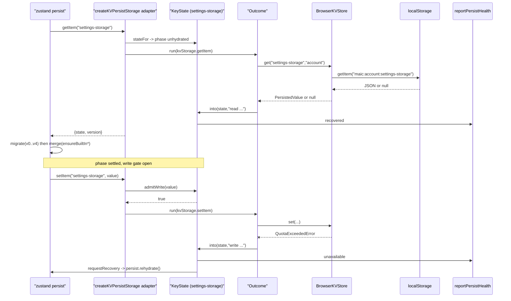
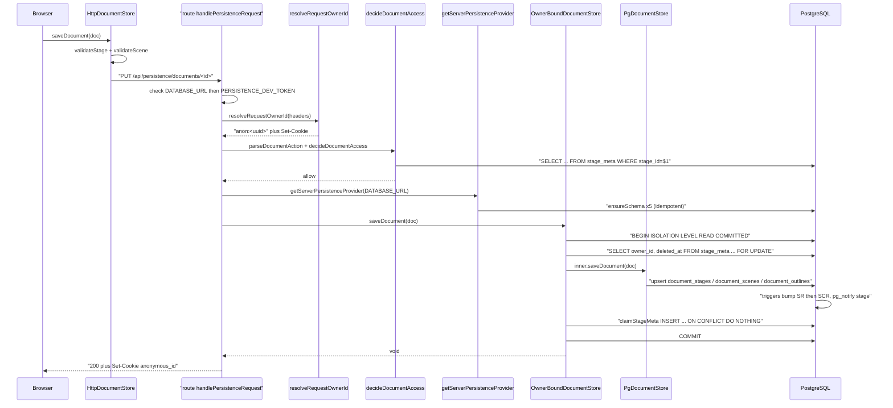
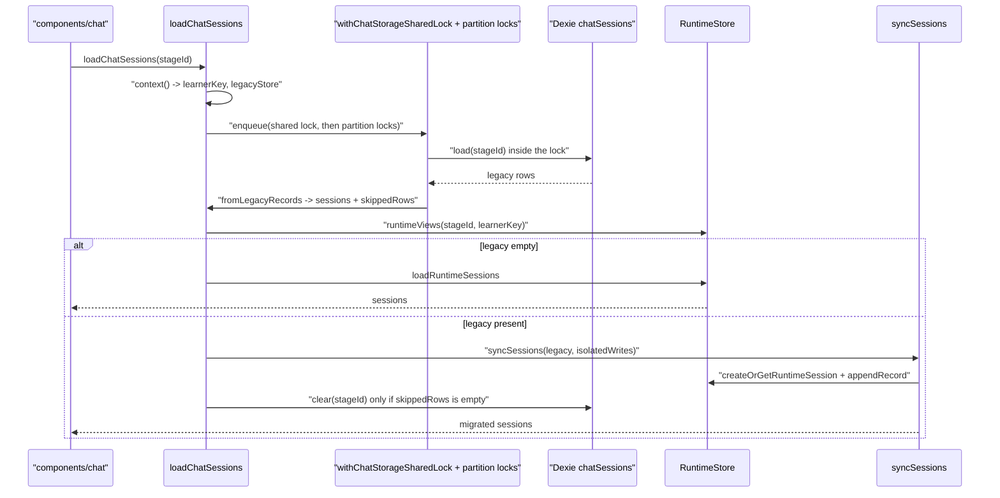
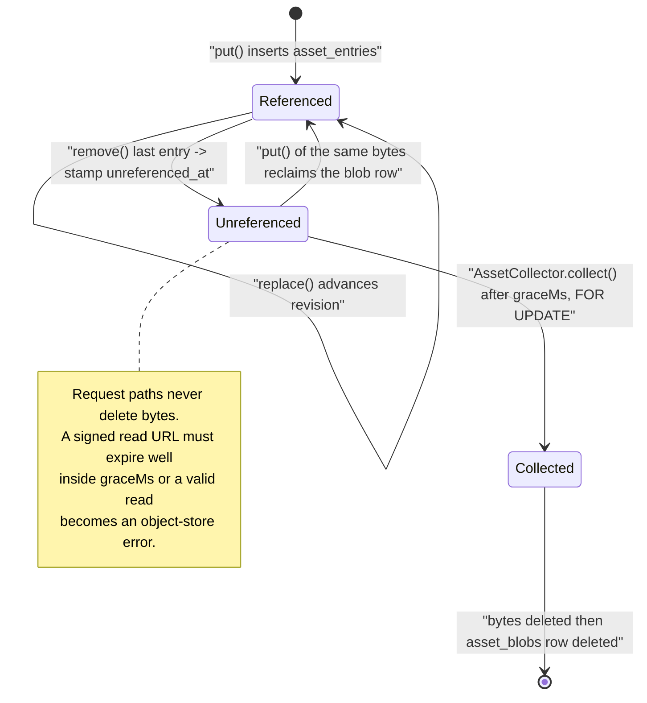
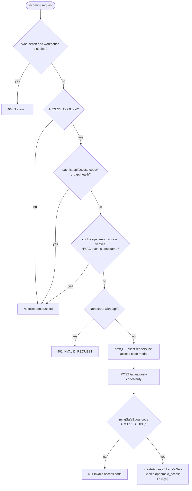

# End-to-end flows

Five traced paths. Every hop names a real function at a real file:line.

## Flow 1 — Settings hydrate, then write (local mode)

| # | Hop | Where |
| --- | --- | --- |
| 1 | module eval builds the store; `persist` calls `storage.getItem('settings-storage')` | [`lib/store/settings.ts:1984-1996`](lib/store/settings.ts#L1984-L1996) |
| 2 | `createKVPersistStorage('account', { onWriteRefused })` returns the adapter | [`lib/store/kv-persist.ts:519`](lib/store/kv-persist.ts#L519) |
| 3 | `getItem` → `stateFor(name)` creates the `KeyState` (phase `unhydrated`) | [`kv-persist.ts:632,543`](lib/store/kv-persist.ts#L632) |
| 4 | `serial(name, …)` puts the read on the key's promise chain | [`kv-persist.ts:578`](lib/store/kv-persist.ts#L578) |
| 5 | `resolveKvStorage()` → `resolveKv` → `new BrowserKVStore()` → `kvPersistStorage(kv, 'account')` | [`kv-persist.ts:525-535`](lib/store/kv-persist.ts#L525-L535), [`zustand/persist.ts:59`](packages/@openmaic/storage/src/zustand/persist.ts#L59) |
| 6 | `Outcome.run(() => kvStorage.getItem(name))` → `kv.get('settings-storage','account')` → `localStorage['maic:account:settings-storage']` | [`kv-persist.ts:658`](lib/store/kv-persist.ts#L658), [`kv/browser.ts:52-56`](packages/@openmaic/storage/src/kv/browser.ts#L52-L56) |
| 7 | `.into(state, 'read "settings-storage" …')` — a throw becomes `state.onFailure` + `UNAVAILABLE`, and the key is left unsettled | [`kv-persist.ts:91-95,658-666`](lib/store/kv-persist.ts#L91-L95) |
| 8 | non-null value → `state.noteRealData()`; then `concludeRead` → `state.settle()` → phase `settled`, `reportPersistHealth(name,'recovered')` | [`kv-persist.ts:637-638,601-606,229`](lib/store/kv-persist.ts#L637-L638) |
| 9 | zustand runs `migrate(persisted, version)` (v0→v4 ladder) then the custom `merge` (`ensureBuiltIn*`, `pruneThinkingConfigs`) | [`settings.ts:1998-2235`](lib/store/settings.ts#L1998-L2235) |
| 10 | a later `set(...)` triggers `storage.setItem`; `state.admitWrite(value)` is decided **at issue time**, not when the queued turn arrives | [`kv-persist.ts:675-677,286-309`](lib/store/kv-persist.ts#L675-L677) |
| 11 | write goes through the same `Outcome` → `noteWriteSucceeded()` or `noteWriteFailed(value)` | [`kv-persist.ts:692-697`](lib/store/kv-persist.ts#L692-L697) |
| 12 | on failure: `onFailure` → `reportPersistHealth(name,'unavailable')` → `#askForRecovery()` → `setTimeout(0/250/1000)` → `useSettingsStore.persist.rehydrate()` | [`kv-persist.ts:195-201,383-402`](lib/store/kv-persist.ts#L195-L201), [`settings.ts:2242`](lib/store/settings.ts#L2242) |

## Flow 2 — Save a course in server mode (`PUT /api/persistence/documents/:stageId`)

| # | Hop | Where |
| --- | --- | --- |
| 1 | `getDocumentStore()` resolves the configured factory once | [`lib/document-store/store.ts:63-71`](lib/document-store/store.ts#L63-L71) |
| 2 | factory built at bootstrap: `new HttpDocumentStore({ baseUrl:'/api/persistence', headers: getPersistenceRequestHeaders, validateScene, validateStage })` | [`lib/persistence/bootstrap.ts:53-61`](lib/persistence/bootstrap.ts#L53-L61) |
| 3 | headers hook awaits `getPersistenceLearnerKey()` → `getLearnerKey(BrowserKVStore)` → KV `device` key `runtime.learnerKey` (minted `anon:<uuid>` under Web Lock `maic:learner-key`) | [`bootstrap.ts:19-39`](lib/persistence/bootstrap.ts#L19-L39), [`lib/runtime/learner-key.ts:48-66`](lib/runtime/learner-key.ts#L48-L66) |
| 4 | `HttpDocumentStore.saveDocument` → `PUT /documents/<stageId>` | [`document/http.ts:220`](packages/@openmaic/storage/src/document/http.ts#L220) |
| 5 | Next route `handlePersistenceRequest` checks `DATABASE_URL` then `PERSISTENCE_DEV_TOKEN` | [`app/api/persistence/[...path]/route.ts:271-281`](app/api/persistence/[...path]/route.ts#L271-L281) |
| 6 | `withRequestOwnerId(request, …)` → `resolveRequestOwnerId` reads/mints cookie `anonymous_id`, returns `anon:<uuid>` | [`route.ts:283`](app/api/persistence/[...path]/route.ts#L283), [`lib/server/agent-runtime/owner.ts:52-64`](lib/server/agent-runtime/owner.ts#L52-L64) |
| 7 | `parseDocumentAction('PUT','/documents/<id>')` → `{ kind:'create', stageId }` | [`route.ts:286`](app/api/persistence/[...path]/route.ts#L286), [`lib/persistence/document-access.ts:43`](lib/persistence/document-access.ts#L43) |
| 8 | `decideDocumentAccess(action, ownerId, readStageMeta, existence probe, readStageMeta)` → `allow` / `forbid` / `not-found` | [`route.ts:291-300`](app/api/persistence/[...path]/route.ts#L291-L300), [`document-access.ts:86-97`](lib/persistence/document-access.ts#L86-L97) |
| 9 | `createPersistenceHandler` → `getServerPersistenceProvider(connectionString)` (5 `ensure*Schema` calls, cached on `globalThis`) | [`route.ts:85-88`](app/api/persistence/[...path]/route.ts#L85-L88), [`lib/persistence/server-provider.ts:36-67`](lib/persistence/server-provider.ts#L36-L67) |
| 10 | `createOwnerBoundDocumentStore({ pool, ownerId, validateScene, validateStage })` | [`route.ts:89-94`](app/api/persistence/[...path]/route.ts#L89-L94) |
| 11 | `createStorageHttpHandler(runtimeStore, documentStore, { authenticate, authorizeDocuments: () => access === 'allow', … })` — `/documents*` requests authenticate as `{ learnerKey: ownerId }`, everything else via `authenticatePersistenceRequest` | [`route.ts:108-121`](app/api/persistence/[...path]/route.ts#L108-L121), [`server/index.ts:777-789`](packages/@openmaic/storage/src/server/index.ts#L777-L789) |
| 12 | `runNodeHandler` adapts the `RequestListener` to a `Response`, buffering chunks as `Buffer` (never a string, to avoid U+FFFD corruption) | [`route.ts:178-261`](app/api/persistence/[...path]/route.ts#L178-L261) |
| 13 | `OwnerBoundDocumentStore.saveDocument` tags the operation `{ stageId, mode:'create' }`, then `withTransaction` locks `stage_meta … FOR UPDATE`, checks foreign/tombstoned/reserved-document/unclaimed | [`owner-bound-document-store.ts:78-82,186-212`](lib/persistence/owner-bound-document-store.ts#L78-L82) |
| 14 | `PgDocumentStore.saveDocument` validates, stamps `dslVersion`, upserts `document_stages`, diffs and upserts `document_scenes`, writes `document_outlines` | `document/pg.ts` (schema at `:58-116`) |
| 15 | triggers `openmaic_stage_revision_trigger` / `openmaic_scene_revision_trigger` bump `document_stage_revision` **before** `document_scene_revision` and `pg_notify('openmaic_agent_event_wakeup', …)` | [`document/pg.ts:169-224`](packages/@openmaic/storage/src/document/pg.ts#L169-L224) |
| 16 | on `mode:'create'` success, `claimStageMeta(queryable, stageId, ownerId)` inserts `stage_meta` `ON CONFLICT DO NOTHING`, then `COMMIT` | [`owner-bound-document-store.ts:215-219`](lib/persistence/owner-bound-document-store.ts#L215-L219), [`stage-meta.ts:103-124`](lib/persistence/stage-meta.ts#L103-L124) |
| 17 | `Set-Cookie` from step 6 is appended to the response, including on 4xx/5xx | [`route.ts:310,319`](app/api/persistence/[...path]/route.ts#L310), [`with-owner.ts:6-11`](lib/server/agent-runtime/with-owner.ts#L6-L11) |

## Flow 3 — `loadChatSessions` with the Dexie cutover

The legacy source is the Dexie `chatSessions` / `chatRestoreStaging` tables
([`lib/utils/chat-storage.ts:90-105`](lib/utils/chat-storage.ts#L90-L105)); the destination is the learner
`RuntimeStore` partition `(stageId, learnerKey)`.

| # | Hop | Where |
| --- | --- | --- |
| 1 | `loadChatSessions(stageId, options)` → `context(options)` resolves store, `learnerKey`, legacy store, and `requiresCrossRealmLock = legacyStore === dexieLegacyStore` | [`chat-storage.ts:1170-1175,273-289`](lib/utils/chat-storage.ts#L1170-L1175) |
| 2 | `enqueue(store, queueKey, stageId, requiresCrossRealmLock, work)` — acquires the global **shared** chat lock first, then registers in the per-partition promise queue (order chosen to avoid a shared→shared→exclusive inversion) | [`chat-storage.ts:238-270`](lib/utils/chat-storage.ts#L238-L270) |
| 3 | `withPartitionLocks` takes `navigator.locks` for the stage key and then the `(stage, learner)` key; with no Web Locks it throws `ChatStorageLockUnavailableError` when the shared Dexie table is involved | [`chat-storage.ts:214-236`](lib/utils/chat-storage.ts#L214-L236) |
| 4 | **inside** the lock: `legacyStore.load(stageId)` reads `chatRestoreStaging` first, else `chatSessions`, sorted by `createdAt` | [`chat-storage.ts:1189`](lib/utils/chat-storage.ts#L1189), [`:91-98`](lib/utils/chat-storage.ts#L91-L98) |
| 5 | `normalizeLegacyConversion` → `fromLegacyRecords` returns `{ sessions, skippedRows }`; malformed rows are logged and **left in place** | [`chat-storage.ts:542-544,1190-1198`](lib/utils/chat-storage.ts#L542-L544) |
| 6 | `runtimeViews(store, stageId, learnerKey)` lists sessions + records and folds each with `foldRecords` | [`chat-storage.ts:500-505`](lib/utils/chat-storage.ts#L500-L505) |
| 7 | a live restore marker triggers `restoreMarkerTargets` deletions + `finalizeRestoreMarker`, then a re-read | [`chat-storage.ts:1200-1214`](lib/utils/chat-storage.ts#L1200-L1214) |
| 8 | **no legacy rows** → `loadRuntimeSessions` → `rememberObservedIds` / `rememberObservedSessions` → `reportSnapshot` → return | [`chat-storage.ts:1215-1228`](lib/utils/chat-storage.ts#L1215-L1228) |
| 9 | **legacy rows present** → `syncSessions(..., legacy, false, …)` migrates them into the runtime store (per session: `syncOne` → `planChatSync` → `createOrGetRuntimeSession` → `appendPayload`) | [`chat-storage.ts:1229-1240,627-679`](lib/utils/chat-storage.ts#L1229-L1240) |
| 10 | `legacyStore.clear(stageId)` **only if `conversion.skippedRows.length === 0`** — the idempotency/no-loss gate | [`chat-storage.ts:1250`](lib/utils/chat-storage.ts#L1250) |
| 11 | `ChatStorageLockUnavailableError` → read-only legacy snapshot returned unmigrated (unless `fallbackToLegacyOnError === false`) | [`chat-storage.ts:1256-1277`](lib/utils/chat-storage.ts#L1256-L1277) |
| 12 | any other error → forget the observation so a later stage save cannot retire unseen data, then fall back to `legacy` if non-empty | [`chat-storage.ts:1278-1299`](lib/utils/chat-storage.ts#L1278-L1299) |

Idempotency: the clear at step 10 is what makes the migration one-shot; a
partition whose legacy table still holds rows re-migrates on the next load, and
`planChatSync` is written to converge on the newest `updatedAt`
([`chat-storage.ts:652-668`](lib/utils/chat-storage.ts#L652-L668)). **Still needed?** Yes — `dexieLegacyStore` is the
default legacy source for every call ([`chat-storage.ts:277`](lib/utils/chat-storage.ts#L277)), `db.chatSessions`
still exists at Dexie v17 ([`lib/utils/database.ts:533`](lib/utils/database.ts#L533)), and
`restoreChatSessionsFromBackup` ([`chat-storage.ts:1328`](lib/utils/chat-storage.ts#L1328)) *writes into* the legacy
tables on purpose as the backup-restore staging path. It is not dead code.

## Flow 4 — Asset write, read and reclamation

| # | Hop | Where |
| --- | --- | --- |
| 1 | `PgAssetStore.put(principal, blob, meta)` opens a transaction | `asset/pg.ts` (contract at [`asset/types.ts:141-162`](packages/@openmaic/storage/src/asset/types.ts#L141-L162)) |
| 2 | quota check on the principal's **logical** bytes precedes any physical write | [`asset/types.ts:155-161`](packages/@openmaic/storage/src/asset/types.ts#L155-L161) |
| 3 | claim the `asset_blobs` row for `content_hash` — serialises the write against the collector | [`asset/pg.ts:1-11`](packages/@openmaic/storage/src/asset/pg.ts#L1-L11) |
| 4 | write bytes via `byteStore.writeWith(queryable, hash, bytes)` when the layer is in the registry database, else `write(hash, bytes)` with `writesOutsideRegistryDatabase` declared | [`asset/pg.ts:12-18`](packages/@openmaic/storage/src/asset/pg.ts#L12-L18), [`lib/persistence/asset-byte-store.ts:132-153`](lib/persistence/asset-byte-store.ts#L132-L153) |
| 5 | insert `asset_entries` (`id`, `principal`, `content_hash`, `mime`, `meta`, `revision=1`) and `COMMIT` — every call allocates a fresh `AssetId` | [`asset/pg.ts:70-78`](packages/@openmaic/storage/src/asset/pg.ts#L70-L78), [`asset/types.ts:141-149`](packages/@openmaic/storage/src/asset/types.ts#L141-L149) |
| 6 | read: `GET /api/persistence/assets/<id>` → asset handler → `resolve` (shared blob-row lock) or, when `ASSET_BYTE_EGRESS=redirect` and the layer can sign, `resolveIndirect` → 302 | [`route.ts:43-77`](app/api/persistence/[...path]/route.ts#L43-L77), [`asset/types.ts:238-266`](packages/@openmaic/storage/src/asset/types.ts#L238-L266) |
| 7 | `remove` decrements the cross-principal reference count and stamps `asset_blobs.unreferenced_at`; **request paths never delete bytes** | [`asset/types.ts:196-205`](packages/@openmaic/storage/src/asset/types.ts#L196-L205), [`asset/pg.ts:20`](packages/@openmaic/storage/src/asset/pg.ts#L20) |
| 8 | `instrumentation.ts` → `startAssetCollectorSchedule()` → `setInterval(collectNow, ASSET_COLLECTION_INTERVAL_MS)` | [`lib/persistence/asset-collector-schedule.ts:88,172`](lib/persistence/asset-collector-schedule.ts#L88) |
| 9 | `AssetCollector.collect()` re-checks and `FOR UPDATE`-locks each candidate blob inside its own transaction, deletes bytes then the row, once `graceMs` has elapsed | [`asset-collector-schedule.ts:13-17,136-139`](lib/persistence/asset-collector-schedule.ts#L13-L17) |
| 10 | egress guard: `indirectEgressWithinGrace` refuses `redirect` unless `ASSET_COLLECTION_GRACE_MS >= 10 × DEFAULT_SIGNED_URL_TTL_SECONDS × 1000`, degrading to direct bytes with a warning | [`route.ts:63-77`](app/api/persistence/[...path]/route.ts#L63-L77) |

## Flow 5 — Access-code gate

| # | Hop | Where |
| --- | --- | --- |
| 1 | any request hits `middleware.ts` (matcher excludes `_next/static`, `_next/image`, `favicon.ico`, `logos/`) | [`middleware.ts:88-90`](middleware.ts#L88-L90) |
| 2 | workbench 404 gate runs first (`isProWorkbenchEnabled` + `isAgentRuntimeConfigured` when not on edge) | [`middleware.ts:53-58`](middleware.ts#L53-L58) |
| 3 | `ACCESS_CODE` unset → `NextResponse.next()`, gate fully off | [`middleware.ts:60-63`](middleware.ts#L60-L63) |
| 4 | allowlist: `/api/access-code/*` and `/api/health` pass | [`middleware.ts:66-68`](middleware.ts#L66-L68) |
| 5 | cookie `openmaic_access` is HMAC-verified with `crypto.subtle` (Edge-compatible) against `timestamp.signature` | [`middleware.ts:18-44,71-74`](middleware.ts#L18-L44) |
| 6 | invalid + `/api/*` → 401 `{ success:false, errorCode:'INVALID_REQUEST' }`; invalid + page → **let through**, the frontend shows a modal | [`middleware.ts:77-85`](middleware.ts#L77-L85) |
| 7 | `POST /api/access-code/verify` compares the submitted code with `timingSafeEqual` over `TextEncoder` bytes | [`app/api/access-code/verify/route.ts:23-28`](app/api/access-code/verify/route.ts#L23-L28) |
| 8 | on success `createAccessToken(accessCode)` = `Date.now()` + `HMAC-SHA256(accessCode, timestamp)` hex; set as `openmaic_access`, HttpOnly, SameSite=Lax, `maxAge` 7 days, `secure` in production | [`lib/server/access-token.ts:4-8`](lib/server/access-token.ts#L4-L8), [`verify/route.ts:30-38`](app/api/access-code/verify/route.ts#L30-L38) |
| 9 | `GET /api/access-code/status` reports `{ enabled, authenticated }` using the Node `verifyAccessToken` | [`app/api/access-code/status/route.ts:5-17`](app/api/access-code/status/route.ts#L5-L17), [`access-token.ts:11-25`](lib/server/access-token.ts#L11-L25) |

What the access code does **not** provide: no per-user identity, no
authorization, and no expiry enforcement — the token embeds a timestamp but
neither `verifyAccessToken` ([`access-token.ts:11-25`](lib/server/access-token.ts#L11-L25)) nor the middleware
([`middleware.ts:18-44`](middleware.ts#L18-L44)) compares it against a maximum age, so a signed token
stays valid until the cookie's own 7-day `maxAge` removes it client-side. The
HMAC key *is* the access code, so every visitor who knows the code can mint a
token. Middleware also lets unauthenticated **page** requests through by design
([`middleware.ts:84-85`](middleware.ts#L84-L85)).
