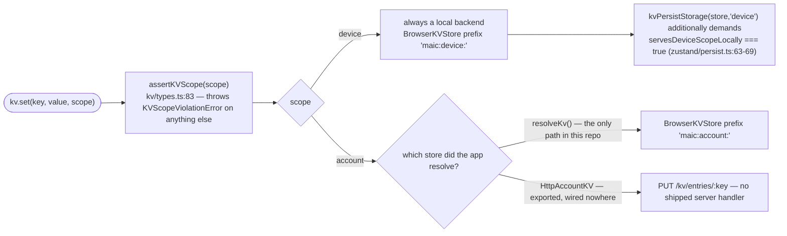

# Dependencies and configuration

## npm dependencies actually used by this subsystem

| Package | Where | Used for |
| --- | --- | --- |
| `zustand` (+ `zustand/middleware`) | `lib/store/settings.ts:10-11`, `lib/store/user-profile.ts:9-10`, `lib/workbench/session-store.ts:24` | every client state store; `persist` middleware for the two KV-backed ones |
| `pg` (`Pool`) | `lib/persistence/server-provider.ts:8`, `lib/persistence/asset-collector-schedule.ts:25`, `lib/server/agent-runtime/store.ts:8` | the only PostgreSQL driver; injected into the storage package, never imported by it |
| `dexie` | `lib/utils/database.ts` (`class MAICDatabase extends Dexie`, `:305`) | the legacy browser database (`MAIC-Database` v17) |
| `i18next`, `react-i18next`, `i18next-resources-to-backend` | `lib/i18n/config.ts:1-3` | locale loading and the React `t` binding |
| `lodash` (`isEqual`) | `lib/utils/chat-storage.ts:12`, `lib/document-store/migration.ts:3` | snapshot equality for conflict detection |
| `nanoid` | `lib/utils/chat-storage.ts:13` | runtime chat session id suffixes |
| `immer` (`produce`) | `lib/contexts/scene-context.tsx:14` | scene draft updates |
| `@openmaic/dsl` | `packages/@openmaic/storage/package.json:108` | the only runtime dependency of the storage package |
| `@aws-sdk/client-s3`, `@aws-sdk/s3-request-presigner` | optional peers (`package.json:110-121`); resolved from `asset/s3-bytes.ts` via a dynamic import in `lib/persistence/asset-byte-store.ts:83-84` | S3 asset byte layer + signed read URLs |
| `@electric-sql/pglite` (dev) | `package.json:125` | in-process PostgreSQL for the package's PG contract tests |
| `fake-indexeddb` (dev) | `package.json:127` | browser-backend tests |

Platform APIs the subsystem depends on, with explicit fallbacks:

- `IndexedDB` — required by every browser backend; `lib/document-store/store.ts:49`
  probes the capability rather than the environment so injected fakes work.
- `localStorage` — `BrowserKVStore` default (`kv/browser.ts:33`);
  `ambientLocalStorage()` catches the throw some privacy modes produce
  (`lib/store/kv-persist.ts:462-468`).
- `navigator.locks` (Web Locks) — cross-realm mutual exclusion for chat storage
  (`chat-storage.ts:214-236`), learner-key minting (`learner-key.ts:52-59`), and
  document migration. Absence is a hard error where the shared Dexie table is
  involved, and a documented residual race for the learner key
  (`learner-key.ts:61-66`).
- `indexedDB.databases()` — probed before a runtime-DB delete so a device that
  never wrote runtime data is not made to create the database
  (`lib/runtime/store.ts:63-69`); assumed present on older Firefox.
- `EventSource` — the workbench session stream (`lib/workbench/owner-session-client.ts:40-46`
  abstracts it behind `OwnerEventSource` for tests).
- `crypto.subtle` — Edge-compatible HMAC in `middleware.ts:26-35`; `node:crypto`
  `createHmac`/`timingSafeEqual` on the Node side (`lib/server/access-token.ts:1`).

## Environment variables

| Variable | Required? | Effect | Evidence |
| --- | --- | --- | --- |
| `NEXT_PUBLIC_PERSISTENCE` | no | `'1'` + a browser window switches document + runtime storage from IndexedDB to `HttpDocumentStore`/`HttpRuntimeStore` against `/api/persistence`. Inlined at build time. | `lib/persistence/bootstrap.ts:16,41-68` |
| `NEXT_PUBLIC_PERSISTENCE_TOKEN` | no | Bearer token the browser sends on every persistence request. Compiled into the public bundle; **not a secret**. | `bootstrap.ts:34-38`, `lib/persistence/server-auth.ts:1-13` |
| `DATABASE_URL` | for any server persistence | Without it `/api/persistence` answers `404 PERSISTENCE_NOT_CONFIGURED`, the asset collector does not start, and `isAgentRuntimeConfigured()` is false so `/api/folders*` answers 404. | `app/api/persistence/[...path]/route.ts:271-274`, `asset-collector-schedule.ts:102-103`, `lib/config/feature-flags.ts:23-25` |
| `PERSISTENCE_DEV_TOKEN` | yes when `DATABASE_URL` is set and the route is used | Missing → `503 PERSISTENCE_DEV_TOKEN_MISSING`. Compared to `Authorization: Bearer …` with a SHA-256 digest + `timingSafeEqual`. | `route.ts:275-281`, `server-auth.ts:32-43` |
| `ASSET_S3_BUCKET` | no | A valid general-purpose bucket name moves asset bytes to S3 (which can sign URLs); invalid names throw `Invalid ASSET_S3_BUCKET` lazily, failing only asset requests. Unset → `asset_blobs.bytes` BYTEA. | `lib/persistence/asset-byte-store.ts:51-68,100-111` |
| `ASSET_BYTE_EGRESS` | no | `'redirect'` answers asset byte GETs with a 302 to a signed URL when the byte layer can sign. Unset/`'direct'`/empty keeps direct bytes; anything else warns and falls back. | `route.ts:43-49` |
| `ASSET_COLLECTION_ENABLED` | no | `'0'`/`'false'` disables reclamation in this process; anything else, including unset, leaves it on. | `asset-collector-schedule.ts:57-60` |
| `ASSET_COLLECTION_INTERVAL_MS` | no | Collection pass period. Default 900 000 (15 min), floor 1 000; invalid warns and uses the default. | `asset-collector-schedule.ts:35,106-112` |
| `ASSET_COLLECTION_GRACE_MS` | no | Retention window for unreferenced bytes. Parsed once in `resolveAssetCollectionGraceMs` so the collector and the route agree; invalid or negative falls back to the package default (3 600 000). | `lib/persistence/asset-collection-grace.ts:17-29`, `.env.example:520` |
| `ACCESS_CODE` | no | Non-empty turns on the site-wide gate in `middleware.ts` and is itself the HMAC key for the `openmaic_access` cookie. Empty/unset disables the gate entirely and makes `POST /verify` answer `{ valid: true }` unconditionally. | `middleware.ts:60-63`, `app/api/access-code/verify/route.ts:7-10` |
| `OPENMAIC_AGENT_RUNTIME_ENABLED` | no | With `DATABASE_URL`, gates `/api/folders`, `/api/folders/[id]`, `/api/folders/members`. Truthy = `'true'` or `'1'`. | `lib/config/feature-flags.ts:10-25`, `app/api/folders/route.ts:53,77` |
| `NEXT_PUBLIC_PRO_WORKBENCH_ENABLED` | no | Build-time half of the `/workbench` 404 gate; the workbench session store is only reachable behind it. | `feature-flags.ts:32-34`, `middleware.ts:54-58` |
| `NODE_ENV` | implicit | `'production'` adds `Secure` to `openmaic_access` and `anonymous_id`. `'test'` (or `VITEST`) makes `recordUsage` a no-op unless an explicit `baseDir` is passed. | `verify/route.ts:37`, `lib/server/agent-runtime/owner.ts:23`, `lib/server/usage-storage.ts:100` |

`.env.example:493-525` documents the persistence and access-control blocks;
`.env.example:495-497` states plainly that the dev scheme "provides no user
isolation and must not be used as public-production authentication".

## Config resolution

```mermaid
flowchart TD
  subgraph client["Client bootstrap (module eval, once)"]
    c1{"typeof window !== undefined<br/>AND NEXT_PUBLIC_PERSISTENCE === '1'"}
    c1 -->|no| cLocal["leave seams unconfigured<br/>-> BrowserDocumentStore + BrowserRuntimeStore"]
    c1 -->|yes| c2["assertRuntimeStorageConfigurable()<br/>assertDocumentStorageConfigurable()"]
    c2 -->|either throws| cFatal["console.error FATAL<br/>no seam changed -> stay local"]
    c2 -->|both pass| c3["configureRuntimeStorage + configureDocumentStorage<br/>(synchronous, cannot half-apply)"]
    c3 --> c4["first getDocumentStore() / getRuntimeStore()<br/>evaluates the factory; failure is NOT cached"]
  end

  subgraph server["Server request (per route)"]
    s1{"process.env.DATABASE_URL"}
    s1 -->|empty| s404["404 PERSISTENCE_NOT_CONFIGURED"]
    s1 -->|set| s2{"process.env.PERSISTENCE_DEV_TOKEN"}
    s2 -->|empty| s503["503 PERSISTENCE_DEV_TOKEN_MISSING"]
    s2 -->|set| s3["getServerPersistenceProvider(connectionString)<br/>cached on Symbol.for('openmaic.persistence.provider')"]
    s3 --> s4["ensureSchema, ensureDocumentSchema, ensureStageMetaSchema,<br/>ensureOwnerMaterialSchema, ensureAssetSchema"]
    s4 --> s5["PgRuntimeStore + PgDocumentStore + PgAssetStore"]
    s5 --> s6{"configuredS3Bucket(ASSET_S3_BUCKET)"}
    s6 -->|valid name| s7["lazy loadS3AssetByteStore<br/>writesOutsideRegistryDatabase = true, can sign"]
    s6 -->|unset| s8["PgAssetByteStore with writeWith/readWith/deleteWith forwarded"]
    s7 --> s9{"ASSET_BYTE_EGRESS === 'redirect'"}
    s8 --> s9
    s9 -->|no| s10["direct byte egress"]
    s9 -->|yes| s11{"grace >= 10x signed URL TTL?"}
    s11 -->|no| s12["console.warn, fall back to direct"]
    s11 -->|yes| s13["byteEgress = {mode:'redirect', collectionGraceMs}"]
  end

  subgraph startup["Process startup (instrumentation.ts)"]
    i1{"DATABASE_URL set AND ASSET_COLLECTION_ENABLED not 0/false"}
    i1 -->|no| i2["return undefined, nothing scheduled"]
    i1 -->|yes| i3["setInterval(collectNow, ASSET_COLLECTION_INTERVAL_MS).unref()<br/>keyed on Symbol.for('openmaic.asset-collector.schedule')"]
  end
```

## Selection logic, stated precisely

The backend for **documents** is chosen exactly once per browser session:

1. `getDocumentStore(deps)` with an explicit `deps.store` → that store, wrapped by
   `withPlainJsonDocumentWrites` (`lib/document-store/store.ts:64`).
2. explicit `deps.indexedDB` / `deps.dbName` → a fresh `BrowserDocumentStore`
   (test isolation, `store.ts:65`).
3. otherwise `defaultStore ??= resolveConfiguredDocumentStore() ?? createBrowserStore({})`
   (`store.ts:68-71`). `resolveConfiguredDocumentStore` sets
   `resolutionStarted = true`, permanently sealing configuration
   (`config.ts:105-111`).

The backend for **runtime** follows the same shape in `lib/runtime/store.ts:35-51`,
additionally latching `usesDefaultBrowserStore` so the deletion cascade knows
whether the `indexedDB.databases()` probe applies.

The backend for **KV** is not configurable in this app: `resolveKv`
(`kv-persist.ts:470-474`) returns `deps.kv` or a shared `BrowserKVStore`, and
`HttpAccountKV` / `HttpKVStore` are exported by the package but referenced nowhere
in `lib/`, `app/`, `components/` or `tests/`
(`/usr/bin/grep -rn "HttpAccountKV|HttpKVStore" lib app components tests` → no
output). So `account`-scoped settings are device-local in every shipped
deployment mode.

## The settings "server sync"

There is no bidirectional settings sync. `fetchServerProviders`
(`lib/store/settings.ts:1461`) is a one-way pull:

1. `GET /api/server-providers` (`settings.ts:1463`); a non-`ok` response returns
   silently.
2. The response is typed inline (`settings.ts:1469-1478`) as
   `{ providers, tts, asr, pdf, image, video, webSearch, generation? }`. Managed
   providers expose "only their allowed model list (LLM/image) and presence (the
   'managed' flag) — never a base URL" (`settings.ts:1465-1468`).
3. Conflict handling is *reset-then-apply*, per capability section: every local
   entry's `isServerConfigured` and `serverModels` (or `serverDisabled`) are
   cleared first, then the server's entries set them
   (`settings.ts:1483-1493` for LLM, `:1535-1555` for TTS, and the same shape for
   ASR/PDF/image/video/web-search).
4. User-entered fields are never overwritten: for LLM providers only `models` is
   rewritten, and only when the server sent an allow-list; per model the merge
   prefers the built-in metadata for `name`/`capabilities` and the local entry for
   everything else (`settings.ts:1498-1528`).
5. A failure logs `Failed to fetch server providers` at warn level and changes
   nothing — "server providers are optional" (`settings.ts:1976-1979`).
6. First-run only, `autoConfigApplied === false` lets the sync auto-select
   provider/model and auto-enable image/video/TTS (`settings.ts:1820,1950-1974`).
   The v0→v4 migration sets `autoConfigApplied = true` for existing users
   (`settings.ts:2111-2113`).

## Physical location per deployment mode

| Entity | Local mode | Server mode (`DATABASE_URL`) | Server + S3 |
| --- | --- | --- | --- |
| Settings, profile | `localStorage` `maic:account:*` | same (KV has no HTTP wiring) | same |
| Learner key, storage generation, migration markers | `localStorage` `maic:device:*` | same (`device` never leaves) | same |
| Course documents | IndexedDB `maic-documents` | `document_stages` / `document_scenes` / `document_outlines` | same |
| Folders | Dexie `folders` + `stageFolders` (v17) | `document_folders` + `document_stages.folder_id` | same |
| Chat sessions | IndexedDB `maic-runtime` (+ legacy Dexie `chatSessions`) | `runtime_sessions` / `runtime_records` | same |
| Asset bytes | IndexedDB `maic-asset-pool` | `asset_blobs.bytes` BYTEA | S3 objects keyed by content hash |
| Asset registry | IndexedDB `maic-asset-pool` (`ASSETS`) | `asset_entries` | `asset_entries` |
| Agent sessions, materials, user skills | not available | `agent_sessions` + 6 sibling tables | same |
| Usage metering | not written (client) | `data/usage/<YYYY>-<MM>.jsonl` on the server filesystem | same |
| Access / owner identity | — | cookies `openmaic_access`, `anonymous_id` | same |
