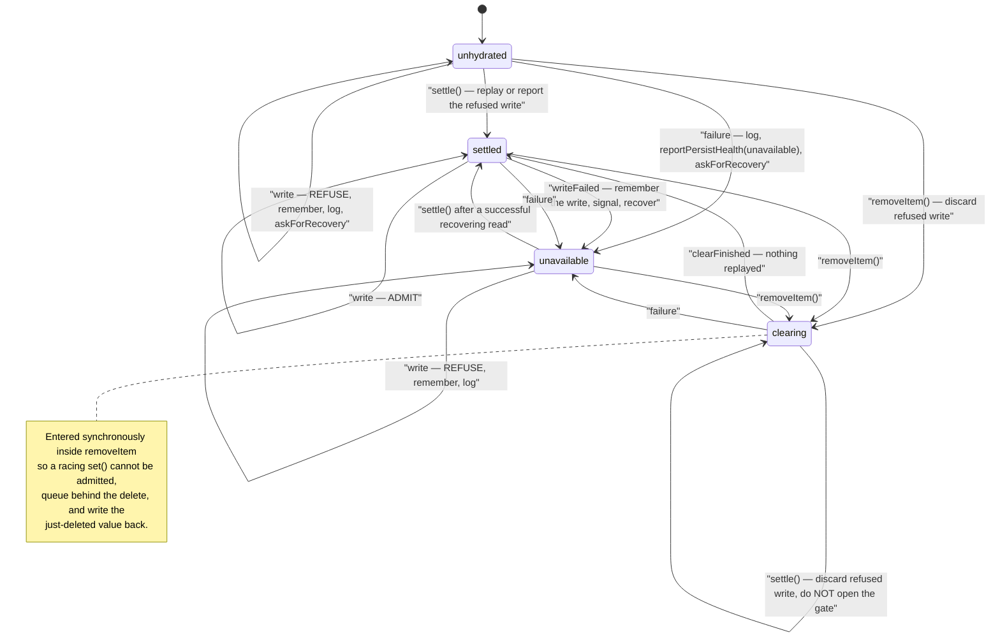
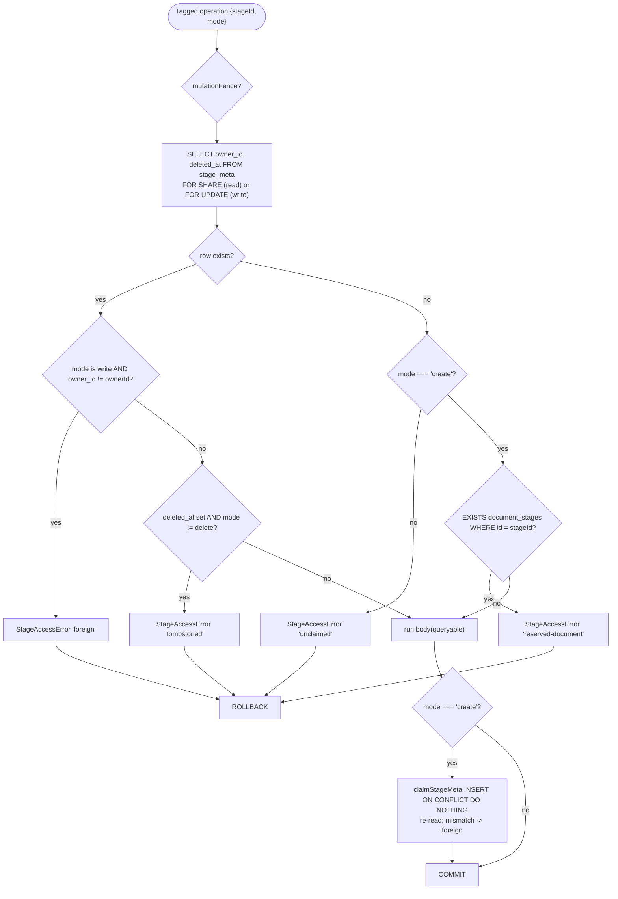
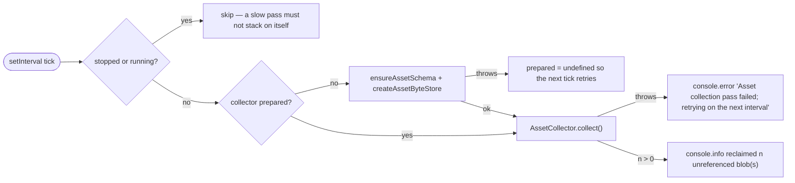

# Failure modes and error handling

## 1. Browser KV persistence (`lib/store/kv-persist.ts`)

The whole module is a failure-handling design. Its rule: a failed read is never
absence, a failed write never leaves a key writable, and either raises the health
signal and asks for recovery (`kv-persist.ts:26-31`).

Concrete outcomes:

- **`localStorage` unreachable in a browser** (privacy mode) — treated as a
  failure, not an empty store, because the alternative is silent data loss:
  `state.onFailure('reach browser storage', …)` (`kv-persist.ts:649-654`). During
  SSR the same condition is expected and silent (`isBrowserRuntime()`
  `:458-460`).
- **Read throws** — key stays `unhydrated`; the store keeps whatever it holds and
  the write gate refuses, rather than settling defaults over unreadable data
  (`kv-persist.ts:662-666`).
- **Write throws after settle** (quota exhausted) — `noteWriteFailed(value)`
  remembers the newest copy, phase becomes `unavailable`, recovery is scheduled
  (`:692-697`).
- **Replay write fails** — `replayFailed()` puts the snapshot back as owed so a
  permanent failure is eventually reported rather than passing as success
  (`:361-372,620-625`).
- **Recovery exhausted** — after `DEFAULT_RECOVERY_BACKOFF_MS.length` (3)
  attempts, `#recoveryExhausted = true`, an error is logged, and if anything is
  still owed `reportPersistHealth(name, 'changes-lost')` fires
  (`:383-398`).
- **`removeItem` cannot reach storage** — throws, deliberately: "a caller clearing
  a user's data has to be able to tell that it did not happen"
  (`:711-730`).
- **Pre-hydration write on a healthy backend** — a distinct, quieter outcome: a
  warning line, `reportPersistHealth(name,'recovered')`, and the stored value
  stands. The comment names the real fix as a hydration gate the app consumes
  (`:244-255`).

User-visible surface: `subscribeToPersistHealth` (`persist-health.ts:138`).
`changes-lost` is final until `acknowledgePersistLoss(name)` (`:118`); `recovered`
retracts an `unavailable` notice **only if it was actually delivered**
(`:96-102`).

## 2. Server persistence route (`app/api/persistence/[...path]/route.ts`)

| Condition | Response | Where |
| --- | --- | --- |
| `DATABASE_URL` unset | `404 {error:{code:'PERSISTENCE_NOT_CONFIGURED'}}` | `route.ts:271-274` |
| `PERSISTENCE_DEV_TOKEN` unset | `503 PERSISTENCE_DEV_TOKEN_MISSING` | `route.ts:275-281` |
| `decideDocumentAccess` → `not-found` | `404 DOCUMENT_NOT_FOUND` | `route.ts:303-305` |
| `decideDocumentAccess` → `forbid` | handler constructed with `authorizeDocuments: () => false`; the package's document handler maps it | `route.ts:115` |
| any throw during init or dispatch | `console.error('Embedded persistence route initialization failed')` + `500 PERSISTENCE_INIT_FAILED` | `route.ts:312-321` |
| handler calls `res.destroy(err)` | the adapter promise rejects with that error or `Persistence HTTP handler destroyed the response` | `route.ts:249-252` |
| unknown/unhandled owner error | `withRequestOwnerId` catches, logs, returns `500` **with the `Set-Cookie` intact** | `lib/server/agent-runtime/with-owner.ts:18-23` |

Every response path appends the owner `Set-Cookie`, including errors — a 500 that
dropped it "would silently make the retry a different anonymous owner"
(`with-owner.ts:6-11`, applied at `route.ts:310,319`).

`ASSET_BYTE_EGRESS` misconfiguration degrades rather than failing:
an unrecognised value warns and uses direct egress (`route.ts:47-48`); a grace
period shorter than ten signed-URL lifetimes warns and falls back, because "the
asset backend is optional, and its misconfiguration must never take document and
runtime traffic down with it" (`route.ts:51-77`).

## 3. Document ownership refusals

`StageAccessRefusal = 'foreign' | 'unclaimed' | 'tombstoned' | 'reserved-document'`
(`lib/persistence/stage-meta.ts:90`). `StageAccessError extends DocumentNotFoundError`
(`:92`) so the package's existing 404 mapping applies without a new branch.

Reads convert any `StageAccessError` to `null` via `readGated`
(`owner-bound-document-store.ts:120-127`) — a miss, not an error, keeping the
no-existence-oracle posture.

## 4. Chat storage (`lib/utils/chat-storage.ts`)

Three named failures:

- `ChatStorageLockUnavailableError` (`:119`) — no `navigator.locks` while the
  shared Dexie table is in play (`:230-234`). On **save**, it is swallowed only
  when the write is provably a no-op echo of what the caller already saw
  (`:1157-1164`); any real creation, edit or deletion still fails loud. On
  **load**, it degrades to a read-only unmigrated legacy snapshot unless
  `fallbackToLegacyOnError === false` (`:1256-1277`).
- `ChatStorageSnapshotInvalidatedByRestoreError` (`:120`) — a backup restore moved
  the restore marker under a caller holding a stale snapshot
  (`:1032-1040`). An unchanged autosave is allowed through as a no-op; a real
  mutation fails.
- `ChatStorageSnapshotInvalidatedByDeletionError` (`:121`) — the chat has a
  deletion tombstone and the caller's baseline matches it (stale) or the caller
  never observed it (`:1093-1104`).

Retry classification: `isDeterministicChatSyncFailure` (`:529-540`) stops retrying
on HTTP 400/401/403/413, any `VALIDATION_FAILED`, or `409 FUTURE_VERSION` — with
an explicit exception for `isInactiveSessionAppendError` (`:517-527`), which is a
race worth retrying. Bounds: 8 attempts × 8 plan steps, exponential backoff capped
at 500 ms (`:47-49,645`).

Post-failure bookkeeping is the subtle part: on a failed runtime read the
observation is deliberately cleared (`rememberObservedIds(store, key, [])`,
`:1281-1283`) so a later stage save cannot interpret the missing sessions as
deletions. On a legacy-only fallback it is set to the legacy ids only, because
runtime-only sessions discovered during sync were never exposed to the caller
(`:1284-1294`).

## 5. Document migration (`lib/document-store/migration.ts`)

- `DocumentStorageGenerationChangedError` (`:89`) — a write that would land after
  `clearDatabase()` bumped `document-storage-generation` fails loud rather than
  resurrecting wiped data.
- `DocumentLockUnavailableError` (`:87`).
- Asset-ref conversion is best-effort on the load path: a failure logs and returns
  the document unconverted, because "a failure (pool unavailable, IndexedDB
  hiccup) must not break opening the document" (`:102-125`).
- `DatabaseClosedError` mid-read is caught and the probe returns `null`; the
  phase-3 fence redoes the reads inside the lock (`:421-426`).
- Verification divergence: `assertMigrationVerified` failing means the marker is
  **not** written, logged as "Legacy snapshot diverges from authoritative
  destination" — the destination is still converted and persisted so diverged
  documents are not stranded with legacy references forever (`:427-447`).
- A failed save-back rolls the whole allocation ledger so freshly allocated asset
  ids do not accumulate quota across repeated opens (`:127-140`).

Idempotency of the migration: keyed on KV `device` marker
`document-migration:<stageId>` (`:98,390-398`), whose payload records
`sourceUpdatedAt`, an FNV-1a `sourceHash` of the legacy snapshot, and
`migratedAt`. `finishMigrationMetadata` returns early when the marker exists
(`:391`).

## 6. Runtime deletion cascade

`beginStageRuntimeDeletionSafely` (`lib/runtime/store.ts:110`) is fail-soft by
construction: bounded by `STAGE_RUNTIME_DELETE_TIMEOUT_MS = 5000` (`:54`), any
error or timeout logs `Failed to delete runtime data for stage <id>` and moves on.
It returns two promises — `completion` (bounded, caller-visible) and `settlement`
(the real one, used to retain destructive maintenance locks) — so a hung delete
cannot brick stage deletion in the main app DB while still keeping the lock held
(`:102-107,116-134`). The documented cost: orphaned runtime rows, unreachable
through normal navigation, reclaimable by a future startup sweep (`:86-94`).

## 7. Asset collector

Deliberate choices recorded in the source: the first pass is one full interval
away so a cold start does not race PostgreSQL coming up
(`asset-collector-schedule.ts:169-172`); the timer is `unref()`ed so it never keeps
the process alive (`:174`); and several concurrent collectors are safe because
each candidate is re-checked under `FOR UPDATE` — the header explicitly asks not
to add a distributed lock (`:13-17`).

## 8. Bootstrap and configuration failures

- `configureDocumentStorage` called twice, or after resolution started → throws
  with an explanatory message; configuration stays sealed even if resolution
  failed, and the fix is to retry the consumer (`lib/document-store/config.ts:69-78`).
- Bootstrap does both `assert*Configurable()` checks before either `configure*`,
  so a failure cannot leave only one seam server-backed
  (`lib/persistence/bootstrap.ts:62-74`); the catch logs
  `FATAL: server-backed persistence bootstrap failed` and the app stays local.
- A configured factory that throws is **not** cached: `defaultStore ??= (() => …)()`
  assigns only on success (`document-store/store.ts:66-71`;
  same in `runtime/store.ts:47-51` and `learner-key.ts:88-99`).
- HMR caveat documented twice: configuration and consumer caches live in separate
  modules, so partial replacement can fragment their module-level state — reload
  the page (`config.ts:45-48`, `learner-key.ts:76-79`).

## 9. i18n

`config.ts:37-44` sets `lng: defaultLocale`, `fallbackLng: defaultLocale`
(`'zh-CN'`), and `supportedLngs` from the registry, so an unknown locale code
resolves to Simplified Chinese rather than raw keys. Workbench copy has its own
fallback chain: `workbenchResourceFor` merges an overlay over English (or over
Simplified for `zh-TW`), so "an untranslated key degrades to a readable sentence
rather than to `workbench.tool.label.x`" (`lib/i18n/workbench.ts:12-16`).

A missing key in a JSON locale is caught at CI time, not runtime:
`pnpm check:i18n-keys` exits 1 and prints every missing and extra key per file
(`scripts/check-i18n-keys.mjs:76-111`).

## 10. Usage metering

`recordUsage` is explicitly fire-and-forget and never throws — a `try/catch`
around the whole body logs `Failed to record usage (ignored)`
(`lib/server/usage-storage.ts:133-135`). `readUsageRecords` returns `[]` when the
directory is absent and silently skips malformed JSONL lines
(`:180-208`). One notable guard: under `VITEST` or `NODE_ENV=test` with no
explicit `baseDir` the function returns immediately, added after test rows were
found written into the live `data/usage/` file (`:94-100`).
