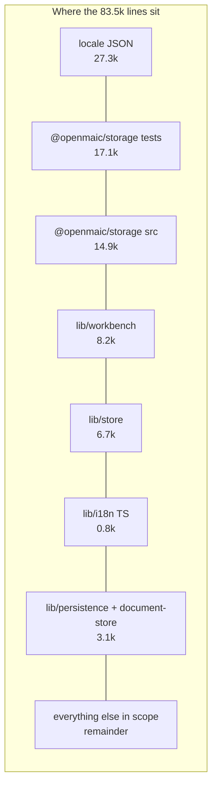

# Quality observations and measured metrics

## Measured metrics

Every number below is paired with the command that produced it, run from the repo
root on branch `main` at `c2c9553a`.

| Metric | Value | Command |
| --- | --- | --- |
| Lines in survey scope | 83 562 | `git ls-files lib/persistence lib/storage lib/store lib/document-store lib/workbench lib/contexts lib/types types lib/brand lib/i18n packages/@openmaic/storage app/api/persistence app/api/folders app/api/access-code lib/utils/chat-storage.ts \| xargs wc -l \| tail -1` |
| `@openmaic/storage` source | 14 904 | `git ls-files packages/@openmaic/storage/src \| xargs wc -l \| tail -1` |
| `@openmaic/storage` tests | 17 068 | `git ls-files packages/@openmaic/storage/test \| xargs wc -l \| tail -1` |
| Test:source ratio for the package | 1.15 : 1 | derived from the two rows above |
| Files in the package's `test/` | 47 — of which **32** are `*.test.ts` suites and 15 are contract helpers, conformance servers and `setup.ts` | `git ls-files packages/@openmaic/storage/test \| wc -l`, then `\| /usr/bin/grep -c '\.test\.ts$'` |
| Files in `test/` whose path contains "contract" | 12 | `git ls-files packages/@openmaic/storage/test \| /usr/bin/grep -c contract` |
| …of which are **backend-equivalence** contract suites | **9** | the 12 above minus `pg-agent-session-contract-helpers.ts` and `pg-document-contract-helpers.ts` (helpers, not suites) and `pg-schema-contract.test.ts` (a single-backend DDL restatement) |
| PostgreSQL tables declared | 20 | `/usr/bin/grep -rhoE "CREATE TABLE IF NOT EXISTS [a-z_]+" packages/@openmaic/storage/src lib/persistence \| sed 's/.*EXISTS //' \| sort -u \| wc -l` |
| Named exports from the package barrel | 159 | `/usr/bin/grep -cE "^  [A-Za-z]" packages/@openmaic/storage/src/index.ts` |
| Subpath exports in `package.json` | 16 | `packages/@openmaic/storage/package.json:9-74` (counted by hand) |
| `lib/persistence/` | 1783 lines, 13 files | `git ls-files lib/persistence \| xargs wc -l \| tail -1` and `\| wc -l` |
| `lib/document-store/` | 1354 lines, 10 files | `git ls-files lib/document-store \| xargs wc -l \| tail -1` and `\| wc -l` |
| `lib/store/` | 6692 lines | `git ls-files lib/store \| xargs wc -l \| tail -1` |
| Locale JSON (both trees) | 27 310 lines | `git ls-files lib/i18n/locales lib/i18n/workbench-locales \| xargs wc -l \| tail -1` |
| `lib/i18n/*.ts` (loader + workbench copy) | 824 lines | `git ls-files 'lib/i18n/*.ts' \| xargs wc -l \| tail -1` |
| `lib/i18n/` (incl. locale JSON) | 28 165 lines | `git ls-files lib/i18n \| xargs wc -l \| tail -1` |
| App locale files | 12 | `ls lib/i18n/locales \| wc -l` |
| Workbench overlay locale files | 10 | `ls lib/i18n/workbench-locales \| wc -l` |
| Leaf keys per app locale (`en-US`) | 1801 | `node -e "const f=require('./lib/i18n/locales/en-US.json');let n=0;(function w(o){for(const v of Object.values(o)){if(v&&typeof v==='object')w(v);else n++}})(f);console.log(n)"` |
| `SettingsState` fields | 91 | `sed -n '81,426p' lib/store/settings.ts \| /usr/bin/grep -cE "^  [a-zA-Z]+\??:"` |
| Setter actions in the settings store | **42** | `/usr/bin/grep -oE "^[[:space:]]+set[A-Z][A-Za-z0-9_]*" lib/store/settings.ts \| /usr/bin/grep -oE "set[A-Z][A-Za-z0-9_]*" \| sort -u \| wc -l`. The two-indent grep returns 84 because every setter is written twice — once in the `SettingsState` type at indent 2, once in the implementation at indent 8 |
| Settings persist version | 4 | `lib/store/settings.ts:48` |
| `createInitialSessionState()` keys (workbench) | 31 | `sed -n '512,559p' lib/workbench/session-store.ts \| /usr/bin/grep -cE "^    [a-zA-Z]+:"` |
| `foldEvent` body length | 840 lines (`:913`–`:1752`) | `/usr/bin/grep -n "^export function foldEvent" lib/workbench/session-store.ts` and `:1754` for `foldEvents` |
| Distinct string literals matched inside `foldEvent` | 45 | `sed -n '913,1752p' lib/workbench/session-store.ts \| /usr/bin/grep -oE "'[a-z_]+'" \| sort -u \| wc -l` |
| Persistence-related test files under `tests/` | 91 | `git ls-files tests \| /usr/bin/grep -cE "persistence\|storage\|store\|i18n\|kv-\|chat-storage\|document"` |
| `console.log` in the in-scope app modules | 0 | `/usr/bin/grep -rn "console\.log" lib/persistence lib/store lib/document-store lib/utils/chat-storage.ts app/api/persistence app/api/folders \| wc -l` |
| `console.warn`/`error`/`info` in the same set | 16 | same command with `console\.` |
| `as Record<string, unknown>` casts in `settings.ts` | 22 | `/usr/bin/grep -c "as Record<string, unknown>" lib/store/settings.ts` |
| `as unknown as DocumentFolderStore` casts in the folder routes | 5 (2 + 2 + 1) | `/usr/bin/grep -rc "as unknown as DocumentFolderStore" app/api/folders/route.ts 'app/api/folders/[id]/route.ts' app/api/folders/members/route.ts` |
| Dexie schema version | 17 (13 deliberately skipped) | `lib/utils/database.ts:300,524-527,562` |

## Genuine strengths

**S1 — One contract suite proves backend equivalence.** 12 of the 47 files in
`test/` have "contract" in the path, and **9** of those are shared
backend-equivalence suites (`agent-session-contract.ts`,
`agent-session-concurrency-contract.ts`, `agent-session-material-contract.ts`,
`agent-session-url-contract.ts`, `asset-contract.ts`,
`asset-byte-store-contract.ts`, `document-contract.ts`, `kv-contract.ts`,
`runtime-contract.ts`) that every backend runs. The other three are not
equivalence suites: `pg-agent-session-contract-helpers.ts` and
`pg-document-contract-helpers.ts` are helpers, and `pg-schema-contract.test.ts`
pins one backend's DDL. The package header states the rule: `KVStore` ships a
browser and an HTTP backend "proven equivalent by one shared contract suite"
(`packages/@openmaic/storage/src/index.ts:10-12`). There are also HTTP conformance
servers (`test/http-conformance-server.ts`, `test/kv-conformance-server.ts`) and a
`pg-schema-contract.test.ts` that pins the DDL so a deployment provisioning tables
with its own migration tooling stays byte-compatible with `ensure*Schema`
(`material/pg.ts:9-13`, `skill/pg.ts:8-11`).

```mermaid
flowchart TD
  subgraph shared["Shared backend-equivalence contract suites (9 files)"]
    kvc["kv-contract.ts"]
    docc["document-contract.ts"]
    rtc["runtime-contract.ts"]
    asc["asset-contract.ts"]
    agc["agent-session-contract.ts"]
  end
  subgraph confservers["In-process conformance servers"]
    httpc["http-conformance-server.ts"]
    kvsrv["kv-conformance-server.ts"]
  end
  subgraph runs["Backends held to them"]
    kvb["BrowserKVStore"]
    kvh["HttpAccountKV"]
    db["BrowserDocumentStore"]
    dh["HttpDocumentStore"]
    dp["PgDocumentStore (PGlite + real pg)"]
    rb["BrowserRuntimeStore"]
    rh["HttpRuntimeStore"]
    rp["PgRuntimeStore"]
    ab["BrowserAssetStore"]
    ah["HttpAssetStore"]
    ap["PgAssetStore"]
    agp["PgAgentSessionStore"]
  end
  ddl["pg-schema-contract.test.ts<br/>pins the DDL byte-for-byte"]
  kvc --> kvb
  kvc --> kvh
  docc --> db
  docc --> dh
  docc --> dp
  rtc --> rb
  rtc --> rh
  rtc --> rp
  asc --> ab
  asc --> ah
  asc --> ap
  agc --> agp
  httpc --> dh
  httpc --> rh
  httpc --> ah
  kvsrv --> kvh
  ddl --> dp
  ddl --> ap
  ddl --> agp
```

**S2 — Failure semantics are encoded in types, not conventions.**
`Outcome<T>`'s payload is a `#`-private field whose only reader demands a
`KeyState` (`lib/store/kv-persist.ts:65-96`), so no call site can look at a result
without feeding the state machine. `DeviceSafeKVStore`'s brand
(`kv/types.ts:40-42`) makes handing a networked store the `device` scope a
compile error, and the deliberate absence of a `(KVStore, KVScope)` overload
(`zustand/persist.ts:56-58`) prevents the guard being handed straight back.
`AssetPrincipal.key` is required for the same class of reason
(`asset/types.ts:30-37`).

**S3 — Invariants are written down where they are enforced, with the failure they
prevent.** The lock-order rule between `document_stage_revision` and
`document_scene_revision` names the deadlock code it avoids
(`document/pg.ts:129-133`). `splitSqlStatements` exists because `split(';')` would
carve plpgsql bodies apart (`document/pg.ts:228-233`). `lazyAssetByteStore`
explains that omitting `writeWith` produces a PostgreSQL-undetectable self-deadlock
(`lib/persistence/asset-byte-store.ts:124-131`). The asset collector's header
pre-emptively asks not to add a distributed lock and says why
(`asset-collector-schedule.ts:13-17`).

**S4 — Security posture is stated, not implied.** `lib/persistence/server-auth.ts:1-13`
is a 13-line disclaimer naming exactly what the dev token does not provide, and
`.env.example:495-497` repeats it. `EXCLUDED_RENDERABLE_TYPES` is enforced at
handler construction rather than documented (`asset/types.ts:104-122`). The URL
trust gate refuses to widen from scraped pages
(`agent-session/types.ts:569-575`).

**S5 — Degradation is chosen per-component.** Asset misconfiguration fails asset
requests only (`route.ts:51-77`, `asset-byte-store.ts:87-99`); the owner-event
projection returns `null` rather than vetoing the lifecycle write
(`agent-session/types.ts:455-462`); the runtime deletion cascade is timeout-bounded
and fail-soft (`lib/runtime/store.ts:86-94`); `listDocuments` tolerates a corrupt
version stamp on one row (`document/types.ts:196-204`).

**S6 — Total resets instead of remembered field lists.**
`createInitialSessionState()` (`lib/workbench/session-store.ts:511`) returns the
complete session state as one object, typed so a new fold field fails to compile
if unset, with a companion test walking the live store's keys. Its comment records
the same bug arriving three times before the invariant was made structural
(`:490-510`).

## Real fragility

**F1 — `account`-scoped KV is not actually shared across devices in any shipped
mode.** `lib/store/settings.ts:1-8` and `lib/store/user-profile.ts:1-7` both
describe `account` as "the thing a second device should not have to be told again"
/ "exactly the data a server-backed deployment is expected to carry across their
devices", but `HttpAccountKV` and `HttpKVStore` appear nowhere outside the package
(`/usr/bin/grep -rn "HttpAccountKV|HttpKVStore" lib app components tests` → no
output), and `resolveKv` (`kv-persist.ts:470-474`) can only produce a
`BrowserKVStore`. There is no server-side KV handler either: `src/server/` has
`asset.ts`, `document.ts`, `index.ts`, `read-json.ts`, `reference.ts` and no
`kv.ts`. So the whole scope axis is currently aspirational, and prose in two
stores reads as if it were live. Severity: medium — misleading to a reader, no
runtime bug.

**F2 — `NEXT_PUBLIC_PERSISTENCE_TOKEN` in a public bundle plus a
client-supplied `x-learner-key` means server mode has no isolation at all.** This
is documented (`server-auth.ts:1-13`) and all asset writes are funnelled to one
`'shared'` principal on purpose (`server-auth.ts:26,53`), but it means the
`AssetPrincipal` partitioning the package went out of its way to make mandatory is
collapsed to a single partition in the only server deployment the repo ships.
Documents get a *different* identity (the server-resolved `anon:` cookie owner,
`route.ts:109-112`), so the same request carries two unrelated notions of "who".
Severity: high if anyone treats server mode as multi-user; the code says not to.

**F3 — The access-code token has no server-side expiry.**
`createAccessToken` embeds `Date.now()` (`lib/server/access-token.ts:4-8`) but
neither `verifyAccessToken` (`:11-25`) nor the Edge `verifyToken`
(`middleware.ts:18-44`) checks it. Validity is bounded only by the cookie's
7-day `maxAge` (`verify/route.ts:36`), which a client controls. Rotating
`ACCESS_CODE` does invalidate every token (it is the HMAC key), which is the real
revocation lever. Severity: medium — the gate is documented as a shared password,
not authentication.

**F4 — `settings.ts` is a 2248-line store with 91 state fields, 42 setters, and 22
`as Record<string, unknown>` escapes.** The escapes exist because the persist
`migrate` ladder must read fields that no longer exist on the type
(`settings.ts:2039-2055,2103-2124`) — legitimate, but it means the migration path
is largely untyped. The unconditional normalisation in `merge`
(`:2213-2235`) runs seven `ensureBuiltIn*` passes plus `pruneThinkingConfigs` on
every rehydrate, so per-provider defaults are re-derived on each page load rather
than at migration time. Severity: medium (maintainability).

**F5 — `foldEvent` is a single 840-line function** (`session-store.ts:913-1752`)
matching 45 distinct string literals. It is pure and covered, and its purity is
load-bearing for `Last-Event-ID` resumption, but a new event type touches one
enormous switch. Severity: low-medium (maintainability, not correctness).

**F6 — `chat-storage.ts` carries five interacting coordination mechanisms.** A
global shared/exclusive Web Lock, two nested per-partition Web Locks, a
per-`(RuntimeStore, partition)` promise queue, four `WeakMap`s of observation
state, plus restore markers and deletion tombstones stored as runtime sessions.
Every piece has a stated reason (`:107-117,238-270`), and the lock-ordering
comment (`:1336-1338`) names the cycle it avoids, but the resulting state space is
large enough that the module's own comments describe the cutover's automatic
legacy adoption as having been *removed* for exactly this reason
(`kv-persist.ts:501-511` makes the same call for KV). Severity: medium.

**F7 — `as unknown as DocumentFolderStore` in all three folder routes** (5
occurrences). `getOwnerScopedDocumentStore(ownerId)` returns a
`DocumentStore`-typed value that is really an `OwnerBoundDocumentStore`
implementing both interfaces (`owner-bound-document-store.ts:58-59,176`), so the
cast is sound today — but it is checked by nothing. `createOwnerBoundDocumentStore`
already returns `DocumentStore & DocumentFolderStore`; the accessor's return type
is what narrows it away. Severity: low (a typing gap, one signature away from
fixed).

**F8 — Two independent revision/generation mechanisms with similar names.**
`document_stage_revision` / `document_scene_revision` (server, trigger-maintained,
`document/pg.ts:157-167`) and the KV `device` `document-storage-generation`
(browser, bumped by `clearDatabase`, `storage-generation.ts:3`) both guard against
writes landing after something changed underneath, but they are unrelated and
neither comment cross-references the other. Severity: low (confusion risk).

**F9 — `check:i18n-keys` covers 12 files and not the other 10.** The script reads
only `lib/i18n/locales` (`scripts/check-i18n-keys.mjs:4`); `workbench-locales/` is
held to shape by a vitest test instead (`lib/i18n/workbench.ts:12-16`). Two
enforcement mechanisms for one contract means a contributor can satisfy
`pnpm check:i18n-keys` and still ship a broken workbench overlay unless they also
run the unit suite. Neither mechanism detects an untranslated (copy-pasted
English) value. Severity: low.

**F10 — Schema provisioning is spread across five call sites with an ordering
dependency.** `server-provider.ts:43-47` provisions runtime/document/stage-meta/
owner-material/asset; `lib/server/agent-runtime/store.ts:47`,
`session-materials.ts:51` and `user-skill-store.ts:53` each provision their own on
first use. `agent_session_materials.session_id` has an FK to `agent_sessions(id)`,
and `material/pg.ts:13-15` states that the host "must provision
`ensureAgentSessionSchema` before this one".
`lib/server/agent-runtime/session-materials.ts:48-50` acknowledges the dependency
in a comment and relies on `getAgentSessionStore` having run first — the ordering
is enforced only by which module happens to be touched first, not by code.
Severity: medium.
