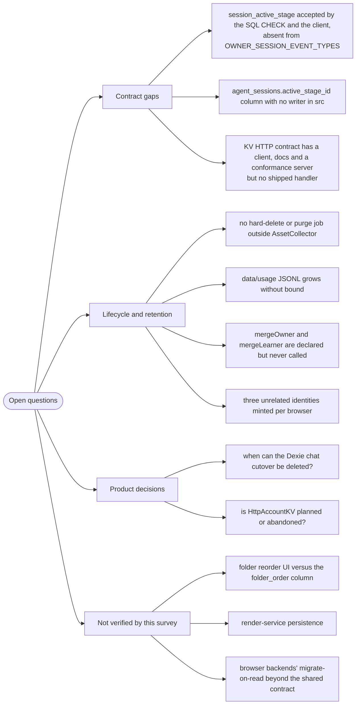

# Open questions

Things I could not determine from the code, and why. Nothing here is a guess.

## 1. `session_active_stage` — a three-way mismatch

`AGENT_SESSION_PG_SCHEMA`'s CHECK constraint accepts six owner-event types
including `'session_active_stage'`
([`packages/@openmaic/storage/src/agent-session/pg.ts:172-174,199-201`](packages/@openmaic/storage/src/agent-session/pg.ts#L172-L174)), and the
browser client lists the same six
([`lib/workbench/owner-session-client.ts:13-20`](lib/workbench/owner-session-client.ts#L13-L20),
[`lib/workbench/pro-home-data.ts:82,128`](lib/workbench/pro-home-data.ts#L82)). But the package's exported
`OWNER_SESSION_EVENT_TYPES` and the `NewOwnerSessionEvent` union list only five —
`'session_active_stage'` is absent
([`packages/@openmaic/storage/src/agent-session/types.ts:424-446`](packages/@openmaic/storage/src/agent-session/types.ts#L424-L446)).

Likewise `agent_sessions.active_stage_id TEXT` exists in the DDL
([`agent-session/pg.ts:94`](packages/@openmaic/storage/src/agent-session/pg.ts#L94)) but no other reference to `active_stage_id` or
`activeStableId`/`activeStageId` appears anywhere in
`packages/@openmaic/storage/src`
(`/usr/bin/grep -rn "active_stage_id|activeStageId" packages/@openmaic/storage/src`
→ one hit, the DDL line), and `AgentSessionMeta` has no corresponding field
([`types.ts:77-96`](packages/@openmaic/storage/src/agent-session/types.ts#L77-L96)).

I could not determine whether this is (a) forward-compatibility for an unported
feature, (b) a column/constraint the host writes to directly outside the package,
or (c) drift left behind by a partial port. The client's own comment says the set
is closed "because EventSource dispatches named events only to matching
listeners" ([`owner-session-client.ts:10-12`](lib/workbench/owner-session-client.ts#L10-L12)), which suggests the client list is
authoritative for the UI — but that does not explain the package's narrower type.

## 2. The KV HTTP contract has no shipped server

`src/kv/http.ts` is a complete client for `/kv/entries/:key` and `/kv/keys`
(`:306,351,357,364`), [`docs/kv-http-contract.md`](packages/@openmaic/storage/docs/kv-http-contract.md) specifies it, and
`test/kv-conformance-server.ts` (459 lines) plus `test/kv-contract.ts` exercise it.
But `src/server/` contains no KV handler
(`git ls-files packages/@openmaic/storage/src` → `server/asset.ts`,
`server/document.ts`, `server/index.ts`, `server/read-json.ts`,
`server/reference.ts`), and no app code references `HttpAccountKV` or
`HttpKVStore`.

Open: is the conformance server the intended reference implementation for hosts to
copy, is a first-party handler planned, or was the HTTP KV backend built for a
deployment that does not exist in this repo? The package README/docs would answer
this; I did not read [`docs/kv-http-contract.md`](packages/@openmaic/storage/docs/kv-http-contract.md) in full and it may state the
intent.

## 3. Deletion and retention

I found exactly one reclamation job in the entire subsystem: `AssetCollector`,
scheduled from [`instrumentation.ts:19-21`](instrumentation.ts#L19-L21) via
[`lib/persistence/asset-collector-schedule.ts:88`](lib/persistence/asset-collector-schedule.ts#L88). Everything else soft-deletes:

- `agent_sessions.deleted_at` — `softDeleteSession` "tombstone[s] a visible
  session while deliberately preserving every child row"
  ([`agent-session/types.ts:273-274`](packages/@openmaic/storage/src/agent-session/types.ts#L273-L274)).
- `agent_user_skill.deleted_at` ([`skill/pg.ts:61`](packages/@openmaic/storage/src/skill/pg.ts#L61)).
- `stage_meta.deleted_at` — `tombstoneStageMeta` sets it; nothing removes the row
  or the underlying `document_stages` row ([`lib/persistence/stage-meta.ts:126-133`](lib/persistence/stage-meta.ts#L126-L133)).
  `OwnerBoundDocumentStore.deleteDocument` only tombstones and clears `folder_id`
  ([`owner-bound-document-store.ts:96-105`](lib/persistence/owner-bound-document-store.ts#L96-L105)) — it never calls
  `inner.deleteDocument`.
- `owner_material.deleted_at` ([`lib/persistence/owner-materials.ts:116`](lib/persistence/owner-materials.ts#L116)). The only
  cleanup described is a 24-hour reclaim of abandoned `status='uploading'` rows,
  triggered by the *next upload* ([`owner-materials.ts:14-22`](lib/persistence/owner-materials.ts#L14-L22)).
- `data/usage/<YYYY>-<MM>.jsonl` — appended forever; `readUsageRecords` can filter
  by month but nothing prunes ([`lib/server/usage-storage.ts:132,178-208`](lib/server/usage-storage.ts#L132)).

`/usr/bin/grep -rln "deleted_at IS NOT NULL" lib packages/@openmaic/storage/src`
returns nothing, i.e. no query anywhere selects tombstoned rows in order to purge
them.

Open: is unbounded growth of tombstoned documents, sessions and usage logs the
intended posture (single-tenant self-host, operator prunes), or is a purge job
missing? The asset collector's header argues the opposite principle for bytes —
"Leaving it to 'the deployment' is not a decision this repository can defer"
([`asset-collector-schedule.ts:5-10`](lib/persistence/asset-collector-schedule.ts#L5-L10)) — which makes the absence of an equivalent
for rows notable rather than obviously fine.

## 4. Identity merge is declared but unwired

`AgentSessionStore.mergeOwner(fromOwnerId, toOwnerId)` exists on the interface
([`agent-session/types.ts:338-342`](packages/@openmaic/storage/src/agent-session/types.ts#L338-L342)) and `RuntimeStore.mergeLearner` is named as
"the migration path" when sign-in lands ([`lib/runtime/learner-key.ts:8`](lib/runtime/learner-key.ts#L8)). Neither
is called anywhere in `lib/`, `app/` or `components/`
(`/usr/bin/grep -rn "mergeOwner|mergeLearner" lib app components` → 4 hits, all
comments). `authenticatedOwnerId` on `resolveRequestOwnerId` is likewise never
passed ([`lib/server/agent-runtime/owner.ts:52-57`](lib/server/agent-runtime/owner.ts#L52-L57), whose own comment says a future
auth integration "must thread `authenticatedOwnerId` through those call sites").

Open: which auth system is intended, and does the anonymous→authenticated merge
have to reconcile the *three* independent identities this subsystem currently
mints — `anon:<uuid>` from the cookie (documents, folders, agent sessions),
`anon:<uuid>` from KV `device` `runtime.learnerKey` (runtime sessions), and the
constant `'shared'` asset principal? They are unrelated values today.

## 5. Can the Dexie chat cutover be removed?

`lib/utils/chat-storage.ts` treats `dexieLegacyStore` as the default legacy source
on every call (`:277`), and `restoreChatSessionsFromBackup` (`:1328`) deliberately
*writes into* `chatRestoreStaging` as the backup-restore staging path, so the
legacy tables are not merely read. Removing the migration therefore also requires
re-homing backup restore.

Open: is there a policy for how long the cutover stays (a release, a version
floor), and is there any signal — telemetry, a version marker — that would tell
maintainers when no user still has legacy rows? I found none in the code.
[`lib/utils/database.ts:544-548`](lib/utils/database.ts#L544-L548) shows `chatRestoreStaging` was added as recently as
Dexie v15, i.e. after the cutover, which argues it is load-bearing, not vestigial.

## 6. Folder ordering has a column but no reorder path

`document_folders.folder_order` is written on create as `MAX(folder_order) + …`
([`document/pg.ts:791-803`](packages/@openmaic/storage/src/document/pg.ts#L791-L803)) and read into `DocumentFolder.order`
([`document/pg.ts:763-775,811`](packages/@openmaic/storage/src/document/pg.ts#L763-L775)), whose doc comment says it "mirrors the local
model's `FolderRecord.order`" ([`document/types.ts:116`](packages/@openmaic/storage/src/document/types.ts#L116)). But there is no
`reorderFolder` on `DocumentFolderStore` ([`document/types.ts:136-172`](packages/@openmaic/storage/src/document/types.ts#L136-L172)), no
reorder route (`git ls-files app/api/folders` → three files: `route.ts`,
`[id]/route.ts`, `members/route.ts`), and
`/usr/bin/grep -rn "reorderFolder|setFolderOrder|folder_order = " lib app packages/@openmaic/storage/src`
returns nothing.

Open: is drag-to-reorder unimplemented on the server side while the local Dexie
`folders` table ([`lib/utils/database.ts:563`](lib/utils/database.ts#L563), indexed on `order`) supports it, or
is reordering deliberately local-only? I did not read the folder UI components.

## 7. Things outside the paths I was asked to trace

- **`render-service/`** — I did not examine whether the standalone render service
  persists anything of its own. `TRUST_PROXY_HEADERS` and the `RENDER_CHUNK_*`
  variables ([`.env.example:480-491`](.env.example#L480-L491)) suggest per-client identity handling that may
  or may not touch storage.
- **`BrowserRuntimeStore` / `BrowserDocumentStore` internals** — I read their
  IndexedDB schema declarations ([`runtime/browser.ts:160-176`](packages/@openmaic/storage/src/runtime/browser.ts#L160-L176),
  [`document/browser.ts:159-172`](packages/@openmaic/storage/src/document/browser.ts#L159-L172)) but not their migrate-on-read implementations, so
  I cannot state whether their DSL-migration behaviour is identical to
  `PgDocumentStore`'s beyond what the shared `document-contract.ts` asserts.
- **`packages/@openmaic/storage/src/asset/browser-store.ts` schema-incompatibility
  path** — `incompatibleSchemaError` (`:85-90`) tells the user to "use a fresh
  dbName, or wait for or request the explicit one-time import help". I could not
  find that import path; it may not exist yet.
- **`lib/i18n/locales/*.json` translation quality** — `check:i18n-keys` proves key
  parity only. Whether the 11 non-source locales are actually translated (rather
  than English copied under a translated key) is not checkable from the repo and I
  did not sample them.

## 8. A brief-vs-repo discrepancy worth recording

The survey brief listed `lib/materials/` as an in-scope path. That directory does
not exist (`ls lib/materials` → `No such file or directory`; `ls lib/` lists 45
subdirectories, none named `materials`). Material persistence is split between
`packages/@openmaic/storage/src/material/` (session-scoped `agent_session_materials`)
and `lib/persistence/owner-materials.ts` (owner-scoped `owner_material`), both
covered in this pack. `lib/storage/` likewise turned out to be a single 32-line
upload helper (`lib/storage/client.ts`), unrelated to the `@openmaic/storage`
package despite the name.
