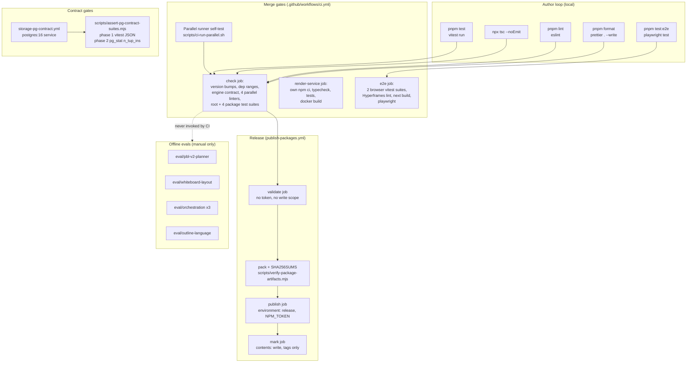
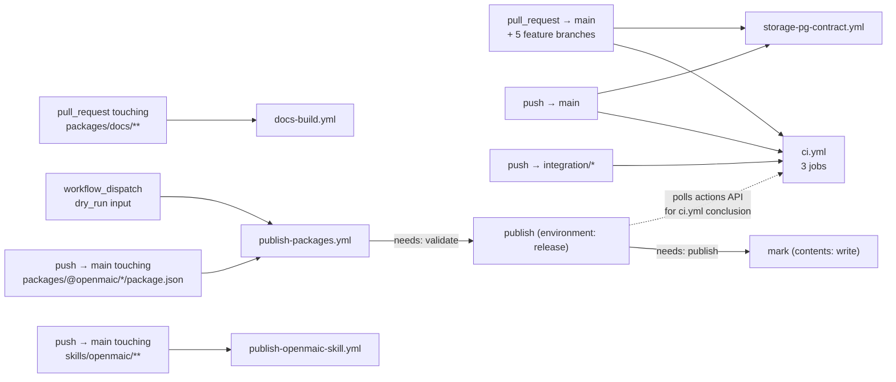

# 00 — Overview: Code quality, testing, evals, CI/CD, build, dependencies, security

Slug: `quality-testing-ci-deps`. Surveyed at commit `c2c9553a` on branch `main`.

## Charter

This subsystem is everything that decides whether a change may land, and what
the repository asserts about itself. It has five distinguishable jobs:

1. **Unit / integration testing** — one root Vitest project over `tests/`
   (`vitest.config.ts:11`), plus six independent per-package Vitest projects
   under `packages/@openmaic/*/vitest.config.ts` and one under
   `render-service/vitest.config.ts`.
2. **Browser testing** — Playwright over `e2e/tests` (`playwright.config.ts:5`),
   and two Vitest suites that are *only* meaningful with a real Chromium
   (`tests/video-export/cover-card-layout.browser.test.ts:34`,
   `tests/video-export/interactive-static-html.browser.test.ts:11`).
3. **Model evaluation** — five offline LLM harnesses under `eval/`, each with
   its own scenario corpus, scorer/judge and exit-code contract. None of them
   run in CI.
4. **Static enforcement** — Prettier (`.prettierrc`), a 670-line flat ESLint
   config that encodes *architectural* boundaries as lint rules
   (`eslint.config.mjs`), and `tsc --noEmit` under `strict: true`
   (`tsconfig.json:7`).
5. **Release engineering** — four GitHub workflows and seventeen `scripts/*`
   helpers whose job is to make silent drift loud: version-bump gates, packed
   tarball digest verification, a database-side audit that the PostgreSQL
   contract suites really touched PostgreSQL, and a two-job publish pipeline
   that structurally separates "code that runs third-party build scripts" from
   "job that holds `NPM_TOKEN`".

The unifying design idea, stated explicitly at
`scripts/openmaic-packages.mjs:17-33`, is that these gates exist to catch
**mistakes that are silent by default**, not deliberate subversion. Nearly every
helper carries a written threat model and a written *known limitation*.

## Internal parts

## File inventory

| Path | Files | Lines | Role |
| --- | --- | --- | --- |
| `tests/` | 666 `*.test.ts` + 14 helpers/fixtures | 160 230 | Root Vitest suite, 6 385 test cases |
| `e2e/tests/` | 15 `*.spec.ts` | 2 334 | Playwright specs, **30** `test()` cases (54 `^\s*test(\.\w+)?\(` matches once `test.describe` groups and `beforeEach`/`afterEach`/`setTimeout` hooks are included) |
| `e2e/fixtures/`, `e2e/pages/` | 9 | 364 | `MockApi` route stubs, 3 page objects |
| `eval/` | 25 `.ts` + 11 `.json` + 3 `.md` | 4 271 | 5 LLM harnesses, 103 scenarios |
| `packages/@openmaic/*/test/` | 140 | — | 1 331 cases across 6 packages |
| `render-service/test/` | 16 | — | 121 cases, Node-only boundaries |
| `.github/workflows/` | 5 | 1 228 | `ci.yml`, `publish-packages.yml`, `publish-openmaic-skill.yml`, `storage-pg-contract.yml`, `docs-build.yml` |
| `.github/scripts/` | 2 | 167 | ClawHub skill publish helper + version preflight |
| `scripts/` | 17 | 2 728 | Version/dependency/engine/i18n gates, smoke tests, asset generators |
| `eslint.config.mjs` | 1 | 670 | 10 config blocks; 7 are module-boundary walls |
| `Dockerfile` / `docker-compose.yml` | 2 | 259 | 4-stage app image; 3 services, 2 opt-in profiles |
| `render-service/Dockerfile` | 1 | 95 | Debian + pinned Chromium/FFmpeg from a dated Debian snapshot |
| `SECURITY.md` / `CONTRIBUTING.md` / `CHANGELOG.md` | 3 | 560 | Disclosure process, contribution rules, 9 released versions |

Counts measured with the commands recorded in `06-quality-and-metrics.md`.

## Workflow trigger map

Note the cross-workflow dependency drawn as a dotted edge: `publish-packages.yml`
does not *depend on* `ci.yml` through GitHub's own machinery. It polls the
Actions API for a completed, successful `ci.yml` run on the same
`head_sha`/`event=push`, with a 1 800-second deadline
(`.github/workflows/publish-packages.yml:301-331`). The comment there states the
reason: `ci.yml` runs concurrently with the publish on a push to `main` and
"blocks nothing".

## What this pack does and does not contain

Every file in this directory is present. There is no section the subsystem has
nothing for. Coverage numbers, however, are heuristic rather than instrumented:
**no coverage provider is installed anywhere in the repository** — no
`@vitest/coverage-v8`, no `coverage` block in any of the nine Vitest configs.
See `06-quality-and-metrics.md` for the command that establishes this and for the
reference-based proxy metric used instead.

## Topic index

Twelve files. Every row links, so this table is the pack's navigation as well as its
manifest. **This index previously omitted three files** — `02b`, `06b` and `06c` — which
made them reachable from nothing; they are registered here now.

| File | Contents |
| --- | --- |
| `00-overview.md` | This file — charter, inventory, workflow trigger map |
| [`01a-modules-test-harnesses.md`](./01a-modules-test-harnesses.md) | `tests/`, `e2e/`, `eval/`, Vitest/Playwright configs, meta-tests, contract-suite gating |
| [`01b-modules-ci-and-build.md`](./01b-modules-ci-and-build.md) | `ci.yml` job graph, all 17 `scripts/`, `eslint.config.mjs` boundary walls, tsconfig, Dockerfiles, compose |
| [`02-interfaces.md`](./02-interfaces.md) | Verbatim type signatures and public contracts of the harness/gate surfaces |
| [`02b-interfaces-gate-contracts.md`](./02b-interfaces-gate-contracts.md) | Gate contracts, env contracts, Playwright fixtures |
| [`03-flows.md`](./03-flows.md) | Four traced end-to-end flows with hop tables and sequence diagrams |
| [`04-dependencies-and-config.md`](./04-dependencies-and-config.md) | Dependency inventory by role, vendored forks, postinstall chain, env vars, licence posture |
| [`05-failure-modes.md`](./05-failure-modes.md) | What happens on each failure, fail-open vs fail-closed analysis |
| [`06-quality-and-metrics.md`](./06-quality-and-metrics.md) | Every measured number with the command that produced it |
| [`06b-quality-observations.md`](./06b-quality-observations.md) | Quality observations — the judgement half of chapter 06 |
| [`06c-metrics-scale-and-gates.md`](./06c-metrics-scale-and-gates.md) | Measured metrics: scale, module size, dependency counts, gate inventory |
| [`07-open-questions.md`](./07-open-questions.md) | What could not be determined, and why |

`01-modules.md` is split into `01a`/`01b`, `02-interfaces.md` gained a `02b`, and `06`
gained `06b`/`06c`, each because the single file exceeded the 350-line budget. This is the
only pack with extra chapters rather than a missing one — see
[`../index.md`](../index.md).

## Where the honest documentation lives

Two habits are worth naming before reading further, because they change how you
read the code:

- Long "why" comments precede almost every gate. `eslint.config.mjs:5-24`,
  `scripts/check-internal-dependency-ranges.mjs:8-43`,
  `scripts/assert-pg-contract-suites.mjs:4-40` and
  `.github/workflows/publish-packages.yml:1-36` each explain the failure they
  were written after, not merely what they do.
- Known limitations are written down inside the gate that has them, labelled
  `KNOWN LIMITATION`. Three exist: the publish job's pack/test filesystem race
  (`.github/workflows/publish-packages.yml:227-233`), the caret-dedup-within-one-0.x-line
  gap (`scripts/check-internal-dependency-ranges.mjs:36-42`), and
  "publishable input == file under the package directory"
  (`scripts/check-package-version-bumps.mjs:16-30`).

Read `01-modules.md` next for per-module responsibilities.
