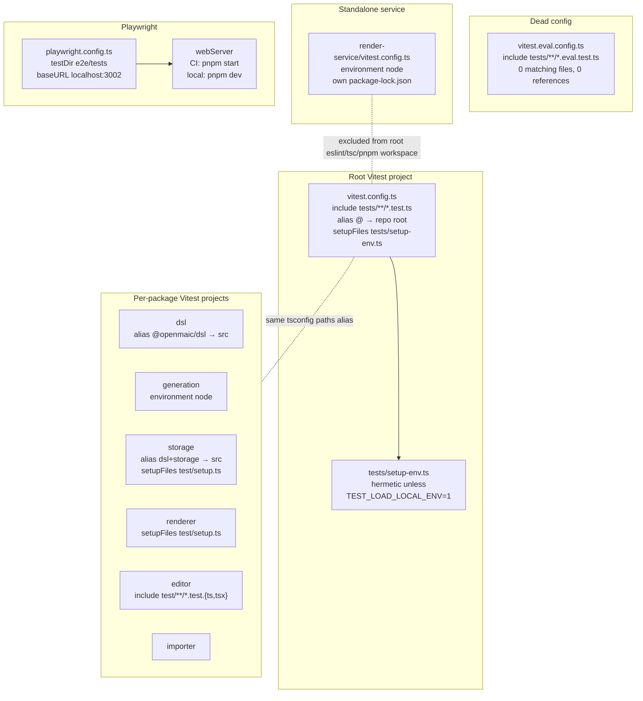
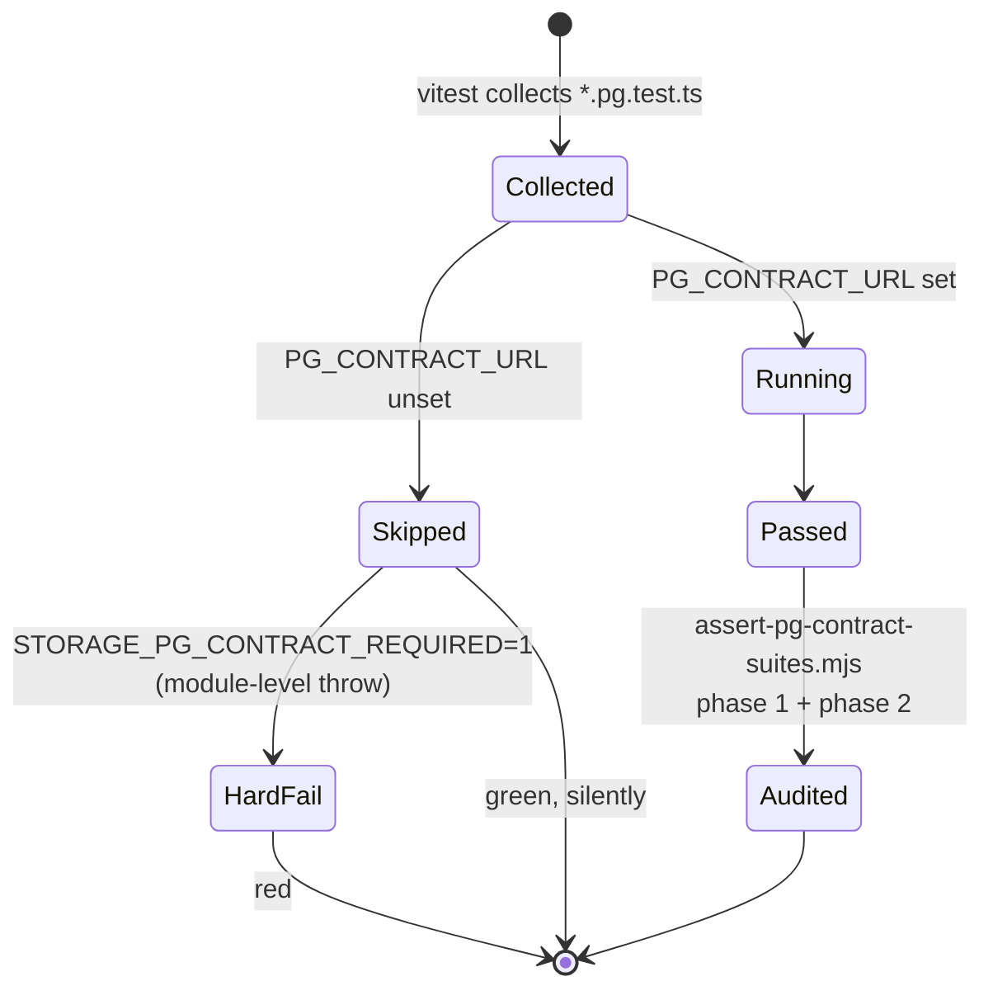

# 01a — Modules: test and eval harnesses

Companion file: `01b-modules-ci-and-build.md` covers CI workflows, `scripts/`,
lint configuration and the container build.

## Harness topology

## `vitest.config.ts` (14 lines)

The entire root test configuration. `test.include` is exactly
`['tests/**/*.test.ts']` (`vitest.config.ts:11`) — a single glob, no `exclude`,
no `environment`, no `coverage`, no `pool` tuning, no per-file timeout override.
Consequences worth knowing:

- `.test.tsx` is **not** in the glob. Measured: zero `.test.tsx` files exist
  under `tests/`, so nothing is currently lost — but a React test added there
  would be collected by nothing and would pass by absence.
- The default Vitest environment is `node`. Component tests that need a DOM must
  declare `// @vitest-environment jsdom` per file or take their DOM by injection.
- `resolve.alias` maps `@` to the repository root (`vitest.config.ts:7`), which
  is what lets `tests/**` import `@/lib/...`, `@/app/api/.../route` and
  `@/components/...` directly. The `app/api/**/route.ts` handlers are therefore
  unit-testable as plain functions, and 52 of 69 of them are imported this way.

## `vitest.eval.config.ts` (14 lines) — dead

Identical to the root config except `include: ['tests/**/*.eval.test.ts']`
(`vitest.eval.config.ts:11`). Measured: **zero** `*.eval.test.ts` files exist
anywhere in the repository, and the string `vitest.eval.config` appears in no
`package.json` script, no workflow, and no documentation. It is unreferenced
configuration. Do not mistake it for the `eval/` harnesses — those are `tsx`
entry points invoked by the `eval:*` scripts, not Vitest projects.

## `tests/setup-env.ts` (41 lines)

The only setup file for the root suite. Its whole job is to *not* load
`.env.local` (`tests/setup-env.ts:23`). The docstring records the reasoning
verbatim: loading it unconditionally "cannot make a test pass — CI has no
`.env.local` at all … it can only invent failures that exist on one machine and
nowhere else". Opt back in with `TEST_LOAD_LOCAL_ENV=1`. Shell-exported variables
are untouched either way.

The parser is deliberately minimal: split on the first `=`, skip blanks and
`#` comments, never overwrite an existing `process.env` key
(`tests/setup-env.ts:34`). The `catch {}` at line 38 is an intentional
"file absent, skip" and carries a comment saying so.

## Test-suite shape by area

Measured with the Python walker recorded in `06-quality-and-metrics.md`.
The five largest areas carry 55 % of all cases:

| Area | Files | Lines | Cases |
| --- | --- | --- | --- |
| `tests/workbench` | 81 | 17 496 | 908 |
| `tests/agent-runtime` | 76 | 22 348 | 827 |
| `tests/pbl` | 53 | 16 077 | 692 |
| `tests/lib` | 55 | 18 707 | 513 |
| `tests/server` | 28 | 6 372 | 401 |
| `tests/edit` | 51 | 7 003 | 364 |
| `tests/store` | 17 | 6 226 | 313 |
| `tests/video-export` | 27 | 8 001 | 259 |
| **Total `tests/`** | **666** | **160 230** | **6 385** |

`tests/` is 160 230 lines against 127 473 lines in `lib/` — a 1.26:1
test-to-library ratio by line count.

## Meta-tests: the suite testing its own tooling

Five suites assert on infrastructure rather than product code. These are the
most unusual and most load-bearing part of the test tree.

| Suite | Cases | What it pins |
| --- | --- | --- |
| `tests/lint-llm-entry-guard.test.ts` | 37 | Runs the **real** ESLint against the real `eslint.config.mjs` on in-memory text; 5 bypass forms × 6 extensions × 10 guarded paths + 3 exempt paths |
| `tests/workflows/ci-video-export-contract.test.ts` | 8 | Parses `.github/workflows/ci.yml` with `js-yaml` and asserts specific step `env` blocks and shell bodies |
| `tests/workflows/publish-packages-workflow.test.ts` | 4 | Same technique against the release workflow |
| `tests/ci/check-clawhub-version.test.ts` | 25 | Exercises `.github/scripts/check-clawhub-version.mjs` |
| `tests/ci/publish-openmaic-skill.test.ts` | 12 | Exercises the publish shell script's argument and divergence paths |
| `tests/security/iframe-sandbox.test.ts` | 3 | Regex-scans three source files for `sandbox=` values combining `allow-scripts` with `allow-same-origin` |
| `tests/packages/editor-manifest.test.ts` | 1 | Pins `@openmaic/editor`'s manifest shape |

`tests/lint-llm-entry-guard.test.ts` deserves the callout. Its docstring
(lines 14-20) records that the guard's scope had three holes, each closed by
hand, and "each hole was closed and then verified by hand, which is exactly the
process that produced the next hole". So the matrix moved into a test. Line 67
is the subtle part: a path ESLint would *ignore* returns
`['<path is eslint-ignored>']` rather than an empty array, so an ignored path can
never look like a pass.

## Contract suites gated on real infrastructure

Eleven `*.pg.test.ts` files exist (measured:
`find . -name '*.pg.test.ts' -not -path '*/node_modules/*'`). Six live in
`packages/@openmaic/storage/test/`, five in the app's `tests/`. All guard with
`describe.skipIf(!contractUrl)`.

**Only three of the eleven are audited.** `REQUIRED_SUITES` in
`scripts/assert-pg-contract-suites.mjs:61-65` names exactly
`pg-document-store.pg.test.ts`, `pg-runtime-store.pg.test.ts` and
`pg-scene-revision.pg.test.ts`. The three agent-session/asset storage suites are
collected and run under `storage-pg-contract.yml` (which sets `PG_CONTRACT_URL`
job-wide) but their execution is not asserted.

**Four of the eleven never run against a database in any CI job.**
`tests/agent-runtime/event-notify.pg.test.ts:57`,
`tests/agent-runtime/park-attempt-budget.pg.test.ts:30`,
`tests/agent-runtime/session-events-live.pg.test.ts:51` and
`tests/persistence/owner-materials.pg.test.ts:29` all `skipIf`. `ci.yml`'s
`pnpm test` runs with no postgres service; `storage-pg-contract.yml` invokes only
`tests/lib/whiteboard/runtime-store.pg.test.ts` explicitly
(`.github/workflows/storage-pg-contract.yml:67`). That fifth file is also the
only app-level one carrying the `STORAGE_PG_CONTRACT_REQUIRED` hard-fail guard
(`tests/lib/whiteboard/runtime-store.pg.test.ts:23`).

One S3 contract suite exists,
`packages/@openmaic/storage/test/s3-asset-bytes.s3.test.ts:12`, keyed on
`S3_CONTRACT_ENDPOINT` / `STORAGE_S3_CONTRACT_REQUIRED`. Measured: neither string
appears anywhere under `.github/` or in `docker-compose.yml`. It never runs in
CI.

## Browser-required Vitest suites

Two suites are Vitest by construction (they need the TypeScript compiler and the
`lib/video-export` compiler API) but only meaningful with Chromium, so they live
in the `e2e` job rather than the `check` job:

- `tests/video-export/cover-card-layout.browser.test.ts:34` — `REQUIRED` is
  `COVER_LAYOUT_BROWSER === '1'`; without it, a missing Chromium is a skip, with
  it a hard failure. `ci.yml:271-274` sets it.
- `tests/video-export/interactive-static-html.browser.test.ts:11` — same pattern,
  gated on `INTERACTIVE_STATIC_BROWSER`, set at `ci.yml:276-279`.
- `tests/video-export/e2e-materialize.test.ts:35` — writes Hyperframes sample
  projects to `HF_E2E_DIR`; the filesystem materializer is skipped when unset.
  `ci.yml:282-285` points it at `${{ runner.temp }}`, then `ci.yml:289-311`
  runs `hyperframes lint` over seven named samples and requires the literal
  string `0 errors, 0 warnings`, because Hyperframes 0.7.60 reports warning-only
  lint with exit status zero.

Both browser suites' `env` blocks are themselves pinned by
`tests/workflows/ci-video-export-contract.test.ts:175` and `:186`.

## Playwright layer

`playwright.config.ts` (37 lines) — 15 specs, 54 `test()` calls, one Chromium
project (`devices['Desktop Chrome']`, lines 17-22). Every setting and its stated
reason:

| Setting | Value | Line | Reason given |
| --- | --- | --- | --- |
| `testDir` | `'./e2e/tests'` | 4 | — |
| `fullyParallel` | `true` | 5 | — |
| `forbidOnly` | `!!process.env.CI` | 6 | — |
| `retries` | `CI ? 2 : 0` | 7 | — |
| `workers` | `CI ? 2 : undefined` | 10 | "Two workers fit a 4-core runner" |
| `reporter` | `CI ? 'html' : 'list'` | 11 | — |
| `use.baseURL` | `'http://localhost:3002'` | 13 | — |
| `use.trace` | `'on-first-retry'` | 14 | — |
| `use.screenshot` | `'only-on-failure'` | 15 | — |
| `webServer.command` | `CI ? 'pnpm start' : 'pnpm dev'` | 28 | CI builds in a dedicated step |
| `webServer.reuseExistingServer` | `!process.env.CI` | 30 | — |
| `webServer.timeout` | `120_000` | 31 | "covers startup, not the (much slower) build" |
| `webServer.env` | `PORT=3002`, `NEXT_PUBLIC_MAIC_EDITOR_ENABLED=true` | 35 | build-time flag; in CI it must be set on `pnpm build` |

`e2e/fixtures/base.ts:12` extends Playwright's `test` with one fixture,
`mockApi`, and unconditionally stubs `/api/server-providers` because the root
layout calls it on every page load. `e2e/fixtures/mock-api.ts` is 86 lines and
stubs four endpoints; `mockSceneActions` (line 50) reads `stageId` out of the
request body when the caller does not supply one, so the mock matches a
dynamically generated stage id. Three page objects live in `e2e/pages/`
(`home`, `generation-preview`, `classroom`), 120 lines total.

`e2e/**` is excluded from both the root `tsconfig.json:39` and
`eslint.config.mjs:53`, has no `e2e/tsconfig.json`, and gets no `tsc` step in any
workflow — see `06-quality-and-metrics.md` observation 13.

## The five eval harnesses

None is wired into any workflow. Each is a `tsx` entry point behind a
`package.json` script (`package.json:28-33`), each requires a model string from
the environment and exits non-zero on failure, and each writes a timestamped
markdown + JSON report under `eval/<name>/results/<model>/<timestamp>/` via the
shared `eval/shared/run-dir.ts` and `eval/shared/markdown-report.ts`.

| Harness | Script | Scenarios | Measures | Scoring | Exit gate |
| --- | --- | --- | --- | --- | --- |
| `eval/pbl-v2-planner` | `eval:pbl-v2-planner` | 23 cases | A/B of `loop` vs `single-call` planner: success rate, runtime completability, output quality | 12-dimension LLM judge + `redLines` + a separate completability judge with `pass`/`riskLevel` | `runner.ts:913` — every case `ok && passesCompletionGate && completability.pass` |
| `eval/whiteboard-layout` | `eval:whiteboard` | 6 scenarios, 3-5 turns each | Whiteboard rendering/layout quality across a multi-turn lesson | VLM rubric, 5 dimensions 1-10 + `overall` + `issues[]` (`scorer.ts:17-59`) | **none** — writes a report, exits 0 |
| `eval/orchestration` | `eval:orchestration` | 5 | Director premature-`END` regression, pre-fix vs post-fix prompt | **deterministic**, no judge: `parseDirectorDecision` → END rate (`judge.ts:17`) | `runner.ts:187` — every scenario's post-fix END rate ≤ `EVAL_END_THRESHOLD` (default 0.2) |
| `eval/orchestration` (answering) | `eval:orchestration:answering` | 7 | — | — | `answering-runner.ts:402` |
| `eval/orchestration` (answer content) | `eval:orchestration:answer-content` | 12 | — | LLM judge (`answer-content-judge.ts`) | `answer-content-runner.ts:516` |
| `eval/outline-language` | `eval:outline-language` | 50 | Whether the inferred `languageDirective` matches ground truth | LLM-as-judge, binary `pass` (`judge.ts`) | `runner.ts:168` — requires **100 %** pass |

Two details are worth copying into any new harness:

- `eval/orchestration/judge.ts:30` excludes errored samples from the END-rate
  denominator, with the comment naming the concrete incident: an Anthropic
  `Forbidden` had shown as 100 % END.
- `eval/orchestration/judge.ts:1-8` argues *against* an LLM judge where the
  verdict is binary and derivable from production parsing code. The other four
  harnesses all use judges because their verdicts are not binary.

`eval/whiteboard-layout/runner.ts:130` maintains a serial `actionChain` promise
because `ActionEngine.ensureWhiteboardOpen()` awaits an internal delay on first
call, which would otherwise let later whiteboard actions race ahead and insert
elements out of order — a good example of the harness having to model a real
runtime ordering hazard.

Five test files under `tests/eval/` (16 cases) unit-test the harness plumbing
itself: `resolve-model`, `run-dir`, the outline-language reporter, and two
prompt-integrity tests over the PBL judge prompt markdown.
