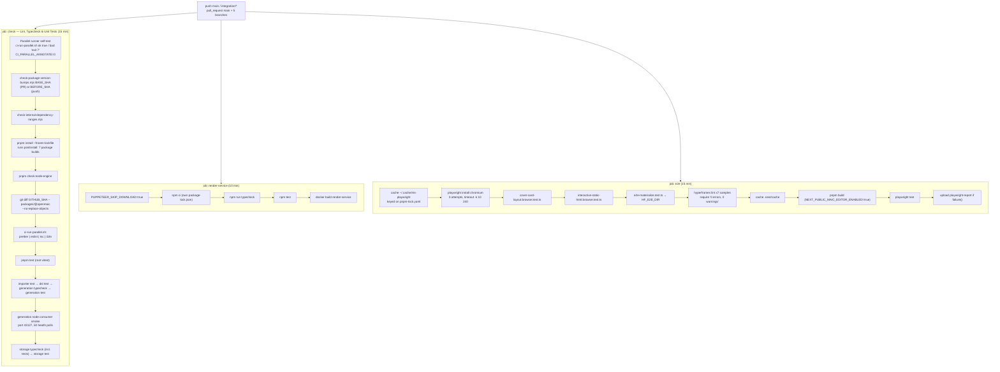
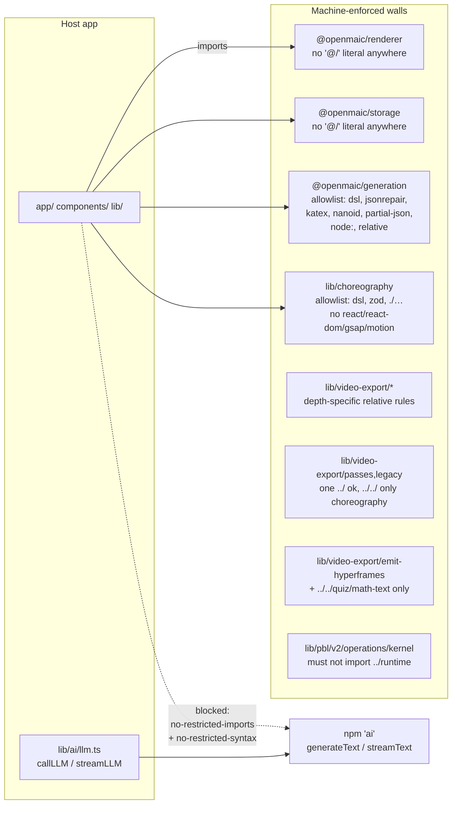

# 01b — Modules: CI, `scripts/`, lint config, build and containers

Companion file: `01a-modules-test-harnesses.md` covers `tests/`, `e2e/` and
`eval/`.

## `ci.yml` job graph

Three points that are easy to miss:

- **The steps within `check` are deliberately sequential after step 6.**
  `ci.yml:133-135`: running root Vitest alongside the storage package on a
  4-core runner made 5-second-timeout tests flake — "CPU contention, not a
  product regression". Only the four linters run in parallel, and only because
  they share no state (`ci.yml:123`).
- **`concurrency.cancel-in-progress` is conditional**:
  `${{ github.event_name == 'pull_request' }}` (`ci.yml:26`). A `main` run is
  never cancelled, because each `main` run validates only its own push range; a
  superseded run would take the range containing a package change with it.
- **Push triggers list the integration branches as well as the PR triggers**
  (`ci.yml:9`), because a `pull_request` run "only ever proves one part merged
  into the branch".

## `scripts/ci-run-parallel.sh` (58 lines)

Runs `NAME COMMAND` pairs concurrently, buffers each to
`${RUNNER_TEMP}/ci-parallel-$$/<i>.log`, then replays them in argument order as
GitHub Actions groups and exits 1 if any child failed
(`scripts/ci-run-parallel.sh:36-55`). `CI_PARALLEL_ANNOTATE=0` suppresses the
`::error::` annotation, which is what lets `ci.yml`'s self-test assert the
expected-failure case without painting the check red (`ci.yml:41-50`).

It is the only bash-only step, and it runs *before* `pnpm install`, so a broken
helper fails in seconds rather than after a full install.

## The shared package registry: `scripts/openmaic-packages.mjs` (206 lines)

One list, `OPENMAIC_PACKAGES = ['dsl','generation','storage','renderer','editor','importer']`
(`scripts/openmaic-packages.mjs:34`), plus `INTERNAL_DEPENDENTS` (line 37)
recording which owned package depends on which.

`assertPackageListIsComplete()` (line 71) checks the list **in both directions**
against `readdirSync(packages/@openmaic)`, then cross-checks
`publish-packages.yml` textually via `crossCheckPublishWorkflow()` (line 141).
The textual check is honest about its own limits, documented at lines 122-139:

- Full-line comments are stripped first, so a commented-out trigger path cannot
  satisfy the check while disabling a package's release.
- `on.push.paths` and every `for pkg in …;` loop are compared as exact **sets**,
  so an unexpected entry fails as well as a missing one.
- `--filter "@openmaic/<name>"` is checked loosely (every package must appear
  somewhere; no filter may name an unknown package) because individual steps
  legitimately filter subsets — the typecheck step omits `importer`.

## `scripts/check-package-version-bumps.mjs` (679 lines)

Two modes (`scripts/check-package-version-bumps.mjs:55-59`):

- **diff mode** — `<base-ref>`, the merge-time gate. For each package whose
  publishable inputs changed between `base` and `HEAD`, require the manifest
  version to have increased (`runDiffMode`, line 441). "Publishable input" means
  "file under the package directory", minus per-package ignore lists
  (`.gitignore`, `vitest.config.ts`, `docs/`, `test/`; importer adds nine more).
- **release mode** — `--release`, the pre-publish gate. Consults the npm registry
  via `npm view … --json` (`registryVersions`, line 515) and refuses to reuse or
  downgrade a published version. Any non-definitive answer — transient error,
  auth failure, unparseable body — exits 2 rather than reading "unknown" as
  "never published" (lines 506-514). Writes the release plan to
  `RELEASE_PLAN_PATH`.

The most interesting rule is `checkDslFormatVersionRule` (line 308). The dsl owns
two *serialized-format* version constants in
`packages/@openmaic/dsl/src/version.ts`. Because dependents declare
`@openmaic/dsl` as `workspace:^` (published as a caret), any version the caret
admits reaches them with no release of their own. The rule therefore requires a
format change to be accompanied by a dsl package bump that **escapes** the
dependents' caret — a minor while dsl is 0.x, a major from 1.0.0
(`caretEscapeVersion`, line 274). The worked failure is spelled out at lines
290-295: dsl 0.5.1 moving `DSL_VERSION` 0.1.0 → 0.2.0 would let installation A
write `dslVersion: '0.2.0'` rows that installation B, lockfile-pinned to dsl
0.5.0, hard-fails to read.

It **fails closed** (lines 303-306): if the constants cannot be located at either
revision while dsl's publishable inputs changed, that is a failure, not a pass.

## `scripts/check-internal-dependency-ranges.mjs` (160 lines)

An owned `@openmaic` package may be declared as a dependency of another **exactly
once, in `dependencies`, as `workspace:^`**. `peerDependencies` and
`optionalDependencies` are rejected outright (`FORBIDDEN_FIELDS`, line 48), as
are `devDependencies` (lines 140-150). The `INTERNAL_DEPENDENTS` map is
cross-checked in both directions (lines 98-134) so deleting a map entry cannot
silently exempt a package.

Why `workspace:^` and not `workspace:*`: pnpm publishes `workspace:*` as an exact
pin, so a consumer installing two dependents released at different times gets two
copies of `@openmaic/dsl` — and dsl carries the schema, validators and version
constants, so two copies mean a document produced against one instance can be
validated by the other's schema revision (lines 12-19).

## `scripts/assert-pg-contract-suites.mjs` (319 lines)

The strongest gate in the repository, and the one whose docstring best explains
itself (lines 4-40). Two phases:

**Phase 1** (lines 202-262) reads the Vitest `--reporter=json` output and, for
each of the three `REQUIRED_SUITES`, requires: the file appears in
`testResults`, `status === 'passed'`, at least one passing case, and zero
non-passing cases. The docstring is explicit that this proves almost nothing on
its own — `assertionResults` are test *cases*, not `expect()` calls, and a
one-line `vi.mock('pg', …)` in `test/setup.ts` would make both suites collect,
run and pass green against an in-memory fake.

**Phase 2** (lines 264-312) connects to `PG_CONTRACT_URL` from **outside** the
Vitest process and asks PostgreSQL what happened: all seven tables in
`REQUIRED_TABLES` (lines 73-91) must exist and must have gained inserts *during*
the run. It counts `pg_stat`'s `n_tup_ins` as a **delta against a baseline
captured before the run**, not an absolute — the suites clean up after
themselves, so surviving rows would prove nothing, and an absolute count would
let a non-ephemeral database satisfy the check forever.

The closing message (lines 314-318) states what the gate does *not* prove: the
inserts are not attributed to the built `PgDocumentStore` / `PgRuntimeStore`
specifically.

## `scripts/verify-package-artifacts.mjs` (116 lines)

Computes / verifies `SHA256SUMS` over the packed tarballs, and reads each
tarball's **packed** `package.json` back out with
`tar -xzOf … package/package.json` (line 29) so the manifest checked is the
manifest the registry will see. `--write` mode records digests; the argumentless
mode verifies them. It is called three times in the release path: after packing,
again immediately after (fresh verify), and once more inside the token-bearing
step.

## Remaining `scripts/` helpers

| Script | Lines | Role |
| --- | --- | --- |
| `smoke-test-package-tarballs.mjs` | 8.5 K | Installs the packed tarballs into a temp dir and asserts each dependent publishes `@openmaic/dsl` as `^<dslVersion>` (`assertDeduplicableDslRange`, line 58) |
| `check-node-engine-contract.mjs` | 73 | `semver.minVersion(root engines.node)` must satisfy every installed direct dependency's own `engines.node` |
| `check-i18n-keys.mjs` | 114 | Leaf-key set equality across `lib/i18n/locales/*.json` against `en-US.json`; rejects arrays and empty objects as locale values |
| `assert-vendor-maic-importer.mjs` | 36 | Build-time guard that `public/vendor/maic-importer/index.js` exists and is non-empty; runs as the first half of `pnpm build` |
| `sync-maic-importer.mjs` | 34 | Copies `packages/@openmaic/importer/dist` → `public/vendor/maic-importer`; the bundle has dynamic `require()` from pdfjs-dist that Turbopack rejects, so it is served as a static asset and imported by runtime URL |
| `generation-node-smoke-server.mjs` / `generation-node-smoke.mjs` | 6.6 K | A fake model endpoint plus a pure-Node consumer of `@openmaic/generation`; `ci.yml:151-178` asserts the JSON has non-empty `outlines`, a `scene`, and `sceneValidation.valid === true` |
| `generate-video-export-katex.mjs`, `-noto-cjk.mjs`, `-noto-script-fonts.mjs` | 13.6 K | Font/KaTeX asset generators behind `gen:*` scripts |
| `probe-mineru-cloud.mjs` | 138 | Manual developer probe of the MinerU Cloud API; not referenced by CI |
| `check-package-version-bumps.mjs`, `check-internal-dependency-ranges.mjs`, `assert-pg-contract-suites.mjs`, `verify-package-artifacts.mjs`, `openmaic-packages.mjs`, `ci-run-parallel.sh` | — | Covered above |

## `eslint.config.mjs` (670 lines): boundaries as lint rules

Ten config blocks. Two inherited (`eslint-config-next/core-web-vitals`,
`.../typescript`), one `globalIgnores` (lines 30-57), one repo-wide rule tweak,
seven boundary walls, and two blocks implementing the single-LLM-entry-point
guard.

Mechanics worth internalising, all stated in the file's own comments:

- **Flat config REPLACES a rule's options per key, it does not merge them.** This
  drives the whole structure. `AI_SDK_DYNAMIC_IMPORT_BAN` (line 13) is a shared
  array spread into every block that sets `no-restricted-syntax`, precisely so
  one repo-wide block would not silently drop those blocks' own boundaries
  (lines 8-12). The static-import guard uses
  `@typescript-eslint/no-restricted-imports` rather than the base rule for the
  same reason (lines 584-588).
- **A dynamic `import()` is an `ImportExpression`, which `no-restricted-imports`
  cannot see** (line 7). Hence both rule families.
- **The `@/` ban is a string-prefix match, not a call-shape match** (lines 84-96),
  which makes it complete against every single-literal module-reference form. The
  same comment names what is out of scope and why: a specifier assembled entirely
  from non-`@/` pieces, and relative parent escapes.
- **`lib/video-export` is split into three file scopes** because a single `../`
  means different things at different depths (lines 336-347): from a module-root
  file it escapes the module, from `passes/` it stays inside.
- **The LLM guard's `files` glob is every linted extension, not just ts/tsx**
  (lines 603-607), after review caught `app/api/route.js` and `scripts/*.mjs`
  being free to import the SDK.

Exemptions from the LLM guard: `lib/ai/llm.ts` itself, `eval/**` and `tests/**`
(lines 610-618, repeated at 652-663).

## Formatting and type checking

`.prettierrc` — 100-column, 2-space, single quotes, `trailingComma: all`,
`arrowParens: always`, `endOfLine: lf`. Enforced by `pnpm check`
(`prettier . --check`) in CI.

`.prettierignore` excludes the two vendored forks, `packages/@openmaic/*/dist/`,
`packages/@openmaic/importer/src1/`, `packages/docs/`, build output, and — worth
noting — **`*.md`, `*.yml` and `*.yaml`**. The workflow YAML is therefore not
format-checked.

`tsconfig.json` — `strict: true` (line 7), `noEmit` (8), `isolatedModules` (13),
`moduleResolution: 'bundler'` (11), `skipLibCheck: true` (6), `target: ES2017`
(3). It **excludes** `e2e`, `render-service`, `packages/*/src` and
`packages/docs` (lines 33-41).
`tsconfig.build.json` re-states the whole `exclude` list (because
`exclude` replaces rather than extends) and additionally drops `tests`, `eval`
and `packages/@openmaic/*/test`.

CI runs the *root* `npx tsc --noEmit` (`ci.yml:130`), i.e. the config that
**includes** `tests/` and `eval/`. It additionally runs
`pnpm --filter @openmaic/generation run typecheck` and
`pnpm --filter @openmaic/storage run typecheck`, both of which chain a second
`tsc -p tsconfig.test.json --noEmit`. `ci.yml:181-184` explains why storage needs
its own: the device-scope guard is written as `@ts-expect-error` probes in its
tests, "and a probe nothing type-checks proves nothing".

## Containers

**`Dockerfile`** — four stages on `node:22-alpine`. `deps` installs native build
toolchain for `sharp` and `@napi-rs/canvas` (line 32). `builder` accepts eleven
build args, ten of them `NEXT_PUBLIC_*`, because they are compiled into the
browser bundle. `runner` re-installs only runtime shared libraries, creates
`nextjs:nodejs` (uid/gid 1001) and switches to it before `CMD` (line 108). Both
`ALPINE_MIRROR` and `NPM_REGISTRY` are optional mirror overrides; the registry
value is trailing-slash-stripped in a shell loop (lines 15-17, 40-42).

**`render-service/Dockerfile`** — Debian `bookworm-slim` pinned by **digest**
(line 8), with the reason given: `@hyperframes/producer` drives Chromium via
puppeteer, and producer's `beginFrame` capture requires the old headless-shell
binary. Eight apt package versions are pinned as build args, all resolved from a
single dated `snapshot.debian.org` archive (`DEBIAN_SNAPSHOT=20260731T162426Z`,
lines 18, 31-35) so exact versions stay installable after they rotate out of the
live mirrors. It deliberately does **not** set `USER render` (lines 85-88): the
container starts as root so the entrypoint can install an iptables egress
lockdown (needs `CAP_NET_ADMIN`), then drops privileges with `setpriv`.

**`docker-compose.yml`** — three services. `openmaic` on the default network plus
an `internal: true` `render` network. `postgres` behind the `server-persistence`
profile with a documented development-only default password
(`docker-compose.yml:53-55`). `render-service` behind the `video-export` profile,
`cap_add: NET_ADMIN`, `mem_limit` 8 GiB default, `shm_size: 2gb`, and 17
`RENDER_*` tuning variables each carrying a comment explaining the chosen value.
