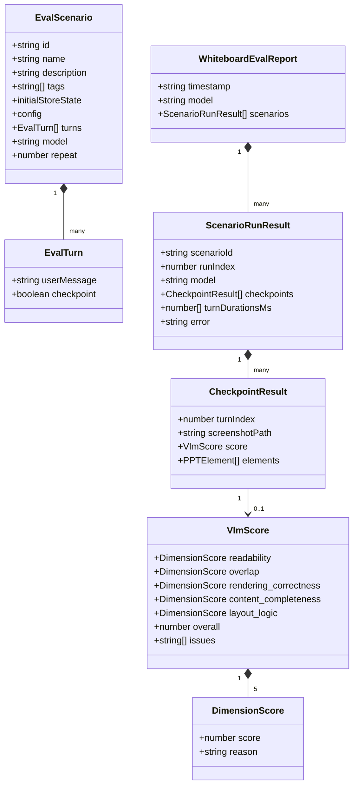
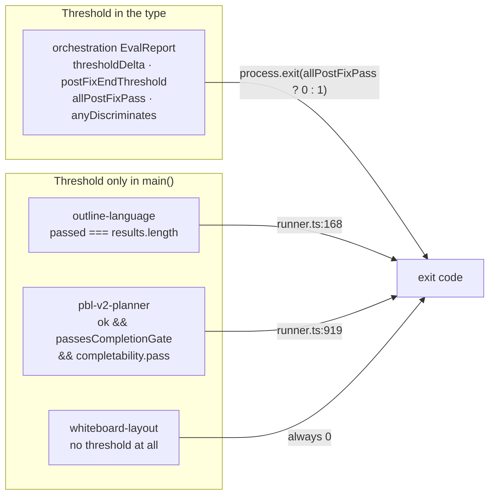

# 02 — Interfaces: the eval harness type model

Every signature below is copied verbatim from the cited file. Nothing here is
paraphrased.

Continued in `02b-interfaces-gate-contracts.md`, which covers
`scripts/openmaic-packages.mjs`, the sixteen gate CLIs, the CI↔test environment
contract, and the Playwright fixture surface.

## Type model of the eval harnesses



Source: `eval/whiteboard-layout/types.ts:6-72`. The nullable
`score: VlmScore | null` at line 54 carries the comment "null when VLM scoring
failed — screenshot is still preserved", which is the harness's whole
degradation contract.

## Whiteboard-layout harness

```ts
// eval/whiteboard-layout/scorer.ts:67
export async function scoreScreenshot(
  screenshotPath: string,
  modelString: string,
): Promise<VlmScore>
```

The rubric is a single 43-line template literal at
`eval/whiteboard-layout/scorer.ts:17-59` scoring five dimensions 1-10 plus a
holistic `overall` and 1-5 `issues`. It is invoked with `temperature: 0` and
`maxOutputTokens: 3000` (lines 86-87). Parsing is defensive in two stages: a
`/\{[\s\S]*\}/` extraction, then `JSON.parse`, then a retry after stripping
trailing commas (lines 93-114). Every one of the five dimensions plus `overall`
is validated for presence and numeric type before the object is returned (lines
116-131).

```ts
// eval/whiteboard-layout/types.ts:33-46
export interface DimensionScore {
  score: number;
  reason: string;
}

export interface VlmScore {
  readability: DimensionScore;
  overlap: DimensionScore;
  rendering_correctness: DimensionScore;
  content_completeness: DimensionScore;
  layout_logic: DimensionScore;
  overall: number;
  issues: string[];
}
```

## Orchestration harness

```ts
// eval/orchestration/judge.ts:12-34
export interface ParsedSample {
  decision: 'END' | 'USER' | string;
  isEnd: boolean;
}

export function classifyDecision(raw: string): ParsedSample

export function endRate(samples: { isEnd: boolean; error?: string }[]): number
```

`classifyDecision` delegates to the *production* parser
`parseDirectorDecision` from `@/lib/orchestration/director-prompt`
(`eval/orchestration/judge.ts:10`). That is the reason this harness needs no LLM
judge — the verdict is derived from the same code the product runs.

```ts
// eval/orchestration/types.ts:36-68
export type PromptVariant = 'pre-fix' | 'post-fix';

export interface SampleResult {
  variant: PromptVariant;
  raw: string;
  /** Parsed value: 'END' if director chose END, otherwise the agent id or 'USER'. */
  decision: 'END' | 'USER' | string;
  isEnd: boolean;
  error?: string;
}

export interface ScenarioResult {
  case_id: string;
  description: string;
  samples: number;
  preFix: { endRate: number; samples: SampleResult[] };
  postFix: { endRate: number; samples: SampleResult[] };
  /** Did the fix discriminate on this scenario by ≥ delta threshold? Informational. */
  discriminates: boolean;
  delta: number;
  /** True if post-fix END rate is at or below the regression threshold. */
  postFixPasses: boolean;
}

export interface EvalReport {
  model: string;
  samplesPerVariant: number;
  thresholdDelta: number;
  postFixEndThreshold: number;
  results: ScenarioResult[];
  anyDiscriminates: boolean;
  allPostFixPass: boolean;
}
```

`discriminates` is explicitly labelled informational; only `allPostFixPass`
drives the exit code (`eval/orchestration/runner.ts:187`).

## Outline-language harness

```ts
// eval/outline-language/types.ts:1-24
export interface LanguageTestCase {
  case_id: string;
  category: string;
  requirement: string;
  ground_truth: string;
  pdfTextSample?: string;
}

export interface JudgeResult {
  pass: boolean;
  reason: string;
}

export interface EvalResult {
  case_id: string;
  category: string;
  requirement: string;
  pdfTextSample?: string;
  groundTruth: string;
  directive: string;
  outlinesCount: number;
  judgePassed: boolean;
  judgeReason: string;
}
```

## PBL v2 planner harness

The judge contract is declared inline in the runner rather than a `types.ts`:

```ts
// eval/pbl-v2-planner/runner.ts:68-94
interface JudgeScores {
  scores: {
    projectNotLecture: number;
    taskEvaluability: number;
    typeFit: number;
    granularity: number;
    coherence: number;
    topicFidelity: number;
    singleConcreteOutcome: number;
    difficultyProgressionAndFit: number;
    learnerAgency: number;
    authenticWorkflow: number;
    stageIntegrity: number;
    closureAndConsolidation: number;
  };
  redLines: string[];
  overall: number;
  rationale?: string;
}

interface CompletabilityJudge {
  score: number;
  pass: boolean;
  blockers: string[];
  riskLevel: 'low' | 'medium' | 'high';
  rationale?: string;
}
```

```ts
// eval/pbl-v2-planner/runner.ts:59, 111-129
type Variant = 'loop' | 'single-call';

interface RunResult {
  caseId: string;
  variant: Variant;
  ok: boolean;
  milestoneCount: number;
  microtaskCount: number;
  roleCount: number;
  durationMs: number;
  error?: string;
  /** True if the project passed the completion gate (all milestones have microtasks). */
  passesCompletionGate: boolean;
  /** True for role-play scenario cases (graded by the scenario rubric). */
  isScenario: boolean;
  /** Runtime feasibility judge: can the learner actually complete it? */
  completability?: CompletabilityJudge;
  judge?: JudgeScores;
  /** Full generated project, dumped to disk for inspection. */
  project?: PBLProjectV2;
}
```

## Shared eval utilities

```ts
// eval/shared/resolve-model.ts:10
export async function resolveEvalModel(envVar: string, fallback?: string)

// eval/shared/run-dir.ts:10
export function createRunDir(baseDir: string, model: string): string

// eval/shared/markdown-report.ts:11-32
export interface ReportHeader {
  title: string;
  timestamp: string;
  model: string;
  judgeModel?: string;
  extra?: Record<string, string | number>;
}

export function renderHeader(h: ReportHeader): string[]

export function renderSummaryTable(headers: string[], rows: string[][]): string[]
```

`resolveEvalModel` deliberately has **no default model** — its docstring at
lines 7-8 says "Never introduces a hardcoded default model string — evals must
be explicit about what they measure." `createRunDir` sanitises `:` and `/` in the
model string to `-` and truncates the ISO timestamp to second precision
(`eval/shared/run-dir.ts:11-12`).

## Threshold surface across the five harnesses

The only *typed* thresholds live in the orchestration `EvalReport`
(`thresholdDelta`, `postFixEndThreshold`); the other four express their pass
condition as a predicate in `main()` rather than as a field. That asymmetry is
the reason a reader cannot answer "what does this harness require" from the types
alone.



Continue to `02b-interfaces-gate-contracts.md` for the gate-side interfaces.
