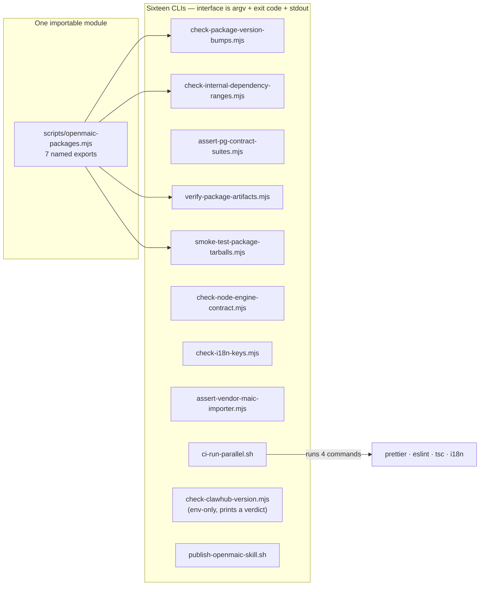
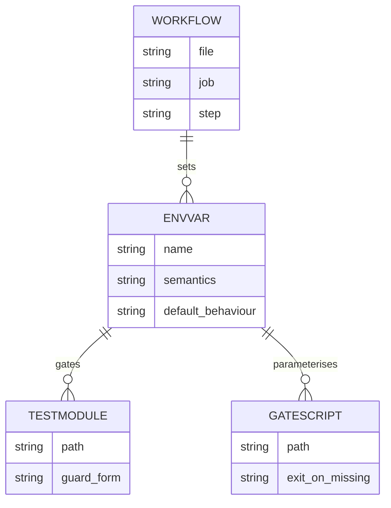

# 02b — Interfaces: gate contracts, env contracts, Playwright fixtures

Continues [`02-interfaces.md`](docs/appendix/research/quality-testing-ci-deps/02-interfaces.md), which covers the eval harness type model.

## What "interface" means for a gate



## `scripts/openmaic-packages.mjs` — the only script module with exports

```js
// scripts/openmaic-packages.mjs:34-71
export const OPENMAIC_PACKAGES = ['dsl', 'generation', 'storage', 'renderer', 'editor', 'importer'];

export const INTERNAL_DEPENDENTS = {
  generation: ['@openmaic/dsl'],
  storage: ['@openmaic/dsl'],
  renderer: ['@openmaic/dsl'],
  editor: ['@openmaic/dsl', '@openmaic/renderer'],
  importer: ['@openmaic/dsl'],
};

export const repositoryRoot = resolve(dirname(fileURLToPath(import.meta.url)), '..');

export const PACKAGES_DIRECTORY = join(repositoryRoot, 'packages/@openmaic');

export function packageDirectory(name)   // → `packages/@openmaic/${name}`
export function readManifest(name)       // → parsed package.json
export function assertPackageListIsComplete()  // → string[] of problems
```

`assertPackageListIsComplete()` returns problems rather than exiting, "so a
caller can report them alongside its own" (lines 68-69). Four scripts import this
module: `check-internal-dependency-ranges.mjs`,
`check-package-version-bumps.mjs`, `verify-package-artifacts.mjs`,
`smoke-test-package-tarballs.mjs`.

`INTERNAL_DEPENDENTS` is not merely documentation — it is checked in both
directions by [`check-internal-dependency-ranges.mjs:98-134`](scripts/check-internal-dependency-ranges.mjs#L98-L134), so removing an entry
is a failure rather than an exemption.

## Gate CLI contracts

| Script | Invocation | Exit codes |
| --- | --- | --- |
| `ci-run-parallel.sh` | `NAME COMMAND [NAME COMMAND …]` | 0 all ok / 1 any child failed / 2 bad usage |
| `check-package-version-bumps.mjs` | `<base-ref>` (diff) or `--release` | 0 pass / 1 gate failure / 2 usage or registry-unknown |
| `check-internal-dependency-ranges.mjs` | no args | 0 / 1 |
| `check-node-engine-contract.mjs` | no args | 0 / 1 |
| `check-i18n-keys.mjs` | no args | 0 / 1 |
| `assert-pg-contract-suites.mjs` | `--capture-baseline <file>` **or** `<vitest-json> --baseline <file>` | 0 / 1 gate / 2 unreadable input |
| `verify-package-artifacts.mjs` | `[--write] <artifact-directory>` | 0 / non-zero via `assert` |
| `smoke-test-package-tarballs.mjs` | `<artifact-directory>` (leading `--` shifted off) | 0 / non-zero via `assert` |
| `assert-vendor-maic-importer.mjs` | no args | 0 / 1 |
| `.github/scripts/check-clawhub-version.mjs` | env only: `SEMVER_PACKAGE_JSON`, `PREFLIGHT_FILE`, `PUBLISH_VERSION` | prints `noop\t<v>` or `continue\t<v>`; `process.exitCode = 1` with `::error::` on stderr |
| `.github/scripts/publish-openmaic-skill.sh` | `[--dry-run]`; env `SOURCE_REPO`, `PUBLISH_VERSION`, `CLAWHUB` | 0 / 1 |

Two contract details that are easy to get wrong when reusing these:

- [`verify-package-artifacts.mjs:104-111`](scripts/verify-package-artifacts.mjs#L104-L111) asserts the *exact* argument count, so a
  stray argument is a failure rather than being ignored. It also shifts a leading
  bare `--` off `argv` ([`smoke-test-package-tarballs.mjs:11`](scripts/smoke-test-package-tarballs.mjs#L11)) because
  `pnpm test:package-tarballs -- <dir>` passes one through.
- `check-clawhub-version.mjs` wraps everything in a `UserFacingError` class
  (line 4) so unexpected internal errors surface as the generic "Unable to check
  ClawHub version." rather than leaking a stack trace into the log
  (lines 105-108). Its stdout is a tab-separated verdict consumed by the calling
  shell, not JSON.

`check-clawhub-version.mjs`'s verdict logic (lines 34-105) is worth reading in
full if you touch skill publishing: it rejects prerelease and build-metadata
versions outright, requires the ClawHub preflight object to carry
`status`/`version`/`fingerprint`/`latestVersion`, returns `noop` when the registry
reports unchanged content at the same canonical version, fails when content is
unchanged at the same SemVer *precedence* but with different build metadata, and
otherwise requires `semver.gt(canonical, latest)`.

## Test-harness environment contracts

These variables are the *interface* between CI and the test tree. They are read
by test modules, not by product code.



| Variable | Read at | Semantics |
| --- | --- | --- |
| `TEST_LOAD_LOCAL_ENV` | [`tests/setup-env.ts:23`](tests/setup-env.ts#L23) | `'1'` opts back into reading `.env.local`; never set in CI |
| `PG_CONTRACT_URL` | 11 `*.pg.test.ts` modules | Present ⇒ suites run; absent ⇒ `describe.skipIf` |
| `STORAGE_PG_CONTRACT_REQUIRED` | [`tests/lib/whiteboard/runtime-store.pg.test.ts:23`](tests/lib/whiteboard/runtime-store.pg.test.ts#L23) and 6 storage suites | `'1'` turns a missing `PG_CONTRACT_URL` into a module-level `throw` |
| `STORAGE_VITEST_RESULTS` | workflow only | Path for `--outputFile.json`, consumed by phase 1 |
| `STORAGE_PG_BASELINE` | workflow only | Path for the pre-run `n_tup_ins` snapshot |
| `S3_CONTRACT_ENDPOINT`, `STORAGE_S3_CONTRACT_REQUIRED` | `packages/@openmaic/storage/test/s3-asset-bytes.s3.test.ts:12,18` | Never set anywhere in `.github/` |
| `COVER_LAYOUT_BROWSER` | [`tests/video-export/cover-card-layout.browser.test.ts:34`](tests/video-export/cover-card-layout.browser.test.ts#L34) | `'1'` makes a missing Chromium a hard failure |
| `INTERACTIVE_STATIC_BROWSER` | [`tests/video-export/interactive-static-html.browser.test.ts:11`](tests/video-export/interactive-static-html.browser.test.ts#L11) | same |
| `HF_E2E_DIR` | [`tests/video-export/e2e-materialize.test.ts:35`](tests/video-export/e2e-materialize.test.ts#L35) | Output dir for Hyperframes lint samples |
| `CI_PARALLEL_ANNOTATE` | [`scripts/ci-run-parallel.sh:46`](scripts/ci-run-parallel.sh#L46) | `'0'` suppresses `::error::` so the self-test can assert failure |
| `RELEASE_ARTIFACTS`, `RELEASE_PLAN_PATH` | workflow + [`check-package-version-bumps.mjs:665`](scripts/check-package-version-bumps.mjs#L665) | Tarball directory; release-plan JSON path |
| `EVAL_*` (24 distinct names) | `eval/**` | Model strings, sample counts, thresholds — enumerated in [`04-dependencies-and-config.md`](docs/appendix/research/quality-testing-ci-deps/04-dependencies-and-config.md) |

Three of these are pinned by tests, so narrowing them fails CI rather than
silently disabling a suite: `COVER_LAYOUT_BROWSER` and
`INTERACTIVE_STATIC_BROWSER` at
[`tests/workflows/ci-video-export-contract.test.ts:175`](tests/workflows/ci-video-export-contract.test.ts#L175) and [`:186`](tests/workflows/ci-video-export-contract.test.ts#L186), and the whole
`ci.yml` main-push gate body at that file's `EXPECTED_MAIN_PUSH_GATE` constant
(lines 30-40).

## Playwright fixture surface

```ts
// e2e/fixtures/base.ts:4-15
type Fixtures = {
  mockApi: MockApi;
};

export const test = base.extend<Fixtures>({
  mockApi: async ({ page }, use) => {
    const mockApi = new MockApi(page);
    // Always mock server-providers — called on every page load by root layout
    await mockApi.mockServerProviders();
    await use(mockApi);
  },
});
```

```ts
// e2e/fixtures/mock-api.ts:10-85 (method signatures only)
export class MockApi {
  constructor(private page: Page)
  async mockSceneOutlinesStream(outlines = mockOutlines)
  async mockSceneContent(response = mockSceneContentResponse)
  async mockSceneActions(stageId?: string)
  async mockServerProviders()
  async setupGenerationMocks(stageId?: string)
}
```

`mockSceneOutlinesStream` synthesises a full SSE body — one `data:` frame per
outline plus a terminal `{type:'done', outlines, courseTitle}` frame — and serves
it with `Content-Type: text/event-stream`, `Cache-Control: no-cache` and
`Connection: keep-alive` ([`e2e/fixtures/mock-api.ts:15-33`](e2e/fixtures/mock-api.ts#L15-L33)).

`mockSceneActions(stageId?)` is the one with non-obvious behaviour: when no
`stageId` is supplied it reads `route.request().postDataJSON()` and takes
`body.stageId`, falling back to `'test-stage'` inside a `catch` whose comment
reads `// fallback to default` ([`e2e/fixtures/mock-api.ts:50-67`](e2e/fixtures/mock-api.ts#L50-L67)). That is what
lets a spec assert against a dynamically generated stage id without threading it
through the fixture.

Test data lives in four modules under `e2e/fixtures/test-data/`
(`scene-outlines.ts` 29 lines, `scene-content.ts` 38, `scene-actions.ts` 44,
`settings.ts` 30) and the three page objects in `e2e/pages/`
(`home.page.ts` 29, `classroom.page.ts` 30, `generation-preview.page.ts` 61).
Total non-spec e2e surface: 364 lines supporting 2 334 lines of specs.
