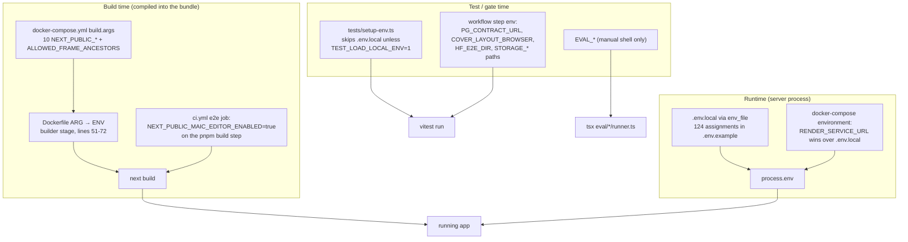
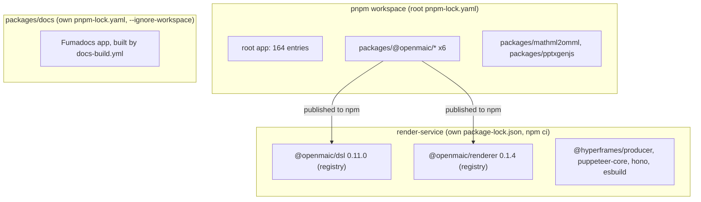

# 04 — Dependencies, build chain, configuration

## Configuration resolution

`.env.example` carries 124 uncommented `KEY=` assignments and 211 counting
commented examples (`grep -cE '^#?\s*[A-Z][A-Z0-9_]*=' .env.example`). Eleven
distinct `NEXT_PUBLIC_*` names appear there. [`CONTRIBUTING.md:70-77`](CONTRIBUTING.md#environment-variable-changes) makes
updating `.env.example` a same-PR requirement for any operator-facing variable
and explicitly exempts test/CI/internal-script variables — which is why
`TEST_LOAD_LOCAL_ENV` and `PG_CONTRACT_URL` are absent from it.

### A build-input drift

Ten of the eleven `NEXT_PUBLIC_*` names are plumbed through
[`Dockerfile:54-72`](Dockerfile#L54-L72) and [`docker-compose.yml:14-21`](docker-compose.yml#L14-L21). The eleventh,
`NEXT_PUBLIC_PRO_WORKBENCH_ENABLED`, is **not**. It is read at
[`lib/config/feature-flags.ts:33`](lib/config/feature-flags.ts#L33), documented at [`.env.example:310`](.env.example#L310), and described
at [`app/workspace/page.tsx:11`](app/workspace/page.tsx#L11) as "build-time, client-visible". Because it is
inlined by `next build`, the Docker/compose path cannot enable the Pro workbench:
putting it in `.env.local` reaches the runtime process but not the compiled
bundle. Measured with
`grep -oE 'NEXT_PUBLIC_[A-Z0-9_]+' Dockerfile docker-compose.yml .env.example | sort -u`.

## Harness and gate environment variables

Product env vars belong to other subsystems. These are the ones this subsystem
owns.

| Variable | Set by | Read by | Effect |
| --- | --- | --- | --- |
| `TEST_LOAD_LOCAL_ENV` | developer only | [`tests/setup-env.ts:23`](tests/setup-env.ts#L23) | `'1'` reads `.env.local` into `process.env` without overwriting existing keys |
| `PG_CONTRACT_URL` | [`storage-pg-contract.yml:32`](.github/workflows/storage-pg-contract.yml#L32), [`publish-packages.yml:207`](.github/workflows/publish-packages.yml#L207) | 11 `*.pg.test.ts`, `scripts/assert-pg-contract-suites.mjs` | Absent ⇒ suites `skipIf` |
| `STORAGE_PG_CONTRACT_REQUIRED` | both PG workflows | 6 storage suites + [`tests/lib/whiteboard/runtime-store.pg.test.ts:23`](tests/lib/whiteboard/runtime-store.pg.test.ts#L23) | `'1'` turns a skip into a module-level `throw` |
| `STORAGE_VITEST_RESULTS` | workflow | `--outputFile.json` target, then phase 1 input | Path only |
| `STORAGE_PG_BASELINE` | workflow | `--capture-baseline` / `--baseline` | Pre-run `n_tup_ins` snapshot |
| `S3_CONTRACT_ENDPOINT`, `S3_CONTRACT_BUCKET`, `S3_CONTRACT_ACCESS_KEY`, `S3_CONTRACT_SECRET_KEY`, `STORAGE_S3_CONTRACT_REQUIRED` | **nothing** | [`packages/@openmaic/storage/test/s3-asset-bytes.s3.test.ts:12-18`](packages/@openmaic/storage/test/s3-asset-bytes.s3.test.ts#L12-L18) | Suite never runs in CI |
| `COVER_LAYOUT_BROWSER` | [`ci.yml:274`](.github/workflows/ci.yml#L274) | [`tests/video-export/cover-card-layout.browser.test.ts:34`](tests/video-export/cover-card-layout.browser.test.ts#L34) | Missing Chromium becomes a hard failure |
| `INTERACTIVE_STATIC_BROWSER` | [`ci.yml:279`](.github/workflows/ci.yml#L279) | [`tests/video-export/interactive-static-html.browser.test.ts:11`](tests/video-export/interactive-static-html.browser.test.ts#L11) | same |
| `HF_E2E_DIR` | `ci.yml:285,292` | [`tests/video-export/e2e-materialize.test.ts:35`](tests/video-export/e2e-materialize.test.ts#L35) | Enables the filesystem materializer |
| `CI_PARALLEL_ANNOTATE` | [`ci.yml:43`](.github/workflows/ci.yml#L43) | [`scripts/ci-run-parallel.sh:46`](scripts/ci-run-parallel.sh#L46) | `'0'` suppresses `::error::` |
| `RELEASE_ARTIFACTS` | [`publish-packages.yml:169`](.github/workflows/publish-packages.yml#L169) etc. | pack/verify/publish steps | Tarball directory |
| `RELEASE_PLAN_PATH` | [`publish-packages.yml:364`](.github/workflows/publish-packages.yml#L364) | [`check-package-version-bumps.mjs:665`](scripts/check-package-version-bumps.mjs#L665) | Release plan JSON |
| `PUPPETEER_SKIP_DOWNLOAD` | [`ci.yml:197`](.github/workflows/ci.yml#L197) | `@hyperframes/producer` install | Skips Chromium download in the render-service job |
| `SEMVER_PACKAGE_JSON`, `PREFLIGHT_FILE`, `PUBLISH_VERSION` | `publish-openmaic-skill.yml` | [`.github/scripts/check-clawhub-version.mjs:19-21`](.github/scripts/check-clawhub-version.mjs#L19-L21) | Version preflight inputs |
| `CLAWHUB`, `SOURCE_REPO`, `CLAWHUB_CONFIG_PATH`, `CLAWHUB_TOKEN` | workflow / `clawhub-release` environment | [`.github/scripts/publish-openmaic-skill.sh:20-22`](.github/scripts/publish-openmaic-skill.sh#L20-L22) | CLI path, provenance, auth |
| `NPM_TOKEN` | `release` environment **only** | [`publish-packages.yml:362`](.github/workflows/publish-packages.yml#L362) as `NODE_AUTH_TOKEN` | Must not also exist as a repository secret ([`:34-36`](.github/workflows/publish-packages.yml#L34-L36)) |
| `EVAL_CHAT_MODEL`, `EVAL_SCORER_MODEL`, `EVAL_DIRECTOR_MODEL`, `EVAL_INFERENCE_MODEL`, `EVAL_JUDGE_MODEL`, `EVAL_AGENT_MODEL`, `EVAL_PBL_MODEL`, `EVAL_PBL_JUDGE_MODEL` | developer shell | `eval/**` | Model selection; every runner hard-fails if unset (no defaults) |
| `EVAL_SAMPLES`, `EVAL_DELTA`, `EVAL_END_THRESHOLD`, `EVAL_PASS_THRESHOLD` | developer shell | [`eval/orchestration/runner.ts:146-148`](eval/orchestration/runner.ts#L146-L148), answering runners | Thresholds; defaults 5 / 0.3 / 0.2 |
| `EVAL_ENABLE_THINKING`, `EVAL_PBL_THINKING`, `EVAL_PBL_THINKING_BUDGET` | developer shell | [`eval/whiteboard-layout/runner.ts:38`](eval/whiteboard-layout/runner.ts#L38), PBL runner | Injects `thinking: {enabled:true}` into the chat body |
| `EVAL_PBL_VARIANTS`, `EVAL_PBL_RUNS`, `EVAL_PBL_FILTER`, `EVAL_PBL_CONCURRENCY`, `EVAL_PBL_STAGGER_MS`, `EVAL_PBL_PORT`, `EVAL_PBL_JUDGE`, `EVAL_SCENARIO` | developer shell | PBL / orchestration runners | Selection and concurrency |
| `DEFAULT_MODEL` | shared with the app | fallback in 4 eval runners | Only ever a fallback, never a default |

Full list measured with
`grep -rhoE 'process\.env\.[A-Z0-9_]+' eval | sort -u` → 24 distinct
`EVAL_*`/`DEFAULT_MODEL` names.

## The `postinstall` build chain

```mermaid
flowchart LR
  I["pnpm install"] --> P0["postinstall"]
  P0 --> M1["packages/mathml2omml<br/>npm run build (rollup)"]
  M1 --> M2["packages/pptxgenjs<br/>npm run build (rollup, CJS config)"]
  M2 --> D["@openmaic/dsl<br/>tsc + scripts/gen-schema.mjs"]
  D --> G["@openmaic/generation<br/>tsc"]
  G --> S["@openmaic/storage<br/>tsc"]
  S --> IM["@openmaic/importer<br/>rollup + tsc --emitDeclarationOnly"]
  IM --> RN["@openmaic/renderer<br/>generate-fonts-css.mjs +<br/>generate-katex-fonts.mjs +<br/>rollup + tsc"]
  RN --> ED["@openmaic/editor<br/>rollup + tsc"]
  ED --> SY["node scripts/sync-maic-importer.mjs<br/>importer/dist → public/vendor/maic-importer"]
  SY --> AV["pnpm build asserts that file exists<br/>scripts/assert-vendor-maic-importer.mjs"]
```

The literal chain is one `&&`-joined shell line, [`package.json:10`](package.json#L10). Properties
that matter:

- **Nine steps, strictly ordered, no parallelism, no idempotence check.** It runs
  on every `pnpm install`, in CI ([`ci.yml:91`](.github/workflows/ci.yml#L91)), in the release job
  ([`publish-packages.yml:117`](.github/workflows/publish-packages.yml#L117)) and in the Docker `deps` stage
  ([`Dockerfile:46`](Dockerfile#L46)).
- **It is written with relative `cd`s** (`cd ../generation`, then
  `cd ../../..`), so renaming or reordering a package directory silently
  redirects a build.
- **Two of the nine steps invoke `npm`, seven invoke `pnpm`.** The vendored forks
  keep their original npm-style scripts.
- **`renderer`'s build regenerates tracked, publishable files** — `fonts.css` and
  a KaTeX font snapshot. This is why both [`ci.yml:107-121`](.github/workflows/ci.yml#L107-L121) and
  [`publish-packages.yml:143-157`](.github/workflows/publish-packages.yml#L143-L157) diff the tree against `$GITHUB_SHA` after
  install/build: a stale committed copy becomes a PR failure rather than a
  release that ships content not in the commit.
- **`postinstall` runs third-party build code.** That is the stated reason the
  release pipeline confines install and build to the `validate` job, which holds
  `contents: read` and no token ([`publish-packages.yml:78-81`](.github/workflows/publish-packages.yml#L78-L81)).

`pnpm.ignoredBuiltDependencies` is `['sharp', 'unrs-resolver']`
([`package.json:203-207`](package.json#L203-L207)), so those two do not run their own install scripts;
[`Dockerfile:32`](Dockerfile#L32) instead installs the native toolchain and lets `sharp` resolve
prebuilt binaries.

## Dependency inventory by role

Root manifest: **132 `dependencies` + 32 `devDependencies` = 164 entries**
(`node -e "const p=require('./package.json');console.log(Object.keys(p.dependencies).length, Object.keys(p.devDependencies).length)"`).

| Role | Count | Representative members |
| --- | --- | --- |
| Model providers & agent SDKs | 17 | `ai`, `@ai-sdk/{openai,anthropic,google,azure,amazon-bedrock}`, `openai`, `@earendil-works/pi-agent-core`, `@earendil-works/pi-ai`, `@langchain/core`, `@langchain/langgraph`, `tokenlens` |
| Cloud SDKs | 7 | `@aws-sdk/client-s3`, `@aws-sdk/s3-request-presigner`, `@aws-sdk/credential-providers`, `@alicloud/docmind-api20220711`, `@alicloud/openapi-client`, `@alicloud/tea-util` |
| Framework | 4 | `next@16.2.11`, `react@19.2.3`, `react-dom@19.2.3`, `postcss` |
| UI kit & motion | 18 | `radix-ui` + 5 `@radix-ui/*`, `@base-ui/react`, `lucide-react`, `cmdk`, `sonner`, `motion`, `embla-carousel-react`, `@xyflow/react`, `class-variance-authority`, `clsx`, `tailwind-merge`, `tw-animate-css`, `next-themes`, `use-stick-to-bottom` |
| Fonts | 16 | `@fontsource-variable/inter` + 15 `@fontsource/*` (all 16 referenced) |
| Rich-text editing | 11 | `prosemirror-{commands,dropcursor,gapcursor,history,inputrules,keymap,model,schema-basic,schema-list,state,view}` |
| Math & code rendering | 8 | `katex`, `temml`, `micromark-extension-math`, `@streamdown/math`, `@streamdown/code`, `streamdown`, `shiki`, `graphemer` |
| Document I/O & export | 15 | `docx`, `pptxgenjs`(ws), `pptxtojson`, `mathml2omml`(ws), `jszip`, `pdf-lib`, `unpdf`, `file-saver`, `sanitize-html`, `turndown`, `@joplin/turndown-plugin-gfm`, `@mozilla/readability`, `linkedom`, `parse5`, `parse-srcset` |
| Raster / vector | 6 | `sharp`, `@napi-rs/canvas` (optional peer of `unpdf`), `echarts`, `svg-arc-to-cubic-bezier`, `svg-pathdata`, `tinycolor2` |
| State & data | 12 | `zustand`, `immer`, `dexie`, `zod`, `typebox`, `js-yaml`, `jsonrepair`, `partial-json`, `nanoid`, `lodash`, `mitt`, `es-module-lexer` |
| Network / persistence | 3 | `undici@7.29.0`, `pg`, `ipaddr.js` |
| i18n | 4 | `i18next`, `react-i18next`, `i18next-resources-to-backend`, `remark-cjk-friendly` |
| Workspace links | 8 | `@openmaic/{dsl,editor,generation,importer,renderer,storage}`, `mathml2omml`, `pptxgenjs` |
| Test & QA tooling (dev) | 8 | `vitest`, `@playwright/test`, `@electric-sql/pglite`, `fake-indexeddb`, `eslint`, `eslint-config-next`, `prettier`, `typescript` |
| Build tooling (dev) | 9 | `tsx`, `rollup`, `@rollup/plugin-commonjs`, `@rollup/plugin-node-resolve`, `rollup-plugin-typescript2` (for the pptxgenjs fork), `tslib`, `tailwindcss`, `@tailwindcss/postcss`, `semver` |
| Video-export tooling (dev) | 3 | `hyperframes@0.7.60` (CLI, used only by [`ci.yml:297`](.github/workflows/ci.yml#L297)), `fontkit@2.0.4`, `gsap` |
| Type packages (dev) | 9 | `@types/{node,react,react-dom,file-saver,katex,lodash,pg,sanitize-html,tinycolor2}` |

### Seven manifest entries with no reference in first-party source

Measured by scanning every `.ts/.tsx/.mjs/.js/.css/.json` under `app`,
`components`, `lib`, `tests`, `e2e`, `eval`, `scripts`, `types`,
`packages/@openmaic` and the root config files for a quoted specifier, then
confirming the only remaining hits are `package.json` and `pnpm-lock.yaml`:

| Entry | Kind | Note |
| --- | --- | --- |
| `@copilotkit/backend` | dependency | CopilotKit is not imported anywhere |
| `@copilotkit/runtime` | dependency | " |
| `copilotkit` | dependency | " |
| `@modelcontextprotocol/sdk` | dependency | No MCP client/server code in this repo |
| `@ai-sdk/react` | dependency | The app hand-rolls `useChatSessions` ([`components/chat/use-chat-sessions.ts:509`](components/chat/use-chat-sessions.ts#L509)) instead of the SDK's React hooks |
| `@alicloud/credentials` | dependency | [`lib/pdf/alidocmind-client.ts:12-14`](lib/pdf/alidocmind-client.ts#L12-L14) uses only `docmind-api20220711`, `openapi-client`, `tea-util` |
| `vue-to-react` | devDependency | No Vue source in the repository |

`hyperframes`, `fontkit`, `rollup-plugin-typescript2` and the `@types/*` packages
also produce no import specifier but are genuinely required (CLI invocation,
script-side `node_modules` path reads, the vendored fork's rollup config, ambient
types). `@fontsource/noto-sans` and `@fontsource/noto-sans-arabic` are read by
`scripts/generate-video-export-noto-script-fonts.mjs:46,179,183` through a
`node_modules` path rather than an import.

## Version-range discipline

Measured with a small Python classifier over the manifest:

| Field | Total | `^x.y.z` | exact | `workspace:*` |
| --- | --- | --- | --- | --- |
| `dependencies` | 132 | 111 | 13 | 8 |
| `devDependencies` | 32 | 25 | 7 | 0 |

Exact pins in `dependencies`: `@earendil-works/pi-agent-core`,
`@earendil-works/pi-ai`, `docx`, `graphemer`, `js-yaml`, `lodash`, `nanoid`,
`next`, `react`, `react-dom`, `sanitize-html`, `sharp`, `undici`. In
`devDependencies`: `@fontsource/noto-sans`, `@fontsource/noto-sans-arabic`,
`eslint-config-next`, `fontkit`, `hyperframes`, `prettier`, `semver`.

The pattern is coherent: exact pins land on the framework trio, the two
`@earendil-works` agent packages, three security-or-parsing-sensitive libraries,
and the tools whose *output bytes* are compared (`prettier` formats the tree,
`fontkit` and the two pinned fonts feed generated font assets, `hyperframes`'s
lint text is string-matched in CI, `eslint-config-next` must track `next`).

**Lockfile:** `pnpm-lock.yaml` at `lockfileVersion: '9.0'`, 935 KB, 2 723
`resolution:` entries, `settings.autoInstallPeers: true`. `--frozen-lockfile` is
used in all four workflows and in the Docker `deps` stage.
`packageManager: pnpm@10.28.0+sha512.…` pins the package manager with an
integrity hash ([`package.json:209`](package.json#L209)); [`Dockerfile:22`](Dockerfile#L22) activates the same version
via corepack.

**Workspace:** `pnpm-workspace.yaml` includes `packages/*` and
`packages/@openmaic/*` and explicitly excludes `packages/docs` with the reason
inline: "standalone docs sub-app: own lockfile, build, deploy". `render-service`
is outside the workspace entirely — it has its own `package-lock.json` and is
installed with `npm ci` ([`ci.yml:212`](.github/workflows/ci.yml#L212)).

## The three separate dependency universes

`render-service/package.json` consumes `@openmaic/dsl` at **exactly `0.11.0`**
and `@openmaic/renderer` at **exactly `0.1.4`**, while the workspace copies are
at `0.11.1` and `0.1.6` respectively (`packages/@openmaic/dsl/package.json`,
`packages/@openmaic/renderer/package.json`). This is by construction — the
service is outside the workspace and pulls the published tarballs — but it means
the render service can be two dsl patch releases behind the app it renders for,
and nothing in CI compares the two.

## Licence posture

| Artifact | Declared licence | Notes |
| --- | --- | --- |
| Repository root | MIT (`LICENSE`, [`package.json:5`](package.json#L5)) | |
| `@openmaic/dsl` | MIT + `LICENSE` file | |
| `@openmaic/generation` | MIT + `LICENSE` file | |
| `@openmaic/storage` | MIT + `LICENSE` file | |
| `@openmaic/renderer` | MIT + `LICENSE` file; ships `font-licenses/` and [`FONTS.md`](packages/@openmaic/renderer/FONTS.md) in `files` | |
| `@openmaic/importer` | MIT + `LICENSE` file | |
| `@openmaic/editor` | **no `license` field** in its `package.json`; a `LICENSE` file (MIT) is present and listed in `files` | npm will publish it with no SPDX identifier |
| `packages/mathml2omml` (vendored fork) | **LGPL-3.0-or-later**, `LICENSE` present | Consumed as `workspace:*` and imported by `lib/export/latex-to-omml.ts`, i.e. bundled into the MIT-licensed app |
| `packages/pptxgenjs` (vendored fork) | MIT declared in `package.json`; **no `LICENSE` file** in the package directory | Not published ([`publish-packages.yml:5-7`](.github/workflows/publish-packages.yml#L5-L7) pins publish scope by name precisely because these two names are not ours) |
| `render-service` | **no `license` field**; `private: true` | Not published |
| Generated font assets | `scripts/generate-video-export-katex.mjs` emits `KATEX_MIT_LICENSE`; `-noto-script-fonts.mjs` emits `NOTO_SANS_OFL_LICENSE` and `NOTO_SANS_ARABIC_OFL_LICENSE` | Licence text is carried into the generated TS modules |

The LGPL entry is the one to escalate: `mathml2omml` is LGPL-3.0-or-later and is
statically bundled into a distributed MIT application via
`lib/export/latex-to-omml.ts`. LGPL §4 relinking obligations are a legal
question, not an engineering one, but nothing in the repository records a
decision about it. There is no licence-scanning step in any workflow and no
`license-checker`-style dependency, so no automated check would surface a future
copyleft addition either.

## Security-relevant configuration

- **Secrets** — `NPM_TOKEN` lives only in the `release` GitHub Environment, whose
  deployment branch rule must allow only `main`; the workflow header states it
  must *not* also be a repository secret, because a repository secret is
  readable by a workflow on any branch ([`publish-packages.yml:34-36`](.github/workflows/publish-packages.yml#L34-L36)). Same
  pattern for `CLAWHUB_TOKEN` in the `clawhub-release` environment
  ([`publish-openmaic-skill.yml:3-13`](.github/workflows/publish-openmaic-skill.yml#L3-L13)). [`docker-compose.yml:53-55`](docker-compose.yml#L53-L55) labels its
  PostgreSQL default password as development-only.
- **Action pinning** — `publish-packages.yml` and `publish-openmaic-skill.yml`
  pin every action to a full commit SHA with a version comment
  ([`publish-packages.yml:63-65`](.github/workflows/publish-packages.yml#L63-L65) explains why). `ci.yml`,
  `storage-pg-contract.yml` and `docs-build.yml` use floating major tags
  (`actions/checkout@v4`, `pnpm/action-setup@v4`).
- **Job permissions** — declared explicitly in the two publish workflows
  (`contents: read` on `validate`, `actions: read` + `id-token: write` on
  `publish`, `contents: write` on `mark`). `ci.yml`,
  `storage-pg-contract.yml` and `docs-build.yml` declare no `permissions` block
  at all and therefore inherit the repository default.
- **`persist-credentials: false`** on every checkout in both publish workflows;
  absent from `ci.yml` and `storage-pg-contract.yml`.
- **`--ignore-scripts`** on the `npm publish` call (so publish lifecycle scripts
  cannot execute in the token-bearing job) and on the global
  `clawhub`/`semver` install.
- **SSRF** — `lib/server/ssrf-guard.ts` is the single boundary module, covered by
  32 cases in `tests/server/ssrf-guard.test.ts` plus 86 cases across eight other
  suites that reference it. Details in [`05-failure-modes.md`](docs/appendix/research/quality-testing-ci-deps/05-failure-modes.md).
- **Render-service isolation** — `internal: true` network plus an iptables egress
  lockdown installed by the container entrypoint under `CAP_NET_ADMIN`, with the
  reasoning written out at [`docker-compose.yml:72-78`](docker-compose.yml#L72-L78): the app must be able to
  reach the service, but the untrusted Chromium must not be able to reach back.
