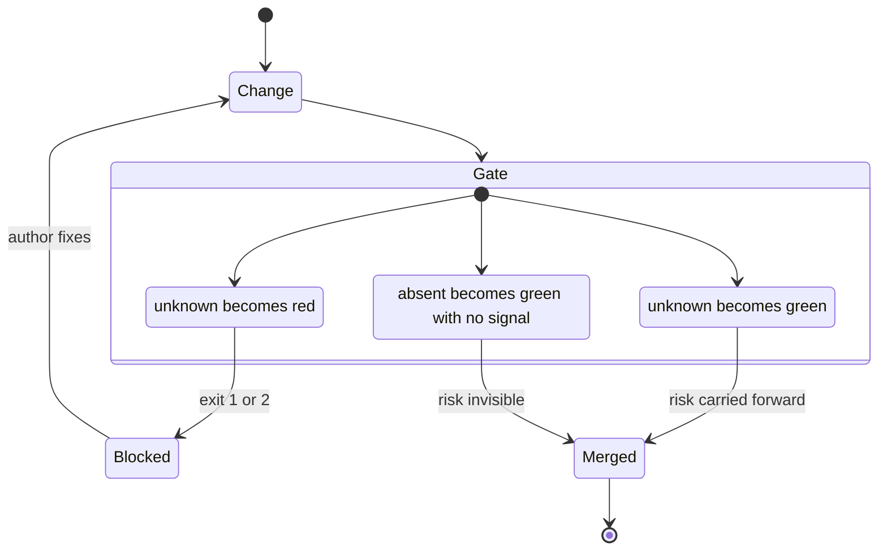
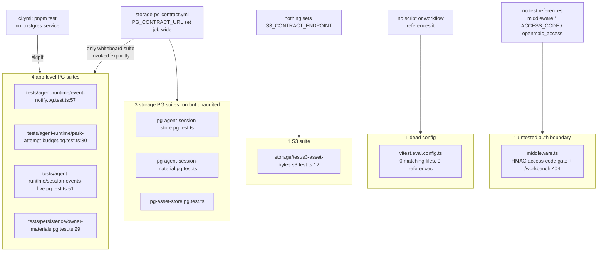
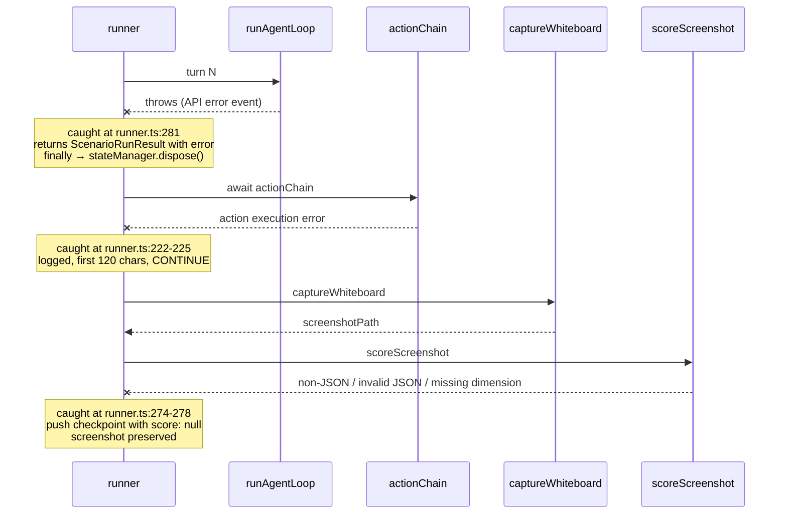

# 05 — Failure modes

## Gate failure taxonomy

The repository is strongly biased toward fail-closed, and says so. Three examples
where "unknown" is deliberately fatal:

- [`scripts/check-package-version-bumps.mjs:506-514`](scripts/check-package-version-bumps.mjs#L506-L514) — any non-definitive registry
  answer (transient error, auth failure, unparseable body, wrong registry) exits
  2 rather than reading "unknown" as "never published".
- [`scripts/check-package-version-bumps.mjs:303-306`](scripts/check-package-version-bumps.mjs#L303-L306) — if the dsl serialized-format
  constants cannot be located at either revision while dsl's publishable inputs
  changed, that is a failure: "This check must not pass by default."
- [`ci.yml:69-79`](.github/workflows/ci.yml#L69-L79) — a push whose `github.event.before` is unusable (branch
  creation, force push) fails rather than substituting `HEAD^`, because "a force
  push can replace many commits at once … and publishing requires this run to be
  green".
- [`tests/lint-llm-entry-guard.test.ts:67`](tests/lint-llm-entry-guard.test.ts#L67) — an ESLint-ignored path returns the
  sentinel `['<path is eslint-ignored>']` so it can never be scored as a pass.

## Exit-code contracts

| Component | 0 | 1 | 2 | Other |
| --- | --- | --- | --- | --- |
| `scripts/ci-run-parallel.sh` | all children ok | any child failed | bad usage (odd arg count) | — |
| `check-package-version-bumps.mjs` | gate passed | gate violation | not a git worktree; unresolvable base ref; registry unknown | — |
| `check-internal-dependency-ranges.mjs` | passed | list drift or wrong dependency shape | — | — |
| `check-node-engine-contract.mjs` | passed | invalid root range or an unsatisfiable dependency range | — | — |
| `check-i18n-keys.mjs` | passed | key-set drift, array value, empty object | — | — |
| `assert-pg-contract-suites.mjs` | both phases passed | phase 1 or phase 2 failure | unreadable results / missing baseline / missing json reporter | — |
| `assert-vendor-maic-importer.mjs` | bundle present and non-empty | missing or empty, with a 5-line remediation message | — | — |
| `check-clawhub-version.mjs` | prints `noop\t<v>` or `continue\t<v>` | `::error::` + `process.exitCode = 1` | — | — |
| `eval/orchestration/runner.ts` | every post-fix END rate ≤ threshold | some scenario over threshold; or missing model env | — | — |
| `eval/outline-language/runner.ts` | 100 % judge pass | any judge failure; or missing model env | — | — |
| `eval/pbl-v2-planner/runner.ts` | every case `ok && gate && completability.pass` | any case failing | — | 2 on unhandled rejection ([`runner.ts:924`](eval/pbl-v2-planner/runner.ts#L924)) |
| `eval/whiteboard-layout/runner.ts` | **always**, regardless of score | missing model env, no scenarios, unhandled rejection | — | — |

## Silent-skip failure modes — the real fragility

These are the cases where a real check produces a green result while asserting
nothing. Each is measured, not inferred.

| Silent skip | Evidence | Consequence if the code regresses |
| --- | --- | --- |
| Four app-level `*.pg.test.ts` never see a database | `grep -rn 'STORAGE_PG_CONTRACT_REQUIRED' tests/` returns one file; [`storage-pg-contract.yml:67`](.github/workflows/storage-pg-contract.yml#L67) invokes one file explicitly | `LISTEN/NOTIFY` delivery, attempt-budget takeover fencing, live SSE tails and owner-quota reservation locking are unverified on every merge |
| `s3-asset-bytes.s3.test.ts` never runs | `grep -rn 'S3_CONTRACT\|STORAGE_S3' .github/ docker-compose.yml` → no hits | The S3 asset-bytes backend has no executed contract test anywhere |
| Three storage PG suites run but are not in `REQUIRED_SUITES` | [`scripts/assert-pg-contract-suites.mjs:61-65`](scripts/assert-pg-contract-suites.mjs#L61-L65) | Excluding them from storage's `vitest.config.ts` — an ignored publishable input, so no version bump needed — would leave the job green |
| `vitest.eval.config.ts` matches nothing | `find . -name '*.eval.test.ts' -not -path '*/node_modules/*'` → 0 | A contributor who names a file `foo.eval.test.ts` expecting the second project gets a file collected by *both* projects' globs in practice only via the root one, and by nothing if the root glob later gains an exclude |
| `middleware.ts` has no test | `grep -rln 'middleware\|access-code\|openmaic_access\|ACCESS_CODE' tests e2e` → 3 unrelated files | The HMAC verification ([`middleware.ts:18-44`](middleware.ts#L18-L44)) and the `/workbench` 404 gate ([`:56-58`](middleware.ts#L56-L58)) are unverified. The signed timestamp is never checked for age, so a leaked cookie is valid forever — and nothing would fail if the verification were weakened |

By contrast the *documented* skip is well handled: `tests/setup-env.ts` explains
why `.env.local` is not loaded and what to set to opt in, and the `.browser`
suites turn a missing Chromium into a hard failure whenever CI is the caller.

## Documented known limitations

Three, each written inside the thing that has it.

1. **Publish pack/test filesystem race** — [`publish-packages.yml:227-233`](.github/workflows/publish-packages.yml#L227-L233). The
   tarball smoke test reads the writable local directory, not the uploaded
   snapshot. Because upload already happened, a test process could replace a
   poisoned local tarball with a valid one, making the smoke test pass while
   `publish` downloads the poisoned snapshot whose own `SHA256SUMS` is
   internally consistent. Cannot be closed while packing, uploading and testing
   share one job and filesystem.
2. **Caret dedup within one 0.x line only** —
   [`scripts/check-internal-dependency-ranges.mjs:36-42`](scripts/check-internal-dependency-ranges.mjs#L36-L42) and
   [`scripts/smoke-test-package-tarballs.mjs:52-57`](scripts/smoke-test-package-tarballs.mjs#L52-L57). A consumer mixing a dependent
   requiring `^0.5.0` with one requiring `^0.6.0` still installs two `dsl`
   copies. The mitigation is the format-version rule in
   `check-package-version-bumps.mjs`.
3. **"Publishable input" == "file under the package directory"** —
   [`scripts/check-package-version-bumps.mjs:16-30`](scripts/check-package-version-bumps.mjs#L16-L30). An under-approximation for
   all six packages: renderer and importer inline their dependency graph through
   Rollup, and dsl/storage `dist` is whatever the lockfile's TypeScript emits, so
   a toolchain bump can change any tarball with no diff under the package
   directory. Closing it would make every dependency bump demand six version
   bumps.

## Error handling in first-party source

Measured over `app`, `components`, `lib`, `render-service/src` and the six
`packages/@openmaic/*/src` trees:

| Metric | Count |
| --- | --- |
| `catch` blocks | 934 |
| …with a body containing no code | 141 |
| …of those, **comment-only** (documented intent) | 128 |
| …of those, **truly bare** (`catch {}` / `catch (e) {}`) | 13 |
| log-only bodies (a single `console.*` call and nothing else) | 7 |
| `console.*` calls total (`warn` 45, `error` 44, `log` 5, `info` 5, `debug` 4) | 96 |

All **13** truly bare catches are inside injected browser-context scripts, where
any DOM/storage API may legitimately throw in a null-origin sandbox:
`lib/utils/iframe.ts` (6), `lib/video-export-app/prepare-interactive-html.ts` (5),
[`lib/video-export/emit-hyperframes/index.ts:395`](lib/video-export/emit-hyperframes/index.ts#L395) (1) and
[`render-service/src/preview-renderer.ts:128`](render-service/src/preview-renderer.ts#L128) (1). The reason is written out at
[`lib/utils/iframe.ts:3-13`](lib/utils/iframe.ts#L3-L13): the interactive iframe is sandboxed `allow-scripts`
*without* `allow-same-origin`, so touching `window.localStorage` throws a
`SecurityError`, and the shim replaces both storages with an in-memory
implementation "when the real ones are inaccessible, keeping the sandbox intact".

The 128 comment-only bodies each state their intent. All six in
`lib/ai/providers.ts` read `/* leave body as-is */` or
`/* ignore request-body inspection failure */` around a `JSON.parse` of a request
body being rewritten — a swallowed parse failure there correctly degrades to "do
not rewrite".

The seven log-only bodies are: `components/edit/PlaybackChromeRoot.tsx:596,700`,
[`components/edit/surfaces/slide/ImagePicker.tsx:31`](components/edit/surfaces/slide/ImagePicker.tsx#L31),
[`lib/pbl/v2/runtime/drain.ts:441`](lib/pbl/v2/runtime/drain.ts#L441),
[`lib/server/material-extraction/runner.ts:74`](lib/server/material-extraction/runner.ts#L74), and
`packages/@openmaic/importer/src/import-pipeline/transformParsedToSlides.ts:749,857`.
[`lib/server/material-extraction/runner.ts:74`](lib/server/material-extraction/runner.ts#L74) is the one on a server path and
therefore the one worth a second look.

## SSRF: two tiers of hardening

```mermaid
flowchart TD
  subgraph strict["Tier 1 — strict path (agent-supplied URLs)"]
    S1["isSessionUrlAllowed()<br/>origin must have been exposed by a<br/>user message or web_search"]
    S2["normalizeUrlForStrictFetch()<br/>http(s) only, no userinfo,<br/>ports 80/443 only,<br/>reject localhost/.local/metadata,<br/>assertSafeIp on IP literals"]
    S3["createPinnedFetchAgent()<br/>undici Agent with custom lookup"]
    S4["lookupAllThenPin →<br/>assertSafeLookupAddresses(addresses)<br/>reject the WHOLE answer set<br/>if any candidate is non-public"]
    S5["per-redirect:<br/>normalizeUrlForStrictFetch(new URL(location, current))"]
    S1 --> S2 --> S3 --> S4 --> S5
  end
  subgraph loose["Tier 2 — validateUrlForSSRF (20 call sites)"]
    L1["new URL(); http(s) only"]
    L2["ALLOW_LOCAL_NETWORKS truthy ⇒ return null (allow)"]
    L3["hostname localhost / .local / 0.0.0.0 / ::1 / isPrivateIP ⇒ block"]
    L4["IP literal ⇒ allow (already checked)"]
    L5["dns.lookup(all:true, verbatim:true);<br/>any private answer ⇒ block"]
    L6["caller then fetches by HOSTNAME<br/>(no address pinning)"]
    L1 --> L2 --> L3 --> L4 --> L5 --> L6
  end
```

**Tier 1** ([`lib/server/agent-runtime/fetch-url.ts:159-174`](lib/server/agent-runtime/fetch-url.ts#L159-L174)) is
DNS-rebinding-proof: the resolved answer set is classified and then pinned into
the connection via the undici `Agent`'s custom `lookup`, and every redirect hop
is re-normalised ([`:479`](lib/server/agent-runtime/fetch-url.ts#L479)). The file header (lines 6-12) states the invariant
explicitly.

**Tier 2** ([`lib/server/ssrf-guard.ts:253-302`](lib/server/ssrf-guard.ts#L253-L302)) is validate-then-fetch: it
resolves the hostname, checks the answers, returns `null`, and the caller then
fetches by hostname — a second resolution the guard never sees. It is used at 20
call sites, and in almost all of them the input is an operator-configured
provider base URL rather than untrusted content (`clientBaseUrl` in 15 of them),
which is a materially weaker threat model. Two call sites take genuinely
less-trusted input and remain on tier 2: `app/api/proxy-media/route.ts:33,55` and
[`app/api/provider/probe-models/route.ts:34`](app/api/provider/probe-models/route.ts#L34).

`ALLOW_LOCAL_NETWORKS=true|1` short-circuits tier 2 entirely
([`lib/server/ssrf-guard.ts:266-269`](lib/server/ssrf-guard.ts#L266-L269)) with the reason in the message text at
line 247: self-hosted deployments and split-horizon DNS. Tier 1 has no such
escape hatch.

The IP classifier is unusually thorough for hand-written code
([`lib/server/ssrf-guard.ts:178-244`](lib/server/ssrf-guard.ts#L178-L244)): IPv4-mapped IPv6, 6to4 (`2002::/16`)
embedded IPv4, Teredo (`2001:0000::/32`) XOR-inverted embedded IPv4, and ISATAP
(`…:0000:5efe:<v4>` / `…:0200:5efe:<v4>`) all recurse into the IPv4 check. It is
covered by 32 cases in `tests/server/ssrf-guard.test.ts` and referenced by eight
further suites (86 additional cases).

## Retry and flake policy

| Surface | Policy | Where | Justification given |
| --- | --- | --- | --- |
| Playwright specs | `retries: 2` in CI, `0` locally | [`playwright.config.ts:8`](playwright.config.ts#L8) | — |
| Playwright artefacts | `trace: 'on-first-retry'`, `screenshot: 'only-on-failure'` | [`:14-15`](playwright.config.ts#L14-L15) | — |
| Chromium download | 3 attempts, each `timeout -k 10 240`, then `::error::` | [`ci.yml:255-266`](.github/workflows/ci.yml#L255-L266) | "A cold download … has sat for 20+ minutes on this runner fleet" |
| `playwright install-deps` | **never run** | [`ci.yml:251-254`](.github/workflows/ci.yml#L251-L254) | The Ubuntu apt mirror "has sat through the whole 15-minute job budget"; `ubuntu-latest` already ships the libraries |
| Root Vitest vs package Vitest | forced sequential | [`ci.yml:133-135`](.github/workflows/ci.yml#L133-L135) | Running them together made 5 s-timeout tests flake — "CPU contention, not a product regression" |
| Playwright workers | 2 in CI | [`playwright.config.ts:12`](playwright.config.ts#L12) | "Two workers fit a 4-core runner" |
| `check` job concurrency | `cancel-in-progress` only on PRs | [`ci.yml:26`](.github/workflows/ci.yml#L26) | A cancelled `main` run takes its push range with it |
| CI polling in publish | 30 s interval, 1 800 s deadline | [`publish-packages.yml:311-331`](.github/workflows/publish-packages.yml#L311-L331) | `ci.yml` "blocks nothing" on a push to main |
| Node smoke server readiness | 50 polls × 100 ms, then dump the log | [`ci.yml:163-172`](.github/workflows/ci.yml#L163-L172) | — |

Two flakes are named and explained rather than shrugged off ([`ci.yml:133-135`](.github/workflows/ci.yml#L133-L135),
[`ci.yml:251-254`](.github/workflows/ci.yml#L251-L254)), which matches the repository's stated standard. No suite is
marked `retry` at the Vitest level; `.only` count is zero across `tests/`, `e2e/`
and all package test trees; `test.skip`/`describe.skip` appear 7 times total.

## Eval harness degradation

The whiteboard harness degrades on three independent axes and keeps every
artefact: a failed score still records the screenshot (`score: VlmScore | null`,
[`eval/whiteboard-layout/types.ts:53-54`](eval/whiteboard-layout/types.ts#L53-L54)), and a `--rescore <run-dir>` mode
([`runner.ts:294-337`](eval/whiteboard-layout/runner.ts#L294-L337)) re-scores existing PNGs without re-running the chat, keeping
the old score on a second failure ([`:317-321`](eval/whiteboard-layout/runner.ts#L317-L321)).

The orchestration harness's degradation is a *measurement* correctness fix rather
than a resilience one: `sampleVariant` marks errored samples with
`decision: 'ERROR'` ([`eval/orchestration/runner.ts:100`](eval/orchestration/runner.ts#L100)) and `endRate` excludes
them from the denominator ([`eval/orchestration/judge.ts:31-34`](eval/orchestration/judge.ts#L31-L34)), because
conflating API failures with END decisions "polluted earlier sweeps (e.g.
anthropic 'Forbidden' showing as 100% END)".

The VLM parser retries once after stripping trailing commas
([`eval/whiteboard-layout/scorer.ts:104-113`](eval/whiteboard-layout/scorer.ts#L104-L113)) and validates all five dimensions
plus `overall` before returning ([`:116-131`](eval/whiteboard-layout/scorer.ts#L116-L131)), so a partially hallucinated score
object is a throw rather than a silently zeroed dimension.

## Container-level failure modes

- `render-service` **boots without `NET_ADMIN`** but "logs a warning and does NOT
  block Chromium egress" ([`docker-compose.yml:85-86`](docker-compose.yml#L85-L86)). This is fail-open on a
  security control, deliberately, so the service is usable where the capability
  cannot be granted.
- [`render-service/Dockerfile:70-76`](render-service/Dockerfile#L70-L76) normalises CRLF out of
  `docker-entrypoint.sh` before `chmod`, because clones made before
  `.gitattributes` landed still hold a CRLF copy whose `#!/bin/sh\r` shebang
  fails at container start "with a message that blames the script instead of the
  interpreter".
- `pnpm build` fails fast if `public/vendor/maic-importer/index.js` is missing
  (`scripts/assert-vendor-maic-importer.mjs`), because otherwise the app 404s at
  runtime and the 404 HTML is parsed as JS, "surfacing an opaque SyntaxError".
- [`docker-compose.yml:27-32`](docker-compose.yml#L27-L32) sets `RENDER_SERVICE_URL` unconditionally, which
  wins over `.env.local`. The comment notes the app probes the service's
  `/health`, so with the `video-export` profile off the app reports MP4 export
  disabled and degrades to the ZIP path rather than failing.
